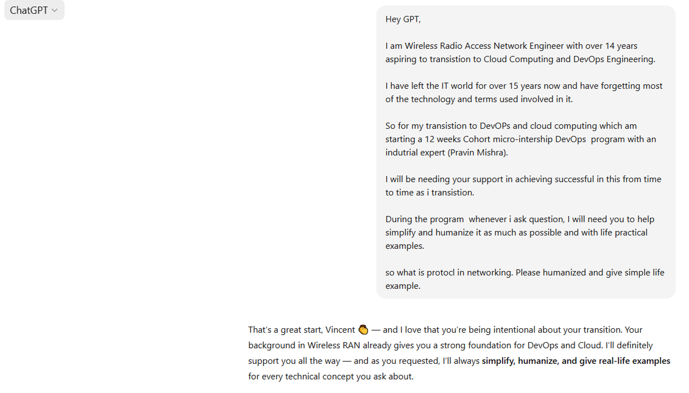
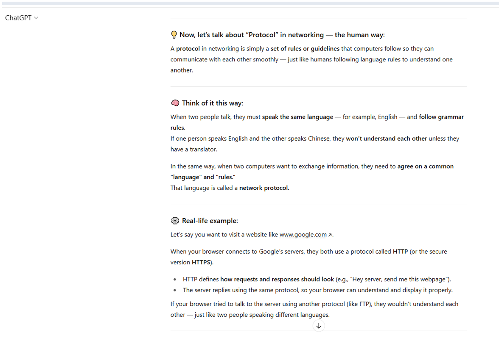
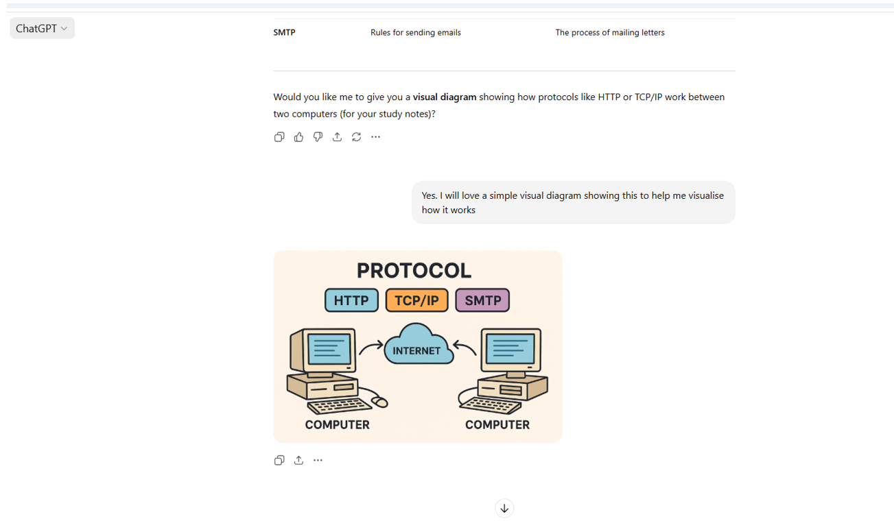
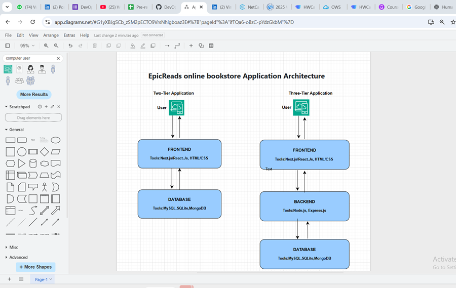
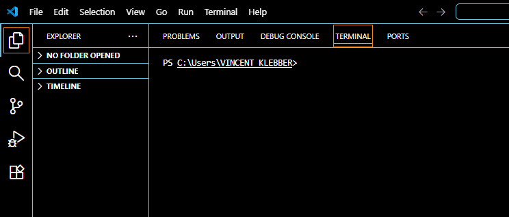
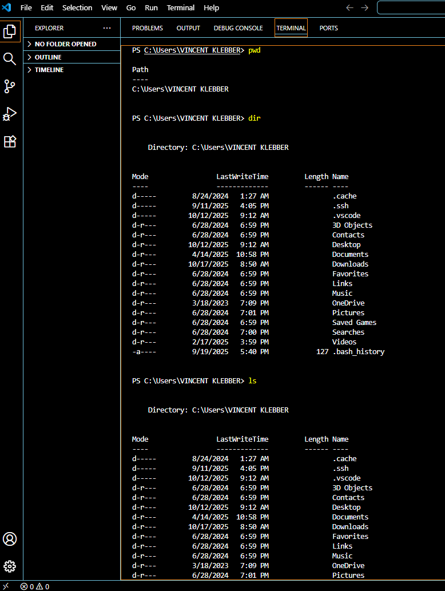

# Week 00 - Internet and Networking

Part of the DevOps Micro Internship (DMI) Cohort 3 with Agentic AI

---

# 🧑‍💻 Task 1: Using ChatGPT as Your Learning Assistant

## Scenario

You're new to DevOps and will frequently encounter technical questions. ChatGPT can be your learning companion.

## Your Task

Write a clear ChatGPT prompt to help you understand:

> "What is a protocol in networking? Explain with a simple real-life example."

I opened the conversation by giving ChatGPT context on my background, 14+ years as a Wireless RAN Engineer transitioning into Cloud and DevOps, and asked it to simplify and humanize technical concepts with real-life examples throughout the program, before asking my actual question about what a protocol is in networking.

ChatGPT explained a protocol as a set of rules computers follow to communicate, comparing it to two people needing to speak the same language and follow the same grammar rules to understand each other. It walked through a real-life example using a browser visiting a website like www.google.com, showing how HTTP defines the request/response format, and how a mismatched protocol (like trying to use FTP where HTTP is expected) breaks communication, just like two people speaking different languages. It then generated a simple visual diagram showing HTTP, TCP/IP, and SMTP as different protocols connecting two computers over the internet.

## Screenshot





---

## What I Learned (2–3 lines)

Giving ChatGPT context about my background before asking a question made a real difference, it tailored its explanations to be simple and grounded in everyday analogies rather than jargon. Seeing "protocol" explained as two people needing a shared language before a conversation makes sense finally made the concept click in a way textbook definitions hadn't.

---

# 🌐 Task 2: Internet and Networking

## Scenario

Your friend is launching an online bookstore named **EpicReads**.

He asked you to explain how users globally can access his website hosted in Finland.

## Your Task

Write a short explanation (**100–150 words**) that includes:

* Packet Switching
* IP Address
* TCP/IP
* HTTP/HTTPS

## Answer

When someone anywhere in the world opens EpicReads.com, their device starts exchanging small chunks of data called packets with the server in Finland, this is packet switching. Rather than sending the entire page as one block, the data is broken into pieces that can travel independently and be reassembled at the destination.

Every device on the internet, including the EpicReads server, has a unique IP address, essentially a postal address that tells the network exactly where to deliver each packet.

TCP/IP is the pair of rules that makes this delivery reliable: IP handles addressing and routing, choosing the best path for each packet, while TCP makes sure every packet arrives, arrives intact, and gets reassembled in the correct order.

Finally, HTTP or HTTPS governs how the browser and the server actually communicate once connected. HTTPS adds encryption, the "S," so the exchanged data can't be read or tampered with in transit, which matters for a bookstore handling customer information and payments.

---

# 🏗️ Task 3: Application Architecture & Stack

## Scenario

EpicReads bookstore has two application versions:

### Two-Tier Application

* Frontend
* Database

### Three-Tier Application

* Frontend
* Backend
* Database

## Your Task

* Draw simple diagrams (hand-drawn or tool-based such as draw.io)
* Label each layer clearly
* List at least two common technologies or tools used for each layer
* Submit a screenshot or photo clearly showing your own drawing

## Diagram Screenshot / Photo



---

## Technologies Used

### Frontend

* Next.js / React.js
* HTML, CSS

### Backend

* Node.js
* Express.js

### Database

* MySQL
* SQLite / MongoDB

---

# 🌍 Task 4: Domain Name & DNS (Basic Concepts)

## Scenario

Your friend's bookstore **EpicReads** is currently accessible through:

```text
52.172.142.222:3000
```

He purchased the domain:

```text
epicreads.com
```

## Your Task

In **50–100 words**, explain in your own words:

1. What is DNS (Domain Name System)?
2. Which DNS record type should be used to connect the domain to the given IP, and why?

## Answer

Think of EpicReads' IP address, 52.172.142.222, as the shop's exact street number, correct, but hard for anyone to remember. DNS (Domain Name System) works like the internet's contact list: instead of memorizing numbers, people can type an easy name like epicreads.com, and DNS looks up the matching IP address behind the scenes.

To connect epicreads.com to 52.172.142.222, we'd use an A Record. An A Record maps a domain name directly to an IPv4 address, exactly what's needed here since the given IP (52.172.142.222) is in IPv4 format. If the server instead used an IPv6 address, we'd use an AAAA Record instead, which serves the same purpose but for IPv6 addresses.

---

# 💻 Task 5: Visual Studio Code Setup (Hands-on)

## Your Task

Install Visual Studio Code (if not already installed).

Take a screenshot of your VS Code environment showing:

* Terminal open inside VS Code
* Running a basic command
* Your selected VS Code theme clearly visible

## Screenshot




The second screenshot shows the terminal running `pwd` (confirming the current directory), followed by `dir` and `ls`, both listing the contents of my Windows user folder, useful for comparing PowerShell's native `dir` command against the Unix-style `ls` alias also available in PowerShell.

---

# 🔗 Task 6: Publish Your Assignment as a LinkedIn Post

## LinkedIn Post URL

`https://www.linkedin.com/posts/vincent-kleber-kakpo-8b920b88_fromonpremtocloud-devops-cloudcomputing-activity-7387103645193986048-OMxM`

---

## LinkedIn Post Backup Copy

Rediscovering the Fundamentals: My DevOps Learning Journey Begins

"If you want to go fast, go alone. If you want to go far, go together." — African Proverb

This quote perfectly reflects my Cloud and DevOps journey. One that thrives on collaboration, curiosity, and continuous learning.

As I prepare for the DevOps Micro Internship (DMI) Cohort-2 by Pravin Mishra, even the qualification assessment has become a step of rediscovery.

My journey took an interesting turn when I used AI to revisit one of the simplest yet most powerful concepts in networking: protocols.

Just as protocols define how systems communicate reliably, DevOps depends on clarity between people, tools, and automation.

That simple reflection showed me how AI, automation, and curiosity now shape how we learn and build in the cloud.

In many ways, AI has become the new mentor, mirroring the same continuous feedback loop that defines DevOps.

To bring the learning to life, I imagined a friend launching an online bookstore called EpicReads, hosted in Finland.

When someone visits EpicReads.com, data travels across the internet in packets. Each with an IP address, like a digital home.

The TCP/IP model ensures those packets arrive safely, while HTTP/HTTPS governs how browsers and servers "talk."

That little "S" in HTTPS? The seal of trust securing our digital world.

It amazed me how the same fundamentals I once worked with in routers and cables now power a global, cloud-based ecosystem.

Next came application architecture, the blueprint behind every scalable system.

The two-tier connects users directly to databases; the three-tier separates interface, logic, and data. Making systems more maintainable and cloud-ready.

Then there's DNS, which gives every website its identity.

What was once an IP (52.172.142.222:3000) became epicreads.com through an A Record: simple, accessible, and human.

Finally, I opened Visual Studio Code, ran my first commands, and set up my digital workshop for this new chapter.

Every line I typed symbolized progress, from on-prem to the cloud, from manual work to automation, from comfort to curiosity.

By the end, one truth stood out clearly: The fundamentals haven't changed. They've simply evolved.

Communication. Structure. Identity. Execution.

The same principles that once powered my on-prem systems now drive the world of Cloud and DevOps.

This journey isn't just a career shift; it's a transformation fueled by curiosity and a lifelong commitment to learning.

Here's to growth, evolution, and the vast wisdom of the digital baobab tree. ☁️🌍

#FromOnPremToCloud #DevOps #CloudComputing #LearningJourney #AI #ContinuousLearning #DNS #VScode #CareerTransformation #EpicReads #PravinMishra

P.S. This post is part of the DevOps Micro Internship (DMI) with Agentic AI — Cohort 3 — by Pravin Mishra. My graded progress is public: https://lnkd.in/eJm4KCuG · Start your DevOps journey: https://lnkd.in/evTFBGRx?utm_source=student&utm_medium=ps-linkedin&utm_campaign=cohort3

---

# Reflection – Week 0

### What did you find easy?

Explaining the core internet fundamentals, packet switching, IP addressing, TCP/IP, and DNS, came fairly naturally once I anchored each concept to a real-world analogy (a postal address, a shared language, a contact list). Setting up VS Code and running basic terminal commands was also straightforward since I already had prior exposure to the tooling from my networking background.

### What was difficult?

Precisely distinguishing between similar DNS record types (A vs. AAAA) took a bit more care than I expected, it's easy to mix up the IPv4/IPv6 mapping if you're moving quickly, which is exactly the slip I caught and corrected while revisiting this work for Cohort 3.

### What will you improve next week?

I want to be more deliberate about double-checking technical details before writing them down, rather than relying on first-pass intuition, and to make sure every task section, including reflections and tech-stack lists, is fully completed the first time, rather than left for a later pass.

---

## 📌 About DMI & CloudAdvisory

DevOps Micro Internship (DMI) is a project-based DevOps program run by Pravin Mishra (The CloudAdvisory) focused on real-world execution, systems thinking, and career readiness.

It helps learners build strong DevOps foundations with hands-on experience.


## 📌 Resources

- 🌐 **DMI Official Website:** https://pravinmishra.com/dmi  
- 🎓 **DevOps for Beginners (Udemy):** https://www.udemy.com/course/devops-for-beginners-docker-k8s-cloud-cicd-4-projects/  
- 🎓 **Ultimate Agentic AI DevOps with Clude Code** https://www.udemy.com/course/ultimate-agentic-ai-devops-with-claude-code/?referralCode=448389767BC96284087B
- 🎓 **DevOps with Claude Code: Terraform, EKS, ArgoCD & Helm** https://www.udemy.com/course/devops-with-claude-code-terraform-eks-argocd-helm/?referralCode=1C5B734505D65A010FA3
- ▶️ **YouTube Playlist (DMI Cohort 3):** https://www.youtube.com/playlist?list=PLFeSNDtI4Cho  
- 🔗 **Pravin Mishra (LinkedIn):** https://www.linkedin.com/in/pravin-mishra-aws-trainer/  
- 🏢 **CloudAdvisory (LinkedIn):** https://www.linkedin.com/company/thecloudadvisory/

---

*This submission is part of DevOps Micro Internship (DMI) Cohort 3 — Agentic AI Track*