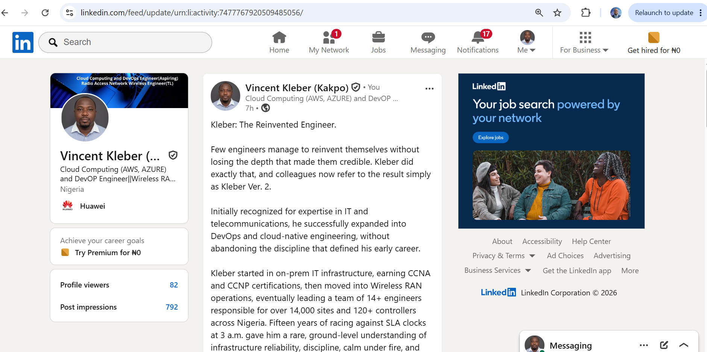
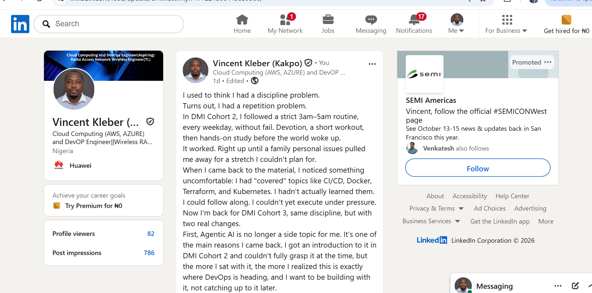

# Week 01 — Success Mindset (Mindset OS)

Part of the DevOps Micro Internship (DMI) Cohort 3 with Agentic AI

---

## Purpose (Read This First)

This week is not motivation homework.

This is you building your **Mindset OS** — the system you will use for the next 5 months (and honestly, for years).

### Expectations

* Be honest.
* Be specific.
* Be practical.
* Write like an adult professional: clear sentences, no one-liners.

You will reuse this in later weeks. So do it properly once.

---

# Assignment 1. What is something you believe to be true that most people around you would disagree with?

### Rules

* No "safe" answers.
* Must be your real belief (not copied from internet).
* Minimum 50 words.

**Hint:** What do you believe about career, money, learning, discipline, relationships, health, success, life, tech industry, etc. that most people don't agree with?

## Answer

Hands-On Repetition Matters More Than Coverage, Credentials, or Even Talent
In IT, there's a common belief that once you've covered a topic, attended the class, watched the tutorial, completed the lab, you know it. I used to believe that too. I don't anymore.
What I now believe, and what most people around me would push back on, is that real competence isn't built by exposure. It's built by repetition under pressure, often repetition of things you've already "learned" once and quietly forgot.
I have 15 years of hands-on telecom infrastructure experience, leading teams of 14+ engineers across 14,000+ RAN sites and 120+ controllers. That depth is real. But when I moved into DevOps, I discovered that covering CI/CD, Docker, Terraform, and Kubernetes once, even attentively, even while completing every assignment, wasn't the same as being able to execute them under pressure. I had the exposure. I didn't have the muscle memory.
Most people treat "I've done this before" as proof of mastery. I no longer do. I believe mastery only shows up the second, third, and tenth time you rebuild something from scratch, without notes, without a walkthrough, when it's no longer novel and your brain wants to skip the hard parts.
This belief is also why I'm now deliberately pivoting toward Open RAN on Kubernetes, a niche almost nobody occupies, precisely because it demands the kind of repeated, hands-on depth that most engineers avoid in favor of breadth. Credentials and degrees can open a door. They cannot substitute for the discomfort of doing something difficult again and again until it becomes instinct.
Most people want to move on once they've "covered" a topic. I've learned, sometimes the hard way, that moving on too early is exactly how knowledge quietly disappears.

# Assignment 2. What are the top 3 objective truths you discovered through experimentation and results?

### Definition

Objective truths do not depend on opinions. They hold true regardless of how people feel.

Write each truth in this format:

**Truth:** (1 sentence)

**Evidence from my life:** (2–4 lines: what you tried + what happened)

---

## Truth #1

### Truth: Emotional Expression Brings Relief and Reduces Stress.

When work, personal, or family issues affect me emotionally, I talk openly with a trusted friend and express everything I am feeling. I am not seeking advice or solutions, just sharing my thoughts releases tension. This habit consistently reduces stress and helps me regain clarity.

### Evidence from my life

During DMI Cohort 2, I was navigating a demanding personal season while still trying to keep up with the program. The weeks I deliberately talked things through with someone I trusted were the weeks I showed up clearer and more present in class. The weeks I bottled it up were the weeks my focus quietly slipped, even though I didn't notice it at the time.

## Truth #2

### Truth:  Repetition and Practice Deepen Understanding.

In my daily learning, I discovered that listening to a topic once is not enough for me to truly understand it. When I revisit the concept, listen again, and apply it through hands-on practice, my understanding becomes much clearer. Repetition combined with practice is essential for deep learning.

### Evidence from my life

I wrote this exact truth during DMI Cohort 2, before I had any proof it was right. A year later, I have the proof. I completed Cohort 2's full syllabus, including CI/CD, Docker, Terraform, and Kubernetes, but only once each. By the time I sat down to actually use them, the material was gone. I had to come back for Cohort 3 specifically to rebuild what one pass through the content couldn't give me. I didn't just discover this truth, I lived the cost of ignoring it.

## Truth #3

### Truth: Rest and Breaks Improve Performance.

I learned that working non-stop left me exhausted and made it harder to focus. Trying to push through fatigue didn't help me get more done. When I started taking short breaks and making sure I rested properly, my energy returned, my concentration improved, and my work became more productive and sustainable.

### Evidence from my life

My 3am–5am study routine across both cohorts only ever worked on the days I protected my sleep the night before. On the nights I sacrificed rest to "catch up," the following morning's session produced almost nothing, I would sit at the material without absorbing it. The routine taught me that rest isn't time lost from the work, it's what makes the work possible.

# Assignment 3. What does your 2.0 version look like?

### Instructions

Write as if a journalist is writing about you **3 to 7 years from now** (not 20 years).

**Minimum 300 words.**

### Rules

* Write in past tense, like it already happened.
* Don't use "likes to / wants to / hopes to."
* Use specifics:

  * built
  * shipped
  * led
  * published
  * earned
  * relocated
  * contributed
* Include skills proof:

  * projects
  * portfolios
  * GitHub
  * blogs
  * certifications
  * job role
  * leadership
  * community contribution
* Add 1–3 images if you can (optional but powerful).

### Publish It Publicly On Any ONE

* LinkedIn
* Medium
* WordPress
* Blogspot
* Personal blog
* Portfolio page

Include this line:

> **P.S. This post is a part of DevOps Micro Internship with Agentic AI Cohort-3 by [Pravin Mishra](https://www.linkedin.com/in/pravin-mishra-aws-trainer/). You can start your DevOps journey by joining this [Discord community](https://discord.pravinmishra.com/) ( https://discord.pravinmishra.com/ ).**

## Your Article

Kleber 2.0: The RAN Engineer Who Took His 15 Years to the Cloud Native Frontier
A profile, five years on
This is the story of Kleber 2.0, the version of himself he set out to build five years ago. When Kleber Vincent walked away from his role leading a team of over 14 engineers responsible for over 14,000 sites and 120+ controllers for Airtel Nigeria, colleagues assumed he was chasing a typical cloud migration story, another telecom veteran retraining as a generic cloud engineer. He wasn't. After fifteen years of waking up to phone calls about dead BTS sites and racing against SLA clocks at 3 a.m., he wanted to keep the parts of that life that had made him good at his job, the discipline, the calm under fire, the instinct for root cause, and pair them with something new. He was aiming at something far more specific: Open RAN running on Kubernetes, a frontier where almost nobody has both his depth in classical radio access networks and modern cloud native orchestration.
The transition wasn't instant, and it wasn't clean. Kleber completed his first DevOps cohort in early 2026, attending every session and contributing to a full group project, while quietly carrying the weight of a family bereavement that pulled his attention in directions no syllabus accounts for. He made an unusual call once the dust settled. He skipped the individual capstone, and with it, that cohort's certificate. He had survived the syllabus, but he hadn't yet earned the muscle memory for CI/CD, Docker, Terraform, or Kubernetes. A certificate for content he couldn't yet execute under pressure wasn't the win he needed, and he was honest enough with himself to say so out loud.
Months later, he enrolled in a second, more intensive micro internship, this time pairing DevOps fundamentals with hands on Agentic AI tooling from day one. He treated the repetition not as a step backward, but as deliberately rebuilding a foundation he knew had to be solid. By the end of that program, he had shipped his first end to end CI/CD pipeline, deployed containerized workloads on Kubernetes, and provisioned cloud infrastructure with Terraform, all documented publicly on GitHub.
What followed was steady, deliberate compounding. Kleber earned his AWS and Azure associate level certifications within the year, then went further, completing specialized training in O RAN architecture and cloud native network functions. He built and published a lab project deploying a simulated Open RAN CU/DU stack on Kubernetes, drawing directly on 15 years of experience operating BTS sites and the RNC and BSC controllers behind them to understand exactly what these disaggregated components needed to behave reliably in production. The project caught the attention of a telecom focused systems integrator expanding its Open RAN practice, where he was hired as a Cloud Native RAN Engineer.
Within three years, he was part of a team deploying and operating live Open RAN sites on Kubernetes infrastructure, work that mirrored, almost poetically, the 24/7 NOC discipline he'd practiced for over a decade, except now the BTS he once managed by hand had become a pod he managed through a cluster.
He has since spoken at a regional telecom cloud meetup in Lagos about the convergence of classical RAN operations and cloud native infrastructure, mentored telecom engineers making the same transition, and become one of a small number of African engineers credibly bridging both worlds.
Asked what advice he'd give engineers considering a similar path, Kleber doesn't hesitate: "Don't throw away your old expertise to chase something new. Stack them. The market doesn't need more generic cloud engineers. It needs people who actually understand what a BTS does and can also run it as a pod."
This is part of DevOps Micro Internship (DMI) Cohort 3 with Agentic AI, by Pravin Mishra.

### Public Link

https://www.linkedin.com/posts/vincent-kleber-kakpo-8b920b88_devops-cloudcomputing-agenticai-share-7477685853574578176-1Mdi/?utm_source=share&utm_medium=member_desktop&rcm=ACoAABKKZ00BSvPefUkOzJsZr6-0-A2NhIYUniE

# Assignment 4. Have you ever cut corners (unethical / dishonest / shortcut behavior — not necessarily illegal)? If yes, how did it make you feel?

### Important

You don't need to write the full story.

Focus on the feeling:

* guilt
* fear
* shame
* stress
* regret
* numbness
* etc.

This is about self-awareness, not judgment.

### Answer Format

**Yes / No** Yes

If Yes: 

**What emotion did you feel?** (minimum 50–100 words)

## Answer

I felt a strong sense of guilt and discomfort. I was helping people pass their CCNA and CCNP exams in ways that skipped real learning. At first, it felt like I was helping them, but I soon realized it encouraged shortcuts instead of true understanding and skill. Rather than feeling proud, I felt conflicted and regretful, knowing it was dishonest and could harm both them and the profession.
Looking back now, I see that experience differently than I did when it happened. It wasn't just a one-off lapse in judgment, it was an early version of the same mistake I later made with myself in DMI Cohort 2: mistaking the appearance of competence for the real thing. I helped others "pass" without truly learning. A year later, I caught myself having "covered" CI/CD, Docker, Terraform, and Kubernetes without being able to execute them under pressure. Same pattern, different direction.
The experience was uncomfortable but valuable. It reminded me, then and now, of the importance of integrity, consistent effort, genuine learning, and earning achievements honestly, whether I'm the one cutting the corner or the one tempted to let myself slide past one.

# Assignment 5. What are 10 non-fiction books you plan to read in the next 1 year?

### Rules

* Mention **Title + Author**
* Any language allowed
* No fiction novels

### Tip

Choose books that improve:

* mindset
* communication
* productivity
* health
* money
* career
* leadership

## Book List

1. "Atomic Habits" – James Clear
Practical strategies to build good habits, break bad ones, and make small daily actions compound into major personal and professional growth.
2. "Mindset: The New Psychology of Success" – Carol S. Dweck
Shows how adopting a growth mindset accelerates learning, resilience, and long-term success.
3. "Deep Work" – Cal Newport
Explains the value of focused, distraction-free work and how it drives mastery, productivity, and career advancement.
4. "Kubernetes: Up and Running" – Brendan Burns, Joe Beda, Kelsey Hightower
A practical, hands-on guide to Kubernetes architecture and operations, directly supporting my move into Open RAN on Kubernetes.
5. "The 7 Habits of Highly Effective People" – Stephen R. Covey
Offers timeless principles for personal effectiveness, self-discipline, and balancing life and work priorities.
6. "Cloud Native Patterns" – Cornelia Davis
Explains how to design and operate resilient, cloud-native systems, a direct bridge between my telecom infrastructure background and modern cloud-native engineering.
7. "The 5 AM Club" – Robin Sharma
Own your morning, elevate your life. A direct mirror of the 3am–5am routine I've already built my DevOps journey around, reinforcing why that block of the day matters.
8. "Rich Dad Poor Dad" – Robert Kiyosaki
Practical lessons on money, investing, and developing a mindset that builds long-term wealth.
9. "Why We Sleep" – Matthew Walker
Explains the science of sleep and how prioritizing rest improves health, focus, and overall performance.
10."Grit: The Power of Passion and Perseverance" – Angela Duckworth
Demonstrates why persistence, resilience, and passion often outweigh raw talent in achieving meaningful success.

---

# Assignment 6. What are the things you will measure regularly in your life and career?

### Rules

List topics only. No need to share numbers.

### Must Include

* Learning / skill
* Output / proof
* Health / energy
* Time / focus
* Money / finance (personal or business)

### Example

* Learning hours per week
* Deep work sessions per week
* Projects shipped / documented
* Steps / workouts
* Sleep hours
* Spending tracker

## My Metrics

| Category | Metric / What to Measure | Frequency |
|---|---|---|
| Learning / Skill | Hours spent on skill development | Weekly |
| Learning / Skill | Hands-on labs rebuilt from scratch (no notes) | Weekly |
| Output / Proof | Projects delivered / milestones achieved on GitHub | Weekly |
| Health / Energy | Sleep hours | Daily |
| Health / Energy | Physical activity / workouts | 3–6 times/week |
| Time / Focus | Deep work sessions | Weekly |
| Money / Finance | Spending tracker / budget adherence | Weekly |
| Productivity / Growth | High-priority tasks completed | Weekly |
| Mindset / Reflection | Journaling / reflection sessions | Weekly |
| Personal Growth / Relationships | Networking / meaningful conversations | Weekly |

---

# Assignment 7. Brain Dump + 5-Month System Plan

## Step 1: Brain Dump (Private)

Do a brain dump of everything in your mind into a notebook.

Examples:

* Bills
* Tasks
* Worries
* Goals
* Pending messages
* Ideas
* Responsibilities

### Did You Do It?

**Yes / No** 

Answer:Yes

---

## Step 2: Your 5-Month Routine + Focus Blocks

Create a simple plan you can realistically follow for the next 5 months.

### Weekly Routine

Example:

* Mon–Thu: 60 min deep work
* Sat: DMI session
* Sun: Weekly review

#### My Weekly Routine

Weekly Routine
Monday–Friday (3:00 AM – 5:00 AM):

Morning devotion (10–15 mins), short workout, then DMI Cohort 3 hands-on work — labs, assignments, and project work for the current week's topic.

Wednesday Evening (Dedicated Repeat Slot, 7:00 PM – 8:30 PM):
Redo last week's hands-on lab from scratch, no notes, no walkthrough. This is the slot that didn't exist in Cohort 2. Last time, topics like Docker, Terraform, Kubernetes, and CI/CD were covered once and never revisited, so they didn't stick. This time, every hands-on topic gets repeated at least once before moving forward.

Saturday:
6:30 AM – 12:00 PM: DMI live class.
After 12:00 PM: Personal errands and relaxation.

Sunday:
Weekly review: what was covered, what's still shaky, what needs another pass next Wednesday. Light reflection and journaling. Plan the week ahead.

### Focus Blocks

#### When Will You Do DMI Work? (Days + Time)

DMI Cohort 3 hands-on: Monday–Friday, 3:00–5:00 AM (5 sessions/week)
Repetition block: Wednesday, 7:00–8:30 PM (1 session/week, non-negotiable)
Live class: Saturday, 6:30 AM–12:00 PM
Review & planning: Sunday

#### How Many Sessions Per Week?

Total: 7 focused sessions/week.

### Distraction Rules

Examples:

* Phone rules
* Social media rules
* Environment setup

#### My Distraction Rules

Phone on silent / Do Not Disturb during all morning and repeat blocks.
No social media until after the morning block is done.
Clean, quiet workspace, only DMI/cohort materials within reach during focus blocks.
If a life event disrupts the routine (as happened in Cohort 2), the Sunday review becomes a recovery planning session, not a guilt session: identify what was missed, and fold it into the next week's repeat slot rather than abandoning the week entirely.

# Reflection – Week 1

### Biggest insight I got about myself this week

My weekly routine itself was never the problem. The 3am-5am structure worked when I followed it. What broke down in Cohort 2 was the absence of any built-in repetition, so when a real life event (a family bereavement) interrupted my momentum, I had no mechanism to recover the topics I'd only covered once. I moved forward instead of circling back, and the harder automation topics (CI/CD, Docker, Terraform, Kubernetes) never got the second pass they needed to stick.

### My biggest weakness/loop I noticed

I tend to treat "covered" as the same as "learned." Once I'd sat through a topic, I mentally checked it off, even when I couldn't yet execute it under pressure. That's the same instinct that made me walk away from claiming my Cohort 2 certificate, I knew the gap was real, but I hadn't yet built a system to close it.

### One system I will implement from this week (exact habit + time)

A mandatory Wednesday 7:00–8:30 PM "redo" block, every single week, where I rebuild the previous week's hands-on lab from scratch with no notes. If life disrupts a week, the Sunday review reschedules the redo rather than skipping it.

### LinkedIn Post

https://www.linkedin.com/posts/vincent-kleber-kakpo-8b920b88_devops-cloudcomputing-agenticai-share-7477020812269572096-b-Eh/?utm_source=share&utm_medium=member_desktop&rcm=ACoAABKKZ00BSvPefUkOzJsZr6-0-A2NhIYUniE

## 10. Proof of Work

- LinkedIn Post URL: **ADD LINK HERE**  
- Blog / Medium : **ADD LINK HERE**  

---

## 📌 About DMI & CloudAdvisory

DevOps Micro Internship (DMI) is a project-based DevOps program run by Pravin Mishra (The CloudAdvisory) focused on real-world execution, systems thinking, and career readiness.

It helps learners build strong DevOps foundations with hands-on experience.

## 📌 Resources

- 🌐 **DMI Official Website:** https://pravinmishra.com/dmi  
- 🎓 **DevOps for Beginners (Udemy):** https://www.udemy.com/course/devops-for-beginners-docker-k8s-cloud-cicd-4-projects/  
- 🎓 **Ultimate Agentic AI DevOps with Clude Code** https://www.udemy.com/course/ultimate-agentic-ai-devops-with-claude-code/?referralCode=448389767BC96284087B
- 🎓 **DevOps with Claude Code: Terraform, EKS, ArgoCD & Helm** https://www.udemy.com/course/devops-with-claude-code-terraform-eks-argocd-helm/?referralCode=1C5B734505D65A010FA3
- ▶️ **YouTube Playlist (DMI Cohort 3):** https://www.youtube.com/playlist?list=PLFeSNDtI4Cho  
- 🔗 **Pravin Mishra (LinkedIn):** https://www.linkedin.com/in/pravin-mishra-aws-trainer/  
- 🏢 **CloudAdvisory (LinkedIn):** https://www.linkedin.com/company/thecloudadvisory/

---

*This submission is part of DevOps Micro Internship (DMI) Cohort 3 — Agentic AI Track*
