# Assignment 2 — Deploy a React App on Ubuntu VM Using Nginx

Part of the DevOps Micro Internship (DMI) Cohort 3 with Agentic AI

---

## Purpose

In this assignment, you will deploy a React application on an Ubuntu EC2 instance and serve it using Nginx. You will provision a Linux server, install the required tools, personalize the application with your details, and verify that it is publicly accessible via a browser.

---

# Task 1 — Setup Environment (Node.js & npm)

## Goal

Install Node.js and npm on the Ubuntu VM and verify the installation:

To prepare the Ubuntu server for building the React application, I first verified that both Node.js and npm were installed by executing the following command:

```bash
node -v && npm -v
```

This command displays the installed versions of Node.js and npm, confirming that the required development tools are available on the server. The output showed that both packages were installed successfully and ready for use. As shown in **Screenshot 1**, the displayed versions verify that the environment was properly configured before proceeding with the React application deployment.

### Evidence

#### Screenshot 1 — Output of `node -v && npm -v` showing installed versions

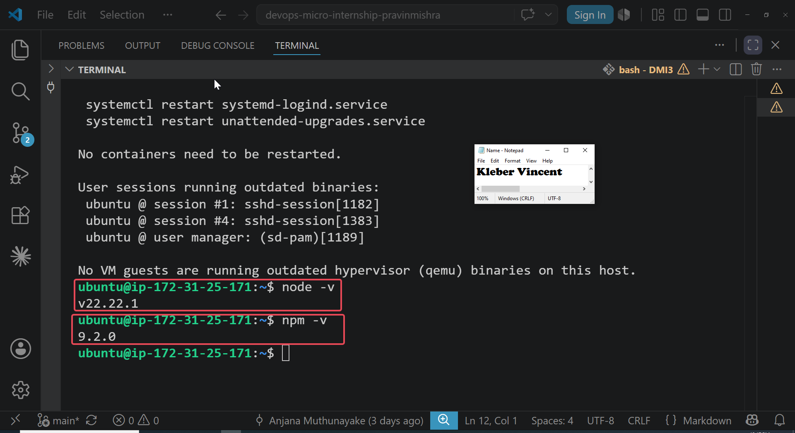

---

# Task 2 — Setup Environment (Nginx)

## Goal

Install Nginx, start the service, and confirm it is running:

To prepare the Ubuntu server for hosting the React application, I installed Nginx and verified that the web server service started successfully by executing the following command:

```bash
systemctl status nginx --no-pager
```

This command displays the current status of the Nginx service, including whether it is active, running, or has encountered any errors. The output confirmed that the service was in the **active (running)** state, indicating that Nginx had been installed successfully and was ready to serve web content. As shown in **Screenshot 2**, the service status verifies that the web server was operating correctly before deploying the React application.

### Evidence

#### Screenshot 2 — Output of `systemctl status nginx --no-pager` showing Active (running)

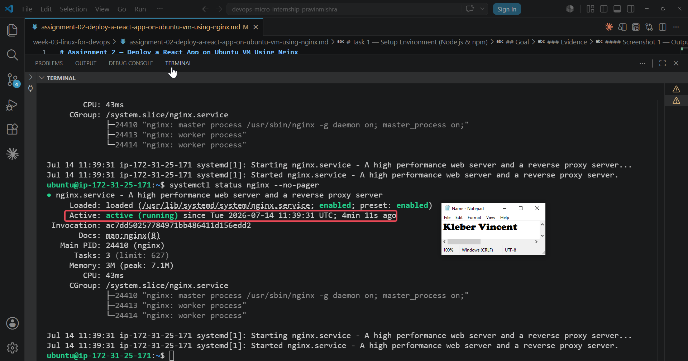

---

# Task 3 — Clone React Application

## Goal

Clone the project repository and verify the project files are present:

To obtain the React application source code, I cloned the project repository and verified that all project files were downloaded successfully by executing the following command:

```bash
ls
```

This command lists the files and directories in the current location, allowing me to confirm that the React project was cloned correctly. The output displayed the expected project files and folders, indicating that the repository was ready for customization and deployment. As shown in **Screenshot 3**, the project structure was successfully created on the Ubuntu server.


### Evidence

#### Screenshot 3 — Output of `ls` inside the `my-react-app` directory showing project files

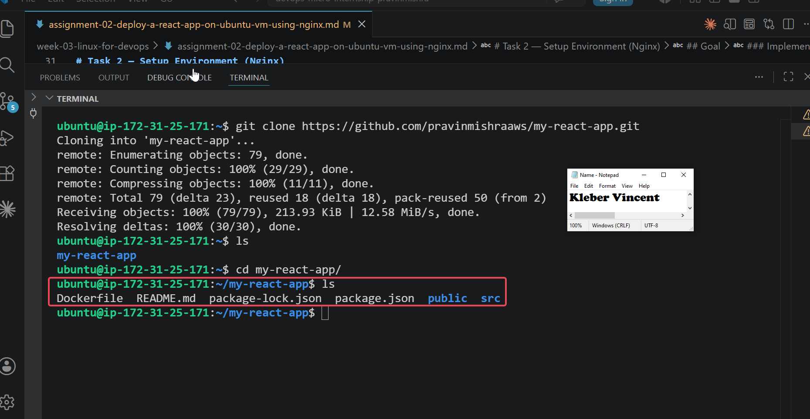

---

# Task 4 — Modify Application (Personalization)

## Goal

Update `App.js` with your full name and the current date:

To personalize the React application, I edited the **App.js** file by executing the following command:

```bash
nano App.js
```

This command opens the **App.js** file in the Nano text editor, allowing me to modify the application's content. I updated the file with my full name and the current date as required by the assignment. As shown in **Screenshot 4**, the changes were successfully applied, confirming that the application had been customized before generating the production build.


### Evidence

#### Screenshot 4 — `nano App.js` open showing your full name and date filled in

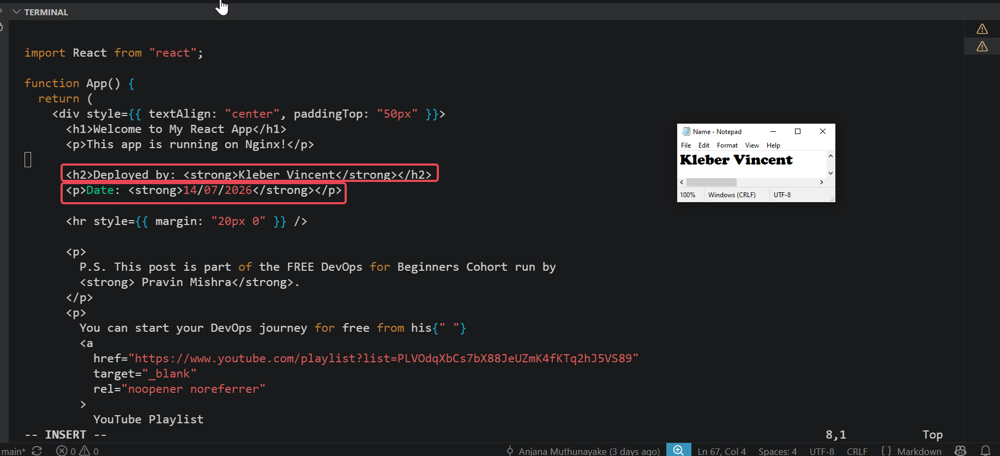

---

# Task 5 — Build React Application

## Goal

Install dependencies and generate the production build:

After personalizing the application, I installed the required project dependencies and generated the production build using the following commands:

```bash
npm install
npm run build
ls
```

These commands install all required packages, generate an optimized production build, and verify that the build folder was successfully created. The output confirmed that the build process completed successfully and produced the **build/** directory containing the optimized application files. As shown in **Screenshot 5**, the generated build folder confirms that the application was ready for deployment.

### Evidence

#### Screenshot 5 — Output of `ls` inside `my-react-app` showing the `build/` folder generated

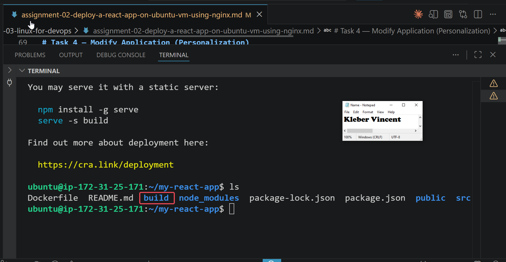

---

# Task 6 — Deploy React Build to Nginx Web Root

## Goal

Copy the production build files to the Nginx web root directory:

To deploy the React application, I copied the production build files into the Nginx web root directory and verified the deployment by executing the following command:

```bash
ls /var/www/html/
```

This command lists the contents of the Nginx web root directory, allowing me to confirm that the React build files were copied successfully. The output displayed the deployed application files, indicating that Nginx now had access to the production build. As shown in **Screenshot 6**, the web root contains the React application files required to serve the website.


### Evidence

#### Screenshot 6 — Output of `ls /var/www/html/` showing the deployed build contents

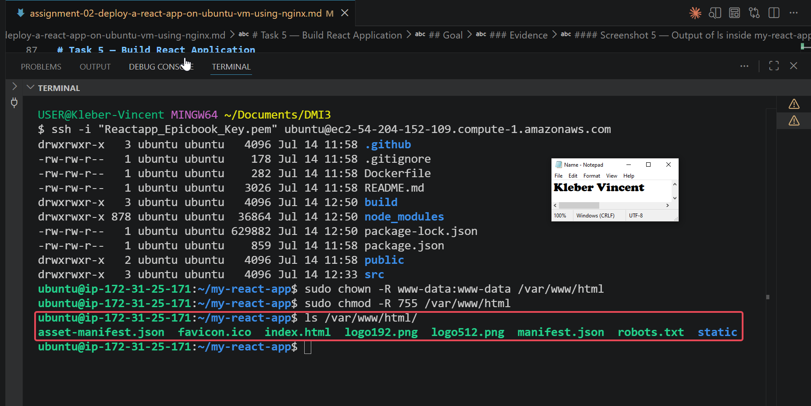

---

# Task 7 — Configure Nginx for React Application

## Goal

Apply Nginx configuration for React routing and confirm the service is active:

To ensure Nginx could correctly serve the React application and support client-side routing, I verified the web server status and reviewed the Nginx configuration by executing the following commands:

```bash
systemctl is-active nginx
cat /etc/nginx/sites-available/default
```

The first command confirms whether the Nginx service is currently running, while the second displays the active server configuration. The output showed that the Nginx service was **active** and that the configuration included the required settings for serving the React application. As shown in **Screenshots 7 and 8**, both the service status and configuration were correctly applied, confirming that the web server was properly configured for deployment.

### Evidence

#### Screenshot 7 — Output of `systemctl is-active nginx` showing `active`

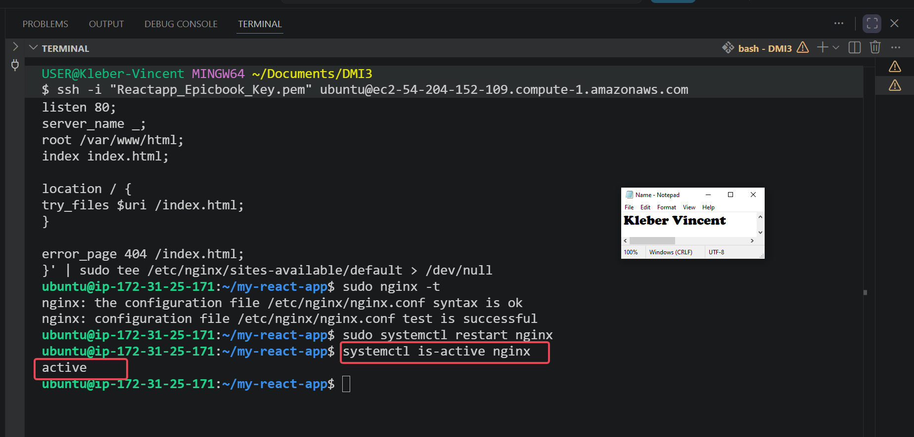

---

#### Screenshot 8 — Output of `cat /etc/nginx/sites-available/default` showing the Nginx config

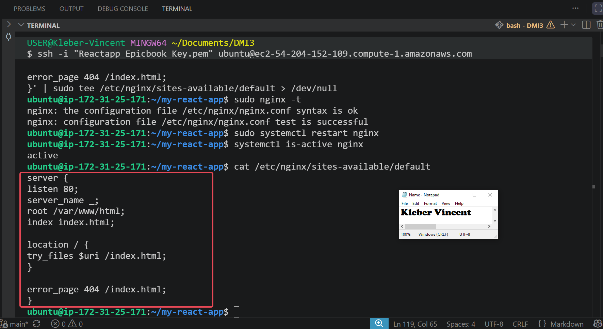

---

# Task 8 — Test Deployment

## Goal

Verify the React application is publicly accessible via the server's public IP:

To verify that the React application was successfully deployed and publicly accessible, I first retrieved the server's public IP address and then accessed the application through a web browser using the following command:

```bash
curl ifconfig.me
```

This command returns the public IP address assigned to the Ubuntu server, allowing me to access the deployed application remotely. The output displayed the server's public IP address, which I entered into a web browser to verify the deployment. As shown in **Screenshot 9**, the public IP address was successfully retrieved, while **Screenshot 10** confirms that the React application loaded correctly in the browser with my personalized details, demonstrating that the deployment was successful.


### Evidence

#### Screenshot 9 — Output of `curl ifconfig.me` showing the server's public IP address

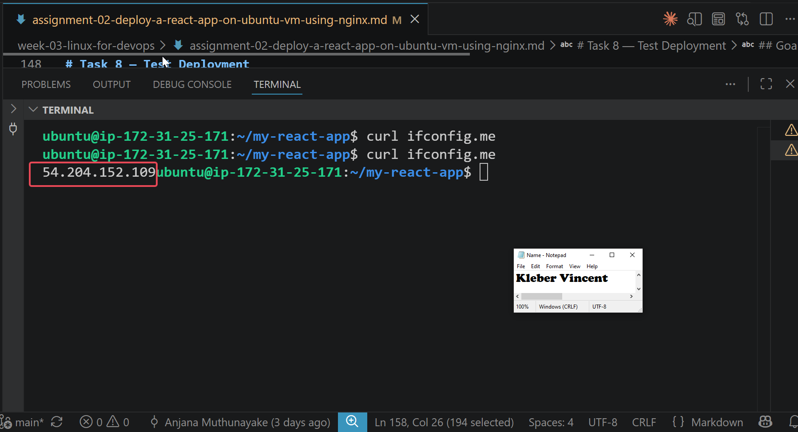

---

#### Screenshot 10 — Browser showing the deployed React app at `http://<public-ip>` with your name and date visible

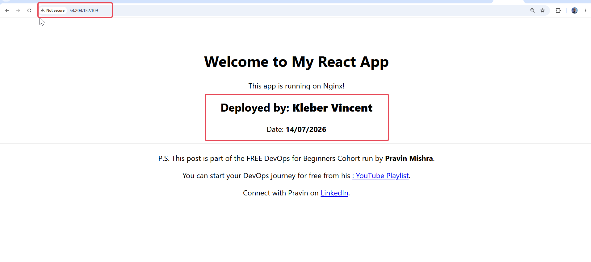
---

# LinkedIn Post (Required)

## Evidence

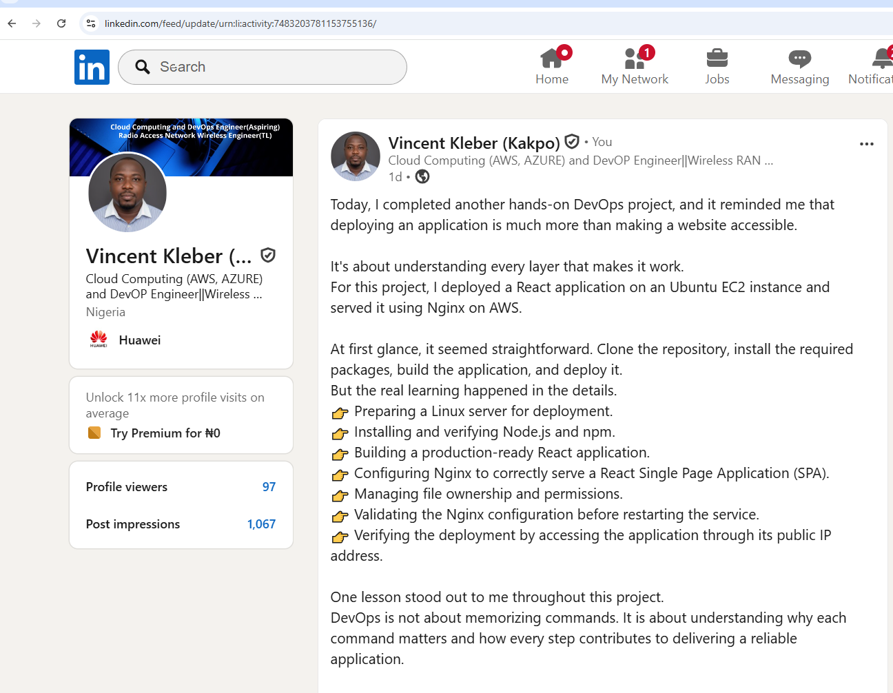

#### LinkedIn Post URL

https://www.linkedin.com/feed/update/urn:li:activity:7483203781153755136/
---

#### Screenshot — LinkedIn post showing the deployed application


---

# Submission Instructions

- Add all required screenshots in your submission
- Full name must be visible in required screenshots
- Do not expose sensitive information (keys, passwords, account IDs)

---

# Completion Checklist

- [ ] Node.js and npm installed and verified (Screenshot 1)
- [ ] Nginx installed and running (Screenshot 2)
- [ ] Repository cloned and files verified (Screenshot 3)
- [ ] App.js updated with full name and date (Screenshot 4)
- [ ] Production build generated (Screenshot 5)
- [ ] Build files deployed to Nginx web root (Screenshot 6)
- [ ] Nginx configured and active (Screenshots 7 & 8)
- [ ] Public IP retrieved (Screenshot 9)
- [ ] React app accessible in browser with personal details visible (Screenshot 10)
- [ ] LinkedIn post published and URL submitted
- [ ] No sensitive data exposed

---

## 📌 About DMI & CloudAdvisory

DevOps Micro Internship (DMI) is a project-based DevOps program run by Pravin Mishra (The CloudAdvisory) focused on real-world execution, systems thinking, and career readiness.

It helps learners build strong DevOps foundations with hands-on experience.

---

## 📌 Resources

- 🌐 DMI Official Website: https://pravinmishra.com/dmi  
- 🎓 DevOps for Beginners (Udemy): https://www.udemy.com/course/devops-for-beginners-docker-k8s-cloud-cicd-4-projects/  
- 🎓 Agentic AI DevOps with Claude Code: https://www.udemy.com/course/ultimate-agentic-ai-devops-with-claude-code/  
- 🎓 DevOps with Claude Code: Terraform, EKS, ArgoCD & Helm: https://www.udemy.com/course/devops-with-claude-code-terraform-eks-argocd-helm/  
- ▶️ YouTube Playlist: https://www.youtube.com/playlist?list=PLFeSNDtI4Cho  
- 🔗 Pravin Mishra (LinkedIn): https://www.linkedin.com/in/pravin-mishra-aws-trainer/  
- 🏢 CloudAdvisory (LinkedIn): https://www.linkedin.com/company/thecloudadvisory/

---

*This submission is part of DevOps Micro Internship (DMI) Cohort 3 — Agentic AI Track.*