# Assignment 3 — Production Maintenance Drill (OPS Checklist)

Part of the DevOps Micro Internship (DMI) Cohort 3 with Agentic AI

---

## Purpose

In this assignment, you will treat your already deployed React application (on Ubuntu VM with Nginx) as a live production system. You will perform structured operational checks covering network validation, service health, log analysis, resource monitoring, configuration verification, and incident simulation with recovery — mirroring real on-call DevOps responsibilities.

---

# Task 1 — Server Access & Networking Validation

## Goal

Verify that the deployed React application is reachable from the browser and confirm basic network connectivity of the Ubuntu VM:

To verify that the deployed React application was reachable and that the Ubuntu server was correctly connected to the network, I performed a series of production readiness checks covering network configuration, routing, DNS resolution, internet connectivity, listening services, and firewall status.

I executed the following commands in sequence:

```bash
ip a
ip route
dig pravinmishra.com +short
ping -c 4 thecloudadvisory.com
sudo ss -tulpen
sudo ufw status
```
The `ip a` command displays the server's network interfaces and assigned IP addresses, confirming that the network interface is properly configured. The `ip route` command verifies the default gateway, ensuring the server knows how to reach external networks. The `dig` command validates DNS resolution by confirming that domain names can be translated into IP addresses, while the `ping` command tests outbound network connectivity.
Finally, `sudo ss -tulpen` lists all listening ports and the associated services, confirming that Nginx is listening on port 80 and SSH on port 22. The `sudo ufw status` command verifies the firewall configuration to ensure that the required network ports are accessible.

As shown in **Screenshots 1–4**, the React application was accessible through the browser, the server's network configuration was healthy, the required services were listening on the expected ports, and the firewall configuration supported external connectivity.

### Evidence

#### Screenshot 1 — Browser showing the React app with your Full Name visible on the UI


#### Screenshot 2 — Output of `ip a`

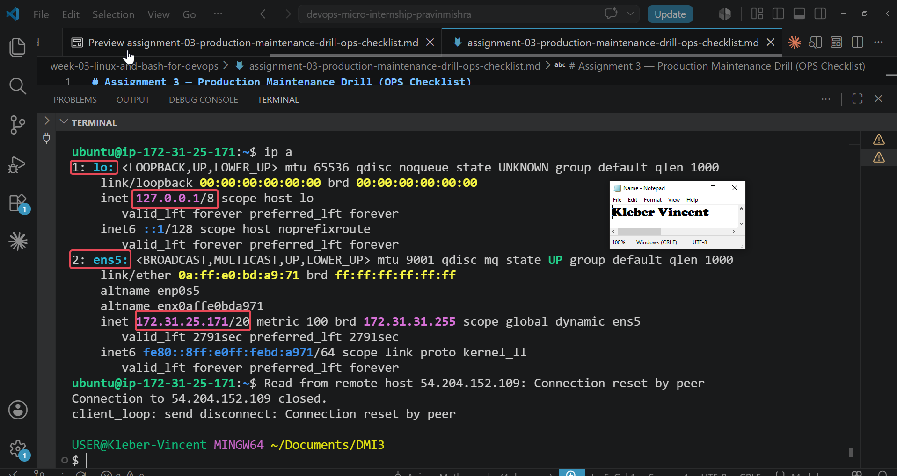


#### Screenshot 3 — Output of `sudo ss -tulpen`

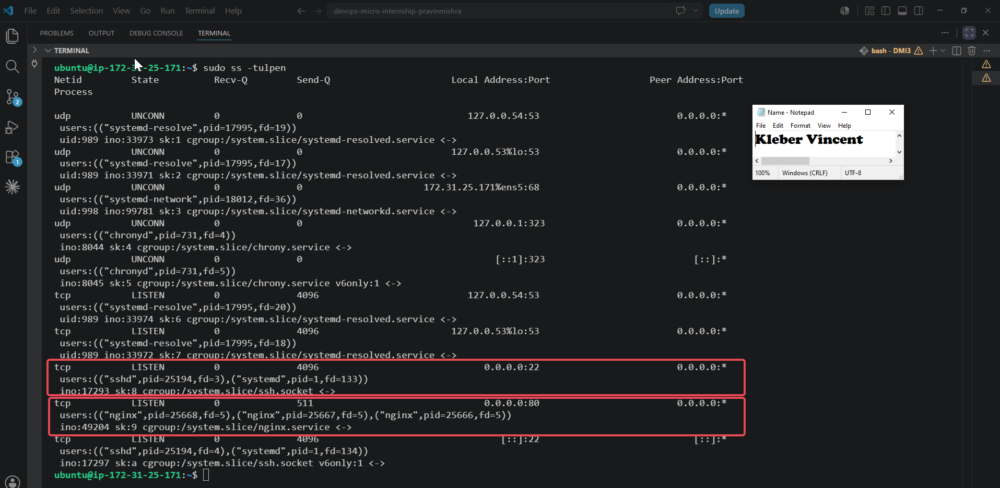


#### Screenshot 4 — Output of `sudo ufw status`

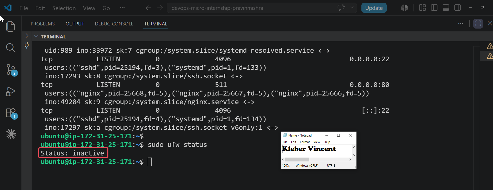


### Notes

Answer the following in your own words:

**1. What proves Nginx is listening on 0.0.0.0:80?**

The output of `sudo ss -tulpen` showed the Nginx service listening on `0.0.0.0:80`. This confirms that Nginx is bound to all available IPv4 network interfaces and is ready to accept incoming HTTP requests from external clients.

---

**2. What proves SSH is active on port 22?**

The same command showed the `sshd` service listening on `0.0.0.0:22` and `[::]:22`. This confirms that the SSH service is active and accepting secure remote connections over both IPv4 and IPv6.

---

**3. Did you find any unexpected open ports? Explain briefly.**

No unexpected open ports were identified during the inspection. The server was listening only on the required services, including SSH (port 22) for remote administration and HTTP (port 80) for the deployed React application, alongside essential system services used for DNS resolution, DHCP, and time synchronization. This indicates that the server is exposing only the services necessary for normal operation, which aligns with good production security practices.

---

# Task 2 — Service Health & Systemd Validation (Nginx)

## Goal

Verify that Nginx is properly installed, running, enabled at boot, and safely configured:

To verify that Nginx was correctly installed, running, enabled to start automatically, and safely configured for production use, I performed a series of health checks on the service before and after a controlled restart.
I executed the following commands in sequence:

```bash
systemctl status nginx --no-pager
systemctl is-enabled nginx
sudo nginx -t
ps aux | grep -E "nginx: master|nginx: worker" | grep -v grep
sudo ss -lptn '( sport = :80 )'
sudo systemctl restart nginx
systemctl status nginx --no-pager
```
The `systemctl status nginx --no-pager` command was used to verify that the Nginx service was active and running. I then checked whether Nginx was configured to start automatically after a system reboot using `systemctl is-enabled nginx`.

Before restarting the service, I validated the Nginx configuration with `sudo nginx -t` to ensure there were no syntax errors that could prevent the web server from starting successfully. Next, I verified that both the Nginx master and worker processes were running and confirmed that Nginx was actively listening on port **80**, making it available to receive incoming HTTP requests.

Finally, I performed a controlled restart of the Nginx service and confirmed that it returned to the **active (running)** state without any errors.

As shown in **Screenshot 1**, the Nginx service was running successfully. **Screenshot 2** confirms that the configuration test passed with no syntax errors, while **Screenshot 3** verifies that Nginx was listening on port **80**, confirming that the web server was ready to serve the deployed React application.


### Evidence

#### Screenshot 1 — Output of `systemctl status nginx --no-pager`

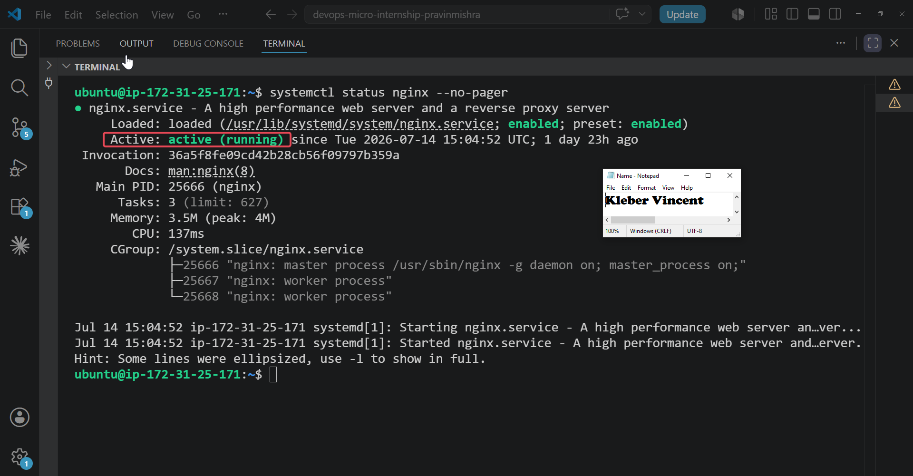

---

#### Screenshot 2 — Output of `sudo nginx -t`

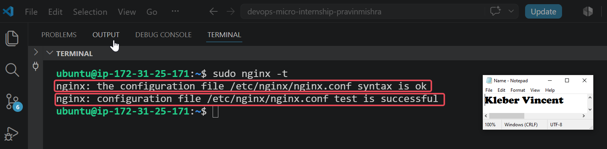

---

#### Screenshot 3 — Output of `sudo ss -lptn '( sport = :80 )'`

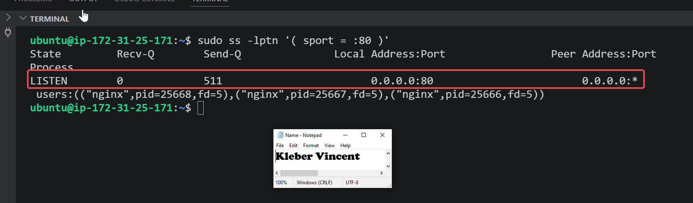

---

### Notes

Answer the following in your own words:

**1. What happens if Nginx fails to restart in production?**

If Nginx fails to restart, users will no longer be able to access the web application because the web server responsible for handling incoming HTTP requests will be unavailable. This can result in application downtime, failed client requests, and a poor user experience. In a production environment, such an incident can also affect business operations and may require immediate investigation and recovery.

---

**2. What's your basic rollback plan?**

My basic rollback plan would be to restore the last known working Nginx configuration or deployment backup, verify the configuration using `sudo nginx -t`, and then restart or reload the Nginx service. If the issue was introduced by a recent configuration change, I would immediately revert the change, test the configuration again, and only bring the service back online after confirming that the configuration is valid and the application is accessible.

---

# Task 3 — Logs & Request Trace

## Goal

Verify real traffic flow and analyze logs to understand system behavior and errors:

To verify that the deployed React application was receiving and processing client requests correctly, I first generated HTTP traffic to the application before reviewing the Nginx access logs, error logs, and system logs for recent activity and potential issues.
I executed the following commands in sequence:

```bash
curl -s http://<public-ip> > /dev/null
curl -I http://<public-ip>
sudo tail -n 30 /var/log/nginx/access.log
sudo tail -n 30 /var/log/nginx/error.log
sudo journalctl -u nginx --no-pager -n 50
```
The first command silently sent an HTTP request to the application without displaying the response body, while the second retrieved the HTTP response headers to confirm that the web server was responding successfully. Generating this traffic ensured that recent requests would be available for analysis in the Nginx logs.

I then examined the last 30 entries in the Nginx access log to verify that incoming requests, including my own, were successfully recorded. Next, I reviewed the Nginx error log to check for configuration errors, runtime issues, or failed requests that could affect application availability. Finally, I inspected the Nginx service logs using `journalctl` to review recent startup events, reload operations, and other service-related messages recorded by systemd.

As shown in **Screenshot 1**, the access log recorded recent client requests, confirming that traffic was successfully reaching the web server. **Screenshot 2** shows that there were no critical runtime or configuration errors affecting Nginx during the inspection period. **Screenshot 3** provides additional confirmation from the system logs that the Nginx service was operating normally and handling requests as expected.

### Evidence

#### Screenshot 1 — Output of `sudo tail -n 30 /var/log/nginx/access.log`

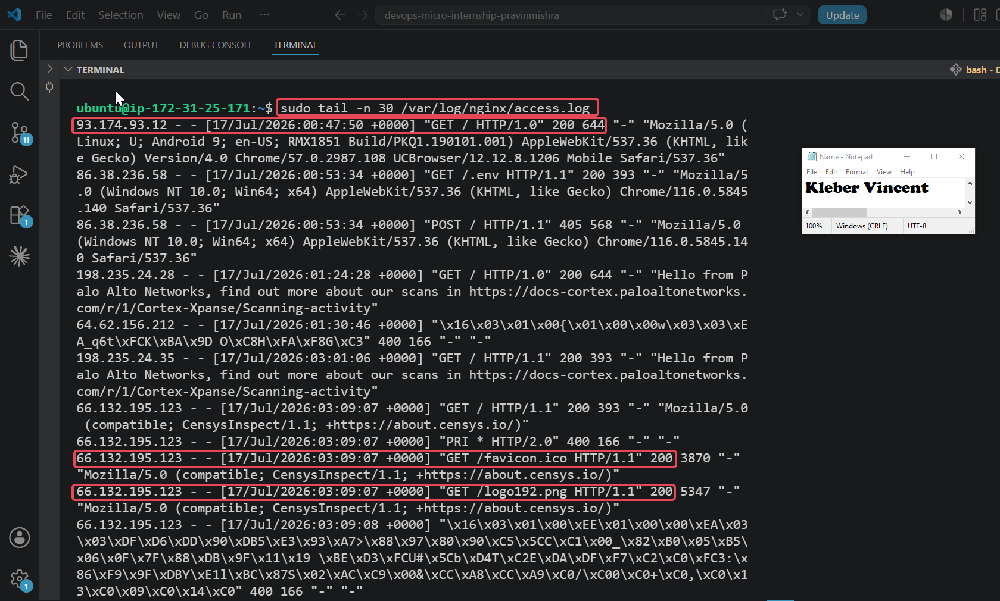

---

#### Screenshot 2 — Output of `sudo tail -n 30 /var/log/nginx/error.log`

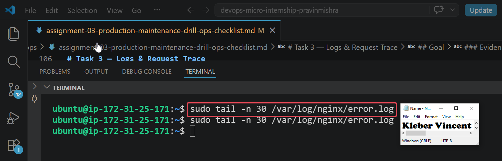

---

#### Screenshot 3 — Output of `sudo journalctl -u nginx --no-pager -n 50`

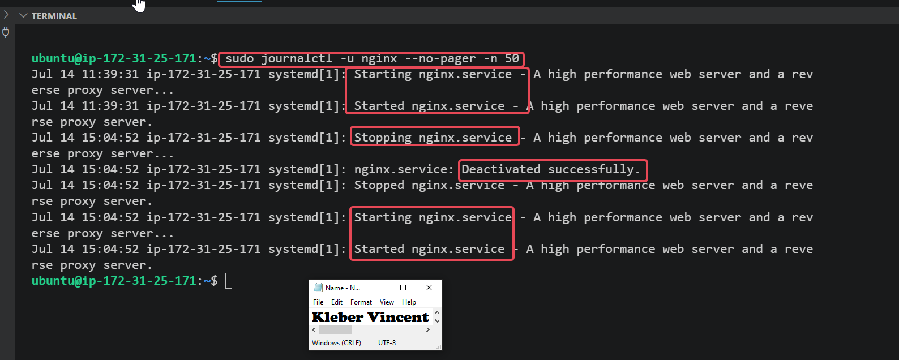

---

### Notes

Answer the following in your own words:

**1. Were there any errors in the logs?**

- If yes, mention 1–2 example error lines from the logs and explain what each one means in simple terms.
- If no, explain what it means if the error log is empty or shows no recent errors during your check.

Yes. The access log contained a few **400 Bad Request** and **405 Method Not Allowed** responses.
These requests were generated by automated internet scans or unsupported client requests rather than problems with the Nginx service.
The Nginx error log contained no recent entries, indicating that no configuration or runtime errors were recorded during the inspection.


---

**2. If there were no errors, what does that indicate about the system?**

Although the access log contained some client-related responses (**400** and **405**), the Nginx error log was empty.
This indicates that the web server was operating normally without any configuration or runtime issues during the period of inspection.
It does not mean the system is permanently error-free,only that no server-side errors were recorded while thechecks were performed.

---

**3. Based on the access logs, were your curl requests visible in the log entries? What does that prove about traffic flow?**

Yes. The `curl` requests appeared in the Nginx access log with **HTTP 200 OK** responses.
This confirms that the requests successfully reached the web server, were processed correctly, and were recorded in the access log.
It also verifies that traffic is flowing normally between the client and the deployed React application.
---

# Task 4 — System Resource Health Check (Capacity Red Flags)

## Goal

Assess server capacity and detect potential performance or failure risks:

## Commands Executed

```bash
uptime
free -h
df -h
sudo du -sh /var/* | sort -h
```
To assess the overall health of the Ubuntu server and identify potential capacity issues before they affect application performance, I performed a series of system resource checks covering CPU load, memory utilization, disk usage, and storage consumption.
I first executed the `uptime` command to determine how long the server had been running and to review the current system load averages. The output confirmed that the server had been running continuously for over three days with a load average of **0.00, 0.00, 0.00**, indicating that the system was not experiencing any CPU load at the time of the health check.
Next, I executed the `free -h` command to examine memory utilization. The output displayed the total, used, free, and available memory in a human-readable format. The results confirmed that the server still had over **550 MiB of available memory**, indicating that sufficient RAM was available for running applications without memory pressure.
I then executed the `df -h` command to review the storage utilization of each mounted filesystem. The output showed that the root filesystem was **60% utilized**, leaving approximately **2.7 GB** of available storage, which indicates that adequate disk space remained available for normal server operations.
Finally, I executed `sudo du -sh /var/* | sort -h` to identify which directories within the `/var` directory were consuming the most storage. The output showed that **/var/lib** occupied the largest amount of space, followed by **/var/cache** and **/var/log**, providing a clear overview of storage distribution within the system.

### Evidence

#### Screenshot 1 — Output of `uptime`

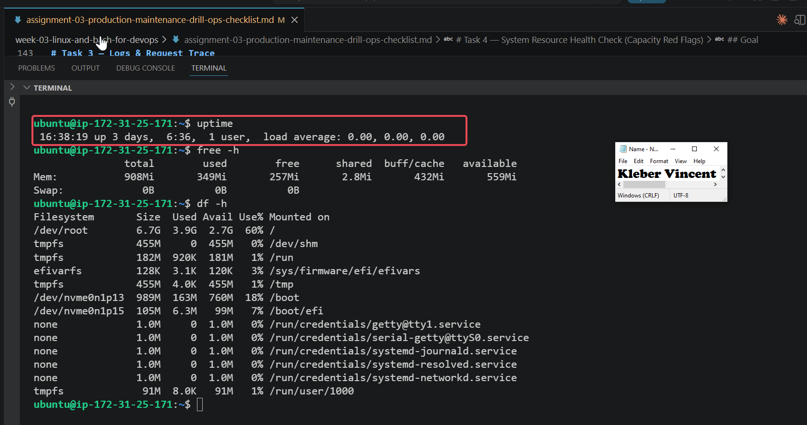

---

#### Screenshot 2 — Output of `free -h`

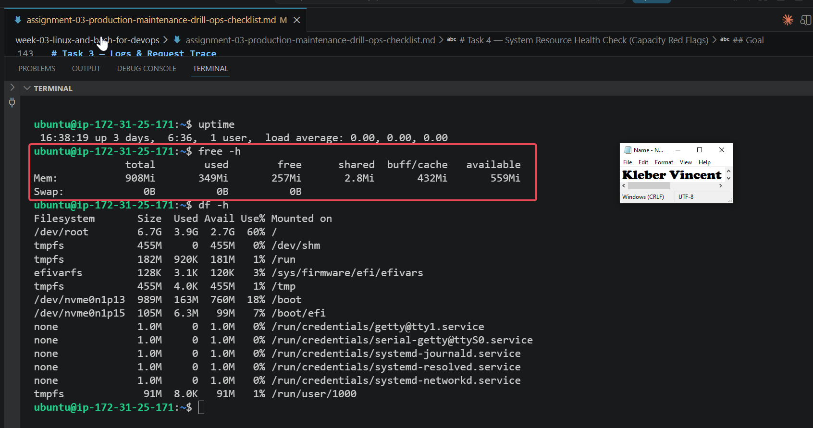

---

#### Screenshot 3 — Output of `df -h`

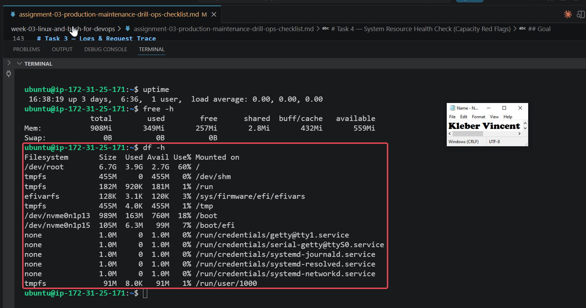

---

#### Screenshot 4 — Output of `sudo du -sh /var/* | sort -h`

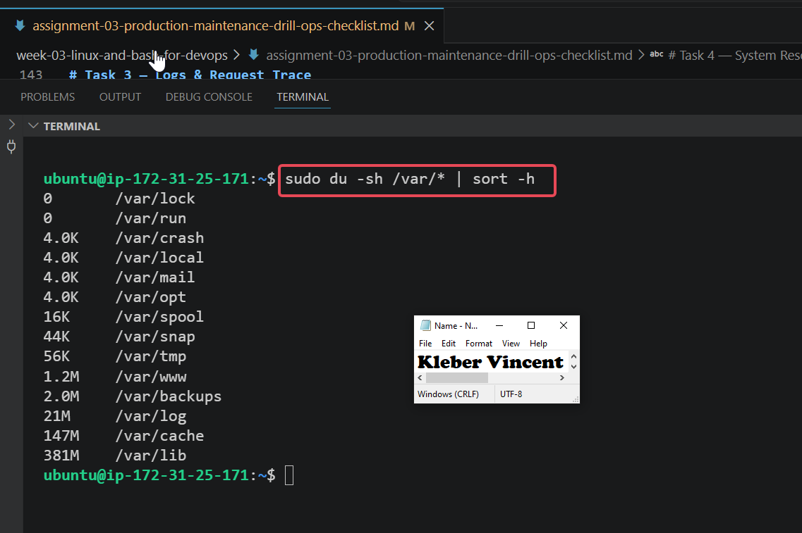

---

### Notes

**1. Which resource looks most critical right now? (CPU/load, memory, or disk) Explain why.**

Based on the results of the system health checks, none of the monitored resources appear to be under immediate pressure. The server load average remained at **0.00**, indicating no CPU contention, while more than half of the available memory remained free for use. In addition, the root filesystem was only **60% utilized**, leaving sufficient storage capacity for normal operations. Although the `/var/lib` directory consumed the largest amount of space within the `/var` directory, its size was not excessive and did not indicate any immediate capacity concern. Overall, the server resources appeared healthy and capable of supporting the deployed application.

---

**2. What happens if disk becomes 100% full in a production server?**

If a production server reaches **100% disk utilization**, applications may no longer be able to write log files, create temporary files, or store new data. This can cause services to fail, deployments to stop, and the operating system to become unstable or unresponsive. Regular monitoring of disk usage, log rotation, and periodic cleanup of unnecessary files help prevent storage exhaustion and ensure the server continues to operate reliably.

---

# Task 5 — Configuration & Deployment Verification

## Goal

Ensure the correct React build is deployed and Nginx is serving it properly:

To verify that the correct React application was deployed and that Nginx was serving the expected production build, I performed a series of deployment verification checks. These checks confirmed that the application files existed in the expected web root, that my customized deployment was present within the compiled React build, and that Nginx was correctly configured to support React Single Page Application (SPA) routing.
The following commands were executed to perform these verification checks:

```bash
ls -lah /var/www/html | head -n 20

grep -R "Deployed by" -n /var/www/html 2>/dev/null | head

grep -n "try_files" /etc/nginx/sites-available/default
```
I first inspected the contents of the `/var/www/html` directory to verify that the React production build files had been deployed successfully. The output confirmed the presence of important files such as `index.html`, `manifest.json`, `robots.txt`, and the `static` directory, indicating that the application build was available for Nginx to serve.
Next, I searched the deployed application for the custom **"Deployed by Kleber Vincent"** marker that I had added during the previous assignment. Although the React application was compiled into a minified JavaScript bundle, the search successfully located the custom text, confirming that the latest version of my application had been deployed rather than an older build.
Finally, I verified the Nginx configuration by checking for the `try_files $uri /index.html;` directive within the default site configuration. This directive is essential for React Single Page Applications because it ensures that any request for a client side route is redirected to `index.html`, allowing the React Router to handle navigation correctly instead of returning a 404 error.

### Evidence

#### Screenshot 1 — Output of `ls -lah /var/www/html | head -n 20`

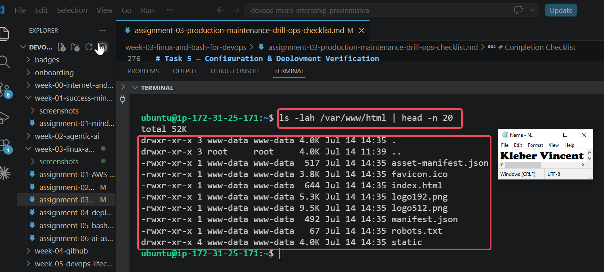

---

#### Screenshot 2 — Output of `grep -R "Deployed by" -n /var/www/html 2>/dev/null | head`

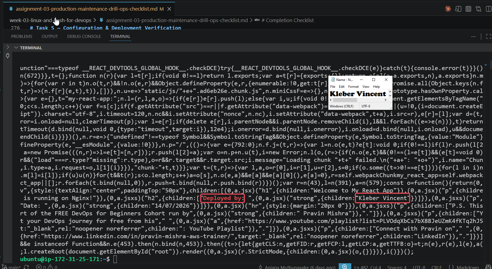

---

#### Screenshot 3 — Output of `grep -n "try_files" /etc/nginx/sites-available/default`

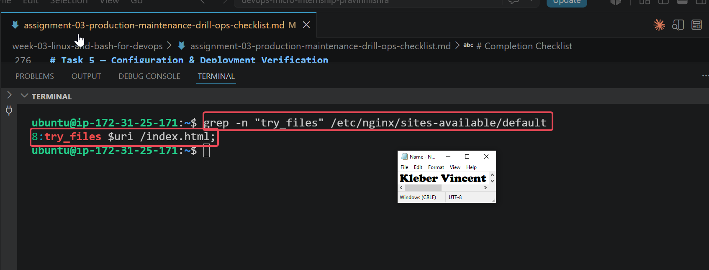

---

### Notes

**1. How do you confirm that the correct version of the application is deployed?**

I confirmed that the correct version of the application was deployed by verifying that the React production build files were present in the `/var/www/html` directory. I then searched the deployed build for the custom **"Deployed by Kleber Vincent"** marker that had been added during the previous assignment. Finding this text confirmed that the latest customized build had been successfully deployed. Finally, I verified that the Nginx configuration contained the `try_files $uri /index.html;` directive, ensuring that the application was configured correctly to support React Single Page Application (SPA) routing.

---

# Task 6 — Nginx Configuration Failure Simulation

## Goal

Simulate a real-world Nginx misconfiguration and recover the service safely:

To simulate a real world production issue, I intentionally introduced a syntax error into the Nginx configuration and then followed the appropriate troubleshooting and recovery process. This exercise demonstrated how configuration validation tools help identify errors before they affect production services and reinforced the importance of validating configuration changes before restarting a web server.
The following commands were executed during this exercise:

```bash
sudo nano /etc/nginx/sites-available/default
sudo nginx -t
sudo nginx -t
sudo systemctl restart nginx
curl -I http://54.204.152.109
```
I first opened the default Nginx site configuration file and intentionally removed the semicolon from the `try_files $uri /index.html;` directive, creating a configuration syntax error. I then executed `sudo nginx -t` to validate the configuration. The validation failed and reported an **unexpected "}"** error in the configuration file, confirming that Nginx had correctly detected the syntax issue and prevented an invalid configuration from being used.
After identifying the error, I restored the missing semicolon and executed the configuration test again. This time, Nginx reported that the configuration syntax was correct and that the configuration test was successful, confirming that the issue had been resolved.
Finally, I restarted the Nginx service to apply the corrected configuration and verified the application using `curl -I`. The server returned an **HTTP/1.1 200 OK** response, confirming that the web server was operating normally after the recovery.

### Evidence

#### Screenshot 1 — Output of `sudo nginx -t` showing the syntax error (broken config)

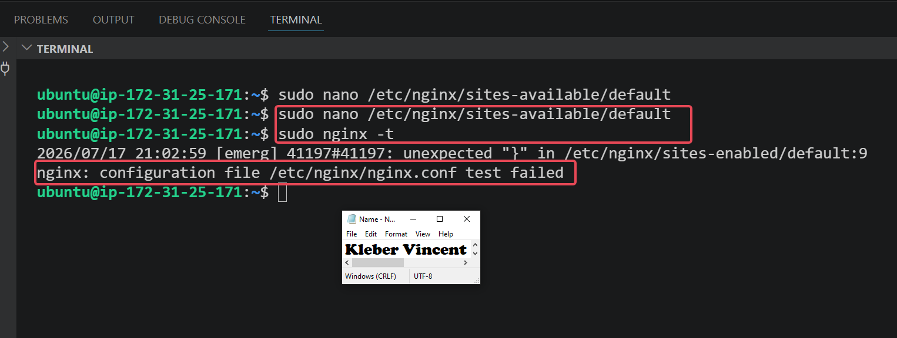

---

#### Screenshot 2 — Output of `sudo nginx -t` showing syntax ok (fixed config)

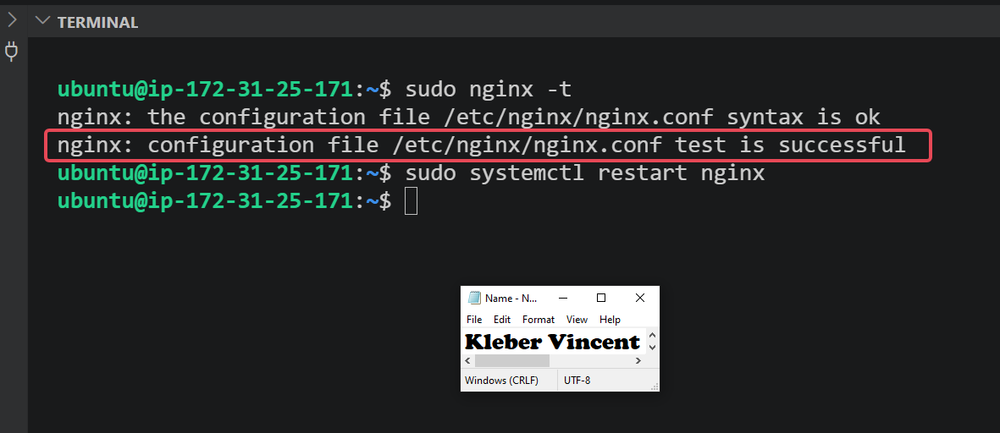

---

#### Screenshot 3 — Output of `curl -I http://<public-ip>` confirming recovery (200 OK)

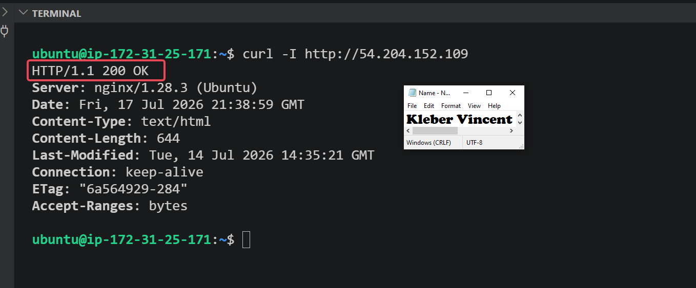

---

### Notes

**1. What caused the configuration failure?**

The failure was caused by intentionally removing the semicolon from the `try_files $uri /index.html;` directive in the Nginx configuration file. This introduced a syntax error, causing the configuration validation to fail and preventing Nginx from accepting the invalid configuration.

---

**2. How did you fix the issue?**

The failure was caused by intentionally removing the semicolon from the `try_files $uri /index.html;` directive in the Nginx configuration file. This introduced a syntax error, causing the configuration validation to fail and preventing Nginx from accepting the invalid configuration.

---

**3. How can you avoid this kind of issue in real production systems?**

Configuration files should always be validated using `sudo nginx -t` before restarting the Nginx service. Performing a syntax check before applying configuration changes helps identify errors early, reduces the risk of service interruptions, and ensures that only valid configurations are deployed to production.

---

# Task 7 — Web Application Failure Simulation

## Goal

Simulate missing deployment content and recover the application safely:

To simulate a deployment failure, I temporarily removed the deployed web application from the Nginx web root while preserving a backup of the original files. This exercise demonstrated how missing application content affects service availability and reinforced the importance of maintaining backups to enable quick recovery during production incidents.
The following commands were executed during this exercise:

```bash
sudo mv /var/www/html /var/www/html_backup
sudo mkdir -p /var/www/html
curl -I http://<public-ip>
sudo rm -rf /var/www/html
sudo mv /var/www/html_backup /var/www/html
sudo systemctl restart nginx
curl -I http://<public-ip>
```

I first moved the existing `/var/www/html` directory to `/var/www/html_backup` to create a safe backup of the deployed application. I then created a new empty `/var/www/html` directory, simulating a scenario where the web server was running but the application files were missing.
Next, I verified the application's status using `curl -I`. As expected, the request no longer returned a successful response because Nginx could not locate the required application files.
To recover the service, I removed the empty directory and restored the original application from the backup. After restarting the Nginx service, I performed another HTTP request using `curl -I`. Receiving an **HTTP/1.1 200 OK** response confirmed that the application had been restored successfully and was once again being served correctly.

### Evidence

#### Screenshot 1 — Output of `curl -I http://<public-ip>` showing failure (non-200 response)

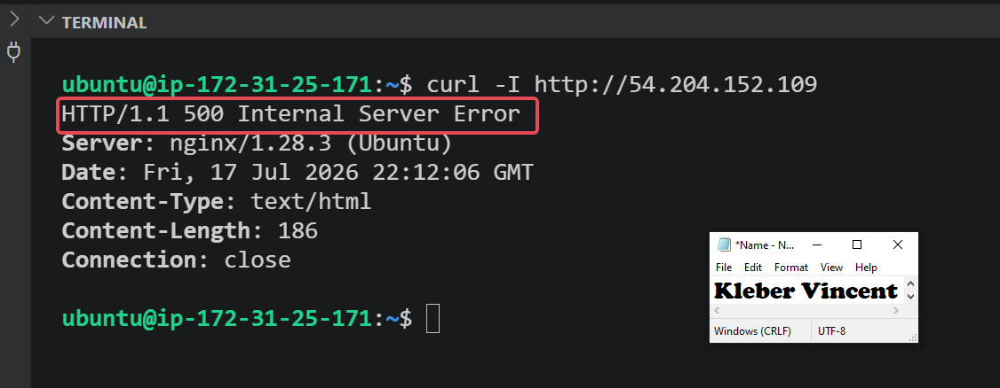

---

#### Screenshot 2 — Output of `curl -I http://<public-ip>` confirming recovery (200 OK)

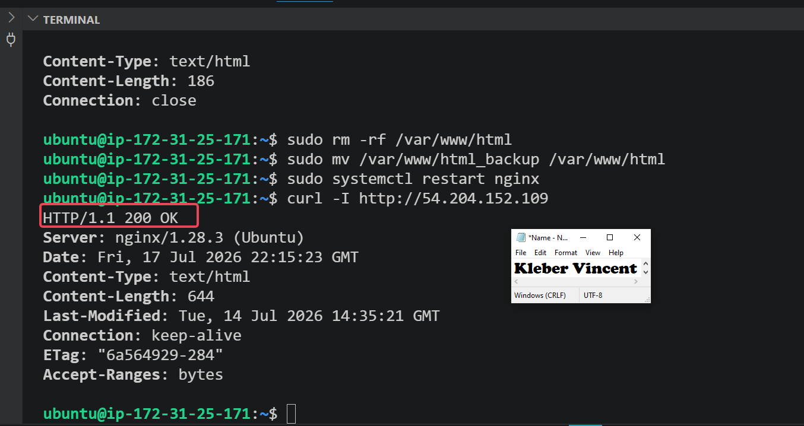

---

### Notes

**1. What caused the application to break in this scenario?**

The application stopped working because the deployed web application directory (`/var/www/html`) was temporarily moved to a backup location and replaced with an empty directory. Although the Nginx service was still running, it could no longer locate the application's files, including `index.html`, causing the server to return an **HTTP/1.1 500 Internal Server Error** instead of serving the website.

---

**2. How did you fix the issue and restore the application?**

I restored the application by removing the empty `/var/www/html` directory and moving the backup directory (`/var/www/html_backup`) back to its original location as `/var/www/html`. After restarting the Nginx service, I verified the recovery by sending an HTTP request using `curl -I`. The server returned an **HTTP/1.1 200 OK** response, confirming that the application had been restored successfully.

---

**3. What steps would you take to prevent this kind of issue in real production systems?**

In a production environment, I would implement automated deployment pipelines with rollback capabilities, maintain regular backups of application files, and verify deployments immediately after every release. Using version control, deployment automation, and monitoring tools would help detect issues early, minimize downtime, and enable rapid recovery if application files become unavailable.

---

# Task 8 — Security & Reliability Review

## Goal

Review and reflect on the security and reliability practices applied during this assignment.

### Security & Reliability Notes


**1. Why is SSH key-based authentication more secure than sharing passwords?**

SSH key-based authentication is more secure because it uses a pair of cryptographic keys instead of passwords that can be guessed, reused, or stolen. The private key remains securely stored on the user's device and is never transmitted during authentication, making it significantly more difficult for attackers to gain unauthorized access. This method also reduces the risk of brute-force and password-based attacks.

---

**2. Why should only required ports be open on a production server?**

Only the ports required by the application should be open to reduce the server's attack surface. Closing unnecessary ports prevents unauthorized access to services that are not in use, reduces potential security vulnerabilities, and helps protect the server from malicious attacks.

---

**3. Why is it important for Nginx to be enabled on boot?**

Enabling Nginx on boot ensures that the web server starts automatically whenever the server is restarted due to maintenance, updates, or unexpected failures. This improves service availability, minimizes downtime, and ensures that users can continue accessing the application without requiring manual intervention.

---

**4. What are the risks of sharing secrets, keys, or credentials publicly?**

Sharing secrets, SSH keys, API keys, or credentials publicly can give unauthorized users access to servers, cloud resources, or sensitive data. This may lead to data breaches, unauthorized changes, financial losses, and service disruptions. Sensitive information should always be stored securely and never committed to source control or shared publicly.

---

**5. Why should cloud resources be stopped or terminated when they are no longer needed?**

Cloud resources continue to consume billable infrastructure even when they are not being used. Stopping or terminating unused resources helps reduce operational costs, minimizes unnecessary security exposure, and keeps cloud environments organized and easier to manage.

---

# LinkedIn Post (Required)

## Evidence

#### LinkedIn Post URL

https://www.linkedin.com/posts/vincent-kleber-kakpo-8b920b88_devops-cloudcomputing-cybersecurity-share-7484133959191322624-V4wN

---

#### Screenshot — Published LinkedIn post


---

# Submission Instructions

- Add all required screenshots in your submission
- Full name must be visible in required screenshots
- Do not expose sensitive information (keys, passwords, account IDs)

---

# Completion Checklist

- [ ] Task 1: Screenshots (browser, ip a, ss -tulpen, ufw status) + Notes answered
- [ ] Task 2: Screenshots (nginx status, nginx -t, ss port 80) + Notes answered
- [ ] Task 3: Screenshots (access log, error log, journalctl) + Notes answered
- [ ] Task 4: Screenshots (uptime, free -h, df -h, du -sh) + Notes answered
- [ ] Task 5: Screenshots (ls html, grep deployed by, grep try_files) + Notes answered
- [ ] Task 6: Screenshots (nginx -t fail, nginx -t pass, curl recovery) + Notes answered
- [ ] Task 7: Screenshots (curl failure, curl recovery) + Notes answered
- [ ] Task 8: Security & Reliability Notes answered
- [ ] LinkedIn post published and URL submitted
- [ ] Full Name visible in all required screenshots
- [ ] No sensitive data exposed

---

## 📌 About DMI & CloudAdvisory

DevOps Micro Internship (DMI) is a project-based DevOps program run by Pravin Mishra (The CloudAdvisory) focused on real-world execution, systems thinking, and career readiness.

It helps learners build strong DevOps foundations with hands-on experience.

---

## 📌 Resources

- 🌐 DMI Official Website: https://pravinmishra.com/dmi  
- 🎓 DevOps for Beginners (Udemy): https://www.udemy.com/course/devops-for-beginners-docker-k8s-cloud-cicd-4-projects/  
- 🎓 Agentic AI DevOps with Claude Code: https://www.udemy.com/course/ultimate-agentic-ai-devops-with-claude-code/  
- 🎓 DevOps with Claude Code: Terraform, EKS, ArgoCD & Helm: https://www.udemy.com/course/devops-with-claude-code-terraform-eks-argocd-helm/  
- ▶️ YouTube Playlist: https://www.youtube.com/playlist?list=PLFeSNDtI4Cho  
- 🔗 Pravin Mishra (LinkedIn): https://www.linkedin.com/in/pravin-mishra-aws-trainer/  
- 🏢 CloudAdvisory (LinkedIn): https://www.linkedin.com/company/thecloudadvisory/

---

*This submission is part of DevOps Micro Internship (DMI) Cohort 3 — Agentic AI Track.*