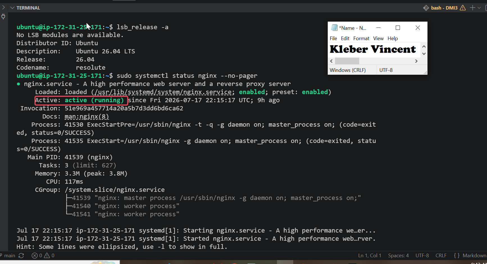
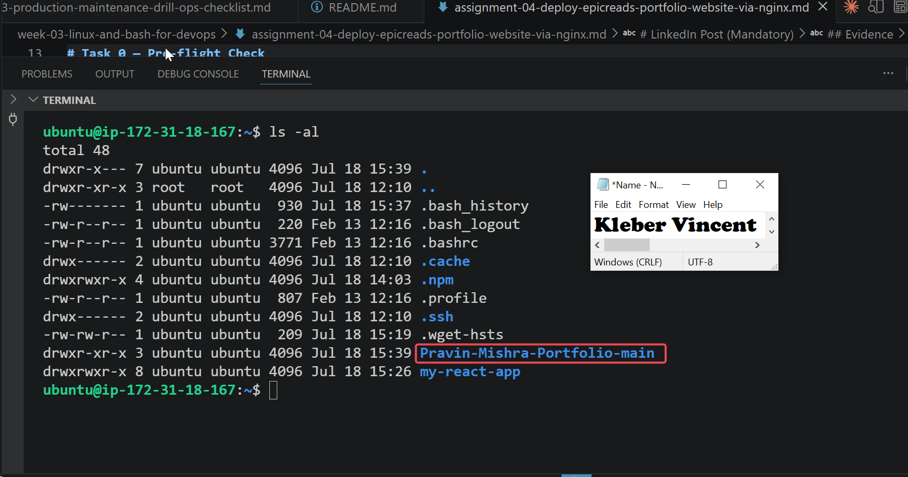
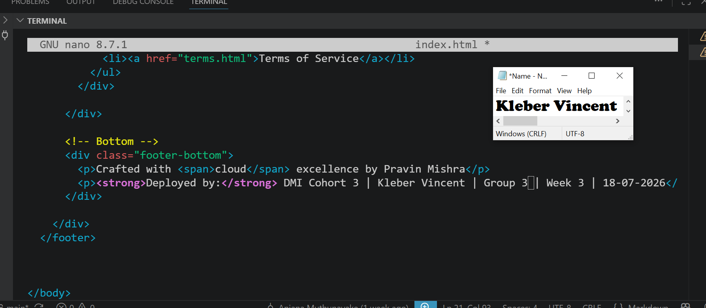
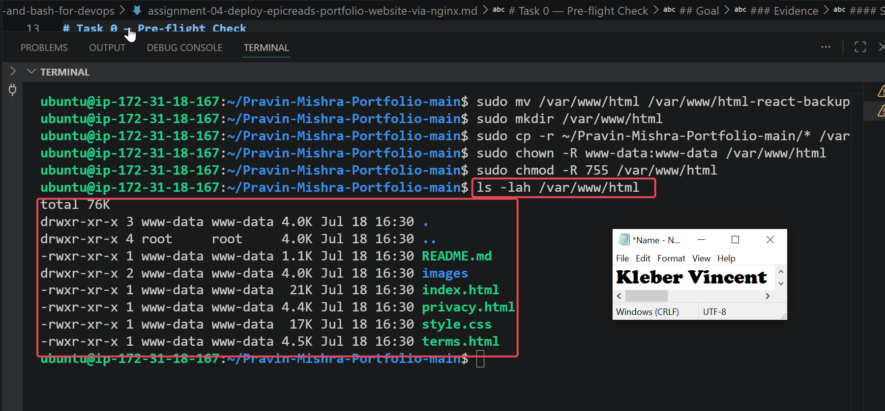
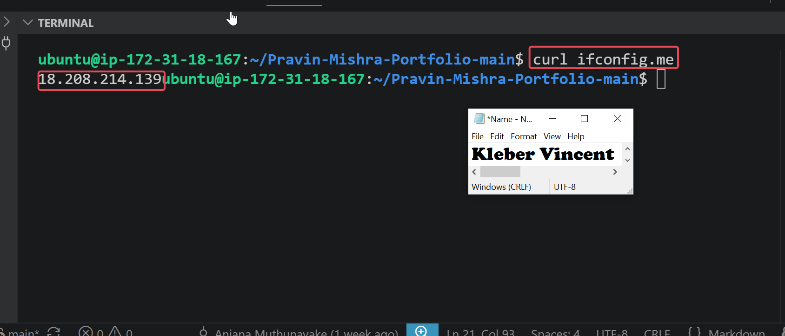
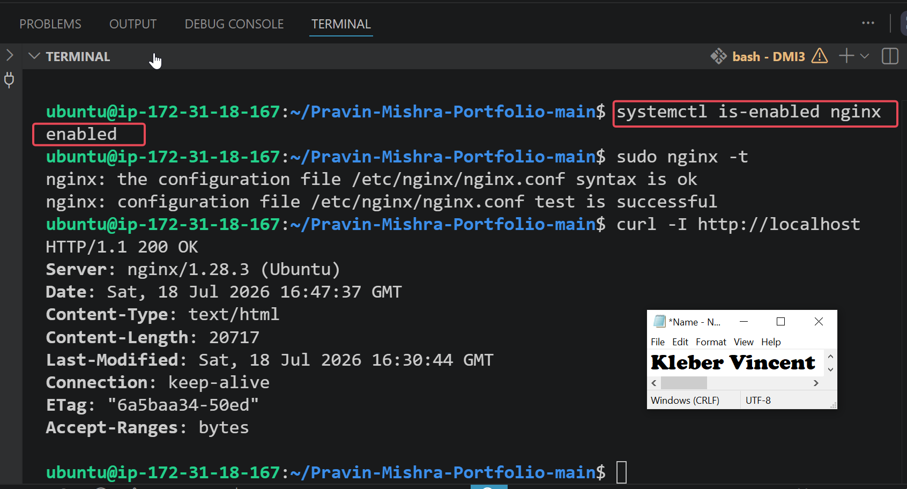
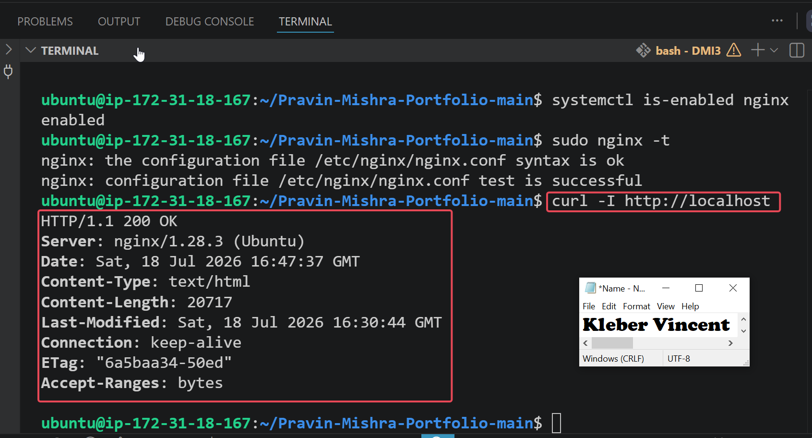
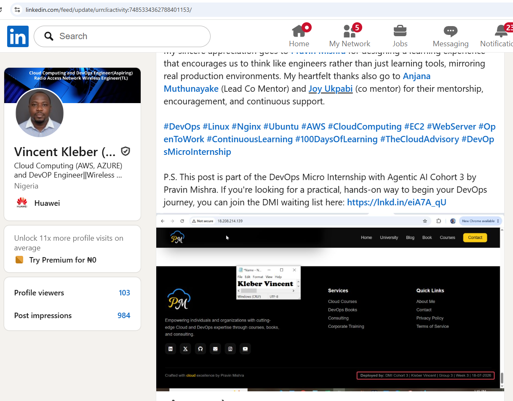

# Assignment 4 — Deploy EpicReads Portfolio Website via Nginx

Part of the DevOps Micro Internship (DMI) Cohort 3 with Agentic AI

---

## Purpose

In this assignment, you will deploy a static portfolio website on an Ubuntu VM using Nginx. You will download the website template, add your ownership proof in the footer, deploy the files to the Nginx web root, and verify the website is publicly accessible via a browser.

---

# Task 0 — Pre-flight Check

## Goal

Verify the Ubuntu VM and Nginx are ready for deployment.

Before deploying the EpicReads Portfolio website, I performed a pre-deployment validation to ensure that the Ubuntu virtual machine was accessible and that the Nginx web server was already installed and running correctly.
This verification is an important deployment practice because attempting to deploy a website to a stopped or unavailable web server would result in unnecessary troubleshooting. Confirming the health of the environment before deployment reduces deployment risks and ensures the server is ready to host the application.
I first verified the installed version of Nginx.

```bash
nginx -v
```
Next, I checked the service status using:

```bash
sudo systemctl status nginx --no-pager
```
The output confirmed that the Nginx service was **Active (running)**, indicating that the web server was ready to host the portfolio website.

### Evidence

#### Screenshot 0 — Output of `sudo systemctl status nginx --no-pager` showing Active (running)



---

# Task 1 — Get the Website Source Code

## Goal

Download and extract the portfolio website template:

To prepare the website for deployment, I downloaded the EpicReads Portfolio website to my local computer and extracted the project files. Rather than downloading the project directly on the server, I securely transferred the extracted project to the Ubuntu EC2 instance using Secure Copy Protocol (SCP). This approach reflects a common deployment workflow where application files are prepared locally before being uploaded to a remote Linux server.
After the transfer, I verified that the project folder existed on the server by listing the contents of my home directory.
During verification, I noticed that the project had been copied into a nested directory. To maintain a clean project structure, I moved the project files into the expected directory and removed the unnecessary nested folder before continuing with the deployment.
I verified the project location using:

```bash
ls -la
```
The output confirmed that the `Pravin-Mishra-Portfolio-main` project directory was available on the server and ready for deployment.

### Evidence

#### Screenshot 1 — Output of `ls -la` showing the extracted project folder



---

# Task 2 — Add Ownership Proof (Anti-Copy Change)

## Goal

Update the website footer with your deployment details:

To demonstrate ownership of the deployed website, I customized the portfolio template by adding my personal deployment information to the website footer. This anti-copy modification distinguishes my deployed version from the original project template supplied for the assignment.
I edited the `index.html` file and inserted my full name, DMI cohort, group number, assignment week, and deployment date while preserving the original footer content.
After saving the file, I verified the changes using:

```bash
grep -A 3 "Crafted with" index.html
```
The verification confirmed that my deployment information had been successfully added to the footer and would be displayed on the live website after deployment.

### Evidence

#### Screenshot 2 — Nano editor open with the updated footer showing your Full Name, Group, Week, and Date



---

# Task 3 — Deploy Website via Nginx

## Goal

Deploy the portfolio website to the Nginx web root:

Before deploying the portfolio website, I inspected the existing Nginx web root and discovered that it already contained a previously deployed React application. Rather than overwriting the existing website, I followed a safer deployment approach by creating a backup of the current web root before deploying the new website.
I renamed the existing `/var/www/html` directory to preserve the previous deployment, created a new web root directory, copied the portfolio files into the new location, and then updated the ownership and permissions so that Nginx could serve the files correctly.
The commands used were:

```bash
sudo mv /var/www/html /var/www/html-react-backup
sudo mkdir /var/www/html
sudo cp -r ~/Pravin-Mishra-Portfolio-main/* /var/www/html/
sudo chown -R www-data:www-data /var/www/html
sudo chmod -R 755 /var/www/html
```
To ensure that the Nginx configuration remained valid after deployment, I tested the configuration using:

```bash
sudo nginx -t
```
The configuration test completed successfully without any syntax errors.


### Evidence

#### Screenshot 3 — Output of `sudo nginx -t` showing configuration test successful


---

#### Screenshot 4 — Output of `ls /var/www/html` showing deployed website files

The deployment was verified by listing the contents of the Nginx web root.

```bash
ls -lah /var/www/html
```
The output confirmed that the portfolio website files, including `index.html`, `style.css`, `privacy.html`, `terms.html`, and the `images` directory, had been successfully deployed.



---

# Task 4 — Verify Website is Live

## Goal

Verify the deployed website is publicly accessible and the footer contains your details:

After deploying the portfolio website to the Nginx web root, I verified that it was accessible over the internet. This validation confirms that Nginx is correctly serving the website and that the server's networking and firewall configuration allow external users to reach the application.
I first retrieved the public IP address assigned to the EC2 instance using:

```bash
curl ifconfig.me
```

The command returned the public IP address of the server, which I used to access the website from my web browser.
I then opened the website by navigating to:

```text
http://18.208.214.139
```
The website loaded successfully, confirming that the deployment was complete and publicly accessible. I also verified that the customized footer displayed my ownership information, including my full name, DMI cohort, group number, assignment week, and deployment date.
This final verification confirmed that visitors accessing the server through its public IP address would see the customized version of the EpicReads Portfolio website rather than the original template.


### Evidence

#### Screenshot 5 — Output of `curl ifconfig.me` showing the server's public IP address


---

#### Screenshot 6 — Browser showing the live website with your Full Name and deployment details in the footer


---

# Task 5 — Mini Real DevOps Operational Check

## Goal

Verify the deployed website and Nginx service are healthy:

Deploying an application is only part of a DevOps engineer's responsibility. After deployment, it is equally important to verify that the service remains operational and is configured to recover automatically after a system reboot.
As part of this operational health check, I verified that the Nginx service was enabled to start automatically whenever the Ubuntu server boots.
I checked the service startup configuration using:

```bash
systemctl is-enabled nginx
```
The command returned **enabled**, confirming that the web server will automatically start after a reboot without requiring manual intervention.
Next, I confirmed that the website was being served correctly by issuing a local HTTP request directly to the Nginx server.

```bash
curl -I http://localhost
```
The response returned **HTTP/1.1 200 OK**, confirming that the web server was responding successfully and serving the deployed website locally. Receiving an HTTP 200 response is an important operational validation because it demonstrates that the web server is healthy and capable of serving client requests.
These checks represent a simple but realistic post-deployment validation that many DevOps engineers perform after releasing an application into production.


### Evidence

#### Screenshot 7 — Output of `systemctl is-enabled nginx`



---

#### Screenshot 8 — Output of `curl -I http://localhost` showing 200 OK




---

# LinkedIn Post (Mandatory)

## Evidence

#### LinkedIn Post URL

Paste your LinkedIn post URL here:

https://www.linkedin.com/posts/vincent-kleber-kakpo-8b920b88_devops-linux-nginx-share-7485334359407857664-ShUJ

---

#### Screenshot — Published LinkedIn post showing the live website with your Full Name in the footer



---

# Submission Instructions

- Add all required screenshots in your submission
- Full name must be visible in required screenshots
- Ownership proof in the footer is mandatory
- Do not expose sensitive information (keys, passwords, account IDs)

---

# Completion Checklist

- [ ] Screenshot 0: Nginx service status (active/running)
- [ ] Screenshot 1: Website files downloaded and extracted
- [ ] Screenshot 2: Footer updated with Full Name, Group, Week, and Date
- [ ] Screenshot 3: Nginx configuration test successful
- [ ] Screenshot 4: Website files deployed to /var/www/html
- [ ] Screenshot 5: Public IP retrieved
- [ ] Screenshot 6: Live website accessible in browser with footer details
- [ ] Screenshot 7: Nginx enabled on boot
- [ ] Screenshot 8: Local HTTP response returns 200 OK
- [ ] LinkedIn post published and URL submitted
- [ ] Full Name visible in all required screenshots
- [ ] No sensitive data exposed

---

## 📌 About DMI & CloudAdvisory

DevOps Micro Internship (DMI) is a project-based DevOps program run by Pravin Mishra (The CloudAdvisory) focused on real-world execution, systems thinking, and career readiness.

It helps learners build strong DevOps foundations with hands-on experience.

---

## 📌 Resources

- 🌐 DMI Official Website: https://pravinmishra.com/dmi  
- 🎓 DevOps for Beginners (Udemy): https://www.udemy.com/course/devops-for-beginners-docker-k8s-cloud-cicd-4-projects/  
- 🎓 Agentic AI DevOps with Claude Code: https://www.udemy.com/course/ultimate-agentic-ai-devops-with-claude-code/  
- 🎓 DevOps with Claude Code: Terraform, EKS, ArgoCD & Helm: https://www.udemy.com/course/devops-with-claude-code-terraform-eks-argocd-helm/  
- ▶️ YouTube Playlist: https://www.youtube.com/playlist?list=PLFeSNDtI4Cho  
- 🔗 Pravin Mishra (LinkedIn): https://www.linkedin.com/in/pravin-mishra-aws-trainer/  
- 🏢 CloudAdvisory (LinkedIn): https://www.linkedin.com/company/thecloudadvisory/

---

*This submission is part of DevOps Micro Internship (DMI) Cohort 3 — Agentic AI Track.*