# Assignment 5 — Bash Script Automation Drill (OPS Checklist)

Part of the DevOps Micro Internship (DMI) Cohort 3 with Agentic AI

---

## Purpose

In this assignment, you will practice Bash scripting by building a series of small automation scripts covering environment setup, variables, arrays, loops, file conditionals, if-else logic, and functions. These scripts form the foundation of real-world Linux automation used in DevOps, cloud, and production support environments.

---

# Task 1 — Bash Environment & Workspace Setup

## Goal

Verify that Bash is available on your system and create a clean workspace for this assignment:

Before writing any Bash scripts, I verified that Bash was installed and functioning correctly on my workstation. Confirming the shell environment and installed version is an important first step because different Bash versions may support different features and syntax. Performing this validation helps ensure that all scripts developed during the assignment will execute correctly without compatibility issues.
I then created a dedicated workspace to organize all the Bash scripts for this assignment. Keeping related scripts in a single directory improves project organization, simplifies script management, and reflects good practices commonly followed by Linux administrators and DevOps engineers.
I executed the following commands during this task:

```bash
echo $SHELL
bash --version

mkdir -p ~/bash-script-assignment/scripts
cd ~/bash-script-assignment/scripts

pwd
ls -lah
```
The `echo $SHELL` command displays the default shell currently in use, confirming that Bash is the active shell. The `bash --version` command displays the installed version of Bash, allowing compatibility to be verified before developing automation scripts.
The `mkdir -p` command creates the assignment workspace, while `cd` changes into the newly created directory. The `pwd` command confirms the current working directory, and `ls -lah` lists the directory contents to verify that the workspace was created successfully.
As shown in Screenshots 1 and 2, Bash was successfully detected, the installed version was verified, and the workspace was prepared for the remainder of the Bash scripting exercises.


### Evidence

#### Screenshot 1 — Output of `echo $SHELL` and `bash --version`


---
#### Screenshot 2 — Output of `pwd` and `ls -lah` showing the scripts directory

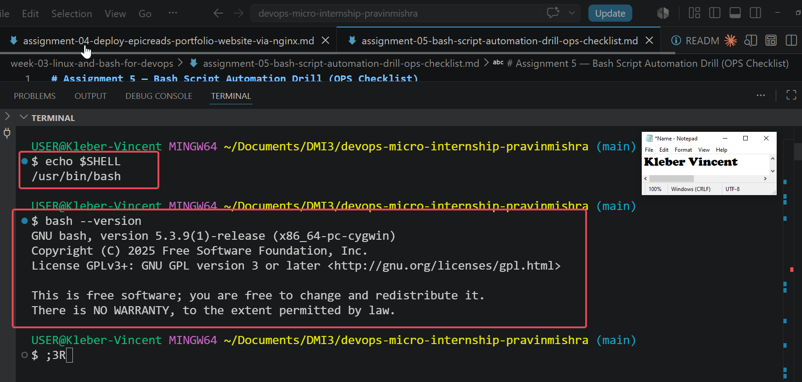

---

## Notes

### 1. What is Bash?

Bash (Bourne Again Shell) is a command-line interpreter that allows users to interact with Linux and Unix operating systems. It can execute commands directly from the terminal and automate repetitive tasks through shell scripts.

### 2. What is the difference between shell and Bash?

A shell is any command-line program that provides an interface between the user and the operating system. Bash is one specific type of shell that extends the original Bourne Shell with additional features such as scripting, command history, arrays, loops, and functions.

### 3. Why is it important to confirm the Bash version before writing scripts?

Different versions of Bash may support different commands and scripting features. Confirming the installed version helps ensure that scripts will execute correctly and prevents compatibility issues when running them on different systems.

---

# Task 2 — Your First Bash Script

## Goal

Create your first Bash script, make it executable, and run it from the terminal.

To become familiar with Bash scripting, I created my first shell script containing a simple sequence of commands. The script displays a welcome message, my full name, and the current system date and time. This exercise introduced the basic structure of a Bash script and demonstrated how commands can be grouped together and executed automatically.
After creating the script, I modified its file permissions to make it executable. In Linux, a script must have execute permission before it can be run directly from the terminal. Once the appropriate permission was assigned, I executed the script to verify that it produced the expected output.
The following commands were used during this task:

```bash
nano first-script.sh
chmod +x first-script.sh
./first-script.sh
ls -l first-script.sh
```
The `nano` command was used to create and edit the Bash script. The `chmod +x` command added execute permission to the file, allowing it to be run as a program. Executing the script with `./first-script.sh` displayed the configured messages, while the `ls -l` command confirmed that the executable permission had been successfully applied.
As shown in Screenshots 1 through 3, the script was created successfully, executed without errors, and assigned the correct executable permissions.

### Evidence

#### Screenshot 1 — Content of `first-script.sh`


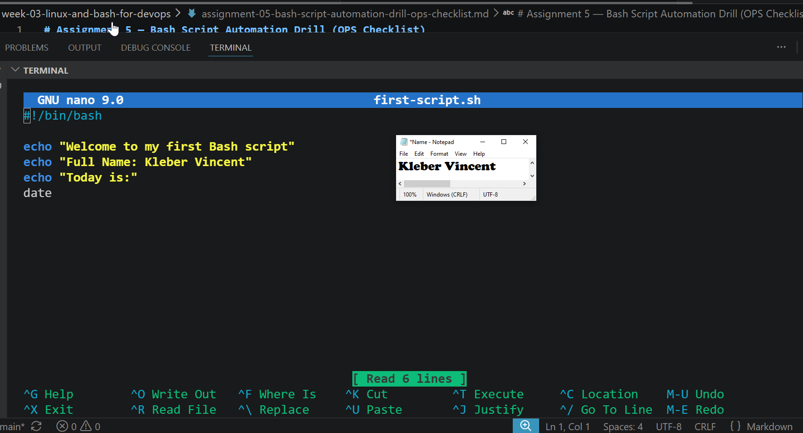

---

#### Screenshot 2 — Output of `./first-script.sh`


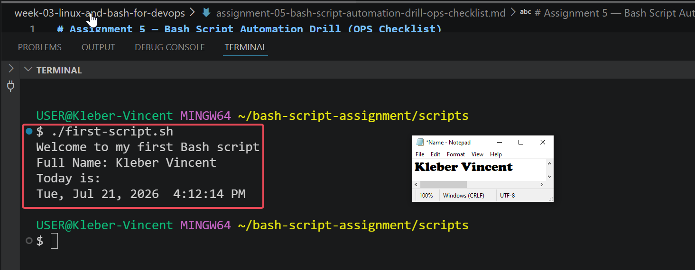

---

#### Screenshot 3 — Output of `ls -l first-script.sh` showing executable permission


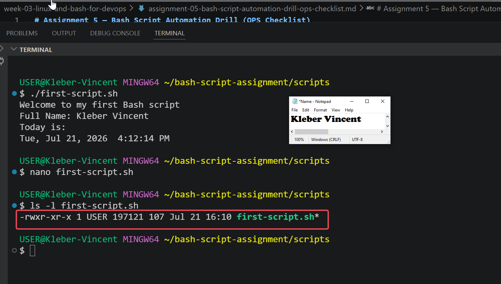

---

## Notes

### 1. What is the purpose of `#!/bin/bash`?

The `#!/bin/bash` line, known as the shebang, tells the operating system to execute the script using the Bash interpreter. This ensures that the script runs with the correct shell regardless of the user's default shell.

### 2. Why do we use `chmod +x` before running a script?

The `chmod +x` command grants execute permission to the script. Without this permission, Linux treats the file as a regular text file and prevents it from being executed directly.

### 3. What is the difference between running a script using `./script.sh` and `bash script.sh`?

Running a script with `./script.sh` executes the file directly using the interpreter specified in the shebang line, provided the script has execute permission. Running `bash script.sh` explicitly starts a new Bash process to interpret the script and does not require the script to have execute permission.

---

# Task 3 — Variables: User Information Script

## Goal

Use variables to store and display user-related information.

In this task, I learned how to use variables in Bash to store information that can be reused throughout a script. Variables make scripts more flexible and easier to maintain because values can be updated in one location without modifying multiple commands.
I created a script that stores my full name, role, and location in separate variables before displaying the information in a formatted output. I also used command substitution to retrieve and display the current date and time dynamically whenever the script is executed. This demonstrates how Bash variables can store both static values and command outputs.
The following commands were used during this task:

```bash
nano user-info.sh
chmod +x user-info.sh
./user-info.sh
```

The `nano` command was used to create and edit the script. After saving the file, the `chmod +x` command granted execute permission, allowing the script to run directly from the terminal. Executing `./user-info.sh` displayed the stored variables together with the current system date and time.
As shown in Screenshots 1 and 2, the script successfully stored information in variables and displayed the expected output.

### Evidence

#### Screenshot 1 — Content of `user-info.sh`

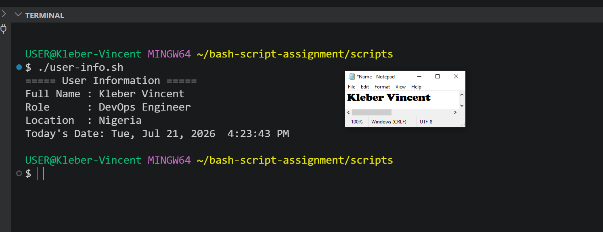

---

#### Screenshot 2 — Output of `./user-info.sh`


---

## Notes

### 1. What is a variable in Bash?

A variable is a named storage location used to hold data that can be referenced and reused throughout a Bash script. Variables make scripts more organized, reusable, and easier to maintain.

### 2. Why should we avoid spaces around the `=` sign when creating variables?

Bash requires variable assignments to have no spaces around the `=` operator. Adding spaces causes Bash to interpret the statement as a command instead of a variable assignment, resulting in an error.

Correct example:

```bash
name="Kleber Vincent"
```

Incorrect example:

```bash
name = "Kleber Vincent"
```

### 3. How do you access the value stored inside a Bash variable?

A variable's value is accessed by prefixing its name with the dollar sign (`$`). For example, if a variable is defined as:

```bash
name="Kleber Vincent"
```
its value can be displayed using:

```bash
echo $name
```
or included within a string such as:

```bash
echo "Full Name: $name"
```

---

# Task 4 — Arrays & Loops: Tools Checklist Script

## Goal

Use arrays and loops to print a checklist of tools used in Bash scripting.

In this task, I explored how Bash arrays and loops can be used together to process multiple values efficiently. Arrays provide a convenient way to store collections of related data, while loops allow each item in the collection to be processed automatically without writing repetitive code.
I created an array containing several common DevOps tools and used a `for` loop to iterate through each element in the array. During execution, the script displayed each tool as a checklist item, demonstrating how loops simplify repetitive operations and make scripts easier to maintain.
The following commands were used during this task:

```bash
nano tools-checklist.sh
chmod +x tools-checklist.sh
./tools-checklist.sh
```

The `nano` editor was used to create the script, `chmod +x` granted execute permission, and `./tools-checklist.sh` executed the script to display every tool stored in the array.
As shown in Screenshots 1 and 2, the array was successfully processed by the loop and each DevOps tool was displayed correctly.

### Evidence

#### Screenshot 1 — Content of `tools-checklist.sh`

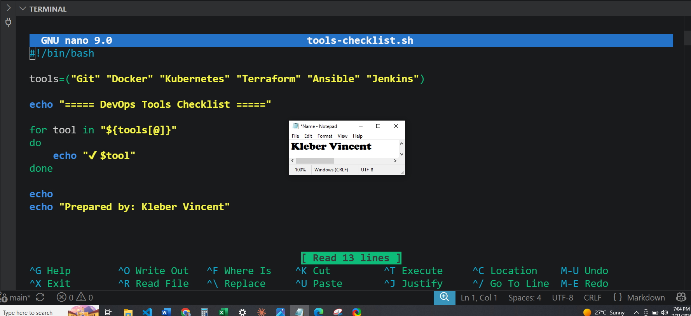

---

#### Screenshot 2 — Output of `./tools-checklist.sh`

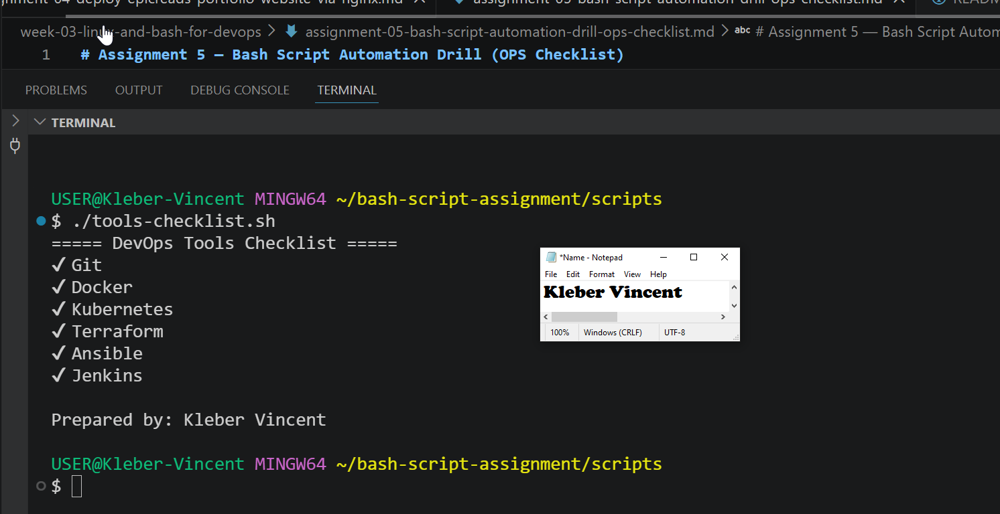

---

## Notes

### 1. What is an array in Bash?

An array is a collection of multiple values stored under a single variable name. Each value is assigned an index, allowing related information to be grouped together.

### 2. Why are arrays useful in scripts?

Arrays make it easy to manage lists of related items without creating multiple variables. They simplify repetitive tasks when combined with loops.

### 3. What does `"${tools[@]}"` mean?

`${tools[@]}` represents all the elements stored in the `tools` array. It allows a loop to process every value in the array one after another.

### 4. What is the purpose of the `for` loop in this script?

The `for` loop iterates through every element in the array and executes the same block of code for each item, eliminating repetitive coding.

---

# Task 5 — Loops: Number Counter Script

## Goal

Use loops to repeat a task multiple times.

This task focused on using loops to automate repetitive operations. Instead of writing the same command several times, I used a `for` loop to count from one to five automatically.
The script demonstrates how loops execute a block of code repeatedly while updating the loop variable during each iteration. This is one of the most fundamental concepts in Bash scripting and is widely used in automation tasks such as processing files, deploying applications, and monitoring systems.
The following commands were executed:

```bash
nano counter.sh
chmod +x counter.sh
./counter.sh
```

The script was created using `nano`, made executable with `chmod +x`, and executed to display the counting sequence.
As shown in the screenshots, the loop successfully counted from 1 to 5 before displaying a completion message.

### Evidence

#### Screenshot 1 — Content of `counter.sh`

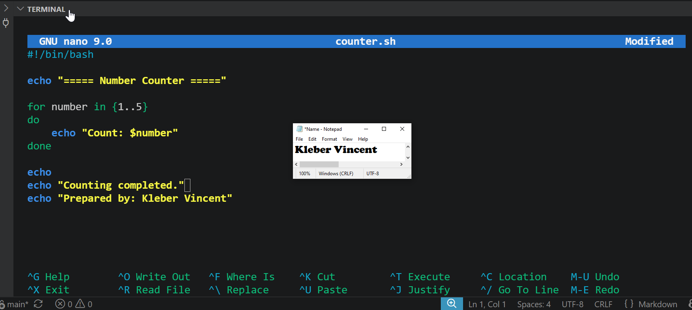

---

#### Screenshot 2 — Output of `./counter.sh`

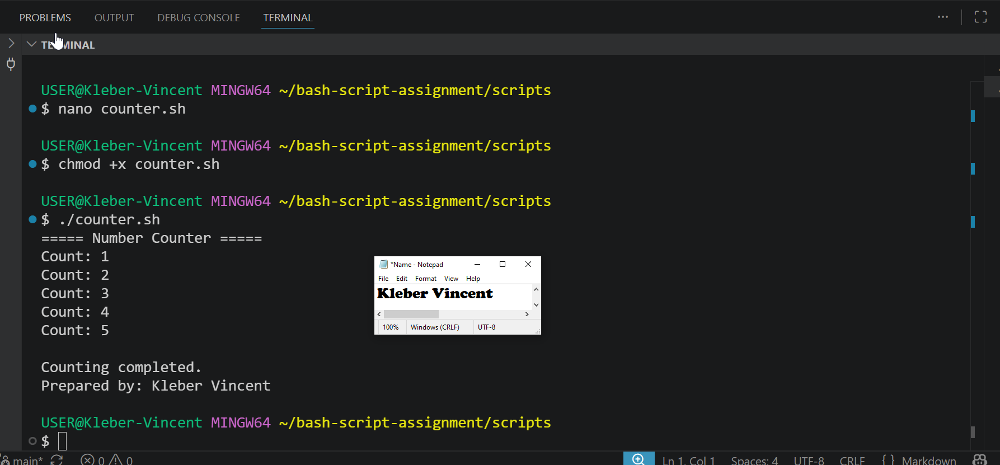

---

## Notes

### 1. What is a loop?

A loop is a programming structure that repeatedly executes a block of code until a specified condition is met or all items have been processed.

### 2. Why do we use loops in Bash scripting?

Loops reduce repetitive code, improve efficiency, and simplify automation tasks that require the same operation to be performed multiple times.

### 3. How many times did the loop run in your script?

The loop executed five times, displaying the numbers 1 through 5.

### 4. What would you change if you wanted the loop to run 10 times?

I would change the range from:

```bash
{1..5}
```

to:

```bash
{1..10}
```

---

# Task 6 — Files & Conditionals: File Validation Script

## Goal

Use file checks and conditionals to verify whether files and directories exist.

In this task, I learned how Bash can verify the existence of files and directories before performing operations on them. File validation is an important aspect of automation because it prevents scripts from failing when expected resources are unavailable.
I created a directory and a sample text file before writing a Bash script that used conditional statements to determine whether both resources existed. Depending on the result of each check, the script displayed an appropriate success or failure message.
The following commands were executed:

```bash
mkdir -p ../test-folder
touch ../test-folder/sample.txt

ls -lah ../test-folder

nano file-check.sh
chmod +x file-check.sh
./file-check.sh
```

The script used Bash file test operators to verify the existence of both the directory and the file before printing the results.
As shown in the screenshots, both validation checks completed successfully.

### Evidence

#### Screenshot 1 — Output of `ls -lah ../test-folder`

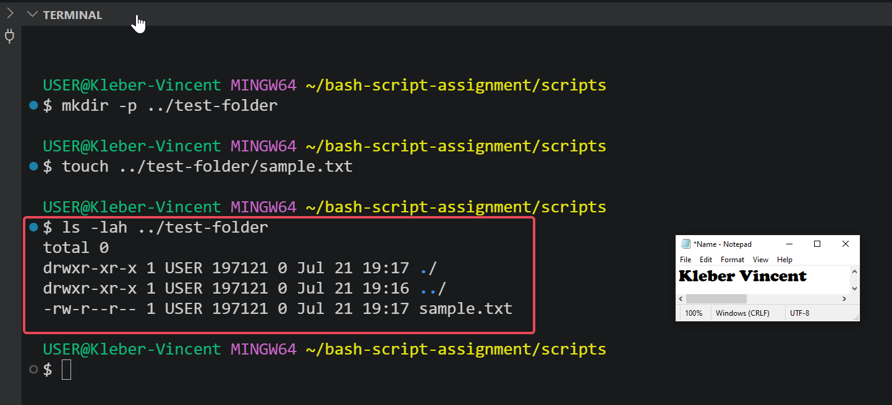

---

#### Screenshot 2 — Content of `file-check.sh`

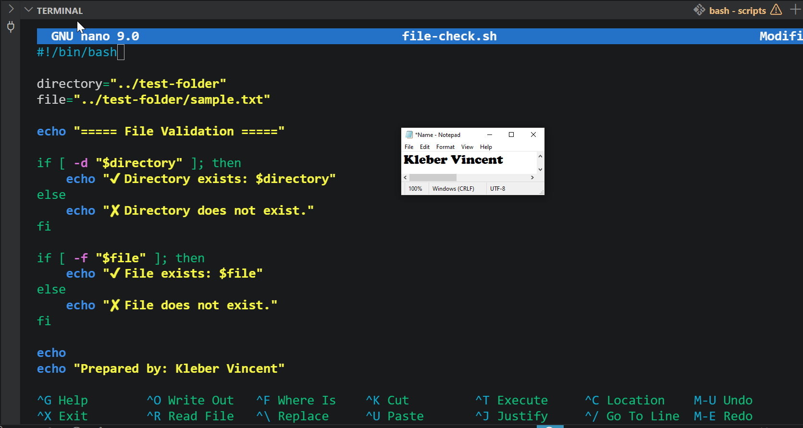

---

#### Screenshot 3 — Output of `./file-check.sh`

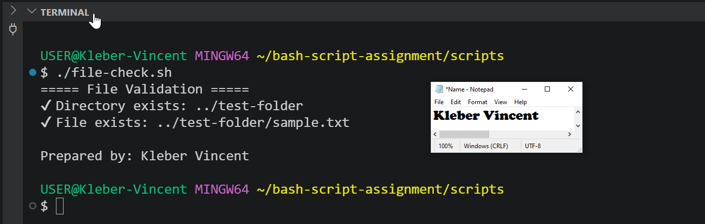

---

## Notes

### 1. What does `-d` check in Bash?

The `-d` operator checks whether a specified path exists and is a directory.

### 2. What does `-f` check in Bash?

The `-f` operator checks whether a specified path exists and is a regular file.

### 3. Why should file and directory paths be stored in variables?

Using variables makes scripts easier to maintain because paths only need to be updated in one place if they change.

### 4. What happens if the file does not exist?

The condition evaluates to false, allowing the script to execute the `else` block and display an appropriate error or warning message.

---

# Task 7 — Conditionals: Pass or Retry Script

## Goal

Use if-else conditionals to make decisions based on a variable value.

This task introduced decision-making in Bash scripts using `if-else` statements. Conditional statements allow scripts to execute different actions depending on whether a specified condition evaluates to true or false.
I created a script that evaluates a student's score. When the score was 85, the script displayed a "Pass" result. After modifying the score to 55, the same script displayed a "Retry" result. Testing both outcomes confirmed that the conditional logic functioned correctly.
The following commands were executed:

```bash
nano score-check.sh
chmod +x score-check.sh

./score-check.sh
```

The script was executed twice using different score values to verify both branches of the conditional statement.
As shown in the screenshots, the script correctly produced both the "Pass" and "Retry" results.

### Evidence

#### Screenshot 1 — Content of `score-check.sh` with `score=85`

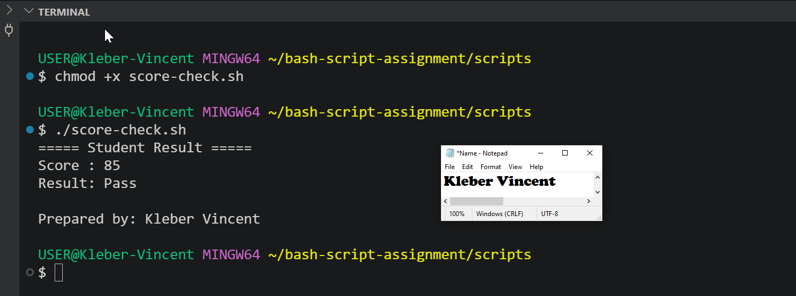

---

#### Screenshot 2 — Output showing `Result: Pass`


---

#### Screenshot 3 — Content of `score-check.sh` with `score=55`

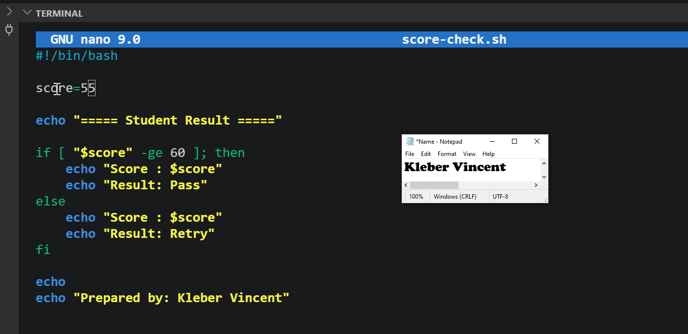

---

#### Screenshot 4 — Output showing `Result: Retry`

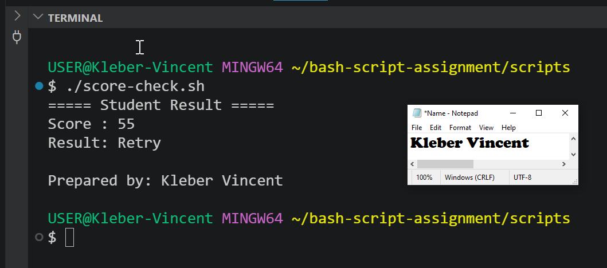

---

## Notes

### 1. What is the purpose of if-else in Bash?

The `if-else` statement allows a script to make decisions by executing different blocks of code depending on whether a condition is true or false.

### 2. What does `-ge` mean?

`-ge` means "greater than or equal to" and is used to compare numeric values.

### 3. Why should conditions be tested with different values?

Testing multiple values confirms that both the true and false branches of the script work correctly.

### 4. How can conditionals help in automation scripts?

Conditionals allow automation scripts to respond intelligently to different situations, such as checking system status, validating files, or handling errors.

---

# Task 8 — Functions: Final Bash Automation Script

## Goal

Create a final Bash script using functions to organize reusable code:

In the final task, I combined the Bash concepts learned throughout the assignment into a single automation script. The script uses functions to organize related tasks into reusable blocks, improving readability and making the script easier to maintain.
Separate functions were created to display the script header, user information, DevOps tools checklist, automation result, and footer. The script also incorporates variables, arrays, loops, and conditional statements to demonstrate how multiple Bash features work together within a structured automation workflow.
The following commands were executed:

```bash
nano final-automation.sh
chmod +x final-automation.sh

./final-automation.sh

ls -lah
```
After creating the script, execute permission was assigned and the script was run successfully. Finally, the contents of the scripts directory were listed to verify that all required Bash scripts had been created.
As shown in the screenshots, the final automation script executed successfully and demonstrated the combined use of variables, arrays, loops, conditionals, and functions.

### Evidence

#### Screenshot 1 — Content of `final-automation.sh`

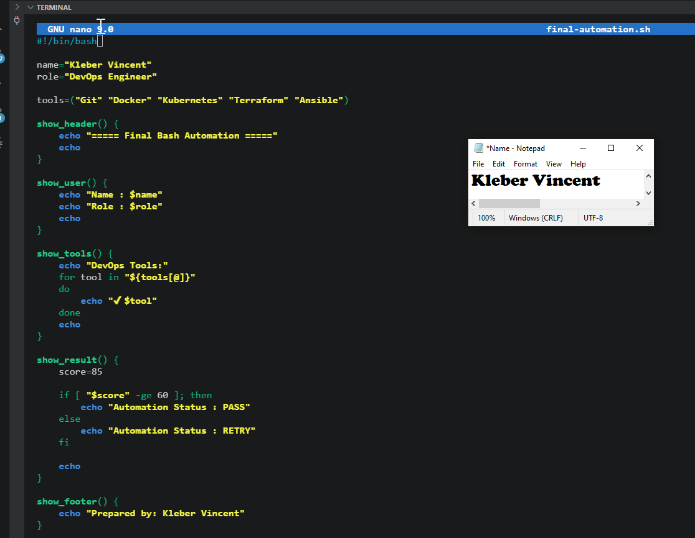

---

#### Screenshot 2 — Output of `./final-automation.sh`

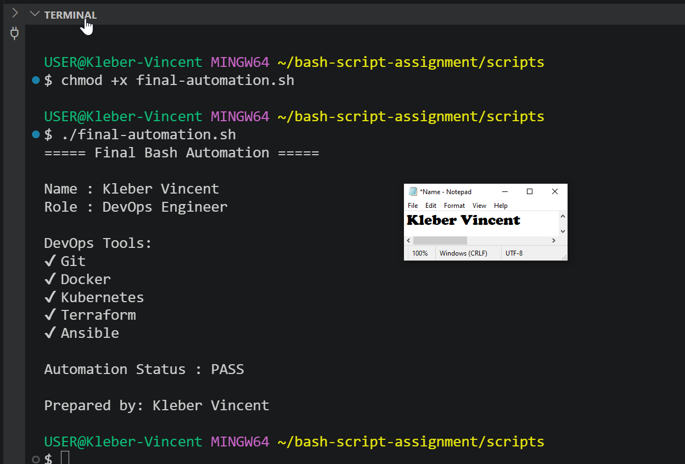

---

#### Screenshot 3 — Output of `ls -lah` showing all created scripts

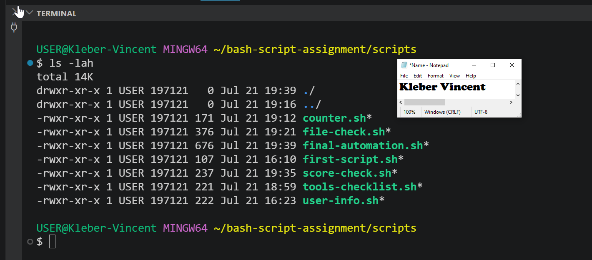

---

## Notes

### 1. What is a function in Bash?

A function is a reusable block of code that performs a specific task. Functions help organize scripts and eliminate repeated code.

### 2. Why are functions useful in scripts?

Functions improve readability, simplify maintenance, encourage code reuse, and make large scripts easier to manage.

### 3. Which functions did you create in this script?

The script includes the following functions:

- `show_header()`
- `show_user()`
- `show_tools()`
- `show_result()`
- `show_footer()`

### 4. How does this final script combine variables, arrays, loops, conditionals, files, and functions?

The script stores information using variables, manages a collection of DevOps tools in an array, iterates through the array using a loop, evaluates a condition using an `if-else` statement, organizes related operations into reusable functions, and demonstrates how these Bash concepts work together to build a structured automation script.---

---

# LinkedIn Post (Required)

## Evidence

#### LinkedIn Post URL

Paste your LinkedIn post URL here:

https://www.linkedin.com/posts/vincent-kleber-kakpo-8b920b88_devops-linux-nginx-share-7485334359407857664-ShUJ

---

#### Screenshot — Published LinkedIn post

[Linkedln Post](screenshots/Ass-04-Linkedln-Post.PNG)
---

# Submission Instructions

- Add all required screenshots in your submission
- Full name must be visible in required screenshots
- All script files must be created and run successfully
- Required notes must be answered clearly for every task
- Do not expose sensitive information (keys, passwords, credentials)

---

# Completion Checklist

- [ ] Task 1: Environment setup verified, workspace created (Screenshots 1–2, Notes answered)
- [ ] Task 2: First script created, executed, permissions verified (Screenshots 1–3, Notes answered)
- [ ] Task 3: Variables script created and run (Screenshots 1–2, Notes answered)
- [ ] Task 4: Arrays and loops script created and run (Screenshots 1–2, Notes answered)
- [ ] Task 5: Counter loop script created and run (Screenshots 1–2, Notes answered)
- [ ] Task 6: File validation script created and run (Screenshots 1–3, Notes answered)
- [ ] Task 7: Pass/Retry conditional script tested with both values (Screenshots 1–4, Notes answered)
- [ ] Task 8: Final automation script created and run (Screenshots 1–3, Notes answered)
- [ ] All scripts run without errors
- [ ] Full Name visible in all required screenshots
- [ ] LinkedIn post published and URL submitted
- [ ] No sensitive data exposed

---

## 📌 About DMI & CloudAdvisory

DevOps Micro Internship (DMI) is a project-based DevOps program run by Pravin Mishra (The CloudAdvisory) focused on real-world execution, systems thinking, and career readiness.

It helps learners build strong DevOps foundations with hands-on experience.

---

## 📌 Resources

- 🌐 DMI Official Website: https://pravinmishra.com/dmi  
- 🎓 DevOps for Beginners (Udemy): https://www.udemy.com/course/devops-for-beginners-docker-k8s-cloud-cicd-4-projects/  
- 🎓 Agentic AI DevOps with Claude Code: https://www.udemy.com/course/ultimate-agentic-ai-devops-with-claude-code/  
- 🎓 DevOps with Claude Code: Terraform, EKS, ArgoCD & Helm: https://www.udemy.com/course/devops-with-claude-code-terraform-eks-argocd-helm/  
- ▶️ YouTube Playlist: https://www.youtube.com/playlist?list=PLFeSNDtI4Cho  
- 🔗 Pravin Mishra (LinkedIn): https://www.linkedin.com/in/pravin-mishra-aws-trainer/  
- 🏢 CloudAdvisory (LinkedIn): https://www.linkedin.com/company/thecloudadvisory/

---

*This submission is part of DevOps Micro Internship (DMI) Cohort 3 — Agentic AI Track.*