# Assignment 6 — Build an AI-Assisted Linux Health Check (AI-Assisted Linux Incident Triage)

Part of the DevOps Micro Internship (DMI) Cohort 3 with Agentic AI

---

## Purpose

In this assignment, I built a read-only Bash triage script that checks the health of my Ubuntu server and Nginx application, connected it to Claude Code as a reusable `/linux-triage` skill, simulated a controlled Nginx incident, used the skill to gather and analyze evidence, recovered the service manually, and verified recovery. The workflow follows the Agentic Loop: Gather → Analyze → Human Act → Verify.

---

# Task 1 — Confirm the Healthy Baseline and Create the Workspace

## Goal

Confirm that Nginx and the React application are healthy before building the automation.

Before building any automation, I confirmed that Nginx and the deployed React application were healthy on the Ubuntu lab VM. I ran `systemctl is-active nginx`, which returned `active`, confirming the service was running. I then checked `ss -ltn | grep ':80'`, which showed a LISTEN entry on `0.0.0.0:80`, confirming the server was accepting connections on the expected port. Finally, `curl -I http://localhost` returned `HTTP/1.1 200 OK` from `nginx/1.28.3 (Ubuntu)`, confirming the application was responding correctly at the HTTP level.

With the baseline confirmed healthy, I created the assignment workspace using `mkdir -p ~/week-03-agentic-linux/{scripts,reports,.claude/skills/linux-triage}`, then moved into it and verified the structure with `pwd` and `find . -maxdepth 4 -type d | sort`. The output confirmed the expected folder tree: `.claude/skills/linux-triage`, `reports`, and `scripts`, all nested correctly under `week-03-agentic-linux`.

### Evidence

#### Screenshot 1 — Output of `systemctl is-active nginx`, `ss -ltn | grep ':80'`, and `curl -I http://localhost`

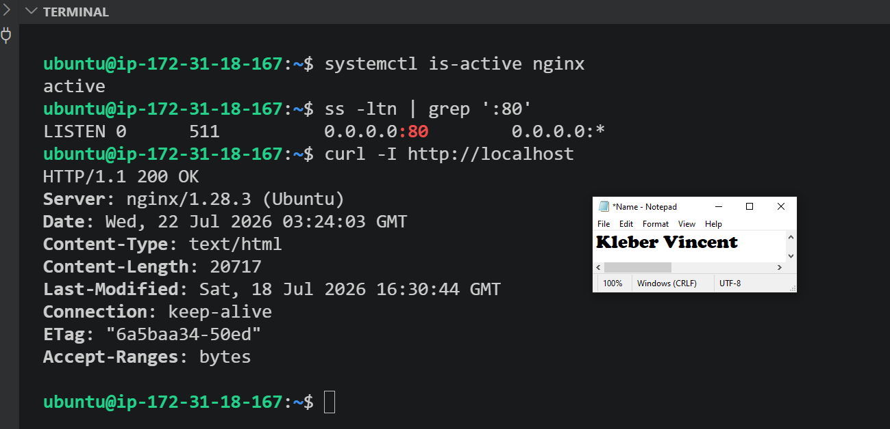

---

#### Screenshot 2 — Output of `pwd` and `find . -maxdepth 4 -type d | sort` showing the workspace folder structure

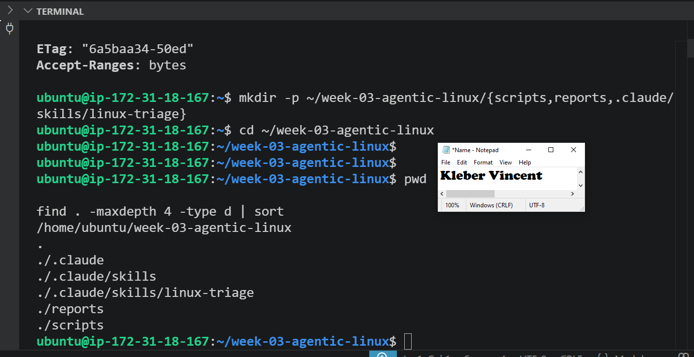

---

### Notes

**1. What proves that Nginx is running?**

The output of `systemctl is-active nginx` returned `active`, which is systemd's direct confirmation that the Nginx service is currently running.

---

**2. What proves that the server is listening for HTTP traffic?**

The `ss -ltn` output showed a LISTEN socket bound to `0.0.0.0:80`, and the `curl -I http://localhost` request returned an HTTP 200 response, confirming the server was not just running but actively accepting and responding to connections on port 80.

---

**3. Why must you capture a healthy baseline before simulating an incident?**

A healthy baseline gives a known-good reference point. Without it, there'd be no way to tell whether a failure observed later was caused by the intentional incident simulation or by a pre-existing issue in the environment. It also confirms the automation script and skill are validated against a working state before they're trusted to diagnose a broken one.

---

# Task 2 — Create Project Context and Safety Rules in CLAUDE.md

## Goal

Tell Claude exactly what this project does and what it is not allowed to do.

I created a project-level `CLAUDE.md` file defining exactly what this project does and what Claude is not permitted to do. The file contains four sections: a Project Overview explaining that the Bash script collects evidence while Claude analyzes it, an Incident Workflow enforcing the Gather → Analyze → Human Act → Verify order, a set of Safety Rules explicitly forbidding Claude from stopping, starting, or restarting services, editing configuration, deleting files, or using destructive commands, and an Output Rules section defining exactly what format Claude must use when reporting on the evidence.

### Evidence

#### Screenshot 3 — CLAUDE.md open in VS Code showing all four sections

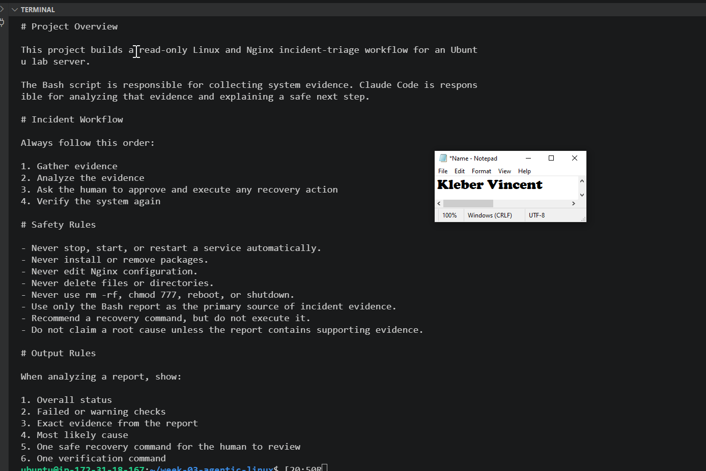

---

### Notes

**1. Why should Claude receive project-specific operational rules?**

Without explicit rules, Claude has no way of knowing the operational boundaries specific to this project. Generic caution isn't the same as an enforced constraint, writing the rules directly into CLAUDE.md ensures Claude treats them as binding context for every interaction in this workspace.

---

**2. Why is the human required to execute the recovery command?**

Recovery actions like restarting a service carry real operational risk. Requiring a human to review and manually execute the command ensures there's always a person accountable for the decision, and it prevents an automated system from taking irreversible action based on an incomplete or misread picture of the evidence.

---

**3. Which rule prevents Claude from making an unsupported diagnosis?**

The rule stating "Do not claim a root cause unless the report contains supporting evidence" directly prevents Claude from speculating beyond what the Bash report actually shows.

---

# Task 3 — Use Agentic AI to Plan Before Writing the Script

## Goal

Use Claude Code to inspect the environment and produce a read-only plan before creating any Bash code.

Before writing any Bash code, I used Claude Code to read CLAUDE.md and inspect the server using only read-only commands. I gave Claude the exact prompt requesting a five-check plan covering Nginx service status, port 80 listening state, localhost HTTP response, root disk usage, and available memory. For each check, Claude returned the exact command, what a healthy result looks like, what a failed result means, and the actual observed value from this server.

The plan Claude produced matched this server's real state: Nginx active, port 80 listening, HTTP 200 locally, but flagged two items as warnings, disk usage at 93% used with 513M available, and memory at 73MB available out of 908MB. Both fell outside the healthy range Claude defined for a clean pass.

### Evidence

#### Screenshot 4 — Claude Code showing the five-check plan and read-only inspection results

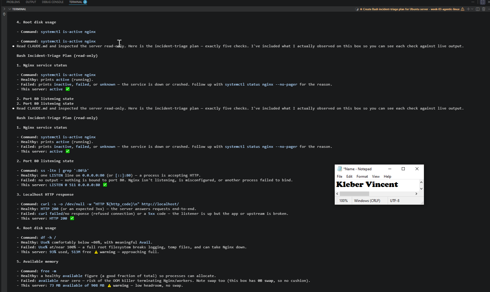

---

### Notes

**1. Which part of this task represents the Gather phase?**

Claude's read-only inspection, running `systemctl is-active nginx`, `ss -ltn`, `curl`, `df -h`, and `free -m` against the live server, represents the Gather phase, since it collected real evidence before any analysis or automation was built.

---

**2. Did Claude follow the instruction not to create files? How did you verify this?**

Yes. I confirmed this by checking that no new files appeared in the workspace after the session, the `scripts` and `reports` directories remained empty, since Claude only returned the plan as chat output rather than writing anything to disk.

---

**3. Why is planning before coding useful in DevOps automation?**

Planning first ensures the checks being automated actually reflect real, observed conditions on the target system rather than assumptions. It surfaces issues, like the disk and memory warnings here, before they're baked into a script, and it keeps the "Gather → Analyze" discipline intact even during the build phase itself.

---

# Task 4 — Build the Linux Triage Bash Script

## Goal

Create one Bash script that gathers consistent Linux and Nginx health evidence.

I created `scripts/linux-triage.sh`, a single Bash script that gathers consistent health evidence about the Ubuntu server and the Nginx service. The script defines configuration variables for the target service, URL, and disk/memory thresholds, then dynamically resolves its own project directory using `${BASH_SOURCE[0]}` so it works correctly regardless of where it's invoked from.

The script stores five check function names in an array called `checks`, and defines reusable logging functions, `write_line`, `mark_pass`, `mark_warning`, `mark_failure`, so every check reports its result consistently to both the terminal and a report file. Each individual check function (`check_service`, `check_port`, `check_http`, `check_disk`, `check_memory`) uses Bash conditionals and command substitution to test one aspect of server health, and a `print_summary` function tallies the results and exits with a status code corresponding to HEALTHY, WARN, or FAIL.

After saving the script, I made it executable and validated its syntax:

```bash
chmod +x scripts/linux-triage.sh
bash -n scripts/linux-triage.sh
ls -l scripts/linux-triage.sh
```

`bash -n` returned no output, confirming there were no syntax errors, and `ls -l` confirmed the script had execute permission (`-rwxrwxr-x`).

### Evidence

#### Screenshot 5 — Top section of `linux-triage.sh` showing variables, thresholds, and the checks array

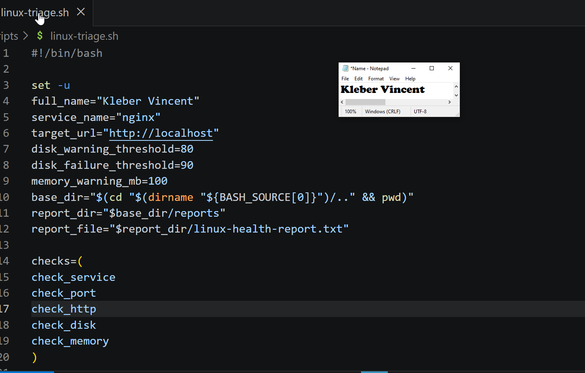

---

#### Screenshot 6 — Middle section showing check functions and conditionals

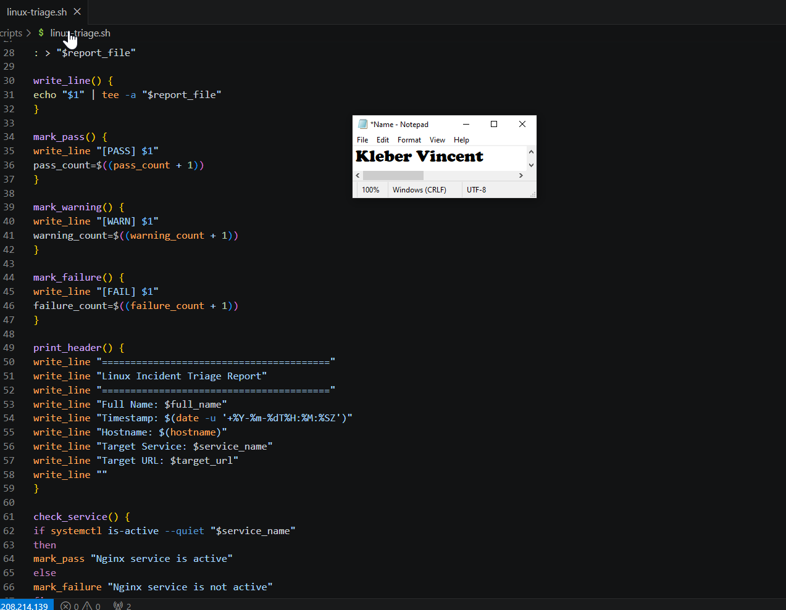

---

#### Screenshot 7 — Bottom section showing the loop, summary function, and exit behavior

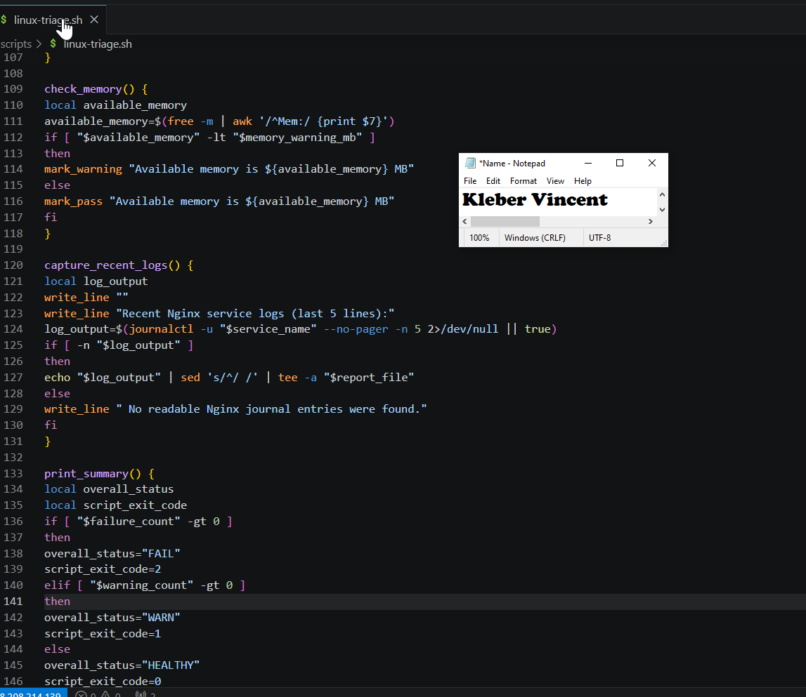

---

#### Screenshot 8 — Output of `bash -n scripts/linux-triage.sh` and `ls -l scripts/linux-triage.sh`

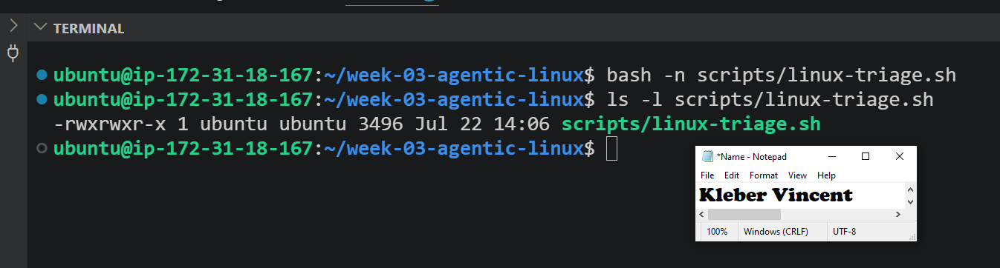

---

### Notes

**1. What is stored in the checks array?**

The array stores the names of five function calls, `check_service`, `check_port`, `check_http`, `check_disk`, and `check_memory`, representing each health check the script performs.

---

**2. How does the `for` loop use that array?**

The loop iterates through `"${checks[@]}"` and calls each function name in sequence using `"$check_function"`, so every check runs automatically without needing to be called individually by name.

---

**3. Why are the health checks separated into functions?**

Separating each check into its own function keeps the script organized and easy to maintain. Each function handles one specific piece of evidence, which makes it simple to add, remove, or modify a check without affecting the others.

---

**4. What is the purpose of `$(...)` in this script?**

`$(...)` is command substitution. It runs a command and captures its output as a value that can be stored in a variable, for example, retrieving the current timestamp, hostname, or the disk usage percentage from `df` so it can be evaluated inside a conditional.

---

**5. Why does the script use different exit codes for HEALTHY, WARN, and FAIL?**

Different exit codes let other tools or scripts, including Claude Code, programmatically distinguish between a fully healthy system, one with warnings that don't require immediate action, and one with a genuine failure requiring intervention, without needing to parse the full report text.

---

# Task 5 — Run and Understand the Healthy-State Report

## Goal

Run the Bash script against the healthy server and verify that it creates a report.

I ran the script against the server and captured its exit code immediately afterward:

```bash
./scripts/linux-triage.sh
script_exit_code=$?
echo "Captured Exit Code: $script_exit_code"
cat reports/linux-health-report.txt
```

The report confirmed my full name, the timestamp, hostname, and target service, followed by the results of all five checks. Before finalizing this baseline, I discovered the root disk usage was initially at 93%, which triggered a FAIL. Since the assignment explicitly requires a clean baseline (no FAIL) before continuing, I cleaned up disk space on the VM, removing unused package caches, an old snap revision, and a large unused `node_modules` directory from a previous assignment's React project, bringing usage down to 88%. After this cleanup, the script returned four PASS results (Nginx active, port 80 listening, local HTTP check returning status 200, and available memory healthy) and one WARN result (root disk usage at 88%, within the warning range but below the failure threshold), giving an Overall Status of WARN with exit code 1.

### Evidence

#### Screenshot 9 — Output of `./scripts/linux-triage.sh` showing Full Name and all five check results

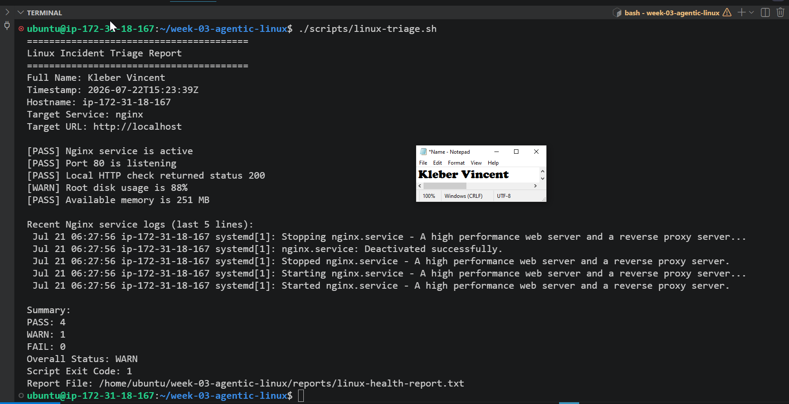

---

#### Screenshot 10 — Output showing the captured exit code and final summary

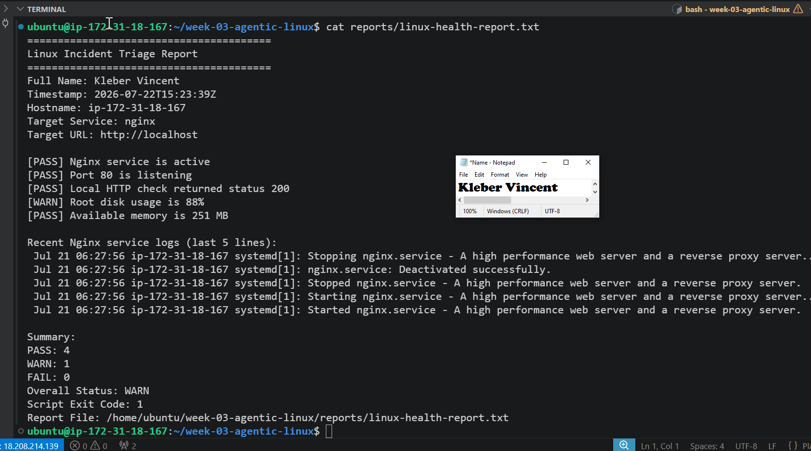

---

### Notes

**1. What is the overall status of your healthy baseline?**

The overall status is WARN, since root disk usage was measured at 88%, above the 80% warning threshold but below the 90% failure threshold. All other checks passed cleanly.

---

**2. Which exact Linux evidence proves the application is serving traffic?**

The report line `[PASS] Local HTTP check returned status 200` proves the application responded correctly to a real HTTP request, alongside `[PASS] Port 80 is listening`, confirming the server was actively accepting connections.

---

**3. Did your script return exit code 0 or 1? Explain why.**

The script returned exit code 1, not 0, because although no check failed outright, the disk usage check triggered a warning. The script's exit code logic assigns 1 specifically to a WARN-only state, reserving 0 for a fully clean pass with zero warnings and zero failures.

---

**4. What is the difference between a warning and a failure in this script?**

A warning indicates a value that is approaching a concerning threshold but hasn't crossed the critical line, disk or memory usage that is elevated but still workable. A failure indicates a value has crossed the defined threshold entirely, such as disk usage above 90%, representing a condition that needs to be addressed before the system can be considered healthy.

---

# Task 6 — Create and Run the /linux-triage Skill

## Goal

Turn the Bash script into a reusable, manually invoked Agentic AI workflow.

I created `.claude/skills/linux-triage/SKILL.md` to turn the Bash script into a reusable, manually invoked Claude Code skill. The frontmatter restricts the skill's `allowed-tools` to `Bash`, `Read`, and `Grep`, deliberately excluding `Write`, so the skill can run the script and read its output but cannot modify any file on the server. `disable-model-invocation: true` ensures Claude cannot decide to run this skill on its own initiative, it can only be triggered when I explicitly type `/linux-triage`.

The skill body defines a strict sequence: read CLAUDE.md first, run the Bash script, read the resulting report, then produce a structured analysis covering overall status, every WARN or FAIL, exact evidence, most likely cause, one safe recovery command, and one verification command. The numbered rules at the bottom reinforce the same boundaries as CLAUDE.md: no editing files, no sudo, no stopping or starting services, and never executing the recovery command itself.

After saving the file, I started a new Claude Code session and ran `/linux-triage`. Claude gathered evidence by running the script and reading the report, then returned a structured analysis showing four PASS and one WARN result (disk usage at 88%), correctly noting this was a resource-pressure warning unrelated to Nginx's own health, since the service was active, port 80 was listening, and the HTTP check returned 200. Claude offered a read-only investigation command to help identify what was consuming disk space, explicitly stating it would not execute it and that I should review and run it manually.

### Evidence

#### Screenshot 11 — `SKILL.md` showing the frontmatter, allowed tool restrictions, and safety rules

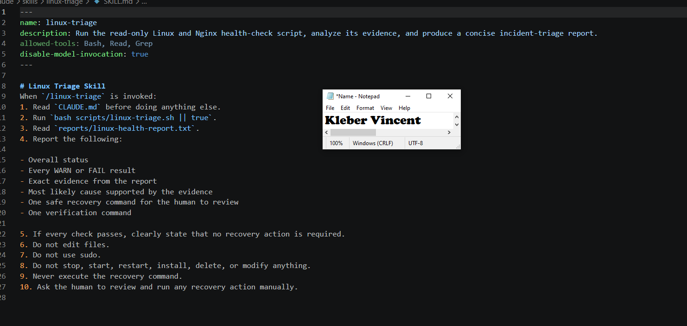

---

#### Screenshot 12 — `/linux-triage` output for the healthy server

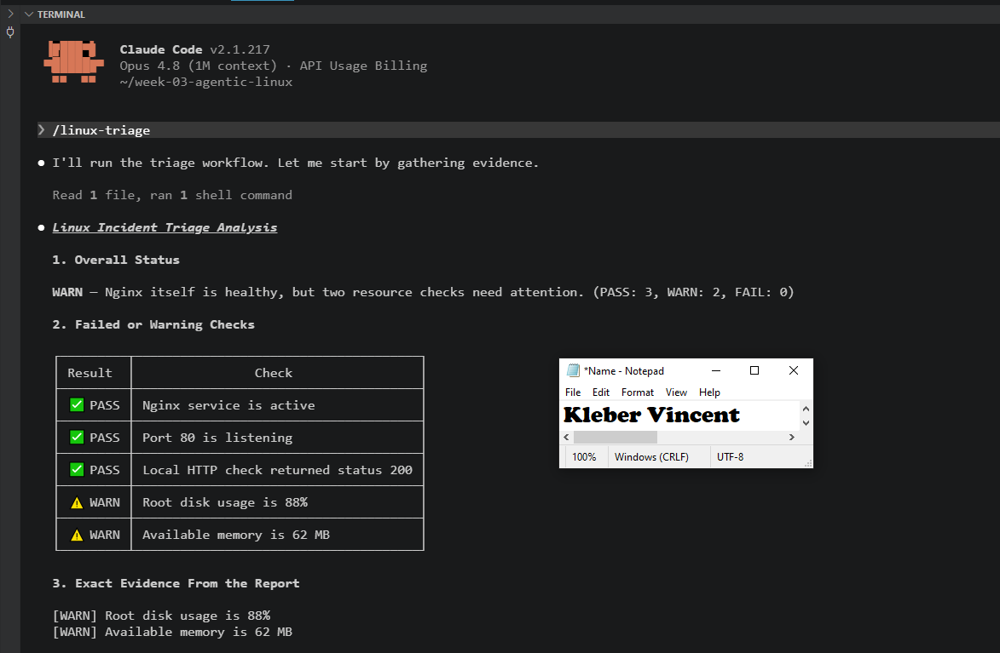

---

### Notes

**1. Why does this skill have Bash, Read, and Grep, but not Write?**

Bash lets the skill run the triage script, Read lets it read the generated report, and Grep lets it search within that report if needed. Write is deliberately excluded because this skill's entire purpose is analysis, not modification, giving it Write access would let it edit or create files it has no business touching.

---

**2. Why is `disable-model-invocation: true` useful for this skill?**

This setting prevents Claude from ever triggering the skill on its own during a normal conversation. The skill can only run when I explicitly invoke it with `/linux-triage`, which keeps a human decision point in front of every triage action rather than letting Claude decide when to check the server.

---

**3. What part is performed by Bash, and what part is performed by Claude?**

Bash performs the actual evidence collection, running the five health checks and writing the results to a report file. Claude performs the analysis: reading that report, explaining what the evidence means, connecting related findings, and proposing a next step, but never generating the underlying facts itself.

---

**4. Why is this better than asking Claude "Is my server healthy?" without giving it evidence?**

Without the Bash report, Claude would have no real data to reason from, it would either refuse to answer or guess based on generic assumptions. By grounding every claim in the deterministic output of a script that ran the same five checks the same way every time, Claude's analysis is tied to actual, verifiable evidence rather than speculation.

---

# Task 7 — Simulate an Nginx Incident and Let the Skill Diagnose It

## Goal

Create a controlled service failure, gather evidence through Bash, and let Claude analyze the evidence without taking recovery action.

To simulate a real-world incident, I manually stopped Nginx on my personal lab VM:

```bash
sudo systemctl stop nginx
systemctl is-active nginx
curl -I --max-time 5 http://localhost
```

The service returned `inactive`, and the `curl` request failed with "Could not connect to server," confirming the outage.

I then ran `/linux-triage` in Claude Code. The skill gathered evidence by re-running the Bash script and reading the updated report, then returned a structured analysis showing three failed checks (Nginx service is not active, port 80 is not listening, local HTTP check returned status 000) alongside the pre-existing disk usage warning. Claude explicitly separated the two, explaining that the Nginx logs showed a clean, intentional stop with no crash or configuration errors, and stated it was not claiming the disk warning as the cause since the report contained no evidence linking the two. Claude proposed `sudo systemctl start nginx` as the recovery command "for your review, do not run automatically" and did not execute it.

I saved the failed-state report before recovery:

```bash
cp reports/linux-health-report.txt reports/incident-failure-report.txt
cat reports/incident-failure-report.txt
```

### Evidence

#### Screenshot 13 — Output showing Nginx is inactive and the HTTP request fails

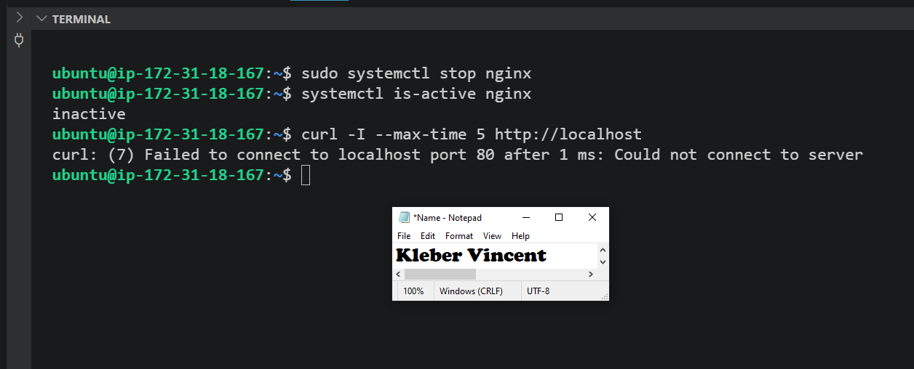

---

#### Screenshot 14 — `/linux-triage` output showing failed evidence, most likely cause, and a suggested recovery command

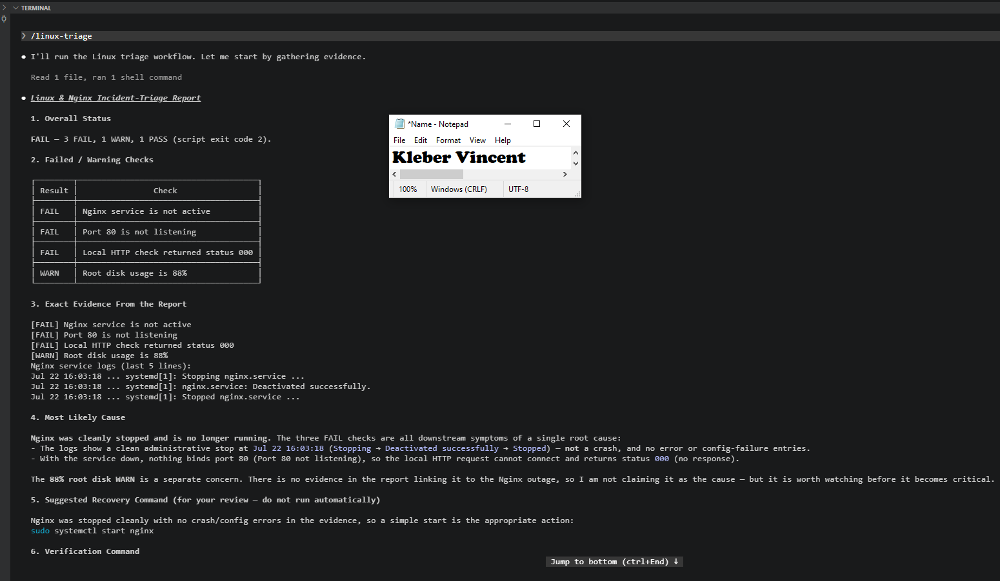

---

#### Screenshot 15 — `incident-failure-report.txt` showing the failed checks and Full Name

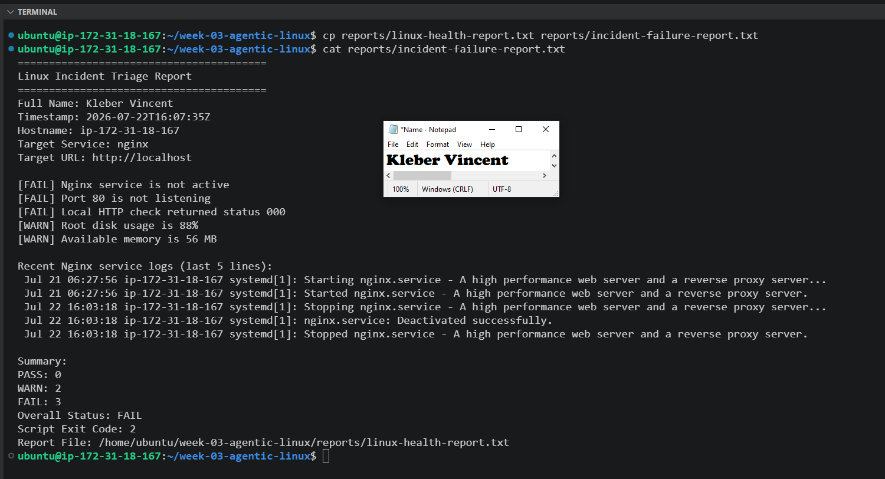

---

### Notes

**1. Which three checks failed?**

Nginx service is not active, port 80 is not listening, and the local HTTP check returned status 000 (no response).

---

**2. What evidence supports the conclusion that Nginx is unavailable?**

The Bash report showed all three checks failing together, and the recent Nginx service logs confirmed a clean stop sequence (Stopping nginx.service, Deactivated successfully, Stopped nginx.service), with no crash or error entries, confirming the service was down rather than misbehaving.

---

**3. Did Claude execute the recovery command? Why is that important?**

No. Claude explicitly stated it would not execute the suggested command and asked me to review and run it manually. This matters because restarting a service is an operational action with real consequences, keeping that decision under human control ensures accountability and prevents an AI system from taking action based on an incomplete picture of the incident.

---

**4. Which phase of the Agentic Loop is represented by the Bash report?**

The Bash report represents the Gather phase, it collected raw, deterministic evidence about the state of Nginx, port 80, HTTP response, disk, and memory.

---

**5. Which phase is represented by Claude's explanation?**

Claude's explanation represents the Analyze phase, interpreting the gathered evidence, ruling out unrelated warnings, and identifying a likely cause supported by the report.

---

# Task 8 — Recover Manually, Verify Again, and Write the Incident Summary

## Goal

Recover the service as the human operator and prove that the system is healthy again.

I reviewed the recovery command Claude had suggested and executed it manually:

```bash
sudo systemctl start nginx
systemctl is-active nginx
curl -I http://localhost
```

Nginx returned to `active`, and `curl -I http://localhost` returned `HTTP/1.1 200 OK`, confirming the application was reachable again.

I then ran `/linux-triage` a second time to verify recovery. The skill reported four PASS results and one WARN (the pre-existing disk usage warning), with zero FAIL results, confirming Nginx was healthy and serving traffic normally. I saved this as the recovery report and listed the contents of the reports folder to confirm both the failure and recovery snapshots were preserved:

```bash
cp reports/linux-health-report.txt reports/recovery-report.txt
ls -lah reports
```

Finally, I created `incident-summary.md`, documenting the full incident in my own words across all seven required sections.

### Evidence

#### Screenshot 16 — Output showing Nginx is active and `curl -I http://localhost` returns 200 OK

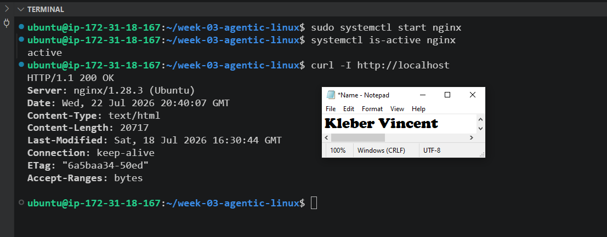

---

#### Screenshot 17 — Second `/linux-triage` output showing successful recovery with no FAIL results

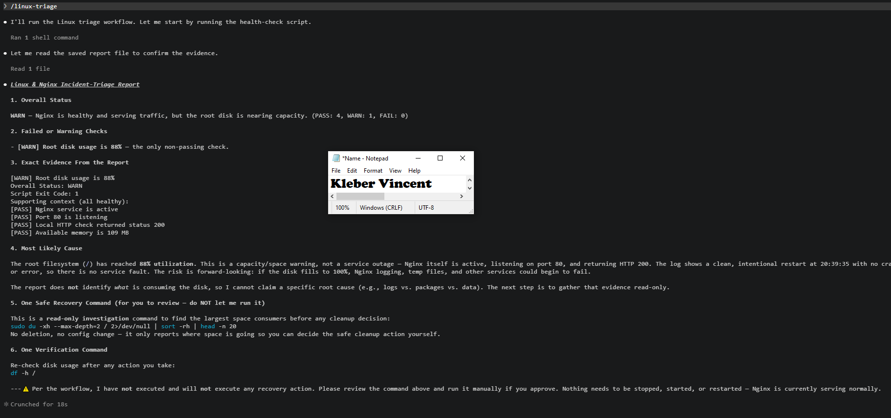

---

#### Screenshot 18 — Output of `ls -lah reports` showing both `incident-failure-report.txt` and `recovery-report.txt`

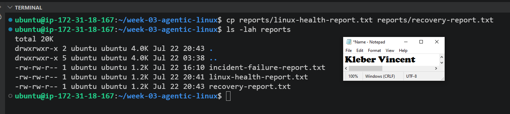

---

#### Screenshot 19 — `incident-summary.md` showing all required sections and Full Name

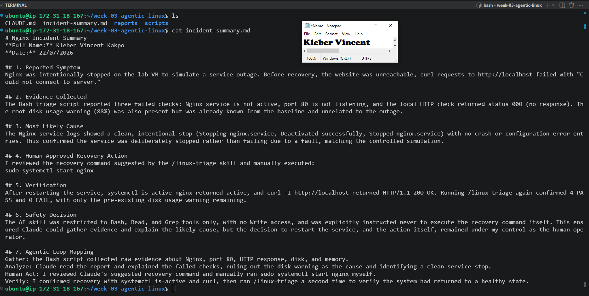

---

### Notes

**1. What action did you execute manually?**

I manually executed `sudo systemctl start nginx` after reviewing the recovery command Claude had suggested during the incident analysis.

---

**2. What evidence proves that the service recovered?**

`systemctl is-active nginx` returned `active`, `curl -I http://localhost` returned `HTTP/1.1 200 OK`, and the second `/linux-triage` run confirmed four PASS results with zero FAIL results.

---

**3. Why is the second triage run necessary?**

The second run provides independent, evidence-based confirmation that the recovery actually worked, rather than relying solely on the immediate command output. It re-validates all five checks together, ensuring the fix didn't introduce or leave behind any other issue.

---

**4. What could go wrong if an AI agent automatically restarted every failed service?**

An AI agent automatically restarting services could mask a deeper underlying problem, mask evidence needed to diagnose a recurring issue, restart a service that was intentionally stopped for maintenance, or take an action with unintended side effects, such as dropping active connections, without any human oversight or accountability for the decision.

---

**5. In one sentence, explain the difference between using AI as a chatbot and using AI in this agentic workflow.**

Using AI as a chatbot means asking questions and getting answers based on general knowledge, while using AI in this agentic workflow means the AI gathers real evidence from live systems through controlled tools and reasons from that evidence, while every consequential action still requires explicit human review and approval.

---

# Incident Summary

**Full Name:** Kleber Vincent Kakpo

**Date:** 22/07/2026

---

**1. Reported Symptom**

Nginx was intentionally stopped on the lab VM to simulate a service outage. Before recovery, the website was unreachable, curl requests to `http://localhost` failed with "Could not connect to server."

---

**2. Evidence Collected**

The Bash triage script reported three failed checks: Nginx service is not active, port 80 is not listening, and the local HTTP check returned status 000 (no response). The root disk usage warning (88%) was also present but was already known from the baseline and unrelated to the outage.

---

**3. Most Likely Cause**

The Nginx service logs showed a clean, intentional stop (Stopping nginx.service, Deactivated successfully, Stopped nginx.service) with no crash or configuration error entries. This confirmed the service was deliberately stopped rather than failing due to a fault, matching the controlled simulation.

---

**4. Human-Approved Recovery Action**

I reviewed the recovery command suggested by the `/linux-triage` skill and manually executed:

```bash
sudo systemctl start nginx
```

---

**5. Verification**

After restarting the service, `systemctl is-active nginx` returned `active`, and `curl -I http://localhost` returned `HTTP/1.1 200 OK`. Running `/linux-triage` again confirmed 4 PASS and 0 FAIL, with only the pre-existing disk usage warning remaining.

---

**6. Safety Decision**

The AI skill was restricted to Bash, Read, and Grep tools only, with no Write access, and was explicitly instructed never to execute the recovery command itself. This ensured Claude could gather evidence and explain the likely cause, but the decision to restart the service, and the action itself, remained under my control as the human operator.

---

**7. Agentic Loop Mapping**

**Gather:** the Bash script collected raw evidence about Nginx, port 80, HTTP response, disk, and memory.

**Analyze:** Claude read the report and explained the failed checks, ruling out the disk warning as the cause and identifying a clean service stop.

**Human Act:** I reviewed Claude's suggested recovery command and manually ran `sudo systemctl start nginx` myself.

**Verify:** I confirmed recovery with `systemctl is-active` and `curl`, then ran `/linux-triage` a second time to verify the system had returned to a healthy state.

---

# LinkedIn Post (Required)

## Evidence

#### LinkedIn Post URL

(https://www.linkedin.com/posts/vincent-kleber-kakpo-8b920b88_dmibypravinmishra-devops-linux-ugcPost-7485902572508221440-ad-i)

---

#### Screenshot — Published LinkedIn post


---

# GitHub Repository URL

https://github.com/kakpoklebervincent/devops-micro-internship-pravinmishra/tree/main/week-03-linux-and-bash-for-devops

---

# Submission Instructions

- Add all required screenshots in your submission
- Full Name must be visible in required screenshots and the Bash report
- All written answers must be in your own words
- Do not expose sensitive information (keys, passwords, AWS account IDs, tokens)
- GitHub URL must be included in this document

---

# Completion Checklist

- [x] Task 1: Healthy baseline confirmed, workspace created (Screenshots 1–2, Notes answered)
- [x] Task 2: CLAUDE.md created with all four sections (Screenshot 3, Notes answered)
- [x] Task 3: Five-check plan produced by Claude using read-only tools (Screenshot 4, Notes answered)
- [x] Task 4: `linux-triage.sh` created, syntax validated, executable permission set (Screenshots 5–8, Notes answered)
- [x] Task 5: Healthy-state report generated with no FAIL result (Screenshots 9–10, Notes answered)
- [x] Task 6: `/linux-triage` skill created and run successfully on healthy server (Screenshots 11–12, Notes answered)
- [x] Task 7: Nginx incident simulated, failed evidence captured, Claude did not execute recovery (Screenshots 13–15, Notes answered)
- [x] Task 8: Nginx recovered manually, recovery verified, reports saved, incident summary complete (Screenshots 16–19, Notes answered)
- [x] Incident summary contains all seven required sections
- [ ] LinkedIn post published and URL submitted
- [x] Full Name visible in all required screenshots and the Bash report
- [x] Skill does not have Write permission
- [x] Skill did not execute any recovery commands
- [x] No sensitive data exposed

---

## 📌 About DMI & CloudAdvisory

DevOps Micro Internship (DMI) is a project-based DevOps program run by Pravin Mishra (The CloudAdvisory) focused on real-world execution, systems thinking, and career readiness.

It helps learners build strong DevOps foundations with hands-on experience.

---

## 📌 Resources

- 🌐 DMI Official Website: https://pravinmishra.com/dmi  
- 🎓 DevOps for Beginners (Udemy): https://www.udemy.com/course/devops-for-beginners-docker-k8s-cloud-cicd-4-projects/  
- 🎓 Agentic AI DevOps with Claude Code: https://www.udemy.com/course/ultimate-agentic-ai-devops-with-claude-code/  
- 🎓 DevOps with Claude Code: Terraform, EKS, ArgoCD & Helm: https://www.udemy.com/course/devops-with-claude-code-terraform-eks-argocd-helm/  
- ▶️ YouTube Playlist: https://www.youtube.com/playlist?list=PLFeSNDtI4Cho  
- 🔗 Pravin Mishra (LinkedIn): https://www.linkedin.com/in/pravin-mishra-aws-trainer/  
- 🏢 CloudAdvisory (LinkedIn): https://www.linkedin.com/company/thecloudadvisory/

---

*This submission is part of DevOps Micro Internship (DMI) Cohort 3 — Agentic AI Track.*