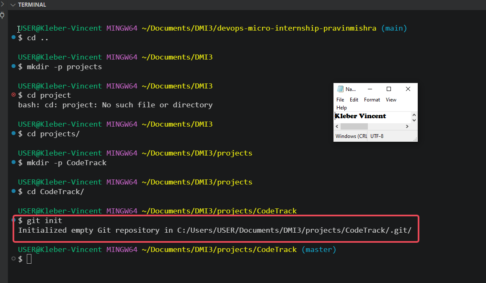
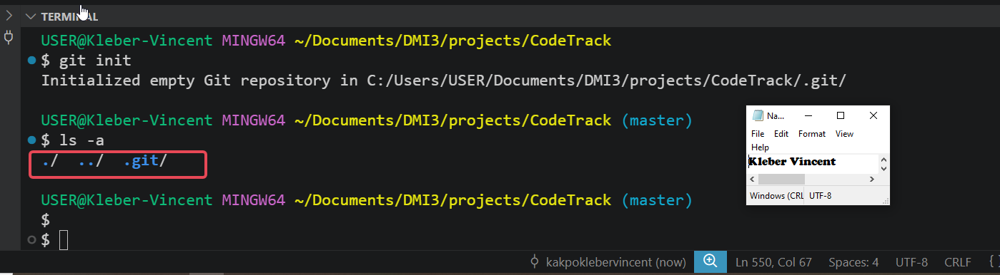
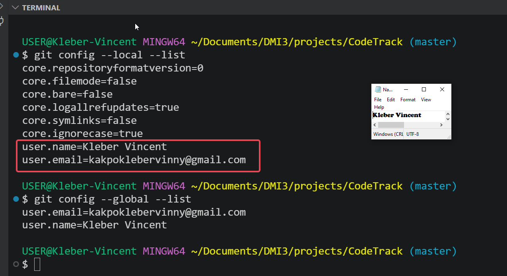
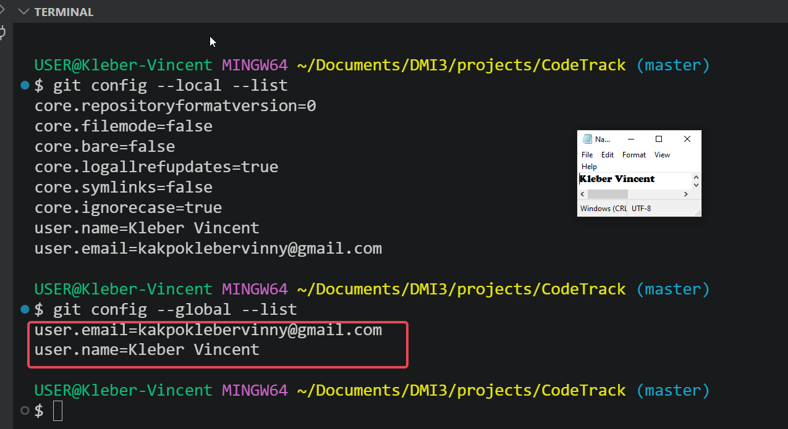

# Assignment 1 — CodeTrack: Initial Git Setup (Local Only)

Part of the DevOps Micro Internship (DMI) Cohort 3 with Agentic AI

---

## Purpose

In this assignment, I set up Git correctly on my local machine before starting the CodeTrack project. I created a local repository and configured my Git identity at both the repository level (local) and the machine level (global). This assignment is local only, nothing was pushed to GitHub yet.

---

# Task 1 — Create the CodeTrack Project and Initialize Git

## Goal

Create a `CodeTrack` project folder and initialize it as a Git repository.

I created a dedicated `CodeTrack` project folder separate from the DMI course repository, under `~/Documents/DMI3/projects/CodeTrack`, so the project would have its own independent Git history rather than being nested inside another repository. Inside that folder, I ran `git init`, which created a `.git` directory and confirmed the repository was initialized with the message "Initialized empty Git repository." I then verified this with `ls -a`, which listed `.git/` alongside the current and parent directory entries, confirming the folder was now a valid Git repository.

### Evidence

#### Screenshot 1 — Output of `git init` inside `CodeTrack` showing "Initialized empty Git repository"

---

#### Screenshot 2 — Output of `ls -a` showing the `.git` folder

---

### Notes

**1. What is the `.git` folder, and why does it matter?**

The `.git` folder is the hidden directory Git creates when you run `git init`. It is where Git stores everything about the repository's history and configuration, including commits, branches, tags, the staging area, and local settings like `user.name` and `user.email`. It matters because it is the actual database that makes a folder a Git repository. If I delete `.git`, I lose all version history and the folder becomes a plain, untracked directory again, even though the project files themselves stay untouched.

---

# Task 2 — Configure Git Identity Locally (Repository-Only)

## Goal

Set my Git username and email for the `CodeTrack` repository only, using `git config --local`.

I set my Git identity for this repository only, using `git config --local user.name` and `git config --local user.email`. This ensures that any commits made inside `CodeTrack` are attributed specifically to this configuration, independent of whatever identity might be set globally on the machine. I verified the settings with `git config --local --list`, which confirmed both `user.name=Kleber Vincent` and `user.email` were correctly stored alongside Git's default core settings for the repository.

### Evidence

#### Screenshot 3 — Output of `git config --local --list` showing `user.name` and `user.email`

---

# Task 3 — Configure Git Identity Globally

## Goal

Set a global Git username and email for this machine using `git config --global`, understanding that CodeTrack's local settings still take priority over these.

I set a global Git identity for this machine using `git config --global user.name` and `git config --global user.email`, so that any future repository I create without a local override will automatically use this identity. I verified the global settings with `git config --global --list`, which confirmed `user.name=Kleber Vincent` and my email were correctly set at the machine level. Because `CodeTrack` already has its own local identity configured, Git will continue to use the local values for this repository specifically, only falling back to the global values in repositories that don't define their own local override.

### Evidence

#### Screenshot 4 — Output of `git config --global --list` showing `user.name` and `user.email`

---

## Completion Checklist

- [x] `CodeTrack` folder created and initialized as a Git repository (Screenshots 1–2)
- [x] Explanation of the `.git` folder written in my own words
- [x] Local `user.name` and `user.email` configured and verified (Screenshot 3)
- [x] Global `user.name` and `user.email` configured and verified (Screenshot 4)
- [x] No sensitive data exposed

---

*This submission is part of DevOps Micro Internship (DMI) Cohort 3 — Agentic AI Track.*