# Assignment 2 — CodeTrack: Tracking, Staging, Committing + Deploy to EC2

Part of the DevOps Micro Internship (DMI) Cohort 3 with Agentic AI

---

## Purpose

In this assignment, I tracked and staged project files, created two meaningful Git commits in `CodeTrack`, verified the commit history, and deployed the CodeTrack static website to an EC2 instance using Nginx. This connected local version-control practice with a basic manual deployment workflow used in real DevOps environments.

---

# Task 1 — Verify Git Setup and Enter the Repository

## Goal

Confirm that Git works and that I am inside the correct `CodeTrack` repository.

I confirmed my Git installation with `git --version`, then navigated into `~/Documents/DMI3/projects/CodeTrack` and verified the path with `pwd`. Running `git status` returned repository status output with no "not a git repository" error, confirming Git recognized the folder correctly.

### Evidence

#### Screenshot 1 — Output of `pwd` showing I'm inside `CodeTrack`

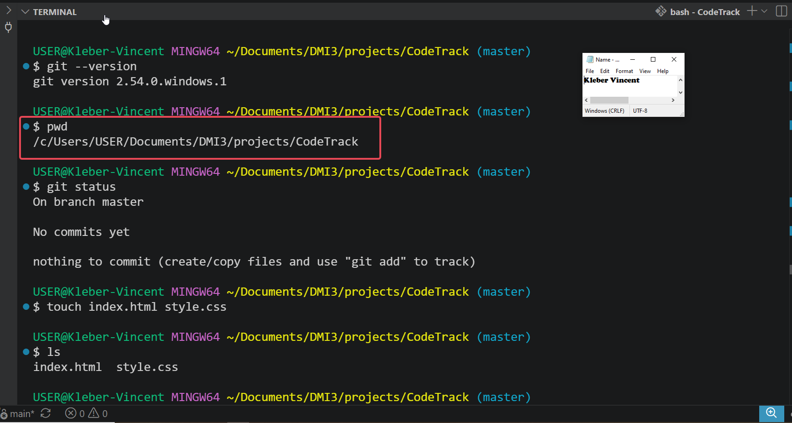

---

#### Screenshot 2 — Output of `git status` showing no "not a git repository" error

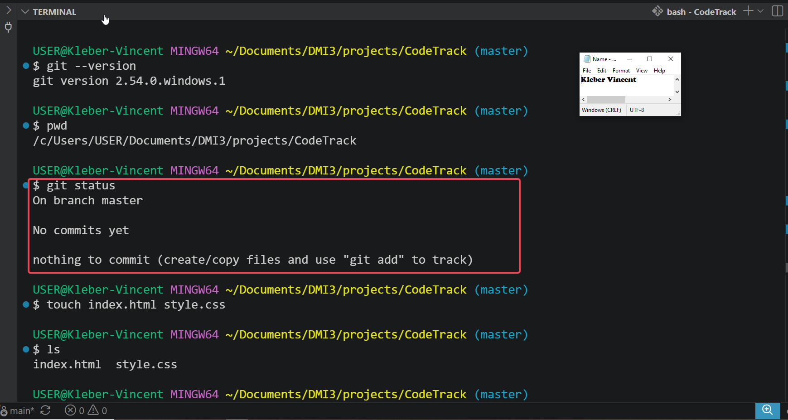

---

# Task 2 — Create index.html and style.css

## Goal

Create the two starter UI files inside `CodeTrack`.

I created both starter files using `touch index.html style.css`, then confirmed they existed with `ls`, which listed both `index.html` and `style.css` in the directory.

### Evidence

#### Screenshot 3 — Output of `ls` showing `index.html` and `style.css`

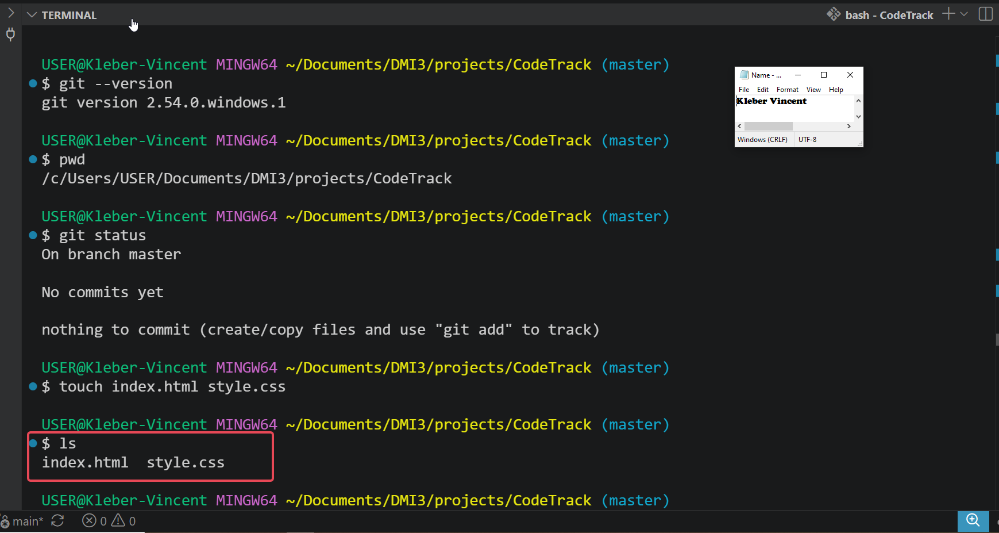

---

# Task 3 — Add Starter Content

## Goal

Copy the provided starter HTML and CSS content into my local `index.html` and `style.css` files.

I opened the `dmi-codetrack-starter-assignment` repository, copied the provided `index.html` and `style.css` content, and pasted each into my local files in VS Code. The editor confirmed both files were fully populated, including the CSS variables and base styles in `style.css`, and the header, tagline, and student-info section with the Task 6 instruction comment in `index.html`.

### Evidence

#### Screenshot 4 — Editor showing the contents of `index.html` and `style.css`

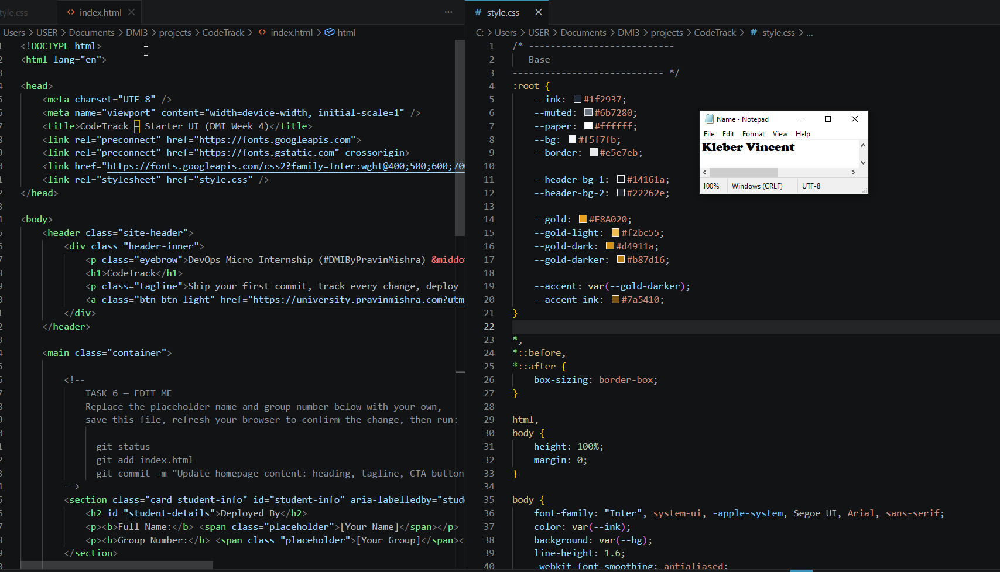

---

# Task 4 — Track and Stage Files Correctly

## Goal

Confirm both files show as untracked, then stage them individually with `git add`.

Running `git status` before staging showed both `index.html` and `style.css` listed under "Untracked files." I staged each file individually using `git add index.html` and `git add style.css` rather than a bulk `git add .`, to keep control over exactly what entered the commit. A second `git status` confirmed both files moved under "Changes to be committed" as new files.

### Evidence

#### Screenshot 5 — Output of `git status` showing both files as untracked

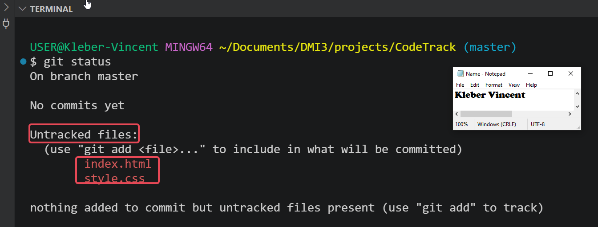

---

#### Screenshot 6 — Output of `git status` showing both files staged under "Changes to be committed"

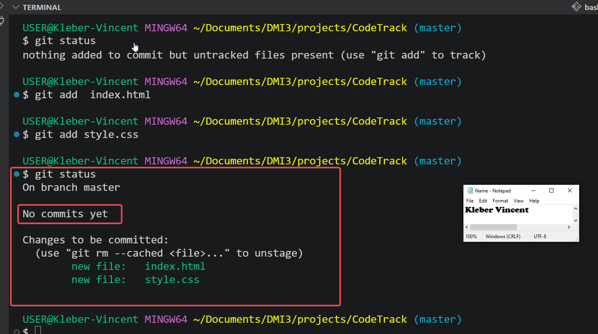

---

# Task 5 — Create the First Commit (Clean Initial Commit)

## Goal

Commit the staged starter files using the message `Initial UI scaffold: add index.html and style.css`, then check the log.

I committed the staged files with the required message. The output confirmed the root commit was created, with 2 files changed and 271 insertions. Running `git log --oneline` confirmed the single commit was recorded correctly with `HEAD -> master` pointing to it.

### Evidence

#### Screenshot 7 — Output of `git commit`

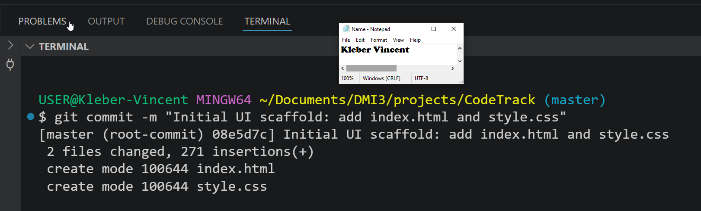

---

#### Screenshot 8 — Output of `git log --oneline` showing the first commit

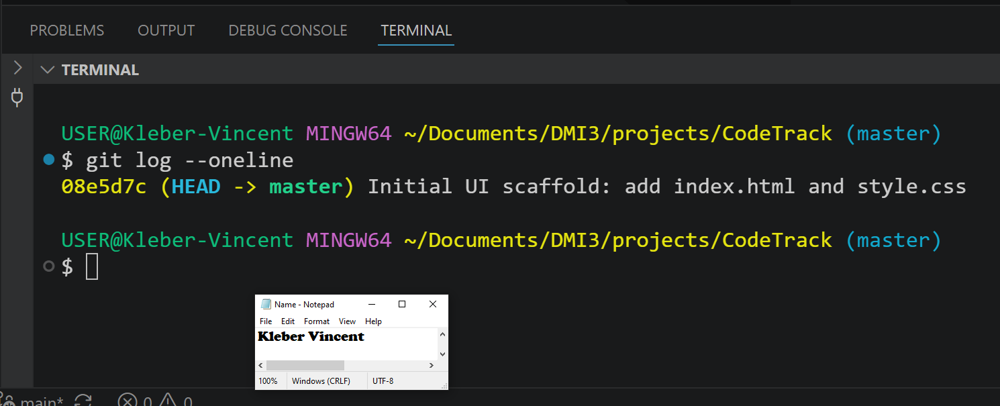

---

# Task 6 — Modify index.html and Create a Second Commit

## Goal

Follow the instruction comment inside `index.html` to update the Student Name and Group Name, then commit that change separately using the message `Update homepage content: heading, tagline, CTA button`.

Following the Task 6 comment inside `index.html`, I replaced the placeholder values with my actual Full Name, Kleber Vincent, and Group Number, Group 2, removing the surrounding brackets since they were only placeholder markers. I confirmed the change by opening `index.html` directly in the browser, where both values displayed correctly under "Deployed By." Running `git status` showed `index.html` as modified, I staged it with `git add index.html`, then committed it separately from the first commit using the required message. `git log --oneline` then showed two commits, with the newest, the homepage content update, listed first.

### Evidence

#### Screenshot 9 — Browser showing the updated page with my Full Name and Group Name visible

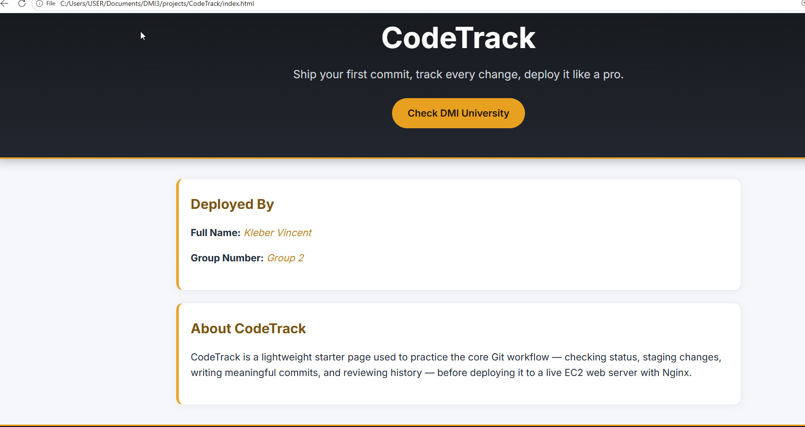

---

#### Screenshot 10 — Output of `git status` showing `index.html` as modified

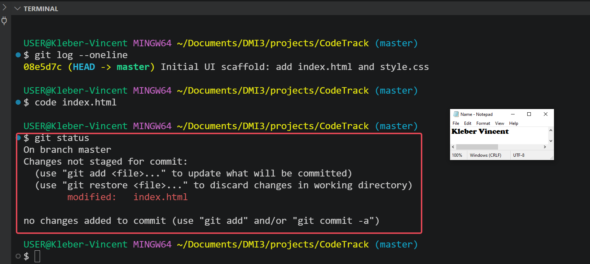

---

#### Screenshot 11 — Output of `git commit`

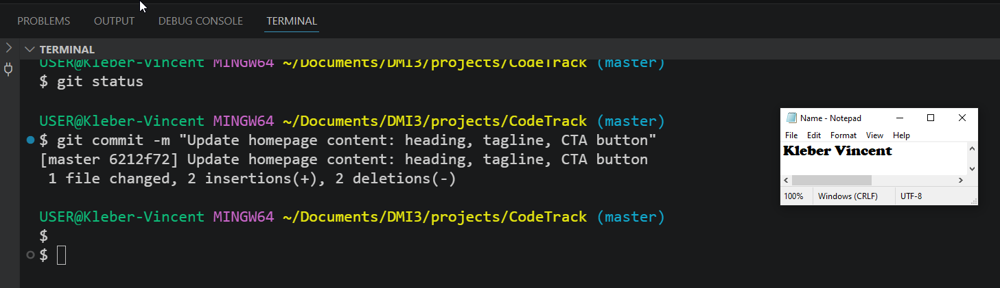

---

#### Screenshot 12 — Output of `git log --oneline` showing two commits

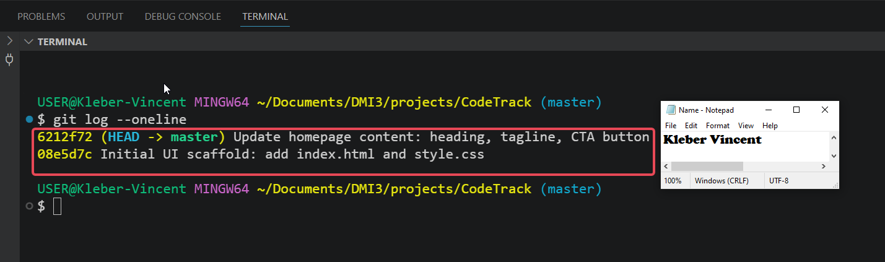

---

# Task 7 — Deploy to EC2 with Nginx (Static Website)

## Goal

Install and start Nginx on my EC2 instance, then copy `index.html` and `style.css` into the Nginx web root.

I installed and started Nginx on my Ubuntu EC2 instance using `sudo apt install -y nginx` and `sudo systemctl enable --now nginx`, then confirmed it was running with `systemctl status nginx --no-pager`, which returned `active (running)`.

Before deploying, I checked `/var/www/html` and found it wasn't empty, it already contained a full site (`index.html`, `style.css`, `README.md`, `privacy.html`, `terms.html`, and an `images/` folder) from an earlier DMI assignment. Rather than overwrite it directly, I backed up the entire directory to `/var/www/html-backup-earlier-assignment-data` using `sudo cp -r`, verified the backup with `ls -al`, then safely cleared the live web root with `sudo rm -rf /var/www/html/*` before deploying CodeTrack.

I transferred my local `index.html` and `style.css` to the EC2 instance's `/tmp` directory using `scp`, then copied them into `/var/www/html` with `sudo cp`, and set their permissions explicitly with `sudo chmod 644` to ensure Nginx's `www-data` user could read them regardless of the umask used during the copy. I verified the deployment locally on the server with `curl -I http://localhost`, which returned `HTTP/1.1 200 OK` from `nginx/1.28.3 (Ubuntu)`, then confirmed the live site by opening the EC2 public IP in the browser, where the CodeTrack page loaded correctly with my Full Name and Group Number visible.

### Evidence

#### Screenshot 13 — Output of `systemctl status nginx --no-pager` showing Nginx `active (running)`

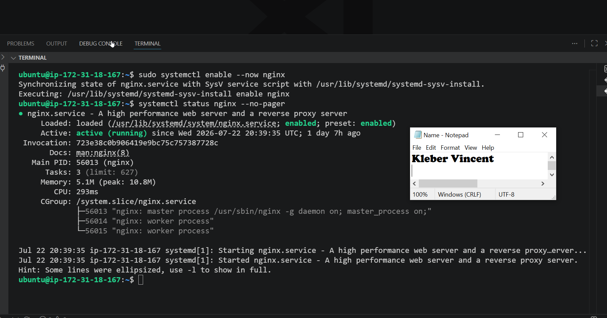

---

#### Screenshot 14 — Output of `curl -I http://localhost` showing `HTTP/1.1 200 OK`

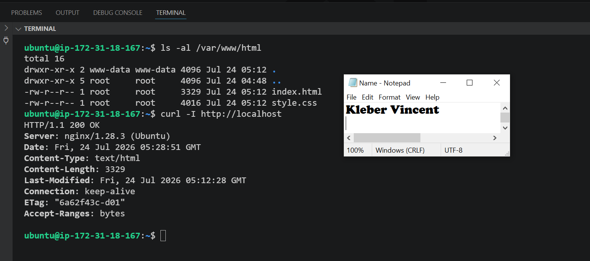

---

#### Screenshot 15 — Browser showing the CodeTrack site loaded at `http://<EC2_PUBLIC_IP>`, with my Full Name and Group Name visible

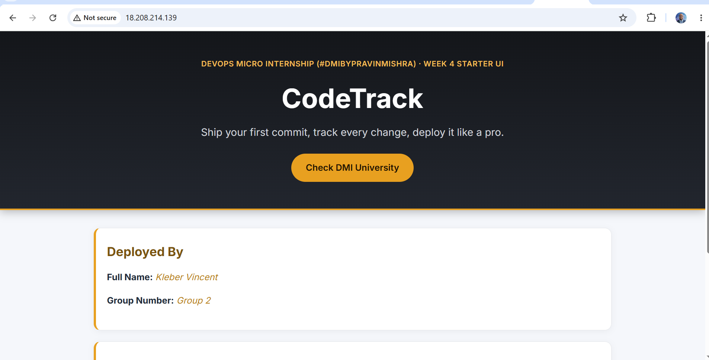

---

# LinkedIn Post (Required)

## Evidence

#### LinkedIn Post URL

https://www.linkedin.com/posts/vincent-kleber-kakpo-8b920b88_dmicohort3-devops-git-share-7486379829357965312-lA5n
---

#### Screenshot — LinkedIn post showing the deployed CodeTrack application

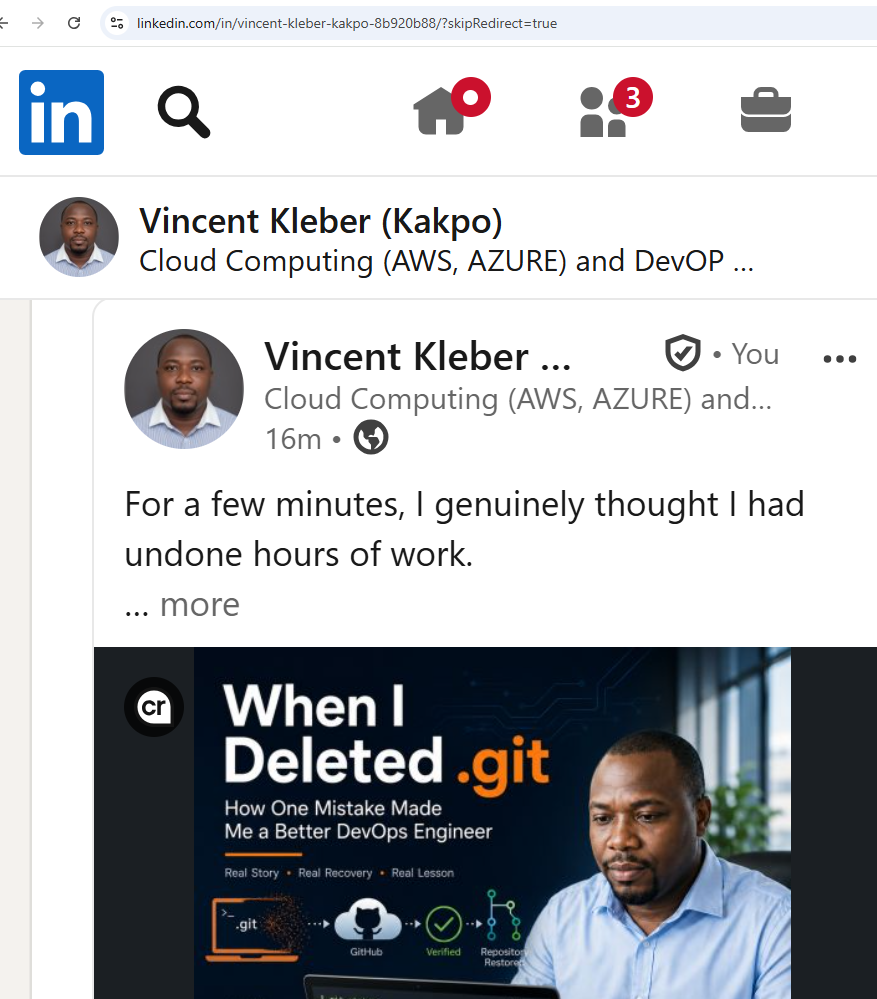

---

## Completion Checklist

- [x] `CodeTrack` repository verified with `git status` (Screenshots 1–2)
- [x] `index.html` and `style.css` created and populated (Screenshots 3–4)
- [x] Starter files staged and committed in the first commit (Screenshots 5–8)
- [x] Student Name and Group Name updated in `index.html` (Screenshot 9)
- [x] Second controlled commit created (Screenshots 10–12)
- [x] Nginx active on the EC2 instance and CodeTrack reachable via its public IP (Screenshots 13–15)
- [ ] LinkedIn post published and URL submitted
- [x] No sensitive data exposed

---

*This submission is part of DevOps Micro Internship (DMI) Cohort 3 — Agentic AI Track.*