# Assignment 3 — CodeTrack: Branching Workflow (Add & Verify a Contact Page)

Part of the DevOps Micro Internship (DMI) Cohort 3 with Agentic AI

---

## Purpose

In this assignment, I added a new Contact page to CodeTrack using a clean feature-branch workflow. I kept each change in a separate commit, proved that the default branch remained unchanged before the merge, and validated the result after merging.

---

# Task 1 — Confirm Repository State and Default Branch

## Goal

Start from a clean default branch (`main` or `master`) and confirm the repository status.

I navigated into `CodeTrack` and confirmed my working tree was clean with `git status`, then verified with `git branch` that I was on `master`, my repository's default branch.

### Evidence

#### Screenshot 1 — Output of `git status` and `git branch` showing a clean status and the default branch checked out

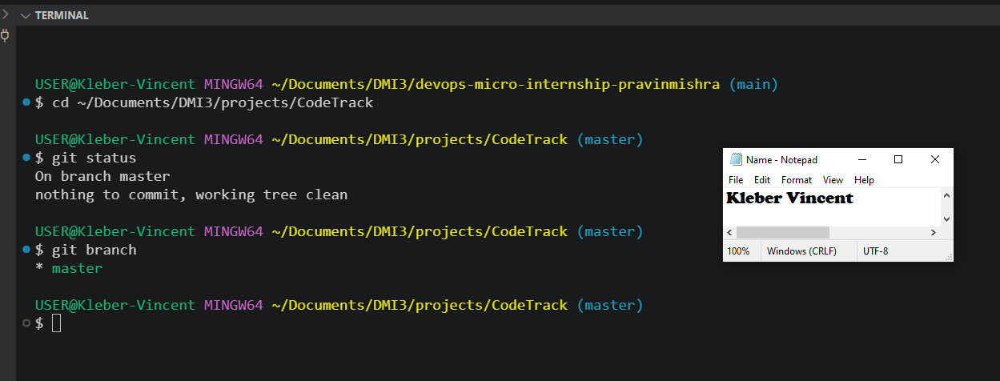

---

# Task 2 — Create and Switch to a Feature Branch

## Goal

Create a branch named exactly `feature/contact-page` and switch to it.

I created and switched to the feature branch in one step using `git checkout -b feature/contact-page`, then confirmed with `git branch` that the asterisk had moved to `feature/contact-page`, isolating all upcoming work from `master`.

### Evidence

#### Screenshot 2 — Output of `git checkout -b feature/contact-page` and `git branch` showing `* feature/contact-page`

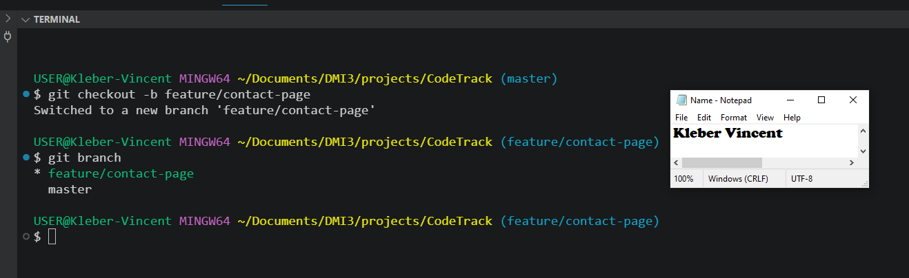

---

# Task 3 — Add contact.html on the Feature Branch

## Goal

Create `contact.html` with the provided content and commit it alone using the message `feat(contact): add Contact page`.

While on `feature/contact-page`, I created `contact.html` and added the provided content, including a WhatsApp community link and a link to Pravin Mishra's website. I confirmed the file existed with `ls`, staged only `contact.html`, and committed it with the required message. `git log --oneline -3` confirmed the new commit sat on top of my existing commit history from Assignment 2.

### Evidence

#### Screenshot 3 — Output of `ls` showing `contact.html`

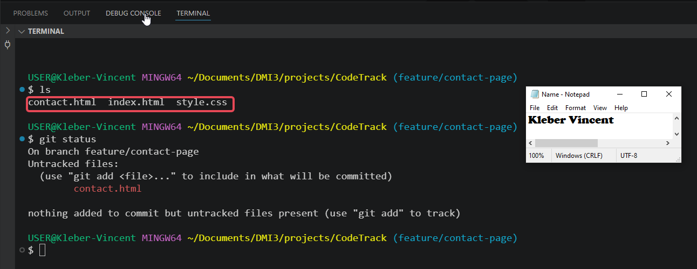

---

#### Screenshot 4 — Output of `git commit`

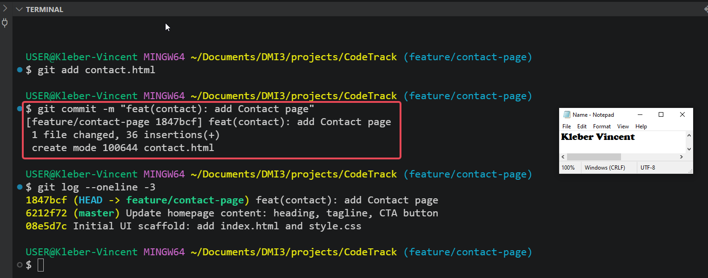

---

#### Screenshot 5 — Output of `git log --oneline -3` showing the new commit

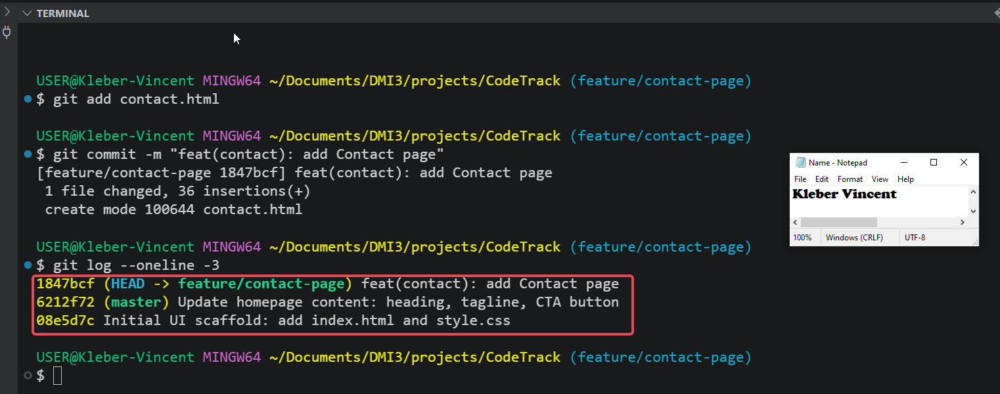

---

# Task 4 — Add the Contact Link to index.html

## Goal

Add the provided Contact Page link to `index.html` and commit it separately using the message `feat(nav): add Contact Page link`.

I added the Contact Page link inside the footer's link list in `index.html`, immediately after the existing Discord link, keeping it visually consistent with the site's separator styling. `git status` confirmed `index.html` as modified before I staged and committed it separately from the `contact.html` commit, keeping the two changes atomic. I confirmed the link rendered correctly in the browser while still on `feature/contact-page`.

### Evidence

#### Screenshot 6 — Output of `git status` showing `index.html` as modified before staging

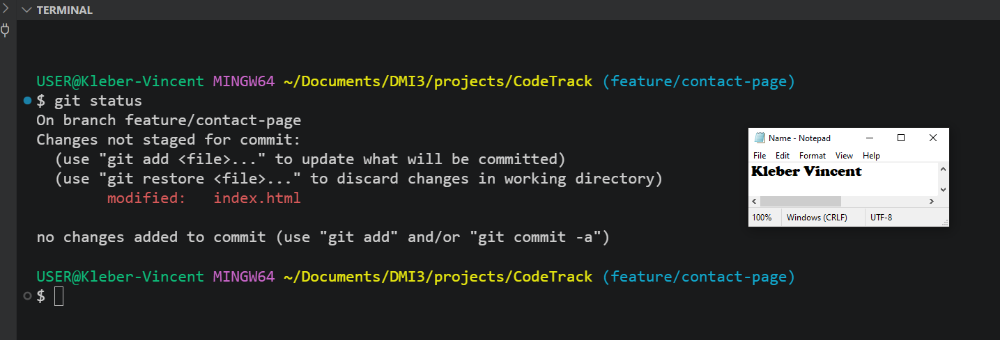

---

#### Screenshot 7 — Output of `git commit`

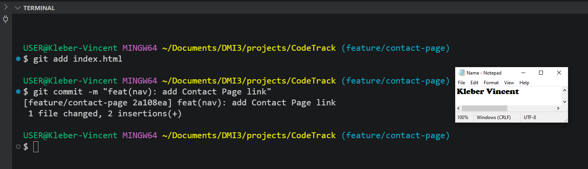

---

#### Screenshot 8 — Browser showing the Contact Page link on the homepage while on `feature/contact-page`

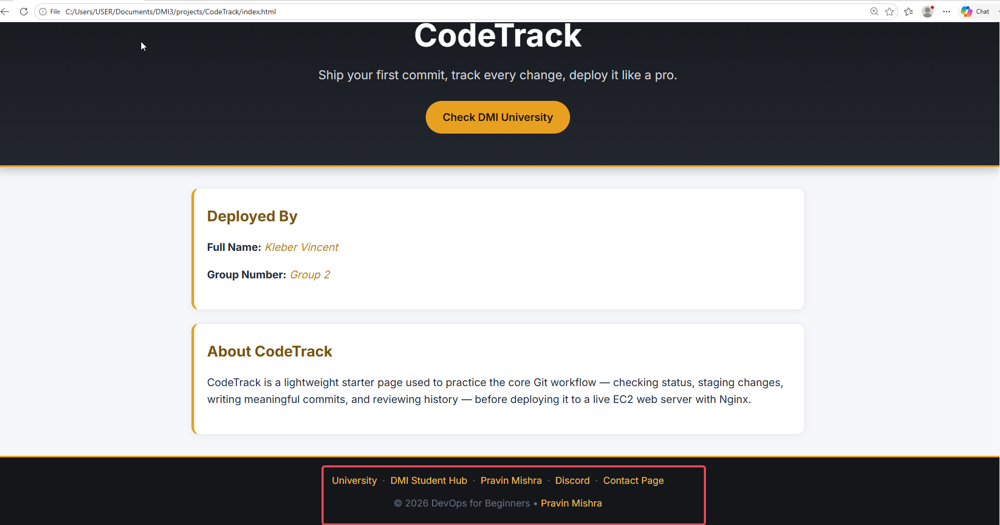

---

# Task 5 — Verify Isolation (Prove the Default Branch Is Unchanged)

## Goal

Switch back to the default branch and confirm that `contact.html` and the Contact Page link do not exist there yet.

I switched back to `master` with `git checkout master` and ran `ls`, which confirmed `contact.html` was absent, only `index.html` and `style.css` were present. I then reloaded the homepage in the browser and confirmed the footer had no Contact Page link, proving the feature work was fully isolated on its branch and hadn't leaked into `master` before the merge.

### Evidence

#### Screenshot 9 — Terminal showing the checkout and `ls` output, proving `contact.html` is absent

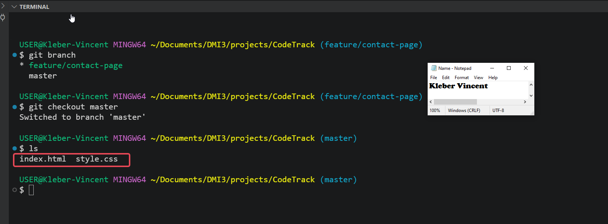

---

#### Screenshot 10 — Browser showing the homepage on the default branch with no Contact Page link

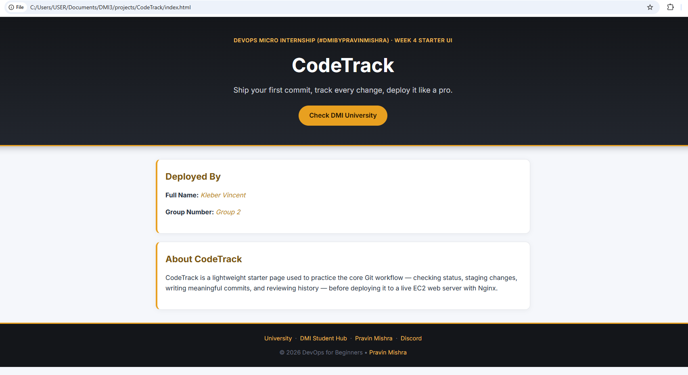

---

# Task 6 — Merge the Feature Branch into the Default Branch

## Goal

Merge `feature/contact-page` into the default branch and confirm the Contact page works.

With `master` confirmed unchanged, I merged `feature/contact-page` in using `git merge feature/contact-page`. Since `master` hadn't diverged during feature development, Git performed a clean fast-forward merge, updating 2 files with 38 insertions and creating `contact.html`. I confirmed the merge with `ls`, then opened the homepage and clicked through to the Contact page from the newly merged link.

During this verification, I discovered that both anchor tags inside `contact.html` were malformed, the opening `<a` tag was missing from both links, causing the browser to render the raw HTML attributes as plain text instead of clickable links. I rewrote the file directly from the terminal using a heredoc to rule out editor/paste interference, confirmed the corrected content with `cat`, then committed the fix separately with the message `fix(contact): correct malformed anchor tags for WhatsApp and DMI links`. The corrected page now renders both links properly.

### Evidence

#### Screenshot 11 — Output of `git merge feature/contact-page`

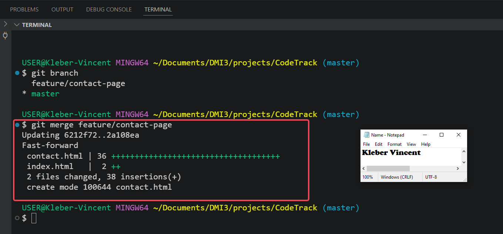

---

#### Screenshot 12 — Output of `ls` showing `contact.html` after the merge

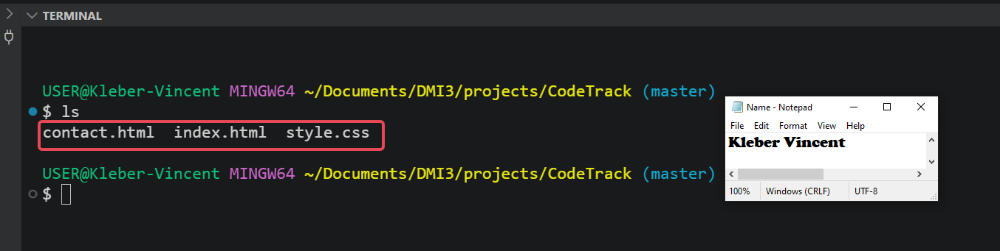

---

#### Screenshot 13 — Browser showing the Contact page opened from the homepage link on the default branch

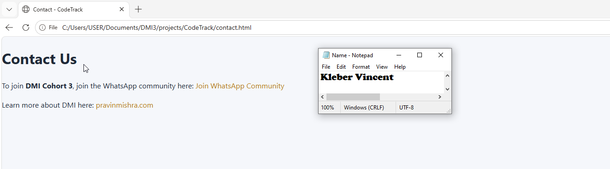

---

# Task 7 — Inspect History (Graph View)

## Goal

Display the repository history as a graph and locate both feature commits.

Running `git log --oneline --graph --decorate --all` showed a clean, linear history with all commits visible: the anchor tag fix, the Contact Page navigation link, the Contact page addition, the homepage content update, and the initial UI scaffold. The graph confirmed `master` at `HEAD` and `feature/contact-page` still pointing at its last commit prior to deletion, consistent with a fast-forward merge that produced no separate merge commit.

### Evidence

#### Screenshot 14 — Full output of `git log --oneline --graph --decorate --all`

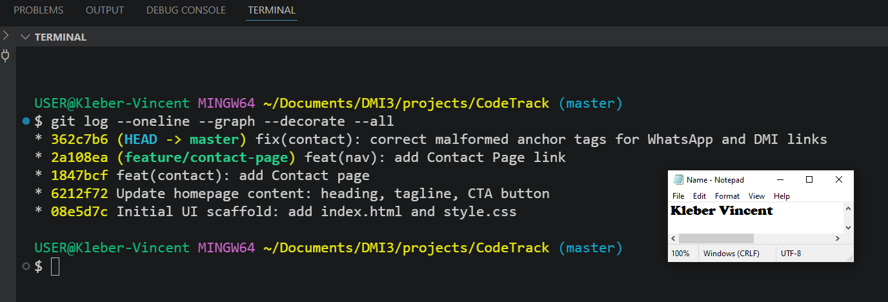

---

# Task 8 — Optional Cleanup (Delete the Feature Branch)

## Goal

Delete the merged `feature/contact-page` branch to keep the branch list clean.

Since `feature/contact-page` was fully merged into `master`, I deleted it with `git branch -d feature/contact-page`, which Git confirmed safely since the branch had no unmerged changes. Running `git branch` afterward showed only `master` remaining.

### Evidence

#### Screenshot 15 (Optional) — Output showing `feature/contact-page` deleted and no longer listed

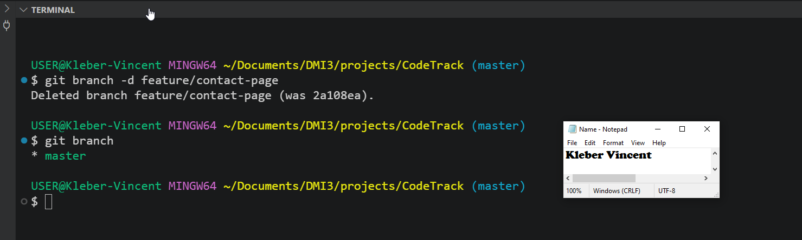

---

## Completion Checklist

- [x] Repository confirmed clean on the default branch (Screenshot 1)
- [x] `feature/contact-page` created and checked out (Screenshot 2)
- [x] `contact.html` added in its own commit (Screenshots 3–5)
- [x] Homepage Contact link added in a separate commit (Screenshots 6–8)
- [x] Default branch proven unchanged before merge (Screenshots 9–10)
- [x] Feature branch merged and Contact page verified (Screenshots 11–13)
- [x] Graph history reviewed (Screenshot 14)
- [x] Optional cleanup completed (Screenshot 15)
- [x] No sensitive data exposed

---

# Completion Checklist

- [ ] Repository confirmed clean on the default branch (Screenshot 1)
- [ ] `feature/contact-page` created and checked out (Screenshot 2)
- [ ] `contact.html` added in its own commit (Screenshots 3–5)
- [ ] Homepage Contact link added in a separate commit (Screenshots 6–8)
- [ ] Default branch proven unchanged before merge (Screenshots 9–10)
- [ ] Feature branch merged and Contact page verified (Screenshots 11–13)
- [ ] Graph history reviewed (Screenshot 14)
- [ ] Optional cleanup completed (Screenshot 15)
- [ ] No sensitive data exposed

---

## 📌 About DMI & CloudAdvisory

DevOps Micro Internship (DMI) is a project-based DevOps program run by Pravin Mishra (The CloudAdvisory) focused on real-world execution, systems thinking, and career readiness.

It helps learners build strong DevOps foundations with hands-on experience.

---

## 📌 Resources

- 🌐 DMI Official Website: https://dmi.pravinmishra.com?utm_source=github&utm_medium=readme  
- 🎓 University: https://university.pravinmishra.com?utm_source=github&utm_medium=readme  
- 💬 Discord Community: https://discord.pravinmishra.com?utm_source=github&utm_medium=readme  
- 📝 Blog: https://dmi.pravinmishra.com/blog?utm_source=github&utm_medium=readme  
- ▶️ YouTube Playlist: https://www.youtube.com/playlist?list=PLFeSNDtI4Cho  
- 🔗 Pravin Mishra (LinkedIn): https://www.linkedin.com/in/pravin-mishra-aws-trainer/  
- 🏢 CloudAdvisory (LinkedIn): https://www.linkedin.com/company/thecloudadvisory/

---

*This submission is part of DevOps Micro Internship (DMI) Cohort 3 — Agentic AI Track.*

