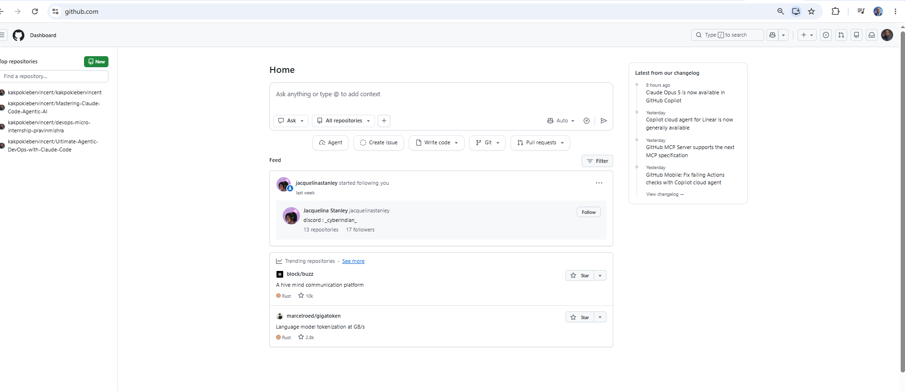
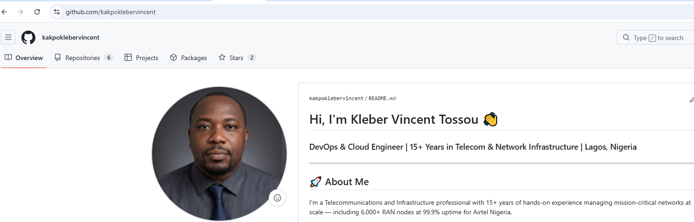
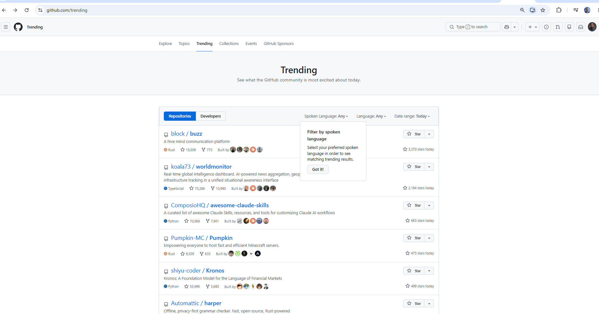
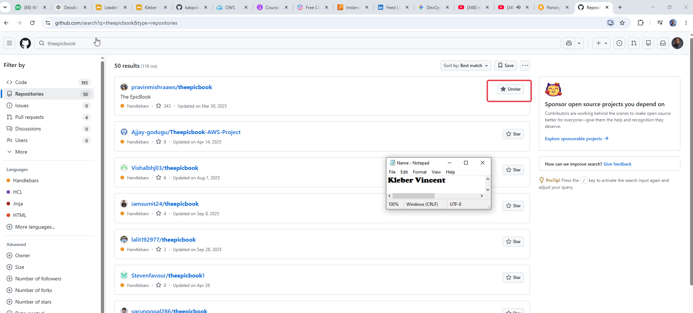
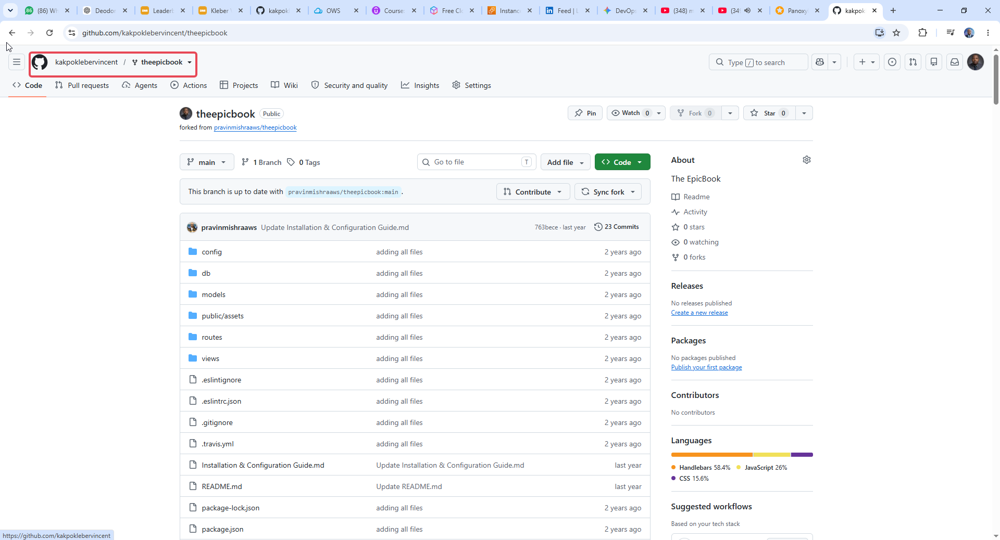
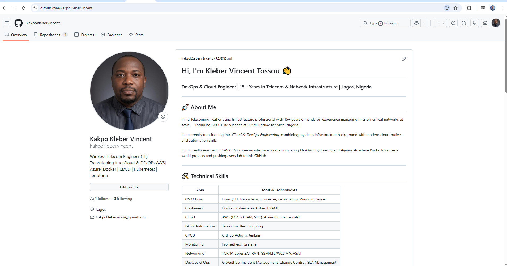

# Assignment 4 — GitHub Account, Exploration & Professional Profile Setup

Part of the DevOps Micro Internship (DMI) Cohort 3 with Agentic AI

---

## Purpose

In this assignment, I confirmed my GitHub account, explored repositories the way a professional would, practiced starring and forking, and reviewed my profile for professional presentation. This establishes a credible GitHub identity before using GitHub for collaboration, portfolio work, and future DevOps projects.

---

# Task 1 — Create a GitHub Account (or Confirm an Existing Account)

## Goal

Confirm that I have a working GitHub account and can access my GitHub dashboard.

I already had a GitHub account set up from my Cohort 3 preparation, `kakpoklebervincent`, complete with a profile README I built earlier. For this task, I confirmed access by visiting `github.com` while signed in, which lands on the Dashboard, GitHub's activity feed showing recent notifications, top repositories, and trending content personalized to my account. The Dashboard is distinct from a public profile page, it's only visible to me while logged in, and it's the clearest proof of an active, authenticated session. I then visited my public profile directly at `https://github.com/kakpoklebervincent` to confirm the URL and username matched.

### Evidence

#### Screenshot 1 — GitHub dashboard or Home page showing I'm signed in, with my username visible

---

#### Screenshot 2 (Optional but Recommended) — My GitHub profile with `https://github.com/kakpoklebervincent` visible in the browser address bar

---

# Task 2 — Explore GitHub Like a Professional

## Goal

Browse Trending, search for a public project, star at least one repository, and fork at least one repository to my own account.

I visited `github.com/trending` to browse what the GitHub community is currently most active around. Trending surfaces repositories gaining stars quickly, useful for spotting emerging tools and popular open-source projects worth learning from.

I then searched for `theepicbook`, one of the assignment's suggested repositories, and found `pravinmishraaws/theepicbook`, the original repository maintained by my DMI instructor. I chose this one deliberately over a random pick since it ties directly back to the program I'm learning through.

I starred the repository, which bookmarks it under my account without creating a copy, useful for saving reference projects I want to find again later without cluttering my own repositories. I then forked it, which creates a full, independent copy of the repository under my own GitHub account (`kakpoklebervincent/theepicbook`). Unlike starring, forking gives me a real, editable copy I can experiment with freely without affecting the original, this is the same mechanism used to contribute to open-source projects through pull requests.

### Evidence

#### Screenshot 3 — GitHub Trending page visible in the browser

---

#### Screenshot 4 — A repository page showing the Star button in the Starred state

---

#### Screenshot 5 — My forked repository page with my username and repository name visible in the URL

---

# Task 3 — Update Your GitHub Profile (Professional Setup)

## Goal

Add a professional bio to my GitHub profile, along with location, technical background, and a profile picture.

My profile was already set up with a detailed, professional presentation from earlier Cohort 3 preparation. It includes a clear bio ("Wireless Telecom Engineer (TL) | Transitioning into Cloud & DevOps AWS | Azure | Docker | CI/CD | Kubernetes | Terraform"), my location (Lagos), a profile picture, and a full README with an "About Me" section, a technical skills table covering OS & Linux, Containers, Cloud, IaC & Automation, CI/CD, Monitoring, Networking, and DevOps & Ops, and a "Currently Learning & Building" section tracking my active certifications and coursework.

This goes beyond the assignment's minimum requirement of a one-line bio, since the goal is to present a credible identity that recruiters and teammates can trust at a glance, a fuller picture with real technical depth serves that purpose better than a short generic description.

### Evidence

#### Screenshot 6 — My public GitHub profile showing my username and professional bio

---

## GitHub Profile URL

`https://github.com/kakpoklebervincent`

---

## Completion Checklist

- [x] GitHub account created or existing account confirmed (Screenshot 1)
- [x] Trending repositories explored (Screenshot 3)
- [x] At least one repository starred (Screenshot 4)
- [x] At least one public repository forked (Screenshot 5)
- [x] Professional bio added to my GitHub profile (Screenshot 6)
- [x] GitHub profile URL included
- [x] No passwords, codes, or authentication secrets exposed

---

*This submission is part of DevOps Micro Internship (DMI) Cohort 3 — Agentic AI Track.*