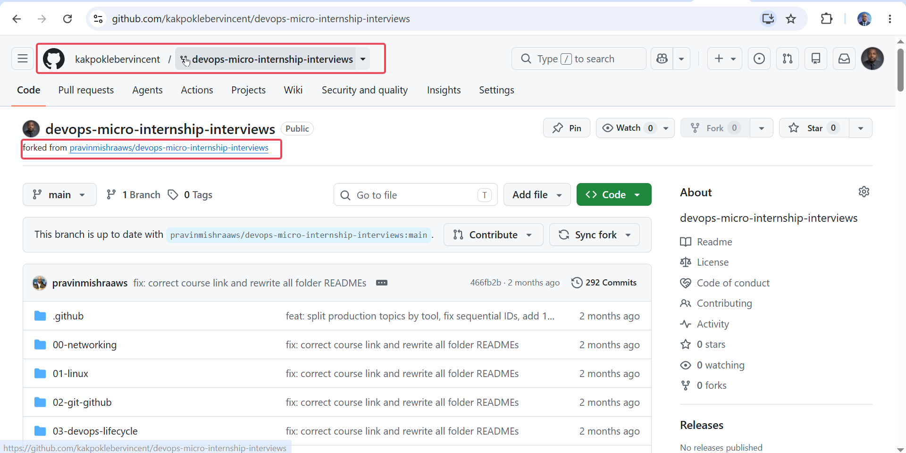
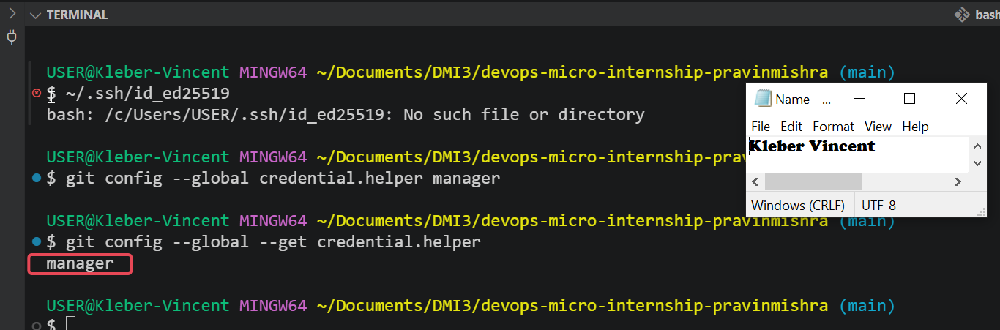
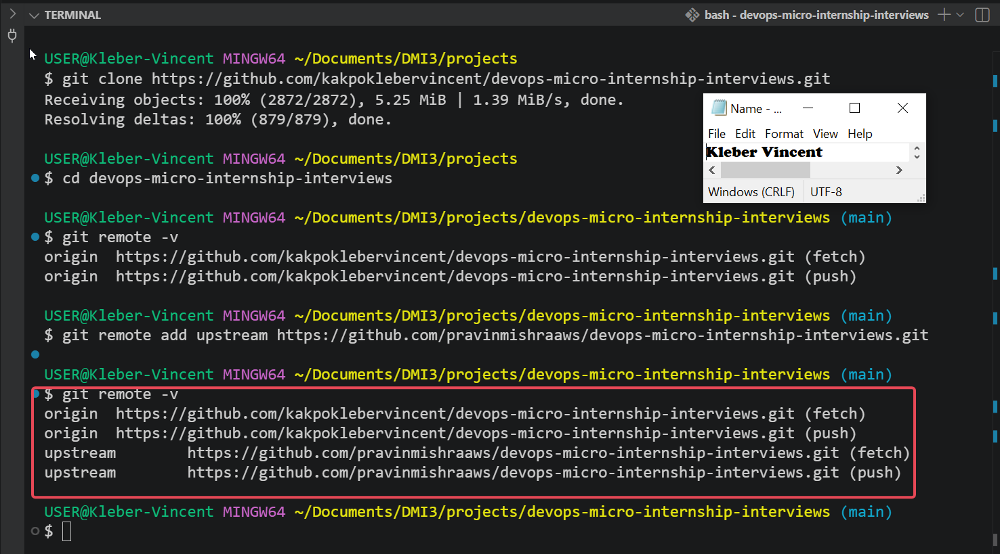
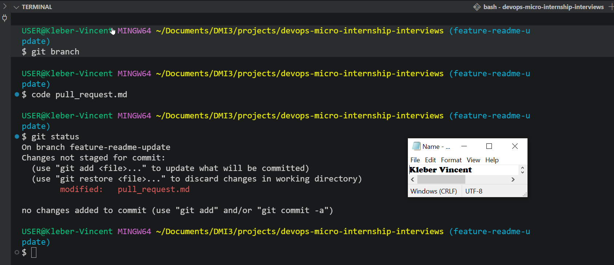
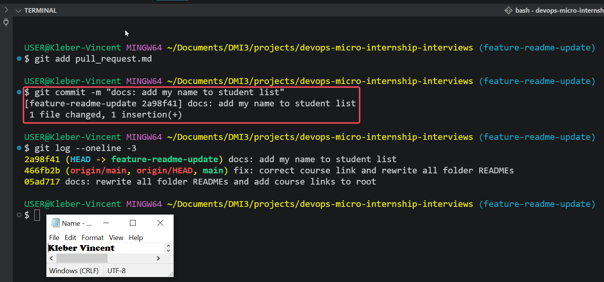
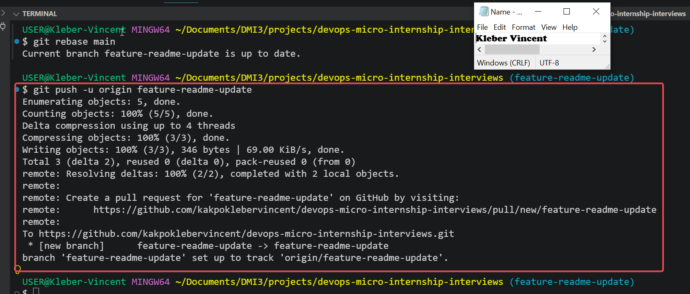
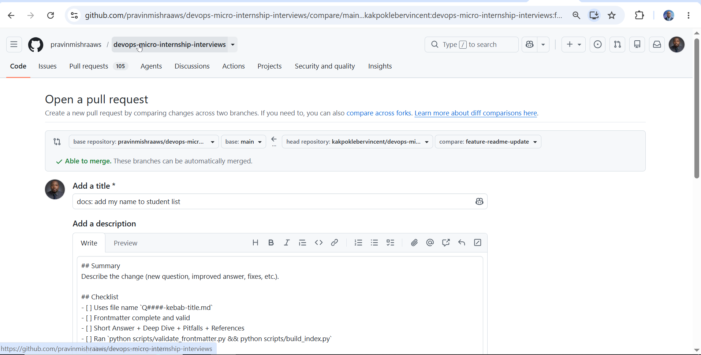
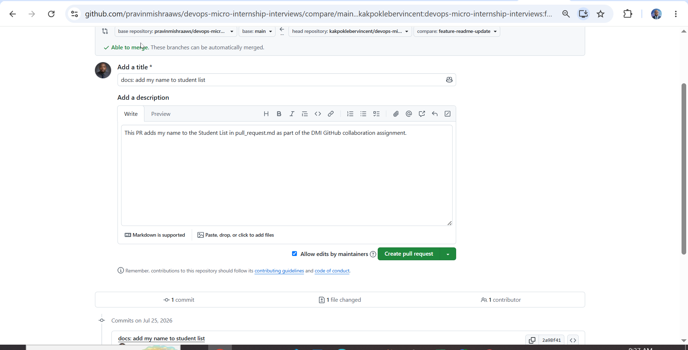
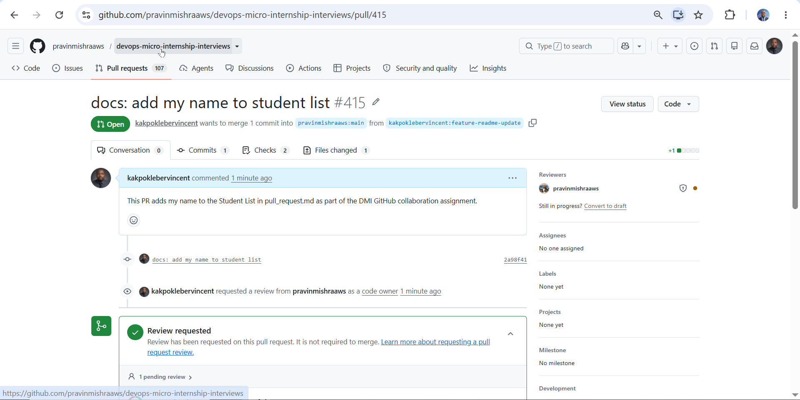

# Assignment 5 — Open-Source Collaboration: Fork, Clone, Sync & Pull Request

Part of the DevOps Micro Internship (DMI) Cohort 3 with Agentic AI

---

## Purpose

In this assignment, I contributed one small documentation change to a shared repository using a standard open-source collaboration workflow: fork, clone, configure remotes, branch, commit, sync with upstream, push, and open a Pull Request. This was done in a separate practice repository, distinct from the one I submit my own DMI work in.

---

# Task 0 — Fork the Upstream Repository

## Goal

Fork `pravinmishraaws/devops-micro-internship-interviews` into my own GitHub account.

A fork is a full, independent server-side copy of someone else's repository, created under my own GitHub account. It exists because contributors usually don't have direct write access to the original ("upstream") repository, forking gives me a copy I can freely change, while still being able to propose those changes back to the original project through a Pull Request.

**Steps taken:**

* Opened `pravinmishraaws/devops-micro-internship-interviews`
* Selected **Fork**
* Kept my personal account as the owner and the repository name unchanged
* Confirmed the fork was created under my account at `github.com/kakpoklebervincent/devops-micro-internship-interviews`

### Evidence

#### Screenshot 1 — My fork page with my username and `devops-micro-internship-interviews` visible in the browser URL



---

# Task 1 — Authenticate GitHub from the Terminal

## Goal

Configure one authentication method, HTTPS with a Personal Access Token, or SSH, so I can push to my fork from the terminal.

I chose **HTTPS with a Personal Access Token (PAT)** since I already had one saved. A PAT acts as a substitute for my GitHub password when authenticating over HTTPS, since GitHub no longer accepts account passwords for Git operations.

```bash
git config --global credential.helper manager
git config --global --get credential.helper
```

* `git config --global credential.helper manager`: tells Git to use Git Credential Manager on Windows to securely store my login details after I authenticate once, so I'm not prompted every single push.
* `git config --global --get credential.helper`: prints back whatever helper is currently configured, used here just to confirm the setting actually took effect (it returned `manager`).

The real authentication (username + PAT) happens automatically the first time I actually push, not at configuration time.

**Bonus setup — SSH (for future use):**

Since I may need it later, I also set up SSH authentication in parallel. SSH uses a locally generated key pair instead of a token, once the public half is added to GitHub, it authenticates me for any repository I have access to without re-entering credentials each time.

```bash
ssh-keygen -t ed25519 -C "kakpoklebervinny@gmail.com"
eval "$(ssh-agent -s)"
ssh-add ~/.ssh/id_ed25519
cat ~/.ssh/id_ed25519.pub
ssh -T git@github.com
```

* `ssh-keygen -t ed25519 -C "..."`: generates a new SSH key pair (a private key and a matching public key) using the modern, secure Ed25519 algorithm. The `-C` flag just attaches a label (my email) to the key so it's identifiable later.
* `eval "$(ssh-agent -s)"`: starts the SSH agent, a background helper process that holds my decrypted private key in memory so I don't have to re-enter a passphrase on every connection.
* `ssh-add ~/.ssh/id_ed25519`: loads my private key into that running agent.
* `cat ~/.ssh/id_ed25519.pub`: prints my **public** key so I can copy it, this is safe to share and paste into GitHub, unlike the private key, which must never leave my machine.
* `ssh -T git@github.com`: tests the connection to GitHub using SSH. The `-T` flag disables shell access since I'm only testing authentication, not trying to log into a real shell. A successful result greets me by username without granting shell access, confirming the key pair works.

For this assignment's submitted evidence, I used the HTTPS method since that's what I configured and used for the actual clone and push.

### Evidence

#### Screenshot 2 — Output of `git config --global --get credential.helper` showing successful configuration



---

# Task 2 — Clone Your Fork and Configure Remotes

## Goal

Clone my fork locally, then add the original repository as `upstream`.

```bash
git clone https://github.com/kakpoklebervincent/devops-micro-internship-interviews.git
cd devops-micro-internship-interviews
git remote -v
git remote add upstream https://github.com/pravinmishraaws/devops-micro-internship-interviews.git
git remote -v
```

* `git clone https://github.com/kakpoklebervincent/...`: downloads a full local copy of my fork, not the upstream repository, complete with its entire commit history. This is deliberate: I always push to and pull from my own fork, never directly to the original project.
* `cd devops-micro-internship-interviews`: moves into the newly created project folder.
* `git remote -v` (first run): lists the remotes currently configured, at this point only `origin`, automatically set to my fork by the clone command, appears.
* `git remote add upstream https://github.com/pravinmishraaws/...`: manually adds a second remote named `upstream`, pointing to the original repository. Git doesn't do this automatically since it has no way of knowing which repo I forked from.
* `git remote -v` (second run): confirms both remotes are now present, `origin` (my fork, where I push my work) and `upstream` (the original project, from which I pull in the latest changes).

This two-remote setup, `origin` for my own copy and `upstream` for the original, is the foundation of the fork-based collaboration model used across nearly all open-source projects.

### Evidence

#### Screenshot 3 — Output of `git remote -v` showing `origin` pointing to my fork and `upstream` pointing to `pravinmishraaws/devops-micro-internship-interviews`



---

# Task 3 — Create a Feature Branch and Make Your Change

## Goal

Create the branch `feature-readme-update`, add only my own entry to the Student List at the end of `pull_request.md`, and commit it with the required message.

```bash
git checkout -b feature-readme-update
```

* `git checkout -b feature-readme-update`: creates a brand-new branch called `feature-readme-update` and switches to it in a single step. The `-b` flag is what tells `checkout` to create the branch first, without it, Git would try to switch to a branch that doesn't exist yet and fail.

I opened `pull_request.md`, located the Student List, and added a single new line at the end in the required format, `Kleber Vincent Kakpo — Group 2`, without touching, reordering, or deleting any existing student's entry. Keeping the change to a single added line makes the eventual Pull Request atomic and easy for a reviewer to approve at a glance.

```bash
git status
git add pull_request.md
git commit -m "docs: add my name to student list"
git log --oneline -3
```

* `git status`: shows which files have changed but aren't staged yet. This confirmed only `pull_request.md` was touched, nothing else in the repository was accidentally modified.
* `git add pull_request.md`: stages that one file, moving it into the "about to be committed" area. Staging only this file (rather than `git add .`) keeps me in full control of exactly what enters the commit.
* `git commit -m "docs: add my name to student list"`: saves a permanent snapshot of the staged change with the exact message required by the assignment.
* `git log --oneline -3`: shows the last 3 commits in short form, confirming the new commit landed correctly at the top of the branch's history.

### Evidence

#### Screenshot 4 — Output of `git status` showing `pull_request.md` modified before staging



---

#### Screenshot 5 — Output of `git commit`



---

# Task 4 — Synchronize with Upstream and Push to Your Fork

## Goal

Fetch and merge `upstream/main` into my local default branch, rebase my feature branch onto it, then push `feature-readme-update` to my fork.

```bash
git fetch upstream
git checkout main
git merge upstream/main
git checkout feature-readme-update
git rebase main
git push -u origin feature-readme-update
```

Here's what each step actually does, in plain terms:

* `git fetch upstream`: downloads the latest commits from Pravin's original repo into my local machine, but doesn't change any of my files yet. Think of it as "check what's new" without touching my work.
* `git checkout main`: switches me to my local `main` branch, since that's the branch I want to update with upstream's latest changes.
* `git merge upstream/main`: merges those fetched upstream commits into my local `main`, bringing my fork's main branch up to date with the original repo. In my case this reported "Already up to date," since I had cloned very recently and upstream hadn't moved since.
* `git checkout feature-readme-update`: switches back to my feature branch, where my actual change lives.
* `git rebase main`: replays my feature branch's commit on top of the now-updated `main`, keeping my history clean and linear rather than creating a messy merge commit. In my case, since `main` hadn't changed, this reported "Current branch feature-readme-update is up to date."
* `git push -u origin feature-readme-update`: pushes my feature branch up to my fork on GitHub (`origin`). The `-u` flag sets up tracking, so future `git push`/`git pull` on this branch won't need me to specify the remote and branch name again.

Since I authenticated via HTTPS, this push was the point Git would normally prompt for my GitHub username and PAT. GitHub responded with a direct link to open a Pull Request for the newly pushed branch, which I used to move into Task 5.

### Evidence

#### Screenshot 6 — Output of `git push -u origin feature-readme-update` showing a successful push



---

#### Screenshot 7 — My fork on GitHub showing `feature-readme-update` in the branch selector and the Compare & pull request page



---

# Task 5 — Create a Pull Request to Upstream

## Goal

Open a Pull Request from `feature-readme-update` on my fork to `main` on the upstream repository.

Using the link GitHub provided after the push, I opened the Pull Request creation page and verified every field before submitting:

* **base repository:** `pravinmishraaws/devops-micro-internship-interviews`, correct, this is the upstream project I want to contribute to.
* **base:** `main`, correct, the branch my change should land on.
* **head repository:** `kakpoklebervincent/devops-micro-internship-interviews`, correct, my fork, where the change actually lives.
* **compare:** `feature-readme-update`, correct, the branch containing my one commit.
* GitHub confirmed: **"Able to merge. These branches can be automatically merged."**

The title was auto-filled from my commit message, `docs: add my name to student list`, matching the required title exactly. I replaced the default description template with the required PR body text. Before submitting, I checked the **Files changed** section and confirmed it showed exactly one file (`pull_request.md`), one addition, zero deletions, and that the diff only added my single line without touching any other student's entry, this step matters because it's the reviewer's first (and sometimes only) confirmation that the PR does exactly what it claims to do, nothing more.

With everything verified, I clicked **Create pull request**. GitHub created **PR #415**, showing "Open" status, correctly targeting `pravinmishraaws:main` from `kakpoklebervincent:feature-readme-update`, with a review automatically requested from the repository owner as code owner.

### Evidence

#### Screenshot 8 — Pull Request creation page showing the correct base repository, base branch, head repository, compare branch, and title



---

#### Screenshot 9 — Successfully created Pull Request page with the PR number visible



---

#### Pull Request URL

`https://github.com/pravinmishraaws/devops-micro-internship-interviews/pull/415`

---

# LinkedIn Post (Required)

## Evidence

#### LinkedIn Post URL

https://www.linkedin.com/feed/update/urn:li:activity:7486815065388752897

---

#### Screenshot — LinkedIn post showing my successfully created Pull Request


---

## Fork URL

`https://github.com/kakpoklebervincent/devops-micro-internship-interviews`

---

## Completion Checklist

- [x] Upstream repository forked to my GitHub account (Screenshot 1)
- [x] GitHub authentication configured securely (Screenshot 2)
- [x] Fork cloned locally with `origin` and `upstream` configured (Screenshot 3)
- [x] Only `pull_request.md` modified, with my own entry added (Screenshots 4–5)
- [x] Local default branch synchronized with `upstream/main`, feature branch rebased and pushed (Screenshots 6–7)
- [x] Pull Request opened against the correct upstream repository and branch (Screenshots 8–9)
- [x] Fork URL and Pull Request URL included
- [ ] LinkedIn post published and URL submitted
- [x] No PAT, password, private key, or authentication secret exposed

---

*This submission is part of DevOps Micro Internship (DMI) Cohort 3 — Agentic AI Track.*