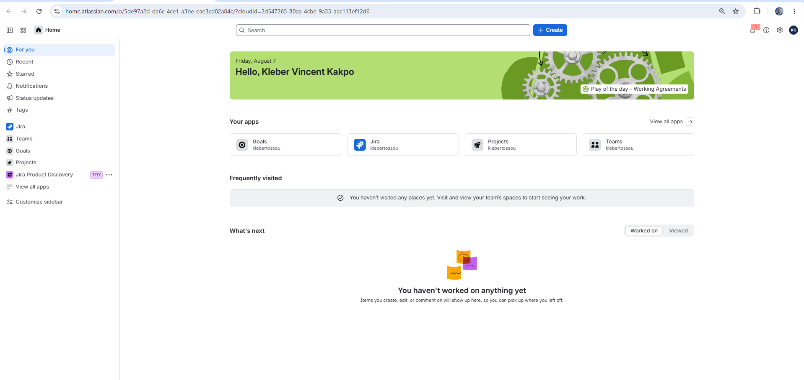
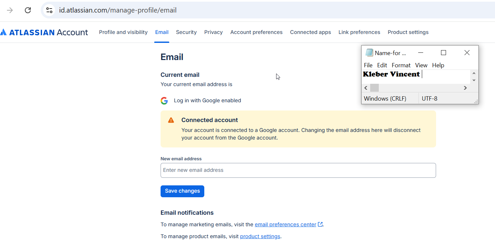
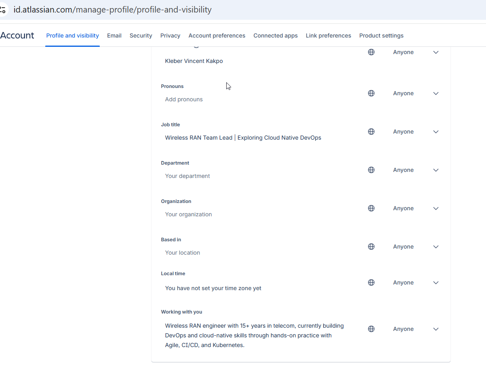
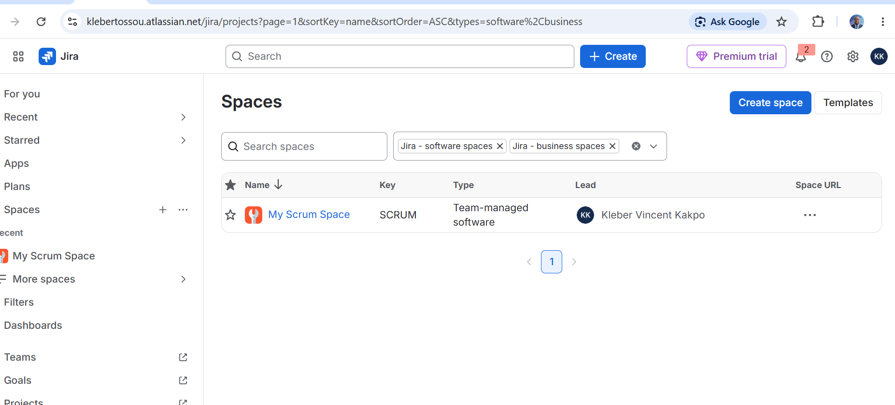
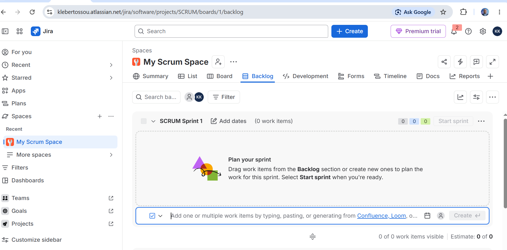

# Assignment 1 — Create Your Jira Account & Setup Profile

Part of the DevOps Micro Internship (DMI) Cohort 3 with Agentic AI

---

## Purpose

In this assignment, I created or accessed a Jira Software Cloud account, verified my Atlassian identity, set up a professional profile, and explored the Jira dashboard and project areas. This prepares me for real-world Agile and DevOps collaboration, where Jira is commonly used to plan work, assign tickets, and track progress. I explored the workspace only and did not create any issues in this assignment.

---

# Task 1 — Sign Up for Jira Software Cloud

## Goal

Create or access your Jira Cloud account and reach the Jira Software workspace successfully.

I attempted to recover an existing Atlassian account from a previous cohort rather than starting fresh, using the login page at id.atlassian.com/login. The account and site (klebertossou.atlassian.net) were still active, so I logged in directly rather than needing a password reset. After selecting the Scrum template for my first space, I landed on the main workspace showing "Hello, Kleber Vincent Kakpo" with my full name clearly displayed, confirming successful access.

### Evidence

#### Screenshot 1 — Jira welcome page, dashboard, or main workspace after successful login, with your name or avatar visible

---

# Task 2 — Verify Your Atlassian Account

## Goal

Confirm your email address if Atlassian requests verification.

Since I was uncertain whether the original account (created during Cohort 2) used Google sign-in or email/password, I checked Account settings → Email, which confirmed "Log in with Google enabled" and that the account is connected to a Google account. This means Google handled identity verification at signup, so no separate Atlassian email verification step was required. I initially checked the "Connected apps" tab expecting to find this confirmation there, but that tab only tracks third-party marketplace app permissions, not the account's login method; the correct location was the "Email" tab.

### Evidence

#### Screenshot 2 (if applicable) — Confirmation screen after email verification, or the inbox showing the Atlassian verification email subject

---

### Notes

> I signed up using Google, and Atlassian did not require separate email verification.

---

# Task 3 — Set Up Your Professional Jira Profile

## Goal

Update your Jira profile with your full name, a job title or role (e.g. "Aspiring DevOps Engineer"), and a short professional bio.

I navigated to Account settings → Profile and visibility, updated the Full name to "Kleber Vincent Kakpo," set the Job title to "Wireless RAN Team Lead | Exploring Cloud Native DevOps," and used the "Working with you" field as the bio, since this version of the Atlassian profile interface does not have a separate dedicated bio box. I added: "Wireless RAN engineer with 15+ years in telecom, currently building DevOps and cloud-native skills through hands-on practice with Agile, CI/CD, and Kubernetes."

### Evidence

#### Screenshot 3 — Updated profile page showing your full name, role/title, and bio

---

# Task 4 — Explore the Jira Dashboard and Projects

## Goal

Locate the project list and open a project's Board or Backlog, and view Project settings, without creating, editing, or deleting any issues.

This Jira interface uses "Spaces" instead of "Projects" as its terminology, so navigation was adjusted accordingly, though the underlying structure and purpose match the assignment brief exactly. I navigated to Spaces from the top menu, confirmed "My Scrum Space" was listed with my full name as Lead, then opened the space and viewed the Backlog tab, which showed "SCRUM Sprint 1" with zero work items, as expected since no issues were created. Finally, I opened Space settings via the "..." menu and browsed through Details, Access, Notifications, Automation, Fields, Work types, and Features without modifying anything.

### Evidence

#### Screenshot 4 — "View all projects" page showing at least one project

---

#### Screenshot 5 — Opened project showing either the Board or Backlog screen

---

## Completion Checklist

- [x] Task 1: Jira Software Cloud account created or existing account accessed (Screenshot 1)
- [x] Task 2: Email verification completed, or a Google sign-in note included (Screenshot 2 or Notes)
- [x] Task 3: Professional profile updated with full name, role/title, and bio (Screenshot 3)
- [x] Task 4: Projects page, Board or Backlog, and Project settings explored without making changes (Screenshots 4 & 5)
- [x] No Jira issues created
- [x] Full Name visible in required screenshots
- [x] No sensitive data exposed

---

## 📌 About DMI & CloudAdvisory

DevOps Micro Internship (DMI) is a project-based DevOps program run by Pravin Mishra (The CloudAdvisory) focused on real-world execution, systems thinking, and career readiness.

It helps learners build strong DevOps foundations with hands-on experience.

---

## 📌 Resources

- 🌐 DMI Official Website: https://dmi.pravinmishra.com?utm_source=github&utm_medium=readme  
- 🎓 University: https://university.pravinmishra.com?utm_source=github&utm_medium=readme  
- 💬 Discord Community: https://discord.pravinmishra.com?utm_source=github&utm_medium=readme  
- 📝 Blog: https://dmi.pravinmishra.com/blog?utm_source=github&utm_medium=readme  
- ▶️ YouTube Playlist: https://www.youtube.com/playlist?list=PLFeSNDtI4Cho  
- 🔗 Pravin Mishra (LinkedIn): https://www.linkedin.com/in/pravin-mishra-aws-trainer/  
- 🏢 CloudAdvisory (LinkedIn): https://www.linkedin.com/company/thecloudadvisory/

---

*This submission is part of DevOps Micro Internship (DMI) Cohort 3 — Agentic AI Track.*