# Assignment 2 — Stand Up Scrum in Jira for the DevOps Micro-Internship Website

Part of the DevOps Micro Internship (DMI) Cohort 3 with Agentic AI

---

## Purpose

In this assignment, I configured a private, team-managed Scrum Space in Jira Cloud for a DevOps Micro-Internship Website improvement and deployment initiative. I built the complete work hierarchy and delivery workflow: Space → Epic → Stories → Sub-tasks → Labels → Sprint → Filters → Reports, the same structure a Product Owner or Scrum Master would stand up before a real team starts executing.

---

# Task 1 — Create the Jira Space (Team-Managed Scrum)

## Goal

Create a private, team-managed Scrum Space named `DevOps Micro-Internship Website – <YourName>`.

A **Space** (what earlier Jira versions and some documentation still call a "Project") is the main workspace where all Epics, Stories, Sprints, and Reports for an initiative live together. Everything in this assignment happens inside one Space.

**Steps taken:**

* Went to Spaces → **Create space**
* Selected the **Scrum** template, then clicked **"Use template"**
* Set project type to **Team-managed**
* Set the Space name to `DevOps Micro-Internship Website – Kleber Vincent Kakpo`
* Accepted the auto-generated key, `DMIWKVK`
* Set Access to **Private**
* Skipped the "Bring your team along" prompt
* Confirmed the Space opened successfully

The **Scrum template** comes pre-configured with Backlog, Sprints, Story Points, and Epics enabled by default, the core features needed for iterative, time-boxed delivery. Jira offers two project management styles: **Team-managed**, which I chose, and **Company-managed**. Team-managed Spaces can be fully configured by the Space's own members, workflows, fields, and permissions are all self-service, no Jira administrator required. Company-managed projects, by contrast, share configuration across an entire organization and typically need an admin to change workflows or fields, appropriate for large enterprises standardizing many teams at once, but unnecessary overhead for a small, self-directed project like this one. Setting Access to **Private** means only people I explicitly invite can view or work in the Space, standard practice for a Space that isn't ready for wider visibility yet.

Once creation finished, Jira landed me directly on the Backlog view, empty as expected, with the Space name "DevOps Micro-Internship Website – Kleber Vincent Kakpo" and key "DMIWKVK" both visible in the header and browser URL. That confirmed the Space existed and was ready for the next step.

### Evidence

#### Screenshot 1 — Space confirmation or Space sidebar showing the Space name and key

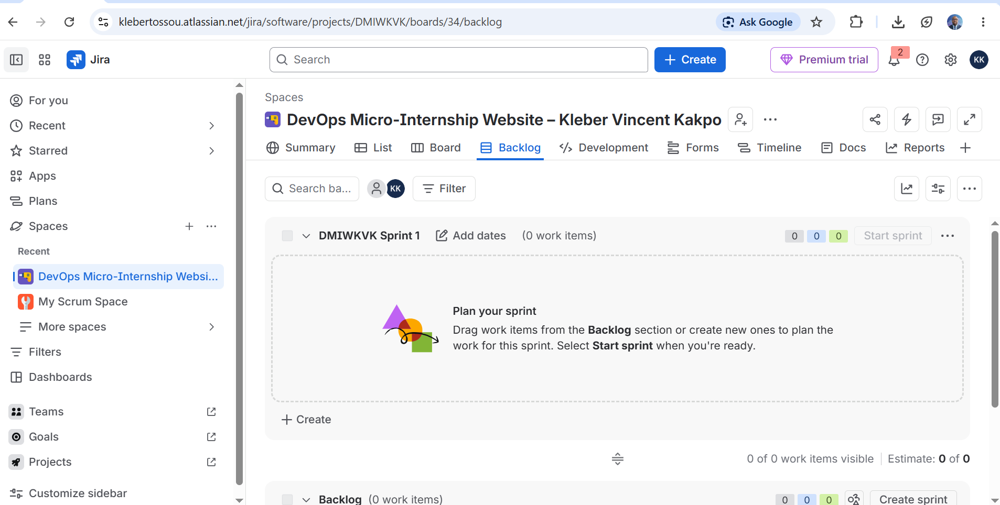

---

# Task 2 — Create Your First Epic from the Backlog

## Goal

Create the Epic `Polish DMI Website UI & Deploy` to group the website UI and deployment work.

The **Backlog** is a prioritized list of all the work planned for a Space; items sit here until they're deliberately scheduled into a Sprint. An **Epic** is a large piece of work or major goal that usually can't be finished in a single Sprint, it gets broken down into smaller Stories, each representing one specific piece of the larger deliverable.

**Steps taken:**

* Opened the **Backlog** tab inside the new Space
* Opened **View settings** (gear icon, top right of the Backlog) and toggled on the **Epic panel**, since it is hidden by default in Team-managed Spaces
* Clicked **Create Epic** inside the now-visible Epic panel
* Typed the Epic name exactly as required: `Polish DMI Website UI & Deploy`
* Pressed Enter to save

The **Epic panel** is a dedicated section docked to the left of the Backlog view that lists every Epic in the Space separately from individual Stories. It exists so large deliverables can be tracked and reported on at a higher level than a single ticket, useful for a Product Owner who cares about "is the website polish shipping" without needing to read every underlying Story.

After pressing Enter, "Polish DMI Website UI & Deploy" appeared immediately in the Epic panel with a purple color swatch next to it (Jira auto-assigns Epics a color for quick visual scanning on the board later). This confirmed the Epic was created and ready to act as the parent for the six Stories in Task 3.

### Evidence

#### Screenshot 2 — Backlog showing the Epic panel enabled and the Epic visible

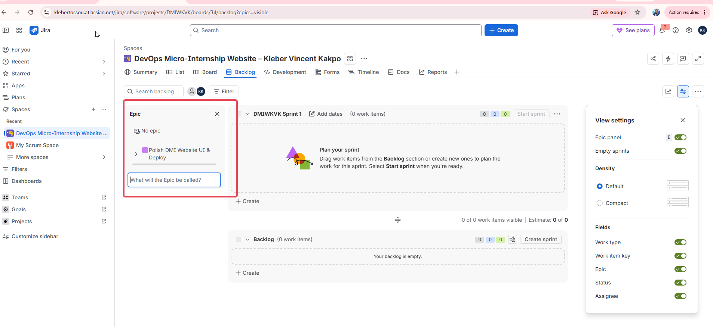

---

# Task 3 — Seed the Product Backlog with Six Stories

## Goal

Create all six required Stories (S1–S6) under the Epic, assign every Story to myself, and add the required description, Fibonacci story point estimate, and label. Enter the Gherkin acceptance criteria directly below the Story description in the same description box.

A **Story** represents one specific, user-facing piece of work needed to complete an Epic. Six Stories together are what actually turn the vague goal "polish the website" into concrete, assignable, estimable units of work a team can plan a sprint around.

**Steps taken (repeated for each of the six Stories):**

* In the Backlog, selected **Create**, set the work item type to **Story**
* Typed the title exactly as specified (e.g. "Update site header text")
* Opened the created Story and set the **Parent** field to `Polish DMI Website UI & Deploy`
* Set **Assignee** to myself
* Added the **Description**, then the **Gherkin acceptance criteria** directly underneath it in the same description box
* Set the **Story point estimate** using the Fibonacci value specified
* Added the required **Label**

The **Parent** field is what actually builds the Epic → Story hierarchy, without it, a Story exists as a standalone ticket and the Epic panel shows no rollup or child count from it. Setting **Assignee to myself** reflects real ownership, in a live team every Story needs one clear person accountable for delivering it, even in a solo project like this one.

For estimation, I used **Story Points** on the **Fibonacci scale** (1, 2, 3, this assignment intentionally stays within that range). Story points measure relative effort and complexity, not literal hours, using Fibonacci numbers instead of a linear 1–10 scale is a deliberate Agile practice: it forces clear distinctions between "small," "medium," and "larger" work rather than getting lost in false precision (arguing whether something is a 4 or a 5 wastes time a team doesn't have).

**Gherkin acceptance criteria** (Given/When/Then statements) are a structured format for writing measurable, testable conditions that define when a Story is genuinely "done." Writing "Given I open the homepage, when the page loads, then the header shows exactly X" removes ambiguity that a vaguer note like "update the header" would leave open to interpretation.

I also applied a **Label** to each Story, a free-text tagging field completely independent of the Epic hierarchy. Labels group work by *discipline* (frontend vs devops) while the Epic groups work by *outcome* ("Polish DMI Website UI & Deploy"), giving the backlog two separate, useful axes of organization. This sets up the filtering demonstrated later in Task 7.

The six Stories created, with their point values and labels:

| Story | Title | Points | Label |
|---|---|---|---|
| S1 | Update site header text | 2 | frontend |
| S2 | Primary button color refresh | 2 | frontend |
| S3 | Improve hero subtitle copy | 1 | frontend |
| S4 | Footer with version and date | 2 | devops |
| S5 | Add Contact / About section | 2 | frontend |
| S6 | Add Join DMI call-to-action | 1 | frontend |

S4 was deliberately labeled **devops** rather than frontend, since footer text tied to a version number and deploy date is release/infrastructure-adjacent work, while S1, S2, S3, S5, and S6 are all direct UI or content changes. This is a realistic reflection of how even a small website initiative still spans more than one discipline.

**Verification issue encountered:** After creating all six Stories, the Backlog's "Backlog" section header read "3 of 4 work items visible" instead of showing all remaining Stories. This turned out to be caused by an active filter left on from earlier testing, not a missing Story. Clicking **Clear filters** immediately revealed the full set of six Stories, confirming nothing had actually been lost.

I also caught and corrected two smaller mistakes while working through this task: S2 was initially saved with 1 story point instead of the required 2 (fixed by reopening the Story and correcting the Story point estimate field), and several Stories were auto-placed into "Sprint 1" instead of the general Backlog section when first created, requiring a manual drag back into Backlog to keep Task 3's evidence clean before Task 6 deliberately moves specific Stories into the sprint.

### Evidence

#### Screenshot 3 — Backlog showing the Epic and all six Stories under it

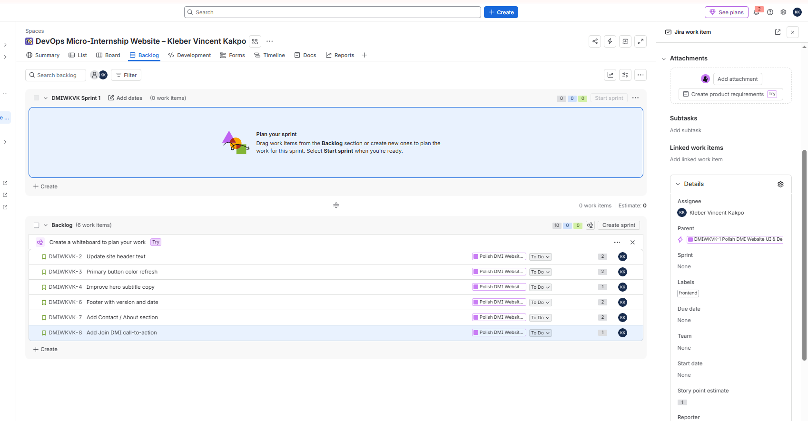

---

#### Screenshot 4 — One opened Story showing its Story point estimate, acceptance criteria, and label

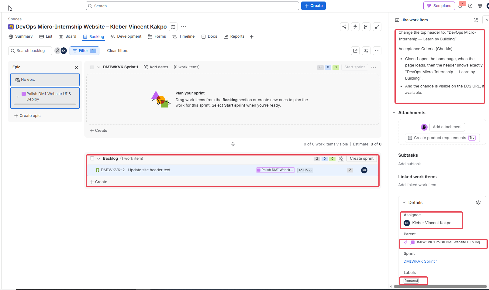

---

# Task 4 — Add Sub-tasks to at Least Two Stories

## Goal

Break down S2 (Primary button color refresh) and S4 (Footer with version and date) into the four required execution Sub-tasks each: Edit HTML/CSS, Test locally, Deploy to EC2, Verify and screenshot.

A **Sub-task** lives underneath a Story, representing one discrete execution step rather than the whole deliverable. A Story defines *what* needs to be true when the work is done, via its acceptance criteria; Sub-tasks define *how* the team actually gets there, step by step.

**Steps taken (repeated for S2, then S4):**

* Opened the Story
* Used the **"+"** icon under the Story title to add a child work item
* Created each of the four required Sub-tasks in order:
  1. Edit HTML/CSS — make the change
  2. Test locally — perform a browser check
  3. Deploy to EC2 — copy or upload the change
  4. Verify and screenshot — capture the EC2 URL

This four-step pattern (Edit → Test locally → Deploy → Verify) mirrors a realistic, minimal software delivery pipeline: make the change, confirm it works before shipping it, deploy it to the live environment, then confirm it actually landed correctly in production. Applying the identical four-step pattern to both S2 and S4 demonstrates consistency, a real team would likely template this exact breakdown across every similar frontend or deployment Story rather than reinventing the Sub-task structure from scratch each time.

Every Story, Sub-task, and other work item in Jira moves through a **workflow**, a defined sequence of statuses. By default, Team-managed Scrum Spaces use a simple three-status workflow: **To Do** (not started), **In Progress** (actively being worked on), and **Done** (finished). This same workflow applies uniformly to Stories and Sub-tasks alike, which is what allows a Sub-task's status to roll up into a visual sense of how far along its parent Story is.

After creating all four Sub-tasks under S2, the Story's Subtasks panel showed "0% Done" with all four sitting in **To Do** status, confirming they were correctly nested as children rather than sitting as standalone top-level items. I repeated the identical process for S4 and confirmed the same result, four Sub-tasks, all To Do, correctly nested, with S4's Labels field still showing **devops** in the side panel as a bonus re-confirmation from Task 3.

### Evidence

#### Screenshot 5 — S2 showing all four Sub-tasks

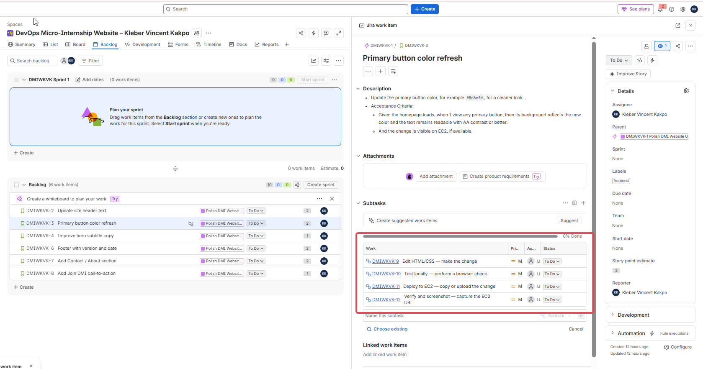

---

#### Screenshot 6 — S4 showing all four Sub-tasks

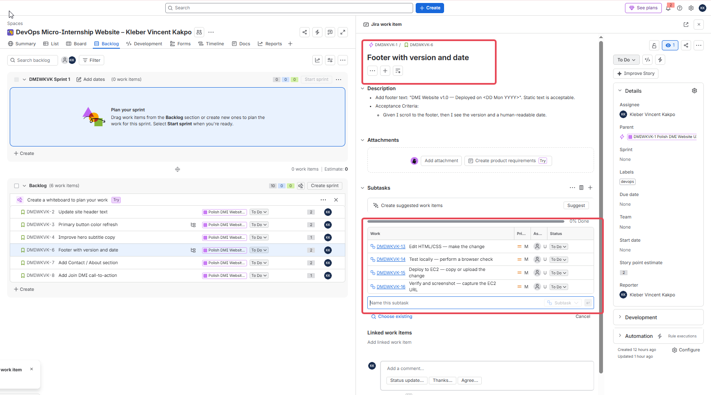

---

# Task 5 — Tag Stories by Workstream

## Goal

Apply the `frontend` label to S1, S2, S3, S5, and S6, and the `devops` label to S4, so every Story has at least one label.

**Steps taken:**

* Confirmed each of the six Stories already carried the correct label, since labels were applied at creation time during Task 3, rather than being added as a separate pass
* Opened two Stories side by side (S1 and S4) to visually confirm both label values in one piece of evidence

Labels give the Backlog a second axis of organization independent of the Epic: the Epic groups work by **outcome** ("Polish DMI Website UI & Deploy"), while labels group work by **discipline** ("frontend" vs "devops"). In practice, this is exactly what a frontend lead would filter by during a standup to see only UI-related tickets, or what a DevOps engineer would filter by before a deployment window to check infrastructure-related work, without needing to open every single ticket to find out what type of work it is.

The side-by-side screenshot confirmed S1 ("Update site header text") correctly tagged **frontend**, and S4 ("Footer with version and date") correctly tagged **devops**, the only Story in the set carrying that label.

### Evidence

#### Screenshot 7 — Backlog or Story details showing labels applied to at least two visible Stories

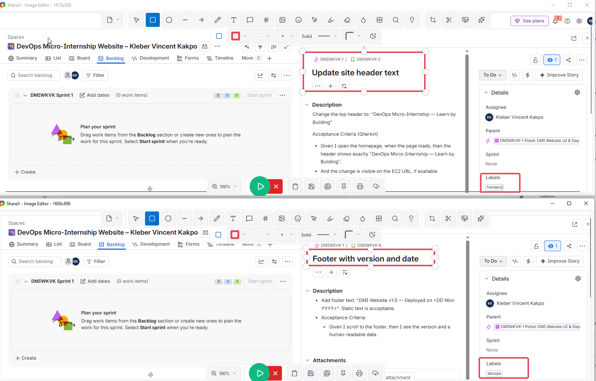

---

# Task 6 — Create and Start Sprint 1

## Goal

Create a one-week Sprint, move two or three Stories into it (approximately 3–5 Story Points), set the required Sprint Goal, and start the Sprint.

A **Sprint** is a fixed, time-boxed period, one week in this case, during which a team commits to completing a specific, bounded set of work. It is the mechanism that turns an open-ended Backlog into a concrete, deliverable plan.

**Steps taken:**

* In the Backlog, dragged **S1** (2 points) and **S2** (2 points) from the general Backlog section up into the "DMIWKVK Sprint 1" section, for a total of **4 Story Points**
* Opened the sprint's edit dialog and set the duration to **one week**
* Set the **Sprint Goal** to the exact required text: *"Ship visible DMI Website UI polish (header, color, footer/CTA) to EC2 with screenshots."*
* Took a screenshot of the sprint in this pre-start state, showing the selected Stories, their points, and the Sprint Goal text
* Clicked **Start sprint**

A scope of **4 points** (within the target 3–5 range) was chosen deliberately rather than pulling every Story into the sprint at once. This mirrors real sprint planning: teams commit to what they can actually finish within the sprint window, not everything that's theoretically ready, since overcommitting leads to unfinished work carrying over and eroding trust in future sprint estimates. The **Sprint Goal** itself is a single, plain-language sentence describing the outcome the sprint is meant to achieve, independent of the specific ticket list. This distinction matters: a team could drop or swap a lower-priority Story mid-sprint without "failing," as long as the overall goal of shipping visible UI polish to EC2 is still met.

After clicking Start sprint, Jira switched to the **Board** view. Where the **Backlog** is a flat, prioritized list of all work across every status, the **Board** shows only the Stories and Sub-tasks currently inside the active Sprint, arranged into columns by workflow status (To Do, In Progress, Done), giving a real-time visual snapshot of exactly what's happening during the sprint. On the Board, S1 and S2 appeared in the **To Do** column, and the "Complete sprint" button appeared in place of "Start sprint," confirming the Sprint was now active.

I noticed the Sprint Goal text did not render on the Board view itself, only on the Backlog view, an interface quirk of this particular Jira version rather than a missing configuration, so I captured the goal confirmation from the Backlog view instead, which also showed the sprint's date range (12 Aug – 19 Aug) alongside the goal text and the "Complete sprint" button, together proving the sprint was both correctly scoped and actively running.

### Evidence

#### Screenshot 8 — Sprint 1 before starting, showing the selected Stories and Story Points

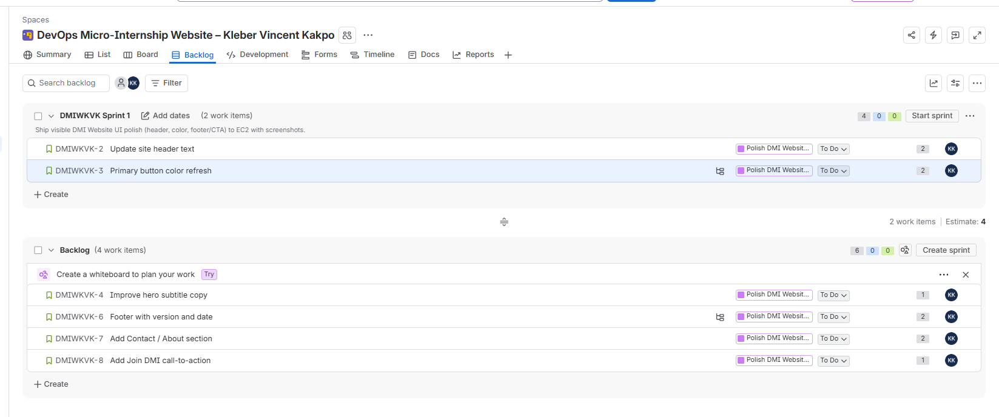

---

#### Screenshot 9 — Active Sprint board showing the started Sprint and Sprint Goal

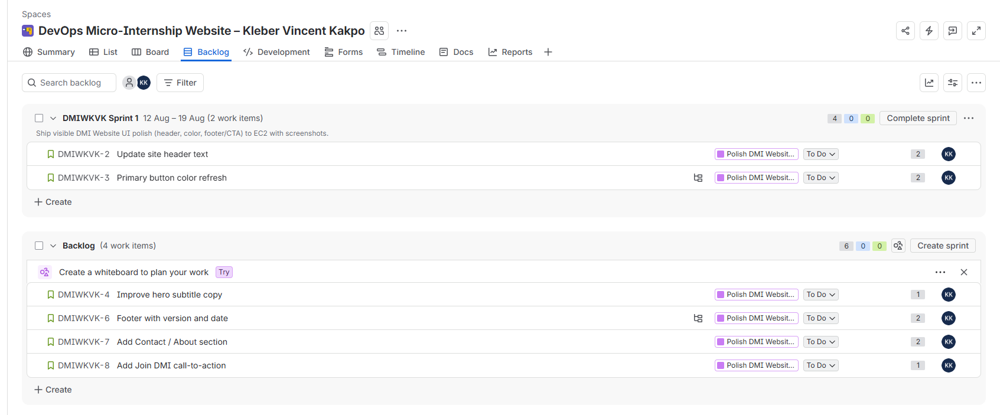

---

# Task 7 — Filter Stories, Sub-tasks, and Status

## Goal

Filter Jira work by the `frontend` and `devops` labels and review Stories with Sub-tasks and their current statuses.

**Steps taken:**

* On the **Backlog** view (not Board, since Board only ever displays the active sprint's scope and wouldn't show the full six-Story set needed to demonstrate filtering properly), clicked **Filter**
* Selected **Labels → frontend**
* Captured the filtered results
* Changed the filter selection to **devops**
* Captured the filtered results again
* Opened S2 and S4 to review their Sub-task statuses

A **filter** in Jira temporarily narrows down which work items are *displayed* on screen, based on a condition like label, assignee, or status. It never deletes, hides permanently, or modifies the underlying tickets, it's purely a view-layer control, meaning it's completely safe to apply and remove repeatedly without any risk to the data itself.

Filtering by **frontend** correctly narrowed the visible work down to exactly five items: S1 and S2 (still inside Sprint 1) plus S3, S5, and S6 (still in Backlog), while S4 disappeared from view entirely, without being deleted or modified in any way. Switching the filter to **devops** inverted this result precisely: S4 appeared alone (Sprint 1's section showed "0 of 2 work items visible" since neither S1 nor S2 carry that label), confirming the filter mechanism correctly toggles between workstreams on demand.

This exercise proves the labels applied back in Task 5 are functionally useful, not just decorative tags sitting unused on each ticket, exactly how a lead filters by workstream during a standup, or a Scrum Master filters by status when checking sprint health. Reviewing S2 and S4's Sub-tasks confirmed all eight (four per Story) remained in **To Do** status, expected at this early stage since no actual development work had started yet.

### Evidence

#### Screenshot 10 — Filter for label = frontend showing the filtered results

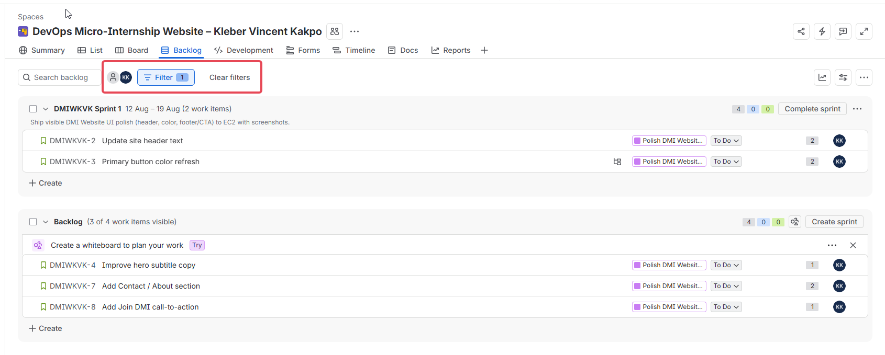

---

#### Screenshot 11 — Filter for label = devops showing the filtered results

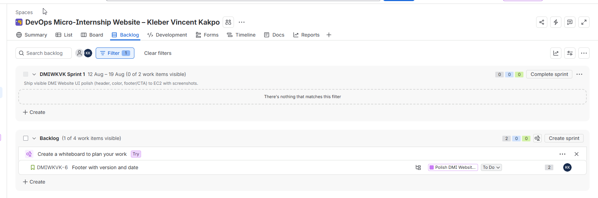

---

# Task 8 — Open the Burndown Report

## Goal

Locate the Burndown Chart for Sprint 1 so it is ready for later progress tracking. It is acceptable if the chart has little or no data since the Sprint has just started.

A **Burndown Chart** plots remaining Sprint work, measured in Story Points, against time. The "remaining work" line starts at the sprint's full point total and, in a healthy sprint, steadily drops toward zero as Stories move to Done. A second **guideline** line shows the *ideal* burn rate, a straight diagonal from full scope to zero, so the two lines can be compared at a glance to spot whether a sprint is on track, ahead, or falling behind.

**Steps taken:**

* Opened **Reports** in the Space navigation
* Selected **Sprint burndown chart**
* Confirmed **DMIWKVK Sprint 1** was selected in the Sprint dropdown, with **Story points** as the Estimation field

The chart rendered correctly, showing the sprint's date range (August 12–19, 2026), the Sprint Goal text repeated at the top for context, and a guideline line sloping from 4 story points on Day 1 down to 0 by the sprint's end date. Since the sprint had only just started and no Stories had moved to Done yet, the "Remaining work" line sat flat at the full 4-point total, exactly the expected state this early on. The chart being present and correctly scoped, not the data inside it, was what this task actually required.

### Evidence

#### Screenshot 12 — Burndown Chart page opened for Sprint 1

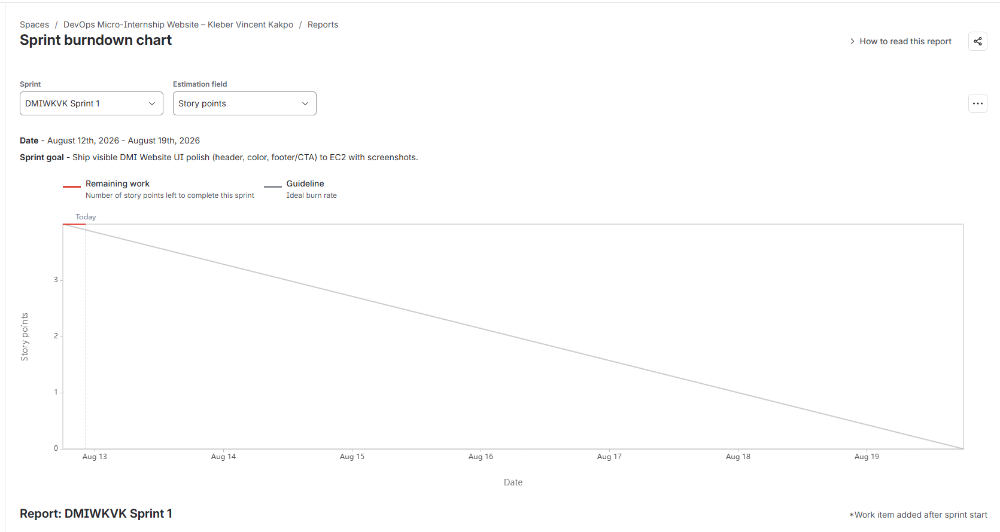

---

# Submission Instructions

- Add all 12 required screenshots in the specified order
- Full name must be visible in required screenshots
- Do not expose passwords, verification codes, private email content, account recovery details, or other sensitive information

---

# Completion Checklist

- [x] Task 1: Private team-managed Scrum Space created with your name (Screenshot 1)
- [x] Task 2: Epic "Polish DMI Website UI & Deploy" created (Screenshot 2)
- [x] Task 3: All six Stories connected to the Epic, assigned to you, with descriptions/acceptance criteria/points/labels (Screenshots 3 & 4)
- [x] Task 4: Four Sub-tasks created under both S2 and S4 (Screenshots 5 & 6)
- [x] Task 5: Frontend and devops labels applied to all Stories (Screenshot 7)
- [x] Task 6: One-week Sprint 1 started with the required Sprint Goal (Screenshots 8 & 9)
- [x] Task 7: Frontend and devops filters demonstrated (Screenshots 10 & 11)
- [x] Task 8: Burndown Chart opened for Sprint 1 (Screenshot 12)
- [x] Full Name visible in required screenshots
- [x] No sensitive data exposed

---

## 📌 About DMI & CloudAdvisory

DevOps Micro Internship (DMI) is a project-based DevOps program run by Pravin Mishra (The CloudAdvisory) focused on real-world execution, systems thinking, and career readiness.

It helps learners build strong DevOps foundations with hands-on experience.

---

## 📌 Resources

- 🌐 DMI Official Website: https://dmi.pravinmishra.com?utm_source=github&utm_medium=readme  
- 🎓 University: https://university.pravinmishra.com?utm_source=github&utm_medium=readme  
- 💬 Discord Community: https://discord.pravinmishra.com?utm_source=github&utm_medium=readme  
- 📝 Blog: https://dmi.pravinmishra.com/blog?utm_source=github&utm_medium=readme  
- ▶️ YouTube Playlist: https://www.youtube.com/playlist?list=PLFeSNDtI4Cho  
- 🔗 Pravin Mishra (LinkedIn): https://www.linkedin.com/in/pravin-mishra-aws-trainer/  
- 🏢 CloudAdvisory (LinkedIn): https://www.linkedin.com/company/thecloudadvisory/

---

*This submission is part of DevOps Micro Internship (DMI) Cohort 3 — Agentic AI Track.*