# Assignment 3 — Run a 5-Day Mini-Sprint in Jira and Ship an Increment

Part of the DevOps Micro Internship (DMI) Cohort 3 with Agentic AI

---

## Purpose

In this hands-on learning practice, I ran a five-day mini-Sprint in Jira and shipped a small but real footer improvement to my portfolio website running on EC2. I tracked the work from Sprint Goal and Story through daily Sub-tasks, Daily Scrum comments, Git commits, repeated deployments, verification, a retrospective, the Burndown Chart, and a LinkedIn delivery story.

Space: **Pravin Mishra Portfolio Website – Kleber Vincent Kakpo** (key `PMPWKVK`). Note: this cohort's Jira interface uses "Spaces" instead of "Projects," and "Space settings" instead of "Project settings," so that's the terminology used throughout this document.

Local repo: `~/Documents/DMI3/projects/Pravin-Mishra-Portfolio-Template`, working on branch `feature/footer-v1`. Deployment target: an EC2 instance running Nginx, serving the site from a custom site root at `/var/www/portfolio` (not the default `/var/www/html`), via a custom Nginx site config named `portfolio`.

---

# Task 1 — Set Up and Start Sprint 1

## Goal

Create the footer Story (`Add footer with version and deploy date`, 1 point, `frontend` label) with its five required Sub-tasks (Day 1–Day 5), move it into Sprint 1, set the required Sprint Goal, and start the Sprint.

A **Story** is a single unit of user-facing work, in this case the footer feature itself, estimated at 1 story point and labeled `frontend`. A **Sub-task** is a smaller slice of that Story broken out by day, so progress can be tracked and demoed incrementally rather than all at once at the end.

**Steps taken:**

- Created the Story with the description and acceptance criteria written in Gherkin format (Given/When/Then), specifying the exact footer text and confirming visibility on the live public EC2 URL
- Set the Story's Story point estimate to 1 and applied the `frontend` label
- Broke the Story into 5 Sub-tasks, one per day: Day 1 — Implement footer & deploy, Day 2 — Make deploy date dynamic, Day 3 — Polish & accessibility, Day 4 — Change the Homepage Tagline / Call-to-Action, Day 5 — Demo + retro + burndown
- Created Sprint 1 with a 5-day duration (13–18 Aug)
- Set the Sprint Goal to the exact required text: *"Ship a visible Pravin Mishra Portfolio footer (version + deploy date + author) to EC2 and document progress daily in Jira."*
- Took a screenshot of the sprint in this pre-start state, showing the Story, its Sub-tasks, and the Sprint Goal text
- Clicked **Start sprint**

A **Sprint Goal** matters because it gives the whole sprint a single sentence to be measured against, rather than just a pile of tasks. Once started, the Board moved from the Backlog view into an active Kanban-style Board with To Do / In Progress / In Review / Done columns, and the Story with its 5 Sub-tasks (0/5 complete at the start) appeared sitting in To Do, ready for Day 1.

### Evidence

#### Screenshot 1 — Sprint 1 created with the Story inside it

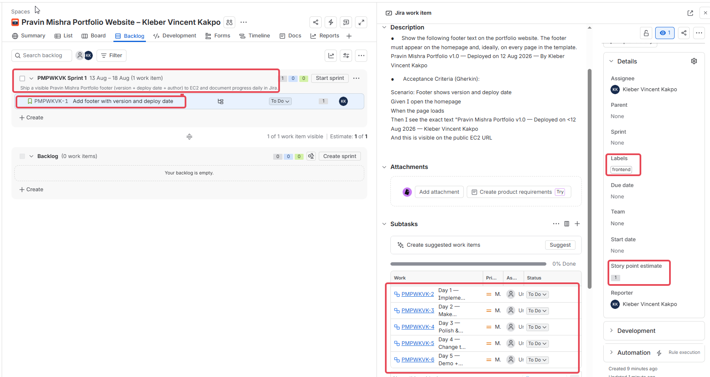

---

#### Screenshot 2 — Active Sprint board showing the Sprint Goal

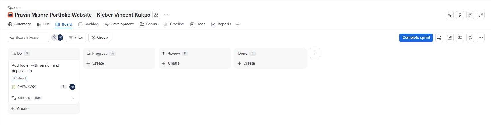

---

# Task 2 — Day 1: Implement the Footer, Commit, and Deploy

## Goal

Add the required footer text (`Pravin Mishra Portfolio v1.0 — Deployed on <DD Mon YYYY> — By Kleber Vincent Kakpo`) to the site on the `feature/footer-v1` branch, commit it, and deploy it to the public EC2 URL.

**Steps taken:**

- Implemented the footer directly in `index.html`, adding the required text into a new `<footer class="footer">` section
- Committed the change:

```bash
git add .
git commit -m "feat(footer): add version, deploy date, and author"
```

- `git add .` stages every changed file in the working directory so it's ready to be committed.
- `git commit -m "feat(footer): add version, deploy date, and author"` records the staged changes as a single commit with a Conventional-Commits-style message describing what changed and why.

- Deployed the updated file to the EC2 instance and confirmed the footer text was visible on the live public URL, exactly as written in the acceptance criteria
- Marked the Day 1 Sub-task (PMPWKVK-2) as Done

One important habit I locked in on Day 1: Daily Scrum comments (the short "yesterday / today / blockers" update that's standard in Scrum) need to be posted on the **parent Story** (PMPWKVK-1), not on the individual Sub-task. The Sub-task is really just a checklist item, while the Story is where the running narrative of the whole sprint lives. Getting this right on Day 1 meant every later day's comment landed in the same place, so the full week reads as one continuous log.

### Evidence

#### Screenshot 3 — Jira board showing the Day 1 Sub-task in Done

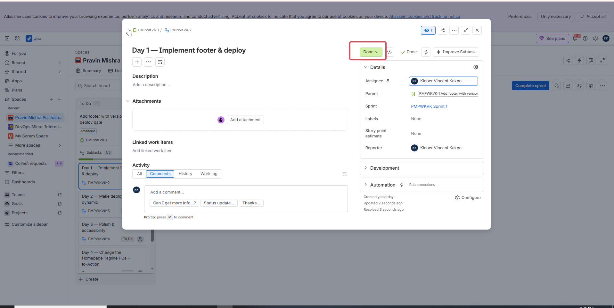

---

#### Screenshot 4 — Successful Git commit output

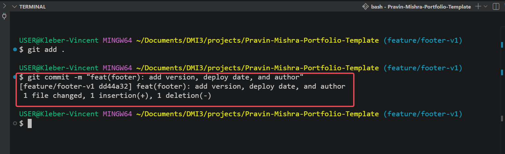

---

#### Screenshot 5 — EC2 browser view showing the complete footer text, with the URL visible

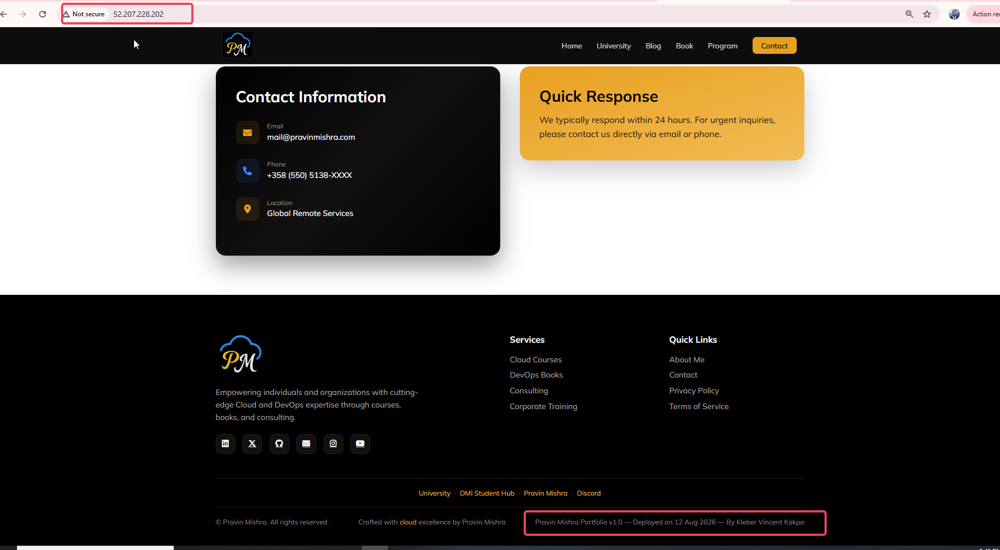

---

#### Screenshot 6 — Jira Story comment showing the Day 1 Daily Scrum update

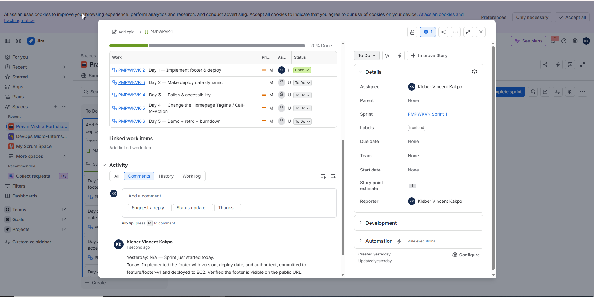

---

# Task 3 — Day 2: Make the Deploy Date Dynamic and Document It

## Goal

Update the footer so the deployment date is generated automatically, document the approach in `README.md`, commit, and redeploy.

**Steps taken:**

- Added a `<span id="deployDate"></span>` placeholder in the footer, paired with an inline `<script>` using JavaScript's `new Date()` and `.toLocaleDateString()`:

```html
<span id="deployDate"></span>
...
<script>
  const options = { day: '2-digit', month: 'short', year: 'numeric' };
  document.getElementById('deployDate').textContent = new Date().toLocaleDateString('en-GB', options).replace(',', '');
</script>
```

- `<span id="deployDate"></span>` is the empty placeholder the script writes the date into.
- `new Date()` grabs the current date and time at the moment the page loads.
- `.toLocaleDateString('en-GB', options)` formats that date as day-month-year (e.g. "13 Aug 2026") instead of the default US format.
- `.replace(',', '')` strips the stray comma the locale formatter adds, so the date reads cleanly.
- `document.getElementById('deployDate').textContent = ...` writes the formatted date into the placeholder span.

- Tested locally by opening `index.html` directly in the browser and confirming the date rendered correctly
- Documented the approach in `README.md` under a new **"## Footer & Deploy Date"** section
- Committed the change:

```bash
git commit -m "feat(footer): generate deploy date automatically"
```

- `git commit -m "feat(footer): generate deploy date automatically"` records this change with a message that makes the "why" clear from the Git log alone.

When I redeployed, the footer on the live site didn't update at first. I ran `cat /etc/nginx/sites-enabled/portfolio` on the EC2 instance to check the actual Nginx site configuration, and confirmed the site was serving from `/var/www/portfolio`, not the default `/var/www/html` I'd assumed. Once I copied the updated files to the correct path, the dynamic date showed up correctly. Sub-task PMPWKVK-3 (Day 2) moved to Done, and the Daily Scrum comment was posted correctly on the Story.

### Evidence

#### Screenshot 7 — Code editor showing the footer and date logic

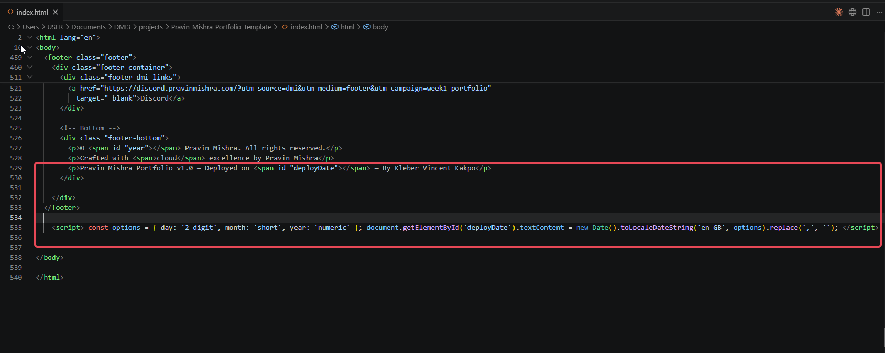

---

#### Screenshot 8 — EC2 browser view showing the updated footer with the current date

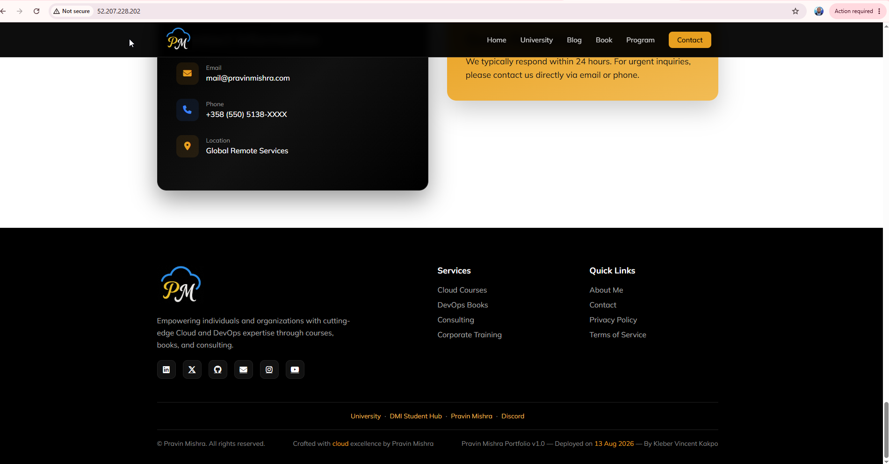

---

#### Screenshot 9 — README snippet documenting the footer and date behavior

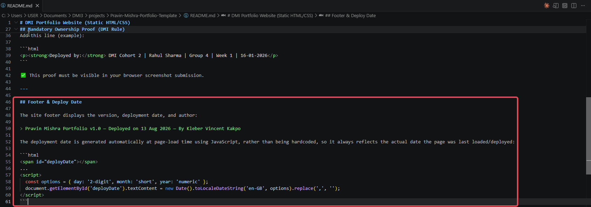

---

#### Screenshot 10 — Jira Story comment showing the Day 2 Daily Scrum update

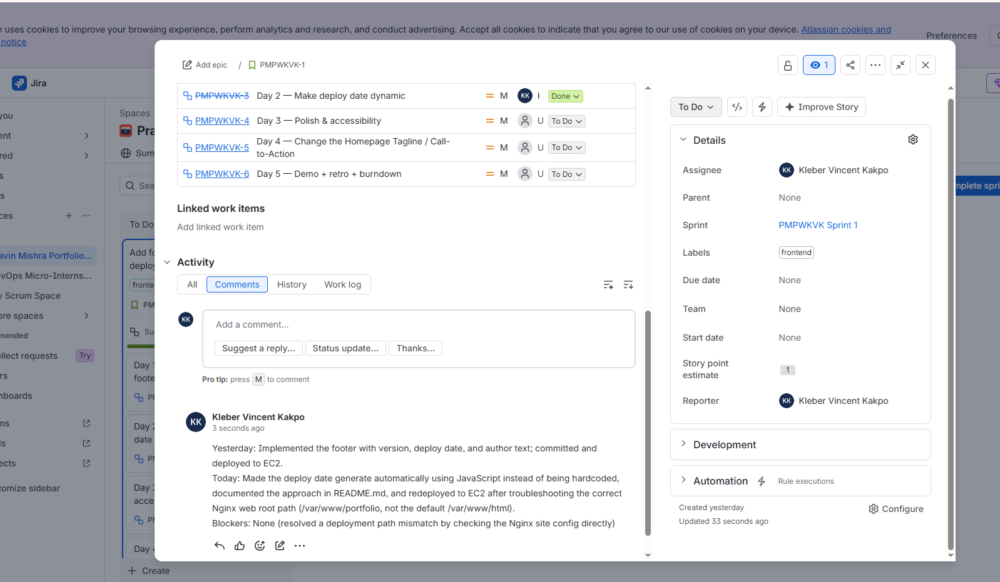

---

# Task 4 — Day 3: Polish the Footer and Validate Accessibility

## Goal

Improve the footer's spacing, contrast, and readability, then validate it at both desktop and mobile viewport widths.

**Steps taken:**

- Ran a contrast check on the footer text and found a real WCAG AA failure: the text was a light gray (`#888`) on a black background, roughly 3.5:1 contrast, below the 4.5:1 minimum required for normal-size text
- Changed the text color to `#ccc`, bringing the ratio up to roughly 12:1
- Added extra line-height and padding so the footer text wraps cleanly and doesn't feel cramped
- Verified the fix at normal desktop width, and using Chrome DevTools' mobile responsive mode set to a 375–400px viewport
- Committed the change:

```bash
git commit -m "style(footer): improve spacing and accessibility"
```

- `git commit -m "style(footer): improve spacing and accessibility"` keeps this change clearly separated from the earlier `feat` commits, since it's a styling fix rather than new functionality.

Deployment hit a real snag: an `scp` transfer threw a permission error, which turned out to only affect internal `.git` object files being copied along with the site files, not the actual deployed HTML/CSS/JS. I cleared out `/tmp/portfolio` on the EC2 instance, redid the transfer, then ran the deploy sequence:

```bash
sudo rm -rf /var/www/portfolio/*
sudo cp -r /tmp/portfolio/* /var/www/portfolio/
sudo nginx -t
sudo systemctl reload nginx
```

- `sudo rm -rf /var/www/portfolio/*` clears out the old deployed files so nothing stale is left behind.
- `sudo cp -r /tmp/portfolio/* /var/www/portfolio/` copies the freshly transferred files into the live site root.
- `sudo nginx -t` tests the Nginx configuration for syntax errors before touching the running service.
- `sudo systemctl reload nginx` reloads Nginx so the new files are served without a full restart.

The first attempt at this sequence failed because I forgot `sudo` on one of the commands, a good reminder that on EC2, most operations touching `/var/www` need elevated permissions. Once corrected, the polished, accessible footer was confirmed live on the public EC2 URL. Sub-task PMPWKVK-4 (Day 3) moved to Done, with the Daily Scrum comment posted on the Story explaining both the contrast fix and the deployment hiccup.

### Evidence

#### Screenshot 11 — Desktop EC2 view showing the polished footer

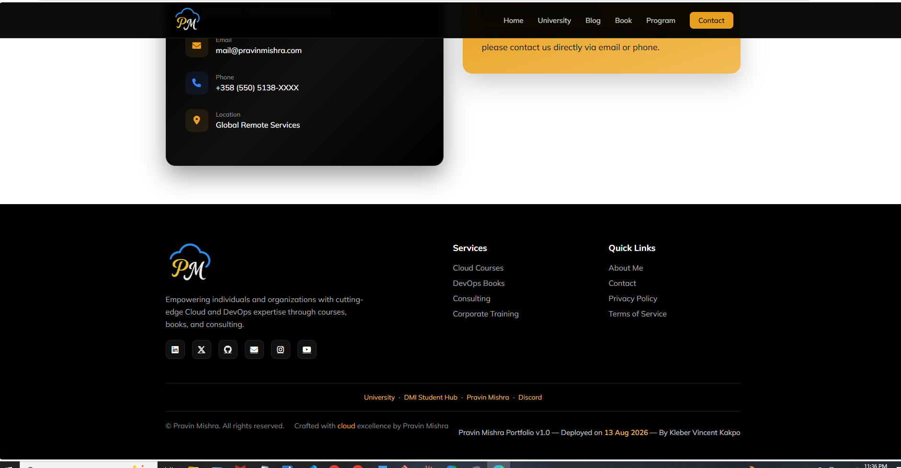

---

#### Screenshot 12 — Mobile responsive view showing the footer remains readable

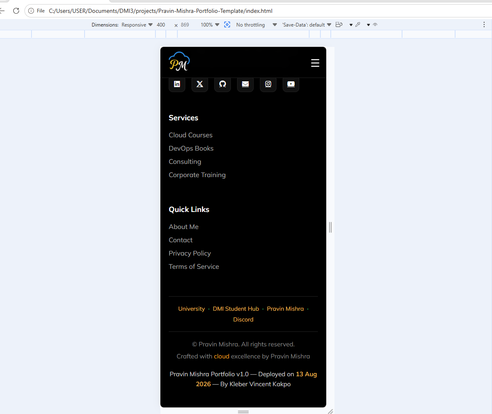

---

#### Screenshot 13 — Jira Story comment showing the Day 3 Daily Scrum update

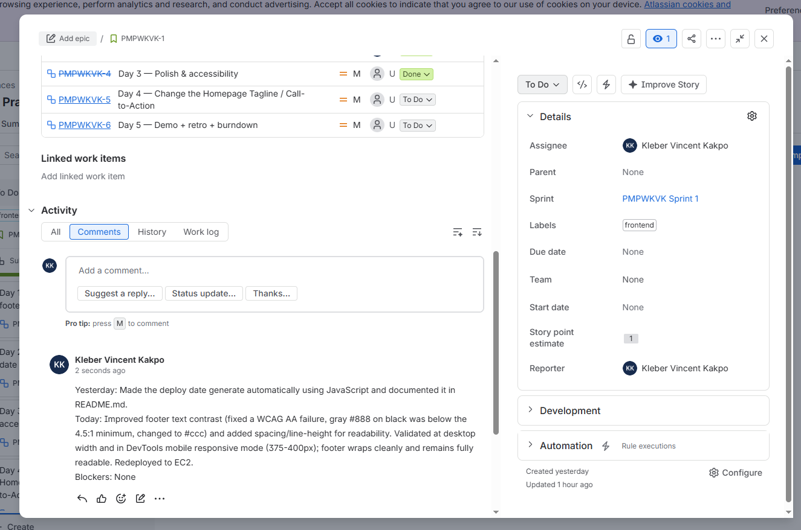

---

**Additional evidence (optional, not one of the 17 required screenshots):** I also captured the polished footer live on EC2 with the URL visible, as a second confirmation alongside the desktop DevTools view above.

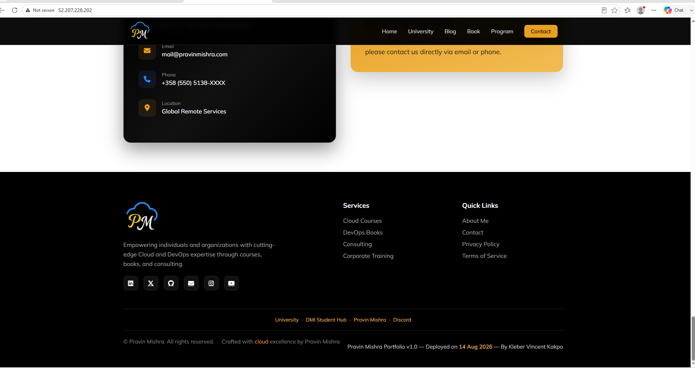

---

# Task 5 — Day 4: Change the Homepage Tagline / Call-to-Action

## Goal

Replace the existing homepage tagline with the required DMI Website call-to-action link and deploy it to EC2.

**Steps taken:**

- Updated the homepage hero section, replacing the tagline with the DMI Discord call-to-action, using a UTM-tagged link so traffic from the portfolio site can be tracked separately
- Confirmed the link opened correctly in a new tab
- Committed the change and redeployed `index.html` to EC2
- Moved Sub-task PMPWKVK-5 (Day 4) to Done

One thing to flag honestly for this repo: the Day 4 comment was initially posted directly on the Sub-task page rather than on the parent Story, breaking the pattern established from Day 1 onward. I caught this during review and reposted the same "yesterday / today / blockers" update as a comment on the Story (PMPWKVK-1), so the full week's Daily Scrum log stays in one continuous place as intended.

### Evidence

#### Screenshot 14 — EC2 browser view showing "Start your DevOps Journey here" and the clickable "Visit the DMI Website" link

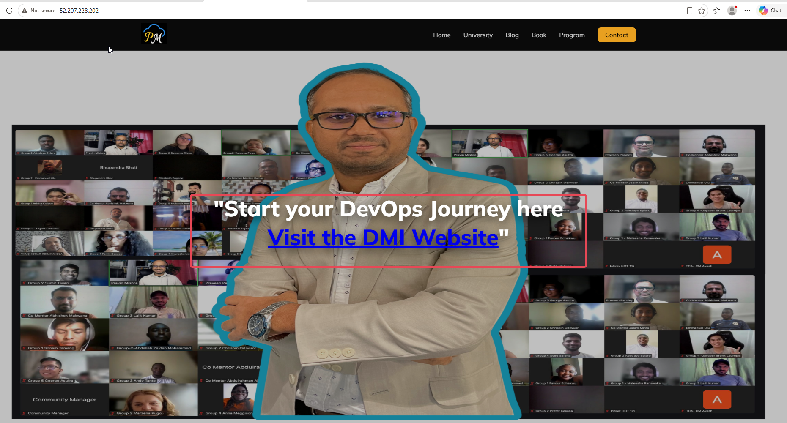

---

**Additional evidence (optional, not one of the 17 required screenshots):** Day 4 Daily Scrum comment, after being corrected to post on the Story.

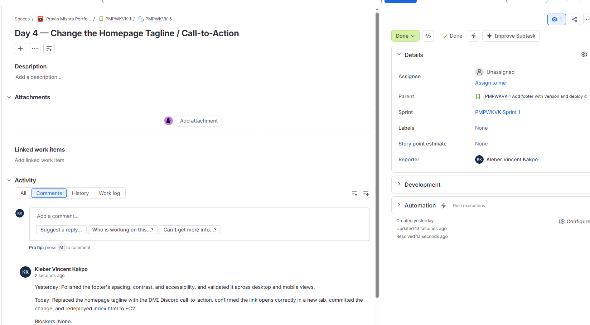

---

# Task 6 — Day 5: Demo, Retrospective, and Burndown

## Goal

Record a two-to-three-minute demo video of the shipped footer, add a retrospective comment (what went well, what to improve, one DevOps pillar observed), post the Day 5 Daily Scrum update, and open the Burndown Chart.

**Steps taken:**

- Recorded a short demo walking through the finished footer (version, dynamic deploy date, author) and the new homepage call-to-action, live on the EC2 URL
- Posted the Sprint Retrospective as a comment on the Story, covering:
  - **What went well:** The footer feature was implemented and improved incrementally throughout the sprint. Each day's changes were committed to Git, deployed to EC2, and verified on the live website, and the deployment process got faster and more familiar as the sprint progressed.
  - **What I would improve:** Automate the deployment process with a shell script or CI/CD pipeline so the SCP, SSH, file-copy, and Nginx reload steps don't need to be performed manually every day.
  - **DevOps value observed:** Continuous Delivery. The sprint demonstrated the value of delivering small, tested, and verified improvements daily, rather than waiting until the end of the sprint to release everything at once.
- Posted a final Day 5 Daily Scrum comment on the Story ("Yesterday: recorded the demo video and added the retrospective. Today: reviewed the Burndown Chart and closed out Sprint 1. Blockers: none.")
- Moved Sub-task PMPWKVK-6 (Day 5) to Done, moved the Story itself to Done, and clicked **Complete sprint**
- Opened the Burndown Chart for Sprint 1

The Burndown Chart's guideline line ran its expected diagonal path from 1 story point down to 0 across the 13–18 Aug window. Since the single Story carried the sprint's only story point and was marked Done by the close of Day 5, the sprint's actual remaining work reached zero right on schedule, matching the sprint goal committed to on Day 0.

As a last sanity check, I reloaded the live EC2 site well after the sprint officially closed, and the dynamic deploy date correctly showed the current date rather than a stale one, confirming the JavaScript-based date logic from Day 2 is working exactly as intended, independent of the sprint dates.

### Evidence

#### Screenshot 15 — Burndown Chart for Sprint 1

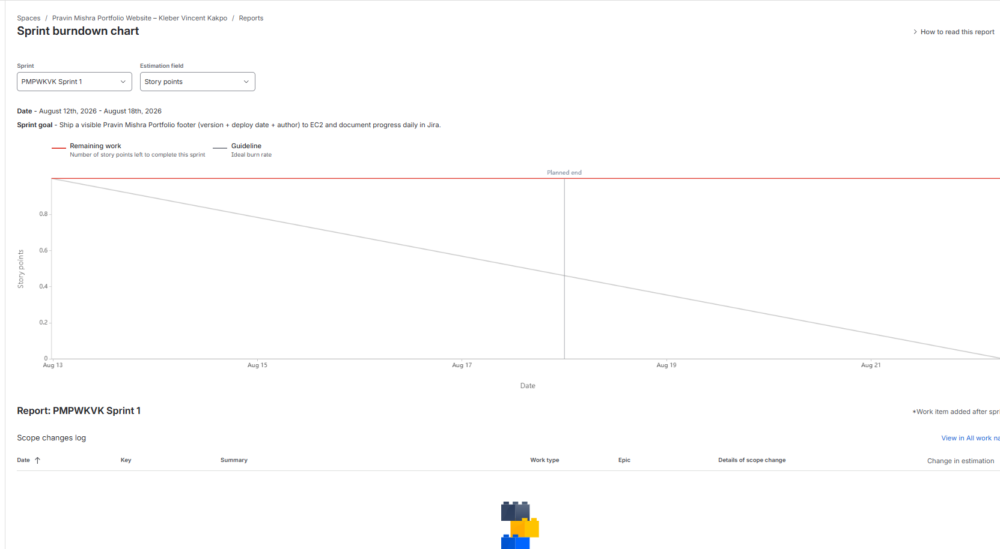

---

#### Screenshot 16 — Jira retrospective comment

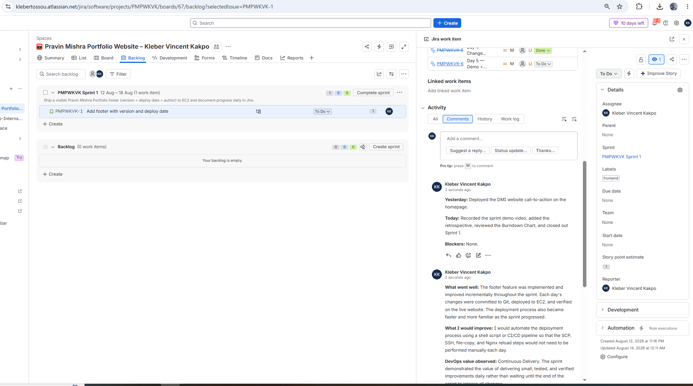

---

#### Screenshot 17 — Final EC2 browser view showing the complete footer requirement


---

#### Demo Video URL

`https://drive.google.com/file/d/1SfSCsJAImBvVNW9bIRWj3rV2Q1PC4Vu0/view?usp=drive_link`

---

# LinkedIn Post (Required)

## Goal

Publish a LinkedIn post about the five-day mini-Sprint, including the GitHub repository URL, the public EC2 live URL, three to five lines on what shipped and was learned, and one proof image (Burndown Chart, active Sprint board, or the EC2 footer).

## Evidence

#### LinkedIn Post URL

`https://www.linkedin.com/posts/vincent-kleber-kakpo-8b920b88_devopsjourney-aws-agiledelivery-activity-7427695945229680640-ZgQI`

---

#### LinkedIn Screenshot 1 — Published LinkedIn post showing the post content and at least one required link or proof image

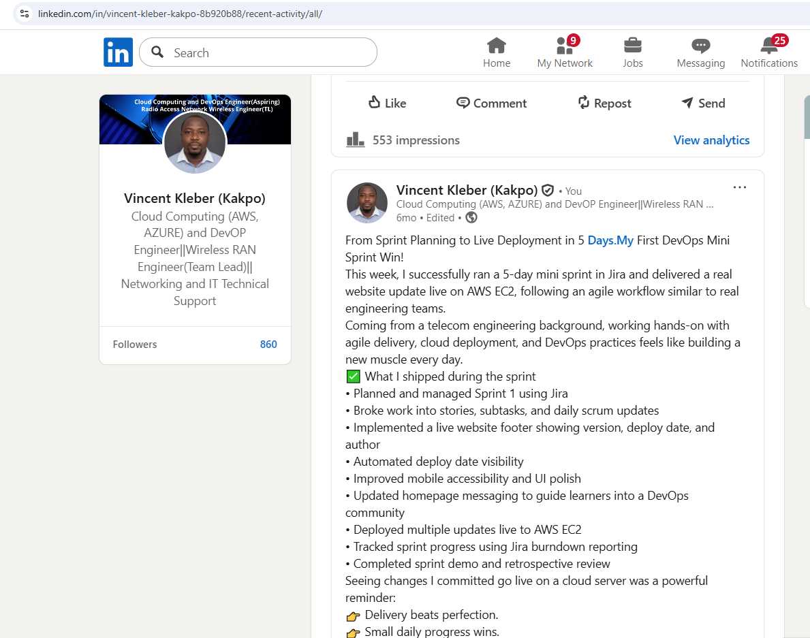

---

# Submission Instructions

- Add all 17 assignment screenshots in the specified order
- Add LinkedIn Screenshot 1
- Full name must be visible in required screenshots
- Include the two-to-three-minute demo-video URL
- Include Daily Scrum comments for Days 1–5 and the retrospective comment
- Include GitHub repository URL and public EC2 live URL
- Do not expose sensitive information (private keys, passwords, tokens, account IDs)

---

# Completion Checklist

- [x] Task 1: Sprint 1 started with the required Sprint Goal (Screenshots 1 & 2)
- [x] Task 2: Day 1 footer implemented, committed, and deployed (Screenshots 3–6)
- [x] Task 3: Day 2 deploy date made dynamic and documented (Screenshots 7–10)
- [x] Task 4: Day 3 footer polished and validated on desktop and mobile (Screenshots 11–13)
- [x] Task 5: Day 4 DMI Website call-to-action deployed and clickable (Screenshot 14)
- [x] Task 6: Day 5 demo, retrospective, and Burndown evidence completed (Screenshots 15–17, video URL)
- [x] Daily Scrum comments posted for Days 1–5
- [x] LinkedIn post published with the GitHub URL, EC2 URL, required delivery details, and proof image
- [x] LinkedIn Post URL included
- [ ] LinkedIn Screenshot 1 included
- [x] Full Name visible in required screenshots
- [x] No sensitive data exposed

---

## 📌 About DMI & CloudAdvisory

DevOps Micro Internship (DMI) is a project-based DevOps program run by Pravin Mishra (The CloudAdvisory) focused on real-world execution, systems thinking, and career readiness.

It helps learners build strong DevOps foundations with hands-on experience.

---

## 📌 Resources

- 🌐 DMI Official Website: https://dmi.pravinmishra.com?utm_source=github&utm_medium=readme  
- 🎓 University: https://university.pravinmishra.com?utm_source=github&utm_medium=readme  
- 💬 Discord Community: https://discord.pravinmishra.com?utm_source=github&utm_medium=readme  
- 📝 Blog: https://dmi.pravinmishra.com/blog?utm_source=github&utm_medium=readme  
- ▶️ YouTube Playlist: https://www.youtube.com/playlist?list=PLFeSNDtI4Cho  
- 🔗 Pravin Mishra (LinkedIn): https://www.linkedin.com/in/pravin-mishra-aws-trainer/  
- 🏢 CloudAdvisory (LinkedIn): https://www.linkedin.com/company/thecloudadvisory/

---

*This submission is part of DevOps Micro Internship (DMI) Cohort 3 — Agentic AI Track.*