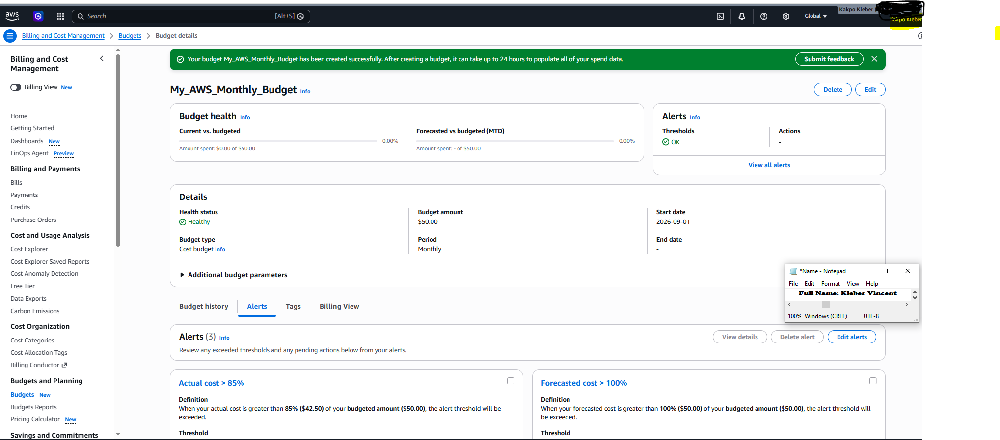

# Assignment 1 — Creating an AWS Free Tier Account & Setting Up Budget Management and Alerts

Part of the DevOps Micro Internship (DMI) Cohort 3 with Agentic AI

---

## Purpose

In this assignment, you will create your own AWS Free Tier account and configure budget management with cost alerts. This is an important first step: it lets you follow along with the rest of the course, and the alerts help ensure you do not exceed your budget.

---

# Task 1 — Sign Up for AWS and Access the Console

## Goal

Create your AWS Free Tier account, select the Basic Support Plan (Free), and log in to the AWS Management Console.

I signed up for a new AWS Free Tier account through the AWS signup flow, which included verifying my email address and payment method. AWS Free Tier is a program that lets new accounts use a limited amount of AWS services at no cost for a set period, which makes it ideal for learning without risking unexpected charges.
During setup, I selected the **Basic Support Plan (Free)**, which includes account and billing support along with access to AWS documentation and community forums, at no extra cost. This is the right support tier for a learning account, since it covers everything needed without adding a paid support commitment.
After completing signup, I logged in to the **AWS Management Console**, the web-based dashboard used to view and manage all AWS services and resources, confirming the account was active and ready to use.

No screenshot was required for this task. Completion is verified through Task 2.

---

# Task 2 — Create a Monthly Cost Budget with Alerts

## Goal

In the Billing Dashboard, create a monthly Cost Budget with a name, amount, and start month, then configure alert thresholds (e.g. 50%, 80%, 100%) and a notification email address.

From the AWS Management Console, I navigated to **Billing and Cost Management** and created a new budget under **Budgets and Planning**. A Cost Budget is a way to track actual and forecasted spending against a limit you define, so AWS can warn you before costs get out of hand.
I configured the budget with the name `My_AWS_Monthly_Budget`, a budget amount of $50.00, a monthly period, and a start date of 2026-09-01.
I then added alert thresholds so I would be notified by email as spending approaches the limit. A threshold is a percentage of the budget amount that, once crossed, triggers a notification. The budget currently has three active alerts, including **actual cost > 85%** (triggers once spend passes $42.50) and **forecasted cost > 100%** (triggers once AWS's forecasted month-end spend passes the full $50.00 budget). Each alert is tied to a notification email address, so AWS emails me as soon as a threshold is crossed rather than me having to check spend manually.
As shown in Screenshot 1, the budget was created successfully with the name, amount, and alert thresholds all visible and healthy.

### Evidence

#### Screenshot 1 — AWS Budget setup page showing the budget name, budget amount, and alert thresholds

---

## Notes

### 1. Why is it important to set up budget alerts when using an AWS account?

Budget alerts matter because AWS charges are usage-based and can grow quietly in the background, especially while learning and experimenting with new services. Without alerts, it is easy to leave a resource running, misconfigure something, or simply lose track of usage, and only find out about the cost when the bill arrives. Setting thresholds means I get an early warning while spending is still within a safe range, giving me time to investigate and shut things down before the budget is exceeded. It turns cost control from something I would have to remember to check manually into something AWS actively watches and flags for me.

---

# Submission Instructions

- Add the required screenshot in your submission
- Full name must be visible in the required screenshot
- Do not expose sensitive billing, card, identity, or account information

---

# Completion Checklist

- [ ] Task 1: AWS Free Tier account created, Basic Support Plan (Free) selected, logged in to the AWS Management Console
- [ ] Task 2: Monthly Cost Budget created with name, amount, and start month, alert thresholds and notification email configured (Screenshot 1, Notes answered)
- [ ] Full Name visible in required screenshot
- [ ] No sensitive billing or account information exposed

---

## 📌 About DMI & CloudAdvisory

DevOps Micro Internship (DMI) is a project-based DevOps program run by Pravin Mishra (The CloudAdvisory) focused on real-world execution, systems thinking, and career readiness.

It helps learners build strong DevOps foundations with hands-on experience.

---

## 📌 Resources

- 🌐 DMI Official Website: https://dmi.pravinmishra.com?utm_source=github&utm_medium=readme  
- 🎓 University: https://university.pravinmishra.com?utm_source=github&utm_medium=readme  
- 💬 Discord Community: https://discord.pravinmishra.com?utm_source=github&utm_medium=readme  
- 📝 Blog: https://dmi.pravinmishra.com/blog?utm_source=github&utm_medium=readme  
- ▶️ YouTube Playlist: https://www.youtube.com/playlist?list=PLFeSNDtI4Cho  
- 🔗 Pravin Mishra (LinkedIn): https://www.linkedin.com/in/pravin-mishra-aws-trainer/  
- 🏢 CloudAdvisory (LinkedIn): https://www.linkedin.com/company/thecloudadvisory/

---

*This submission is part of DevOps Micro Internship (DMI) Cohort 3 — Agentic AI Track.*