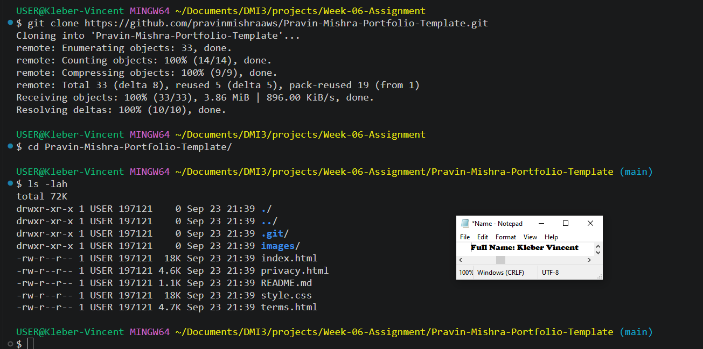
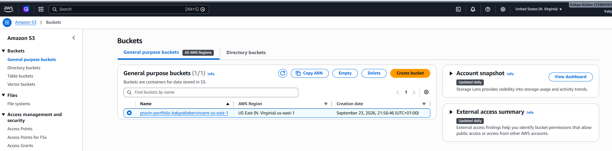
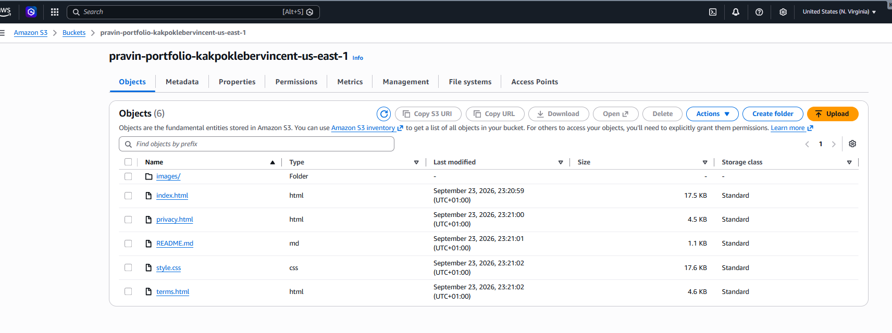
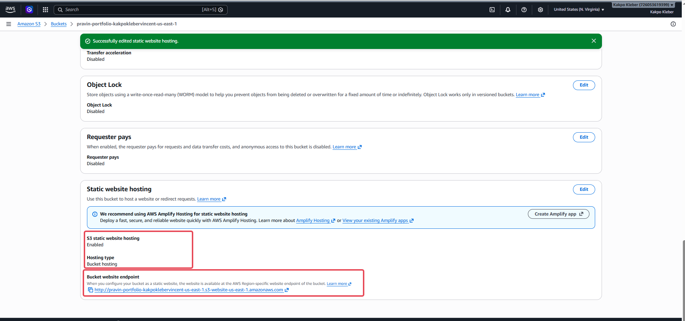
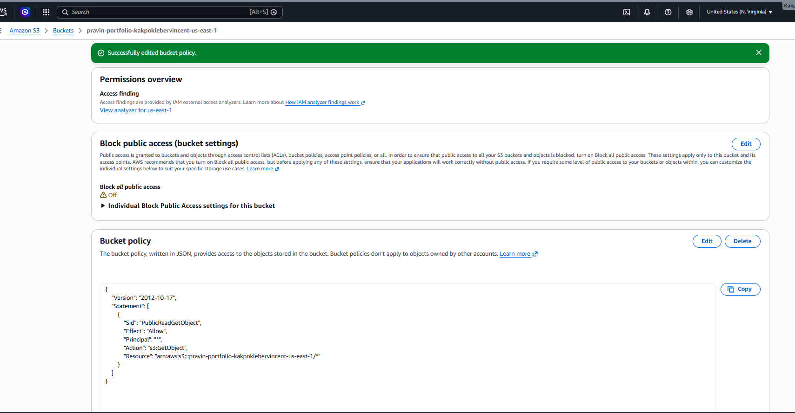
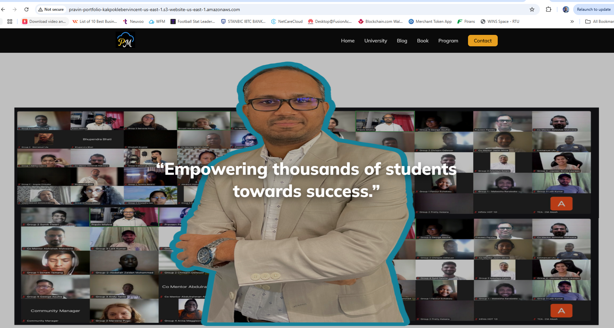
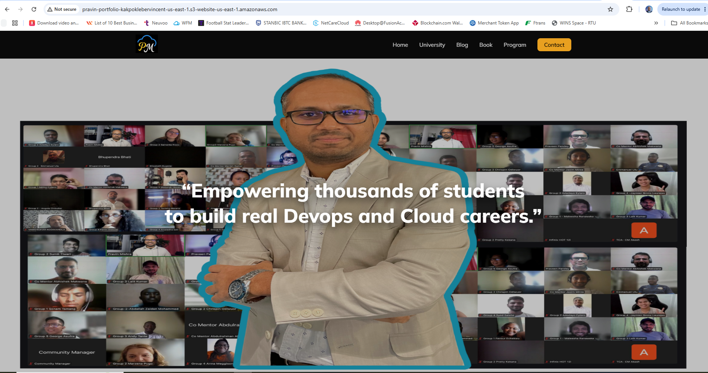

# Assignment 2 — Deploy Personal Portfolio Website on S3

Part of the DevOps Micro Internship (DMI) Cohort 3 with Agentic AI

---

## Purpose

In this assignment, you will deploy a static personal portfolio website quickly and reliably using Amazon S3 Static Website Hosting. You will download the portfolio template, create an S3 bucket, upload the static files, enable static website hosting, configure public read access, and validate the deployment through the S3 website endpoint.

---

# Task 1 — Download the Website Template Locally

## Goal

Download or clone the portfolio website template from GitHub and confirm `index.html` is present.

I cloned the portfolio template repository from GitHub to my local machine, then moved into the cloned directory and listed its contents to confirm the site's files were present before doing anything else with them.

```bash
git clone https://github.com/pravinmishraaws/Pravin-Mishra-Portfolio-Template.git
cd Pravin-Mishra-Portfolio-Template
ls -lah
```

- `git clone https://github.com/pravinmishraaws/Pravin-Mishra-Portfolio-Template.git`: downloads a full copy of the template repository, including its Git history, onto my machine.
- `cd Pravin-Mishra-Portfolio-Template`: moves into the folder created by the clone.
- `ls -lah`: lists every file in the folder, including hidden ones, with human-readable sizes, so I could confirm `index.html` and the other site files landed correctly.

As shown in the screenshot, `index.html` (18K) is clearly present alongside `style.css`, `privacy.html`, `terms.html`, `README.md`, and an `images/` folder.

### Evidence

#### Screenshot 1 — Terminal showing the template folder contents with `index.html` visible



---

# Task 2 — Create an S3 Bucket for Website Hosting

## Goal

Create a globally unique S3 bucket in your chosen AWS region.

In the AWS Console, I created a new S3 bucket named `pravin-portfolio-kakpoklebervincent-us-east-1` in the US East (N. Virginia) region, following the recommended naming format of `pravin-portfolio-<yourname>-<region>` to keep the name globally unique. During creation, I unchecked **Block all public access**, since this bucket needs to serve a public website, and acknowledged the warning AWS displays for that setting.

No terminal commands were required for this task, since bucket creation was done entirely through the AWS Console.

As shown in the screenshot, the bucket was created successfully with the correct name and region.

### Evidence

#### Screenshot 2 — S3 bucket created screen showing the bucket name and region



---

# Task 3 — Upload Website Files to the Bucket

## Goal

Upload the contents of the template folder (not the folder itself) so `index.html` sits at the bucket root.

I uploaded the contents of the cloned template folder directly into the bucket, selecting the individual files and the `images/` folder rather than the parent folder itself, so `index.html` would sit at the bucket root rather than nested inside a subfolder.

While working through Task 4, I noticed the template did not include an `error.html` file, which the static hosting configuration requires as the error document. I created a minimal `error.html` locally and uploaded it using the AWS CLI:

```bash
nano error.html
aws s3 cp error.html s3://pravin-portfolio-kakpoklebervincent-us-east-1/error.html
cat error.html
```

- `nano error.html`: opens the `nano` text editor to create and write a simple 404 error page.
- `aws s3 cp error.html s3://pravin-portfolio-kakpoklebervincent-us-east-1/error.html`: copies the local `error.html` file directly into the bucket root using the AWS CLI, rather than the console's upload UI.
- `cat error.html`: prints the file's contents back to the terminal to confirm what was saved before uploading.

As shown in the screenshots, all website files including `index.html` and the added `error.html` are sitting at the bucket root, with `index.html` and every other file confirmed at the top level rather than inside a subfolder.

### Evidence

#### Screenshot 3 — S3 bucket Objects view showing `index.html` at the top or root level



---

# Task 4 — Enable Static Website Hosting

## Goal

Enable S3 Static Website Hosting with `index.html` as the index document and `error.html` as the error document.

In the bucket's **Properties** tab, I enabled **Static website hosting**, chose **Host a static website** as the hosting type, and set `index.html` as the index document and `error.html` as the error document (uploaded in Task 3). After saving, AWS generated a website endpoint for the bucket.

No terminal commands were required for this task.

As shown in the screenshot, static website hosting is enabled with the hosting type set to Bucket hosting, and the website endpoint `http://pravin-portfolio-kakpoklebervincent-us-east-1.s3-website-us-east-1.amazonaws.com` is displayed.

### Evidence

#### Screenshot 4 — Static website hosting enabled screen showing the Website endpoint



---

# Task 5 — Make the Website Public (Bucket Policy + Permissions)

## Goal

Adjust Block Public Access settings and save a bucket policy that grants public read access to the website objects.

In the bucket's **Permissions** tab, I confirmed Block all public access was off, then added a bucket policy granting public `s3:GetObject` access to every object in the bucket:

```json
{
 "Version": "2012-10-17",
 "Statement": [
 {
 "Sid": "PublicReadGetObject",
 "Effect": "Allow",
 "Principal": "*",
 "Action": "s3:GetObject",
 "Resource": "arn:aws:s3:::pravin-portfolio-kakpoklebervincent-us-east-1/*"
 }
 ]
}
```

This policy statement allows anyone (`"Principal": "*"`) to perform a `GetObject` action, meaning read a file, on any object inside the bucket (`.../*`), which is what lets a browser load the site's HTML, CSS, and images without needing AWS credentials.

As shown in the screenshot, the bucket policy was saved successfully, Block all public access shows as Off, and the resource ARN correctly references the bucket name.

### Evidence

#### Screenshot 5 — Bucket policy page showing the policy saved successfully, with the bucket name visible



---

# Task 6 — Verify Website Works (Public Endpoint Test)

## Goal

Load the site through the S3 website endpoint and confirm the homepage, images, and CSS load correctly.

I opened the S3 website endpoint directly in a browser to confirm the site was actually reachable and rendering correctly, not just uploaded.

No terminal commands were required for this task.

As shown in the screenshot, the homepage loaded fully styled, with the navigation bar, hero image, and tagline text all rendering correctly at the endpoint URL shown in the address bar.

### Evidence

#### Screenshot 6 — Browser showing the live website with the S3 website endpoint visible in the address bar



---

# Task 7 — (Optional) Update One Small Detail and Re-Upload

## Goal

Edit a small visible detail, re-upload it to S3, and confirm the change appears live.

To practice a real small-change-and-redeploy workflow, I edited the hero tagline in `index.html` from "Empowering thousands of students towards success." to "Empowering thousands of students to build real Devops and Cloud careers." and re-uploaded the file, overwriting the existing object in the bucket.

```bash
aws s3 cp index.html s3://pravin-portfolio-kakpoklebervincent-us-east-1/index.html
```

- `aws s3 cp index.html s3://pravin-portfolio-kakpoklebervincent-us-east-1/index.html`: copies the updated local `index.html` to the bucket, overwriting the existing object at the same key so the live site immediately serves the new version.

After a hard refresh of the browser tab, the updated tagline appeared on the live site.

As shown in the screenshot, the updated tagline text is visible on the live website at the S3 endpoint.

### Evidence

#### Screenshot 7 — Browser view showing the updated text live



---

# Submission Instructions

- Add all required screenshots in your submission
- Include the live S3 Website Endpoint URL
- Do not expose sensitive AWS account information

**Live S3 Website Endpoint URL:** http://pravin-portfolio-kakpoklebervincent-us-east-1.s3-website-us-east-1.amazonaws.com

---

# Completion Checklist

- [ ] Task 1: Template downloaded/cloned with `index.html` confirmed (Screenshot 1)
- [ ] Task 2: Globally unique S3 bucket created (Screenshot 2)
- [ ] Task 3: Website files uploaded with `index.html` at bucket root (Screenshot 3)
- [ ] Task 4: Static website hosting enabled (Screenshot 4)
- [ ] Task 5: Public-read bucket policy saved (Screenshot 5)
- [ ] Task 6: Live website verified through the S3 website endpoint (Screenshot 6)
- [ ] Task 7: Optional small update re-uploaded and verified (Screenshot 7)
- [ ] S3 Website Endpoint URL included
- [ ] No sensitive account information exposed

---

## 📌 About DMI & CloudAdvisory

DevOps Micro Internship (DMI) is a project-based DevOps program run by Pravin Mishra (The CloudAdvisory) focused on real-world execution, systems thinking, and career readiness.

It helps learners build strong DevOps foundations with hands-on experience.

---

## 📌 Resources

- 🌐 DMI Official Website: https://dmi.pravinmishra.com?utm_source=github&utm_medium=readme  
- 🎓 University: https://university.pravinmishra.com?utm_source=github&utm_medium=readme  
- 💬 Discord Community: https://discord.pravinmishra.com?utm_source=github&utm_medium=readme  
- 📝 Blog: https://dmi.pravinmishra.com/blog?utm_source=github&utm_medium=readme  
- ▶️ YouTube Playlist: https://www.youtube.com/playlist?list=PLFeSNDtI4Cho  
- 🔗 Pravin Mishra (LinkedIn): https://www.linkedin.com/in/pravin-mishra-aws-trainer/  
- 🏢 CloudAdvisory (LinkedIn): https://www.linkedin.com/company/thecloudadvisory/

---

*This submission is part of DevOps Micro Internship (DMI) Cohort 3 — Agentic AI Track.*