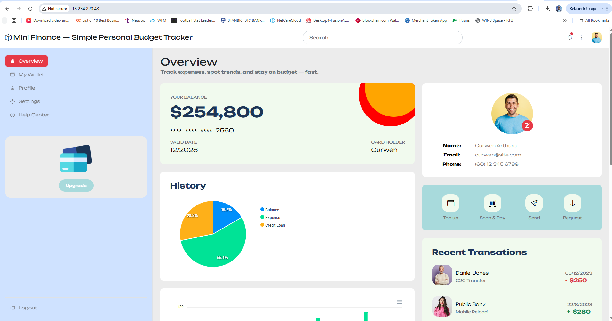

# Assignment 3 — Deploy Mini Finance Website on AWS Virtual Machine

Part of the DevOps Micro Internship (DMI) Cohort 3 with Agentic AI

---

## Purpose

In this assignment, you will deploy the Mini Finance static HTML website on an AWS EC2 Linux virtual machine. You will launch the server, configure network access, connect through SSH, install a web server, deploy the GitHub source files, and confirm the website is reachable through the EC2 public IP.

---

# Task 1 — Launch and Secure an EC2 Linux Instance

## Goal

Launch an Amazon Linux 2 or Ubuntu EC2 instance in a public subnet, and configure its security group to allow SSH (22) and HTTP (80).

I launched a new EC2 instance named `mini-finance-server` using the **Ubuntu** AMI on a `t2.micro` instance type, in a public subnet with auto-assigned public IP enabled. During launch, I created a new key pair for SSH access and configured the attached security group to allow inbound traffic on **port 22 (SSH)** and **port 80 (HTTP)**, since the instance needs to be both administrable remotely and publicly reachable as a website.

No terminal commands were required for this task, since it was done entirely through the AWS Console. Once launched, the instance reached the **Running** state with public IP `18.234.220.43`.

No screenshot required for this task. Completion is verified through Task 4.

---

# Task 2 — Connect via SSH and Install a Web Server

## Goal

Connect to the instance using SSH and install Nginx or Apache.

I connected to the instance over SSH using the key pair created in Task 1, then installed Nginx as the web server.

```bash
chmod 400 mini-finance.pem
ssh -i mini-finance.pem ubuntu@18.234.220.43

sudo apt update
sudo apt install -y nginx
```

- `chmod 400 mini-finance.pem`: restricts the private key file's permissions so only I can read it, since SSH refuses to use a key file that's too open.
- `ssh -i mini-finance.pem ubuntu@18.234.220.43`: opens a remote shell session on the instance, authenticating with the private key rather than a password. `ubuntu` is the default login user on Ubuntu AMIs.
- `sudo apt update`: refreshes Ubuntu's package index so the latest available package versions are known before installing anything.
- `sudo apt install -y nginx`: installs the Nginx web server, with `-y` auto-confirming the install prompt.

The SSH session opened successfully, and Nginx installed without errors, with its systemd service created and ready to run.

No screenshot required for this task. Completion is verified through Task 4.

---

# Task 3 — Clone and Deploy the Mini Finance Site

## Goal

Clone the Mini Finance repository and copy the site files to the web server's root directory.

I cloned the Mini Finance repository directly onto the EC2 instance, then copied its contents into Nginx's default web root so the server would serve the site's files.

```bash
git clone https://github.com/pravinmishraaws/mini_finance.git
ls mini_finance
sudo cp -r mini_finance/* /var/www/html/
ls /var/www/html
```

- `git clone https://github.com/pravinmishraaws/mini_finance.git`: downloads the Mini Finance site's source code onto the instance.
- `ls mini_finance`: lists the cloned folder's contents to confirm `index.html` and the other site files were present before copying anything.
- `sudo cp -r mini_finance/* /var/www/html/`: copies everything inside the `mini_finance` folder into `/var/www/html`, Nginx's default document root. The `*` copies the folder's contents rather than the folder itself, and `-r` copies subfolders recursively so images, CSS, JS, and fonts all came along. `sudo` was needed since `/var/www/html` is owned by root.
- `ls /var/www/html`: confirmed the files landed correctly, with `index.html` sitting alongside `profile.html`, `wallet.html`, `settings.html`, `css/`, `js/`, `fonts/`, and `images/`.

No screenshot required for this task. Completion is verified through Task 4.

---

# Task 4 — Start the Web Server and Verify the Website

## Goal

Start the web server and confirm the Mini Finance website is accessible through the EC2 public IP.

I started the Nginx service, enabled it to launch automatically on any future reboot, and confirmed it was running before testing the site in a browser.

```bash
sudo systemctl start nginx
sudo systemctl enable nginx
sudo systemctl status nginx
```

- `sudo systemctl start nginx`: starts the Nginx service so it begins listening for HTTP requests on port 80.
- `sudo systemctl enable nginx`: configures Nginx to start automatically if the instance is ever rebooted.
- `sudo systemctl status nginx`: confirms Nginx is actively running rather than just installed.

I then opened `http://18.234.220.43` in a browser. The Mini Finance dashboard loaded fully, with the balance card, spending history pie chart, profile details, and recent transactions all rendering correctly with styling and images intact, confirming the deployment was successful end to end.

### Evidence

#### Screenshot — Mini Finance website running in the browser



---

#### Public IP URL

`http://18.234.220.43`

---

# Submission Instructions

- Add the required screenshot in your submission
- Include the EC2 Public IP URL
- Do not expose private keys, passwords, or account IDs

---

# Completion Checklist

- [ ] EC2 instance launched in a public subnet with SSH (22) and HTTP (80) allowed
- [ ] Connected to the instance via SSH
- [ ] Web server (Nginx or Apache) installed
- [ ] Mini Finance repository cloned and files copied to the web server root
- [ ] Web server started and website verified in the browser (Screenshot 1)
- [ ] EC2 Public IP URL included
- [ ] No sensitive data exposed

---

## 📌 About DMI & CloudAdvisory

DevOps Micro Internship (DMI) is a project-based DevOps program run by Pravin Mishra (The CloudAdvisory) focused on real-world execution, systems thinking, and career readiness.

It helps learners build strong DevOps foundations with hands-on experience.

---

## 📌 Resources

- 🌐 DMI Official Website: https://dmi.pravinmishra.com?utm_source=github&utm_medium=readme  
- 🎓 University: https://university.pravinmishra.com?utm_source=github&utm_medium=readme  
- 💬 Discord Community: https://discord.pravinmishra.com?utm_source=github&utm_medium=readme  
- 📝 Blog: https://dmi.pravinmishra.com/blog?utm_source=github&utm_medium=readme  
- ▶️ YouTube Playlist: https://www.youtube.com/playlist?list=PLFeSNDtI4Cho  
- 🔗 Pravin Mishra (LinkedIn): https://www.linkedin.com/in/pravin-mishra-aws-trainer/  
- 🏢 CloudAdvisory (LinkedIn): https://www.linkedin.com/company/thecloudadvisory/

---

*This submission is part of DevOps Micro Internship (DMI) Cohort 3 — Agentic AI Track.*
