# Assignment 4 — Deploy EpicBook on Ubuntu VM + MySQL RDS with Secure Cloud Network

Part of the DevOps Micro Internship (DMI) Cohort 3 with Agentic AI

---

## Purpose

In this assignment, you will deploy the EpicBook web application in AWS using a secure two-tier architecture: an Ubuntu EC2 instance with Nginx in a public subnet, and a private MySQL RDS database with restricted security-group access. The completed deployment must prove that the frontend, backend, and private database communicate successfully end to end.

**The big picture:** two AWS resources sit in two separate "rooms" of one private network (a VPC). The public room holds an EC2 server running Nginx (the public front door, listening on port 80) and Node.js (the app's backend logic, listening on port 3000, only reachable from inside the server itself). The private room holds a MySQL RDS database with no route to the internet at all, reachable only by the EC2 instance, and only because a security group explicitly allows it. A visitor's request travels: browser → Nginx → Node.js → RDS, and the response travels back out the same path.

---

# Task 1 — Create VPC + Public/Private Subnets + Routing

## Goal

Create `epicbook-vpc` (10.0.0.0/16) with a public subnet (10.0.1.0/24) and two private database subnets in different Availability Zones, attach an Internet Gateway, and route only the public subnet to it.

A **VPC** (Virtual Private Cloud) is a private, isolated network inside AWS, a building you fully control. Inside it, **subnets** are individual rooms. A room only becomes "public" (reachable from the internet) if its route table explicitly points outbound traffic at an Internet Gateway, there's no separate on/off switch for this, it's purely a routing decision.

I created `epicbook-vpc` with CIDR `10.0.0.0/16` (a block of 65,536 addresses), then carved out three subnets inside it: `epicbook-public-subnet` (10.0.1.0/24, `us-east-1a`) for the EC2 instance, and two private subnets, `epicbook-private-db-subnet-1` (10.0.2.0/24, `us-east-1a`) and `epicbook-private-db-subnet-2` (10.0.3.0/24, `us-east-1b`), for RDS. Two private subnets in two different Availability Zones are required because Amazon RDS mandates a DB Subnet Group span at least two AZs, even for a single database instance, this is AWS enforcing high-availability design regardless of whether you use it.

I enabled **Auto-assign public IPv4 address** on the public subnet (without this, an EC2 instance placed there still wouldn't get a reachable public IP). I created and attached an **Internet Gateway** (`epicbook-igw`) to the VPC, the literal front door between the VPC and the internet, a VPC has zero internet access until one is attached. I then created a route table, `epicbook-public-rt`, added a route sending all non-VPC traffic (`0.0.0.0/0`) to `epicbook-igw`, and associated that route table with only `epicbook-public-subnet`. The two private subnets were left on the VPC's default route table, which has no internet route at all, that absence of a route is what actually keeps them private, not any explicit "make private" setting.

```bash
# No terminal commands required — this task was completed entirely
# through the AWS Console (VPC, Subnets, Internet Gateway, Route Tables)
```

As shown in the screenshots, `epicbook-vpc` contains all three subnets with correct CIDRs, split correctly across `us-east-1a` and `us-east-1b`, and the public route table shows an active `0.0.0.0/0 → epicbook-igw` route associated specifically with the public subnet.

### Evidence

#### Screenshot 1 — VPC details showing `epicbook-vpc` and CIDR 10.0.0.0/16

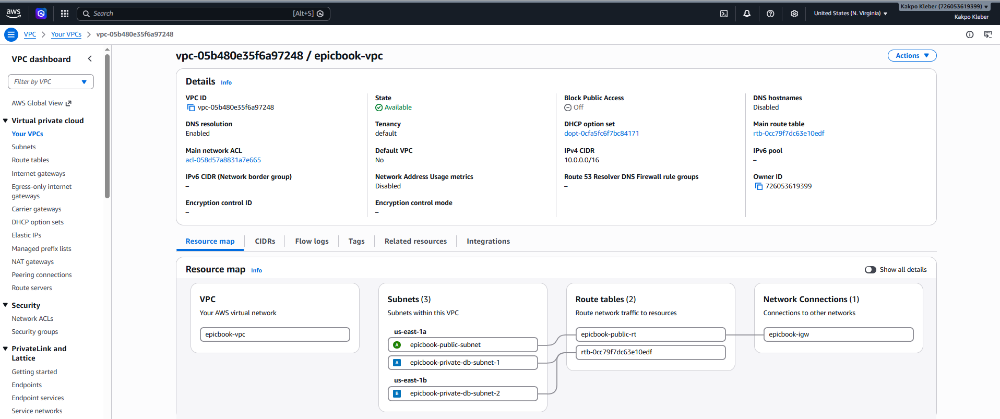

#### Screenshot 2 — Subnets list showing all three subnets and their CIDRs

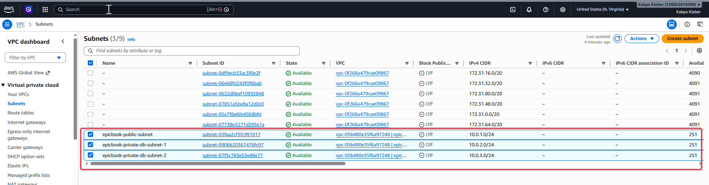

#### Screenshot 3 — Public route table showing 0.0.0.0/0 → IGW and association with the public subnet

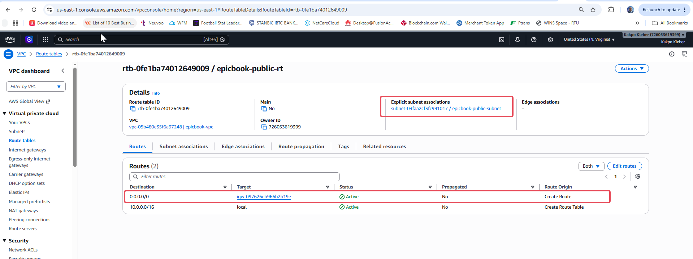

---

# Task 2 — Create Security Groups (EC2 + RDS) with Least Privilege

## Goal

Create `epicbook-ec2-sg` (SSH from my IP, HTTP public) and `epicbook-rds-sg` (MySQL 3306 only from `epicbook-ec2-sg`).

A **security group** is a virtual firewall attached to a resource, a list of "allow" rules where everything not explicitly permitted is blocked. The guiding principle here is **least privilege**: give each resource only the access it genuinely needs.

I created `epicbook-ec2-sg` with two inbound rules: **SSH (port 22)** restricted to **My IP** only, since an SSH port open to the whole internet invites automated brute-force attempts, and **HTTP (port 80)** open to **0.0.0.0/0**, since the whole point of the server is to be a public website.

I then created `epicbook-rds-sg` with a single inbound rule: **MySQL/Aurora (port 3306)**, with the source set to `epicbook-ec2-sg` itself, not an IP address. This is the key security pattern in this whole assignment: instead of saying "allow traffic from IP X," the rule says "allow traffic from anything wearing the `epicbook-ec2-sg` security group." This is more robust than an IP-based rule (EC2 public IPs can change on reboot), and it means nothing else in the world, not even other resources in the same AWS account, can reach port 3306 unless they specifically carry that security group.

```bash
# No terminal commands required — both security groups were created
# through the AWS Console (EC2 → Security Groups)
```

As shown in the screenshots, `epicbook-ec2-sg` shows SSH from a single `/32` IP address and HTTP from anywhere, and `epicbook-rds-sg` shows MySQL 3306 with its source explicitly referencing the EC2 security group by ID.

### Evidence

#### Screenshot 4 — `epicbook-ec2-sg` inbound rules showing ports and sources

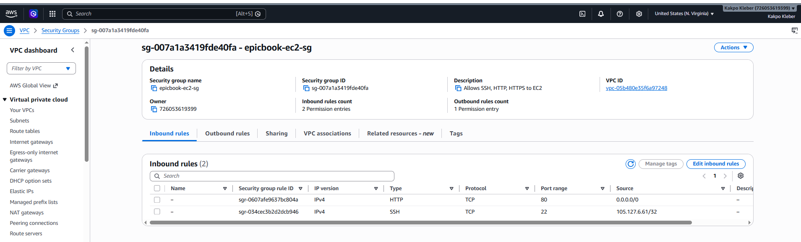

#### Screenshot 5 — `epicbook-rds-sg` inbound rule showing MySQL 3306 allowed from the EC2 security group

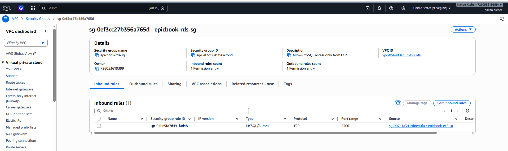

---

# Task 3 — Launch Ubuntu EC2 in Public Subnet

## Goal

Launch an Ubuntu instance in the public subnet with `epicbook-ec2-sg` attached, and connect to it over SSH.

I launched `epicbook-ec2` using the **Ubuntu Server LTS** AMI (Long Term Support, meaning it receives security patches for years) on a `t3.micro` instance, explicitly placing it in `epicbook-vpc` → `epicbook-public-subnet`, with auto-assign public IP enabled, and attaching the existing `epicbook-ec2-sg` security group rather than letting AWS create a fresh, unconfigured default one.

```bash
chmod 400 mini-finance.pem
ssh -i mini-finance.pem ubuntu@3.238.195.132
sudo apt update -y
sudo apt upgrade -y
```

- `chmod 400 mini-finance.pem`: restricts the private key's permissions so only I can read it. SSH refuses to use a key file that's too open, since a private key readable by others defeats its entire purpose.
- `ssh -i mini-finance.pem ubuntu@3.238.195.132`: opens an encrypted remote shell session, authenticating with the private key instead of a password. `ubuntu` is the default admin user on Ubuntu AMIs (Amazon Linux instead defaults to `ec2-user`).
- `sudo apt update -y`: refreshes Ubuntu's package catalog, telling it what versions are currently available, without installing anything yet.
- `sudo apt upgrade -y`: installs the newer versions of already-installed packages based on that refreshed catalog, so the instance starts from a fully patched baseline before anything else is installed on top of it.

As shown in the screenshots, `epicbook-ec2` is Running with public IP `3.238.195.132`, correctly placed in `epicbook-public-subnet` with `epicbook-ec2-sg` attached (confirmed via the instance's Security tab), and the SSH session opened successfully, changing the terminal prompt to `ubuntu@ip-10-0-1-67:~$`.

### Evidence

#### Screenshot 6 — EC2 instance summary showing the public IPv4 address, subnet, and security group

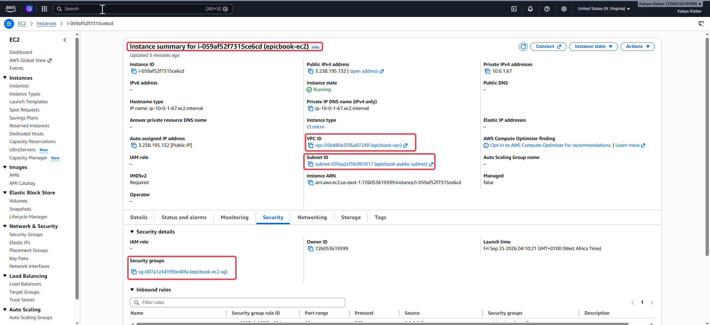

#### Screenshot 7 — Terminal showing a successful SSH login with the `ubuntu@...` prompt

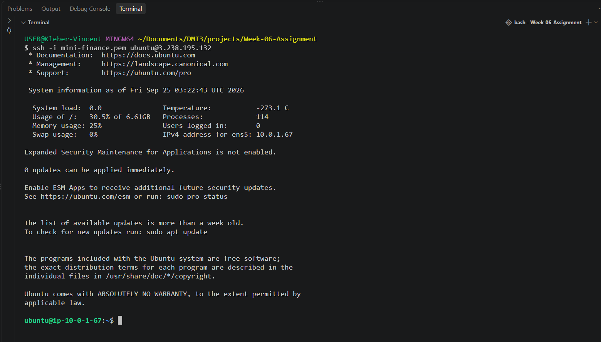

---

# Task 4 — Install Required Software on EC2

## Goal

Install Node.js, npm, Nginx, and the MySQL client on the instance, and confirm Nginx is running.

Three separate pieces of software are needed here: **Node.js** to run the app's backend logic, **Nginx** to serve as the public-facing web server and reverse proxy, and the **MySQL client** to let this machine send commands to the (separate) RDS database server.

```bash
sudo apt update -y
sudo apt install -y curl

curl -fsSL https://deb.nodesource.com/setup_24.x | sudo -E bash -
sudo apt install -y nodejs

node -v
npm -v

sudo apt install -y nginx
sudo systemctl enable nginx
sudo systemctl start nginx
sudo systemctl status nginx --no-pager

sudo apt install -y mysql-client
mysql --version
```

- `sudo apt install -y curl`: installs `curl`, needed to download Node's setup script from the internet.
- `curl -fsSL https://deb.nodesource.com/setup_24.x | sudo -E bash -`: downloads a setup script from NodeSource (a trusted source maintaining current Node.js packages, since Ubuntu's own default repos often carry outdated versions) and pipes it directly into `bash` to run. This adds NodeSource's package repository so `apt` knows where to find the current Node.js LTS release.
- `sudo apt install -y nodejs`: installs Node.js itself, along with `npm` (Node Package Manager), which comes bundled with it.
- `node -v` / `npm -v`: confirm both installed correctly and show their versions.
- `sudo apt install -y nginx`: installs the Nginx web server.
- `sudo systemctl enable nginx`: configures Nginx to start automatically on any future reboot.
- `sudo systemctl start nginx`: starts the service immediately.
- `sudo systemctl status nginx --no-pager`: confirms Nginx is actively running (`active (running)`); `--no-pager` prints the full output directly rather than opening a scrollable viewer.
- `sudo apt install -y mysql-client`: installs the `mysql` command-line tool, a client, not a database server, it lets this machine connect to and query a MySQL server running elsewhere (RDS).
- `mysql --version`: confirms the client installed correctly.

As shown in the screenshots, Node `v24.21.0` and npm `11.19.0` installed successfully, Nginx shows `active (running)` with its systemd service enabled, and the MySQL client shows version `8.4.11-0ubuntu0.26.04.1`.

### Evidence

#### Screenshot 8 — Output of `node -v` and `npm -v`

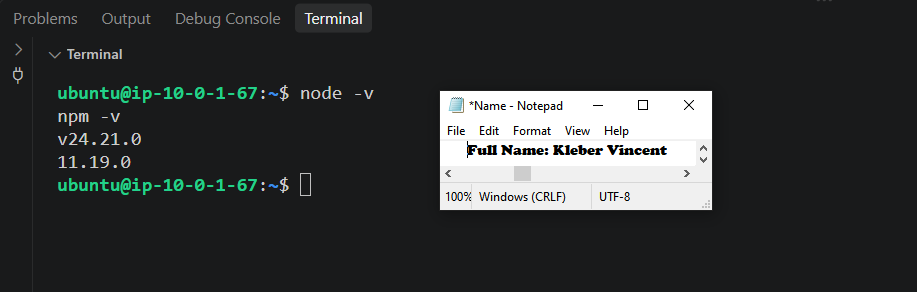

#### Screenshot 9 — Output of `sudo systemctl status nginx --no-pager`

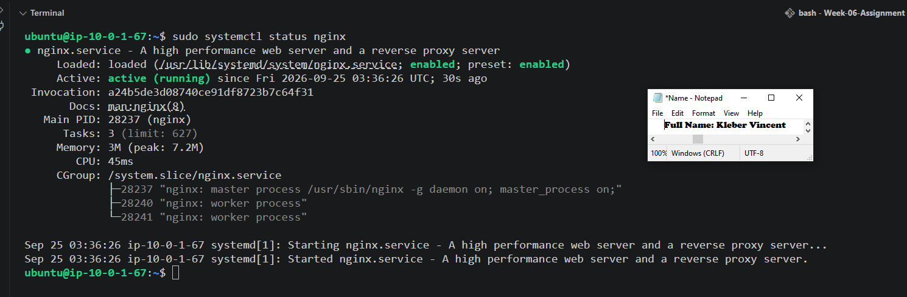

#### Screenshot 10 — Output of `mysql --version`

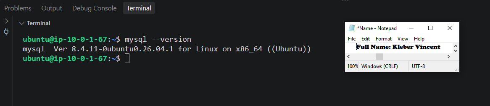

---

# Task 5 — Create RDS MySQL in Private Subnet (No Public Access)

## Goal

Create a private MySQL RDS instance in `epicbook-vpc` using a DB Subnet Group over the private subnets, with `epicbook-rds-sg` attached and public access disabled.

RDS requires a **DB Subnet Group**, a named collection of subnets across multiple AZs, before a database can be created; you can't assign a database directly to a single subnet. This exists to support high availability, even for a single-instance database like this one. I created `epicbook-db-subnet-group` referencing both `epicbook-private-db-subnet-1` and `epicbook-private-db-subnet-2`.

I then created the RDS instance itself using **Full configuration** (not Express configuration, which hides exactly the settings that matter most here: VPC, subnet group, and public access). Key settings: engine **MySQL**, Free Tier template, VPC `epicbook-vpc`, DB subnet group `epicbook-db-subnet-group`, **Public access: No**, VPC security group `epicbook-rds-sg`, initial database name `epicbook`, master username `admin`.

**Why "Public access: No" matters so much:** this single setting controls whether RDS assigns the database a publicly routable IP address at all. It's a second, independent layer of protection on top of the security group, even a perfectly configured security group means little if the database also has a reachable public address in the first place.

```bash
# No terminal commands required — created through the AWS Console
# (RDS → Subnet groups → Create; RDS → Databases → Create database)
```

As shown in the screenshot, the `epicbook-db` instance shows **Publicly accessible: No**, is correctly placed in `epicbook-vpc`, uses `epicbook-db-subnet-group` (spanning both private subnets), and has `epicbook-rds-sg` attached and Active.

### Evidence

#### Screenshot 11 — RDS instance summary showing Publicly accessible: No

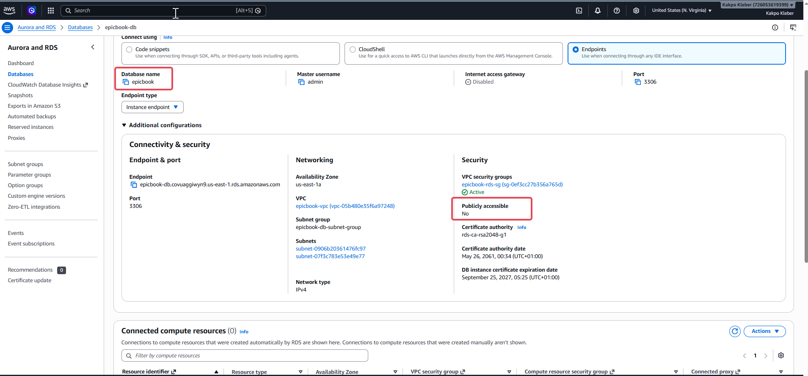

#### Screenshot 12 — Connectivity & security section showing the VPC and attached security group

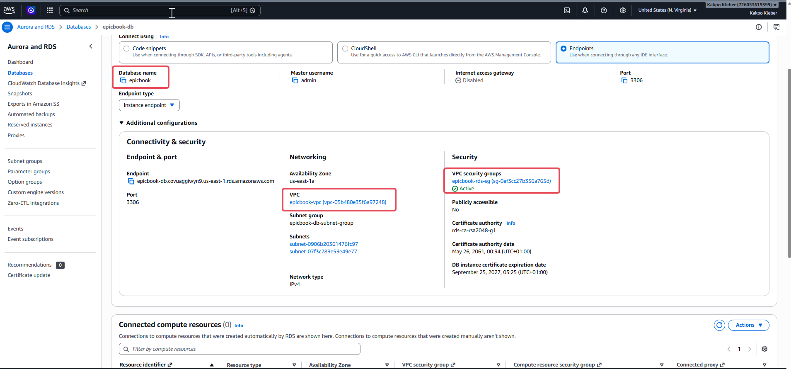

---

# Task 6 — Initialize Database (SQL Dump Import)

## Goal

Connect to RDS from EC2, create the `epicbook` database, and import the provided SQL dump.

I cloned the EpicBook repository to locate its SQL files, then connected from EC2 to the RDS endpoint to import them.

```bash
git clone https://github.com/pravinmishraaws/theepicbook.git
find theepicbook -iname "*.sql"
```

This revealed **three** SQL files, not one as the brief's generic template assumed: `db/BuyTheBook_Schema.sql` (creates the tables), `db/author_seed.sql` and `db/books_seed.sql` (insert starter data). I confirmed the correct import order by reading the repository's own `Installation & Configuration Guide.md`, rather than guessing: schema first, then authors, then books, since the `Book` table has a foreign key constraint referencing `Author`, so author rows must exist before book rows can reference them.

Attempting the first import failed:
ERROR 1049 (42000) at line 1: Unknown database 'bookstore'


Investigating with `head -20 theepicbook/db/BuyTheBook_Schema.sql` revealed every `CREATE TABLE` statement in the file was hardcoded to a schema named `` `bookstore` `` (a leftover from the repo's generic template, not `epicbook`, the name this assignment and my actual RDS instance both use). I fixed this by rewriting every occurrence across all three files, rather than editing the originals directly:

```bash
sed 's/bookstore/epicbook/g' theepicbook/db/BuyTheBook_Schema.sql > theepicbook/db/BuyTheBook_Schema_epicbook.sql
sed 's/bookstore/epicbook/g' theepicbook/db/author_seed.sql > theepicbook/db/author_seed_epicbook.sql
sed 's/bookstore/epicbook/g' theepicbook/db/books_seed.sql > theepicbook/db/books_seed_epicbook.sql

grep -l bookstore theepicbook/db/*_epicbook.sql
```

- `sed 's/bookstore/epicbook/g' file > newfile`: `sed` is a stream editor; `s/bookstore/epicbook/g` means substitute every (`g`, global) occurrence of `bookstore` with `epicbook` on each line. Redirecting (`>`) into a new file, rather than editing in place, keeps the original repository files untouched.
- `grep -l bookstore theepicbook/db/*_epicbook.sql`: searches the corrected files for any remaining occurrence of "bookstore"; `-l` prints only filenames with a match. This returned nothing, confirming the fix was complete.

I then imported the three corrected files in order, and verified the result:

```bash
mysql -h epicbook-db.covuaggiwyn9.us-east-1.rds.amazonaws.com -u admin -p epicbook < theepicbook/db/BuyTheBook_Schema_epicbook.sql
mysql -h epicbook-db.covuaggiwyn9.us-east-1.rds.amazonaws.com -u admin -p epicbook < theepicbook/db/author_seed_epicbook.sql
mysql -h epicbook-db.covuaggiwyn9.us-east-1.rds.amazonaws.com -u admin -p epicbook < theepicbook/db/books_seed_epicbook.sql

mysql -h epicbook-db.covuaggiwyn9.us-east-1.rds.amazonaws.com -u admin -p -e "USE epicbook; SHOW TABLES;"
```

- `-h`: the database host (the RDS endpoint). `-u admin`: the master username. `-p`: prompts for the password rather than exposing it in plain text on the command line.
- `mysql ... epicbook < file.sql`: connects to the `epicbook` database and feeds the SQL file's contents in as a stream of commands to execute, replaying every `CREATE TABLE` and `INSERT` statement inside it.
- `-e "USE epicbook; SHOW TABLES;"`: passes SQL commands directly on the command line instead of entering the interactive prompt, a quick way to check the result.

As shown in the screenshot, `SHOW TABLES;` confirmed `Author`, `Book`, and `Cart` were created successfully, and a follow-up row count check confirmed real data landed: 53 authors and 54 books.

### Evidence

#### Screenshot 13 — Terminal showing successful `SHOW TABLES;` output with tables listed

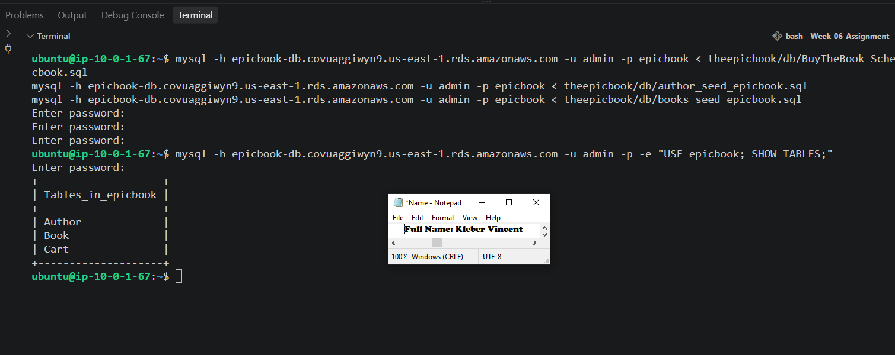

---

# Task 7 — Deploy EpicBook Backend and Configure Environment Variables

## Goal

Clone the EpicBook repository, install backend dependencies, configure environment variables with the RDS endpoint and credentials, and start the backend.

```bash
cd ~/theepicbook
npm install
```

- `npm install`: reads `package.json`, the project's list of external libraries it depends on, and downloads them into a `node_modules` folder. Without this, the app would crash immediately trying to load libraries that don't physically exist on disk yet.

Before configuring anything, I checked how this specific application actually reads its database credentials, rather than assuming the brief's generic `.env` instructions (`DB_HOST`, `DB_USER`, etc.) applied directly. Reading `server.js` and `models/index.js` revealed the app uses **Sequelize** (an ORM, a library letting JavaScript code query a SQL database through objects instead of raw SQL), and reads its credentials from `config/config.json`, selecting a block based on `NODE_ENV`. The `production` block was already wired to read a single environment variable called `JAWSDB_URL`, a full connection string, rather than separate variables. This also revealed the app's actual default port is **8080**, not 3000 as the brief assumed (`const PORT = process.env.PORT || 8080;`).

Based on that, I created a `.env` file:

```bash
nano .env
```

NODE_ENV=production
PORT=3000
JAWSDB_URL=mysql://admin:<MASTER_PASSWORD>@epicbook-db.covuaggiwyn9.us-east-1.rds.amazonaws.com:3306/epicbook


- `NODE_ENV=production`: switches the app to the `production` config block, the one reading from `JAWSDB_URL`.
- `PORT=3000`: overrides the app's default 8080 to match the rest of the assignment.
- `JAWSDB_URL`: a single connection string packing together the database type, username, password, host, port, and database name, which Sequelize parses into its individual parts.

The first start attempt failed with `AccessDeniedError: Access denied for user 'admin'@'10.0.1.67'`. Since a direct `mysql` client connection with the same credentials succeeded (proving the credentials and network path were both fine), the cause was narrowed to the `.env` file itself, it still contained the literal placeholder text `<MASTER_PASSWORD>` rather than the real password. Replacing it with the actual master password resolved the issue.

```bash
export $(cat .env | xargs)
npm start
```

- `export $(cat .env | xargs)`: reads the `.env` file and reformats its lines into space-separated `KEY=value` pairs, then exports all of them as environment variables available to any program run afterward in that shell.
- `npm start`: runs the project's start script (`node server.js`).

On success, Sequelize's `sync()` step automatically created two additional tables the manual SQL import hadn't included, `Checkout` and `Cartbook`, by comparing the app's model definitions against the database and creating whatever was missing. The process then logged `App listening on PORT 3000`.

To keep the backend running independently of the SSH session (so it survives disconnects and Nginx always has something to forward to):

```bash
nohup npm start > app.log 2>&1 &
disown
```

- `nohup`: makes the process ignore the signal sent when the terminal closes.
- `> app.log 2>&1`: redirects both standard output and error output into a log file instead of the screen.
- `&`: runs the command in the background, returning the terminal prompt immediately.
- `disown`: fully detaches the background job from the current shell so it survives even after the SSH session ends.

From a second terminal, I verified the backend both reported success internally and was actually reachable externally:

```bash
ss -tulpn | grep 3000
curl -I http://localhost:3000
```

- `ss -tulpn`: lists active network sockets; piped through `grep 3000`, this confirms something is genuinely listening on port 3000 at the OS level, not just that the app's log claimed to start.
- `curl -I http://localhost:3000`: sends a real HTTP request and shows just the response headers, confirming the server actually answers, not just that a process exists.

As shown in the screenshots, the repository cloned with all expected files, the backend logged its Sequelize table creation and "App listening on PORT 3000," and the follow-up check returned an active listener on port 3000 with a clean `HTTP/1.1 200 OK` response.

### Evidence

#### Screenshot 14 — Terminal showing the repository cloned and the `ls` output

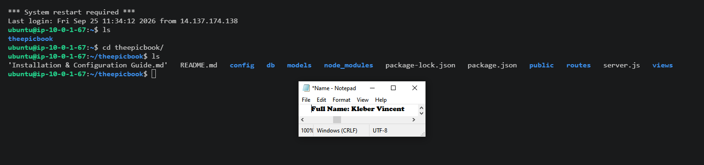

#### Screenshot 15 — Terminal showing the backend running, port 3000 open

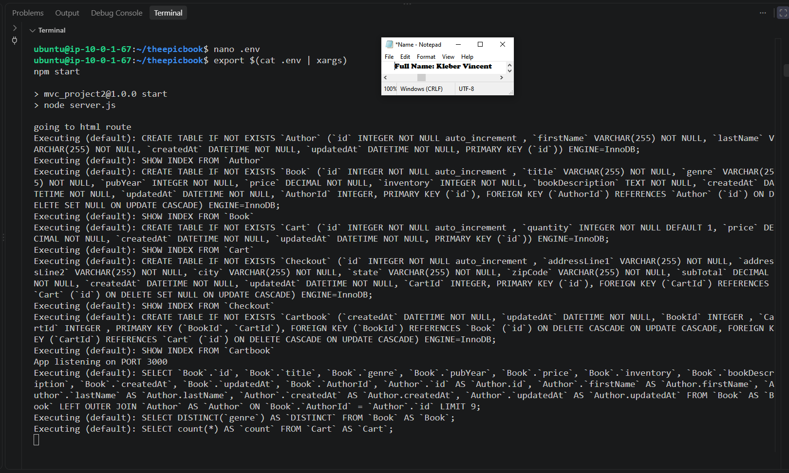

#### Screenshot 16 — `curl` output proving the backend responds

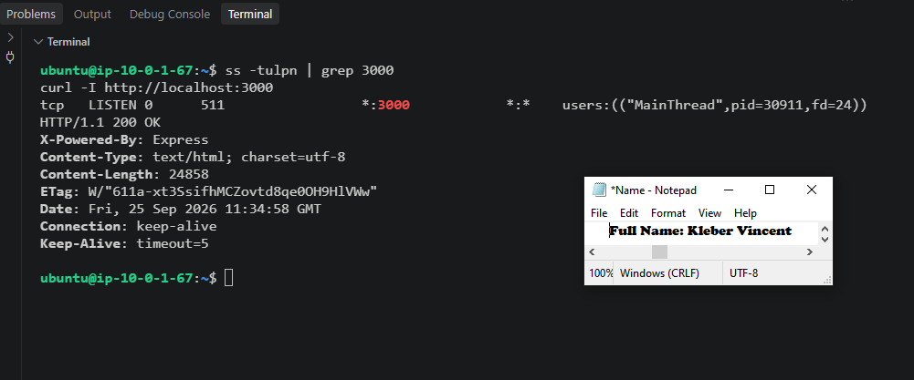

---

# Task 8 — Serve Frontend Using Nginx + Reverse Proxy to Backend

## Goal

Configure Nginx to serve the frontend and reverse-proxy `/api/` (and beyond) to the Node backend.

A **reverse proxy** lets Nginx sit at the public front door (port 80) and, for certain requests, quietly forward them to another program running behind the scenes (Node.js on port 3000), then relay the response back as if Nginx had produced it itself. This is what lets a browser reach the Node backend through a single, normal-looking address, without ever needing to know a second program or port is involved.

Before writing the config, I checked whether this app actually matched the brief's assumption of a separate static frontend folder to copy into Nginx's web root. Checking `server.js`, the `public` folder, and the `views` folder showed it does not, EpicBook renders every page dynamically on the Node.js side using **Handlebars**, a templating engine, meaning there is no separate static frontend to copy anywhere. So instead of Nginx serving static files for most routes and only proxying `/api/`, the whole site needed to be proxied to Node:

```bash
sudo nano /etc/nginx/sites-available/epicbook
```

```nginx
server {
    listen 80;
    server_name _;

    location /api/ {
        proxy_pass http://127.0.0.1:3000/api/;
        proxy_http_version 1.1;
        proxy_set_header Host $host;
        proxy_set_header X-Real-IP $remote_addr;
        proxy_set_header X-Forwarded-For $proxy_add_x_forwarded_for;
    }

    location / {
        proxy_pass http://127.0.0.1:3000/;
        proxy_http_version 1.1;
        proxy_set_header Host $host;
        proxy_set_header X-Real-IP $remote_addr;
        proxy_set_header X-Forwarded-For $proxy_add_x_forwarded_for;
    }
}
```

- `location /api/` / `location /`: Nginx checks each incoming request's path against these rules; API calls match the first, more specific block, everything else falls through to the second.
- `proxy_pass http://127.0.0.1:3000/...`: the actual forwarding instruction, `127.0.0.1` means "this same machine," `3000` is the port Node is listening on.
- `proxy_http_version 1.1` and the `proxy_set_header` lines: ensure proper protocol handling and re-attach the original visitor's real IP and requested host, information that would otherwise be lost once Nginx sits in the middle.

```bash
sudo ln -s /etc/nginx/sites-available/epicbook /etc/nginx/sites-enabled/
sudo rm /etc/nginx/sites-enabled/default
sudo nginx -t
sudo systemctl reload nginx
```

- `ln -s ... sites-enabled/`: creates a symbolic link into the folder Nginx actually reads active configs from (`sites-available` is just storage; only links in `sites-enabled` are live).
- `rm /etc/nginx/sites-enabled/default`: removes Nginx's default welcome site, which would otherwise conflict on port 80.
- `nginx -t`: tests the configuration's syntax before applying it, catching typos safely.
- `systemctl reload nginx`: applies the new config without a full service restart.

As shown in the screenshots, `nginx -t` returned "syntax is ok" and "test is successful," and the saved configuration file correctly shows both the `/api/` and `/` reverse proxy blocks pointing at `127.0.0.1:3000`.

### Evidence

#### Screenshot 17 — `nginx -t` success output

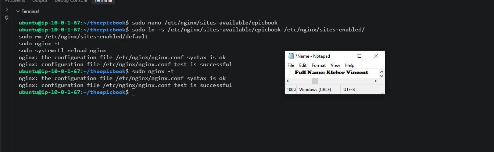

#### Screenshot 18 — Nginx configuration showing the reverse proxy

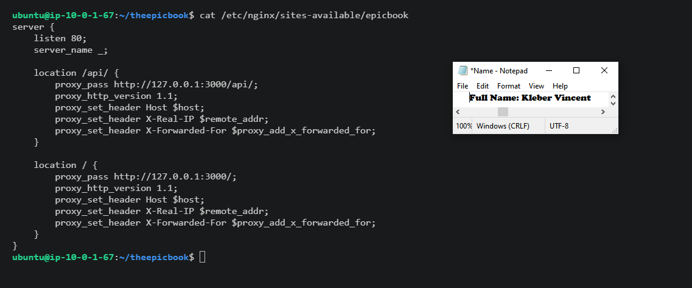

---

# Task 9 — End-to-End Testing (Frontend ↔ Backend ↔ RDS)

## Goal

Verify the frontend loads publicly, the backend responds through Nginx, and EC2 can query the private RDS database.

Each earlier task proved one piece worked in isolation; this task proves they work together as one continuous path a real visitor would take.

```bash
curl http://3.238.195.132/api/cart
mysql -h epicbook-db.covuaggiwyn9.us-east-1.rds.amazonaws.com -u admin -p -e "SELECT 1;"
```

- Loading `http://3.238.195.132` directly in a browser tested the full chain in one pass: browser → Nginx (port 80) → Node.js (port 3000) → RDS query → Handlebars-rendered HTML → back out to the browser. The homepage rendered fully styled with real seeded book covers and titles.
- `curl http://3.238.195.132/api/cart`: isolated the reverse-proxy path specifically for an API call, reaching Node through Nginx on port 80 rather than hitting port 3000 directly, confirming the proxy itself, not just Node in isolation, works correctly.
- `mysql -h ... -e "SELECT 1;"`: the most basic possible database check, stripped of every other layer (no Node, no Nginx, no app logic), confirming the lowest-level connection from EC2 to RDS, the one everything else depends on, is solid.

As shown in the screenshots, the EpicBook homepage loaded fully at the public IP with real book data, the API call through the public endpoint returned a clean `{"cart":[],"book":null}` JSON response, and the direct database check returned `1`, confirming all three layers work both independently and together.

### Evidence

#### Screenshot 19 — Browser showing the EpicBook application loaded with the public IP visible

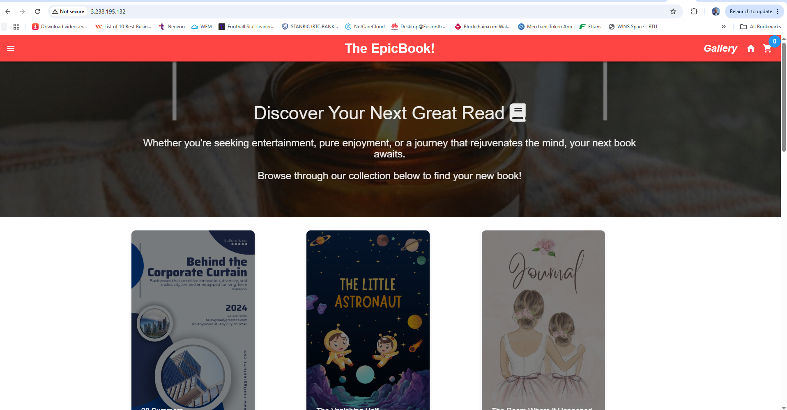

#### Screenshot 20 — Terminal showing a successful API call through the public endpoint

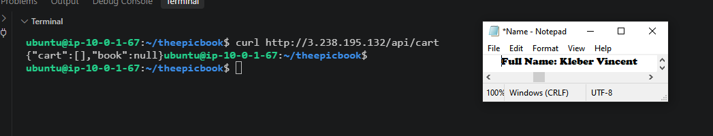

#### Screenshot 21 — Terminal showing the successful database connectivity test

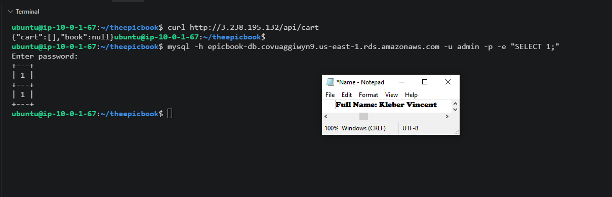

---

# Submission Instructions

- Add all required screenshots in your submission
- Do not expose PEM contents, passwords, `.env` values, or other secrets

**Live application URL:** `http://3.238.195.132`

---

# Completion Checklist

- [ ] Task 1: VPC, public/private subnets, IGW, and public routing created (Screenshots 1–3)
- [ ] Task 2: Least-privilege EC2 and RDS security groups created (Screenshots 4–5)
- [ ] Task 3: Ubuntu EC2 launched in the public subnet with SSH verified (Screenshots 6–7)
- [ ] Task 4: Node.js, npm, Nginx, and MySQL client installed (Screenshots 8–10)
- [ ] Task 5: Private MySQL RDS created with no public access (Screenshots 11–12)
- [ ] Task 6: Database initialized from the SQL dump (Screenshot 13)
- [ ] Task 7: Backend deployed and responding on port 3000 (Screenshots 14–16)
- [ ] Task 8: Nginx serving the frontend and reverse-proxying to the backend (Screenshots 17–18)
- [ ] Task 9: Frontend, backend, and RDS verified end to end (Screenshots 19–21)
- [ ] No sensitive data exposed

---

## 📌 About DMI & CloudAdvisory

DevOps Micro Internship (DMI) is a project-based DevOps program run by Pravin Mishra (The CloudAdvisory) focused on real-world execution, systems thinking, and career readiness.

It helps learners build strong DevOps foundations with hands-on experience.

---

## 📌 Resources

- 🌐 DMI Official Website: https://dmi.pravinmishra.com?utm_source=github&utm_medium=readme  
- 🎓 University: https://university.pravinmishra.com?utm_source=github&utm_medium=readme  
- 💬 Discord Community: https://discord.pravinmishra.com?utm_source=github&utm_medium=readme  
- 📝 Blog: https://dmi.pravinmishra.com/blog?utm_source=github&utm_medium=readme  
- ▶️ YouTube Playlist: https://www.youtube.com/playlist?list=PLFeSNDtI4Cho  
- 🔗 Pravin Mishra (LinkedIn): https://www.linkedin.com/in/pravin-mishra-aws-trainer/  
- 🏢 CloudAdvisory (LinkedIn): https://www.linkedin.com/company/thecloudadvisory/

---

*This submission is part of DevOps Micro Internship (DMI) Cohort 3 — Agentic AI Track.*