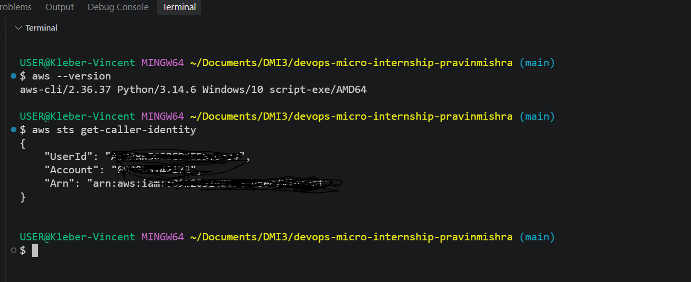
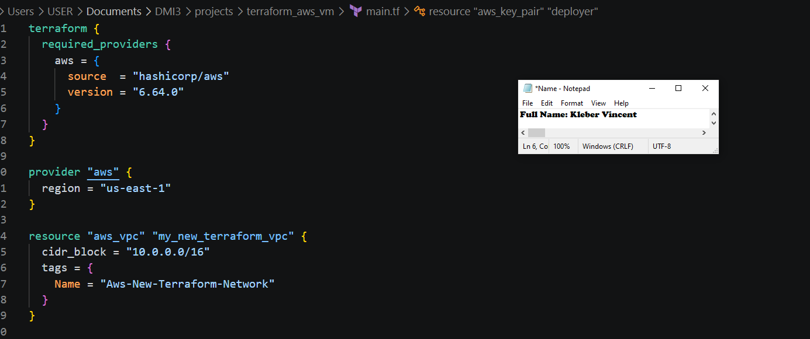
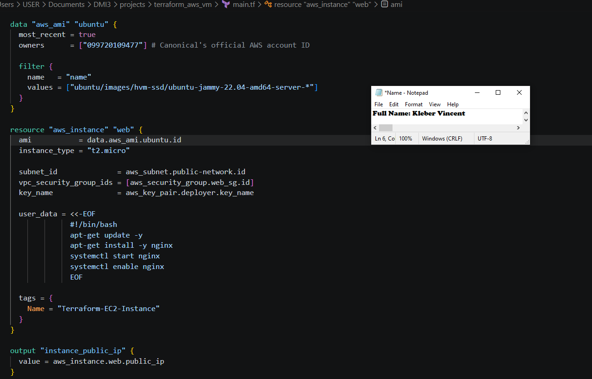
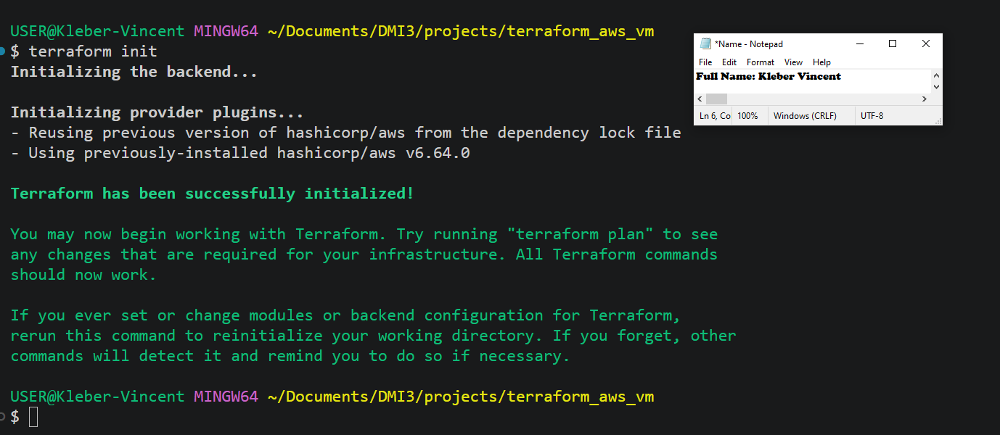
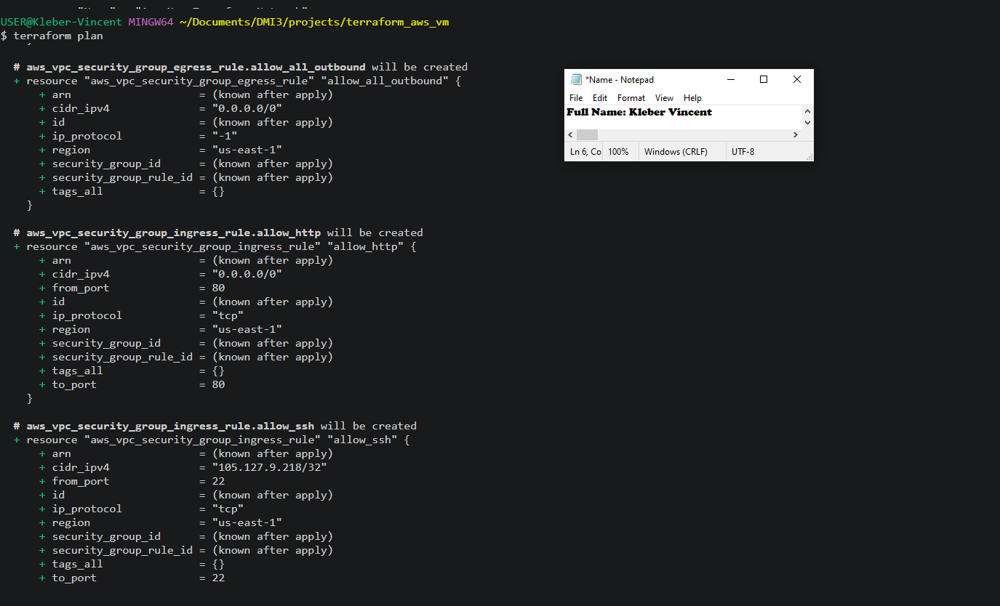
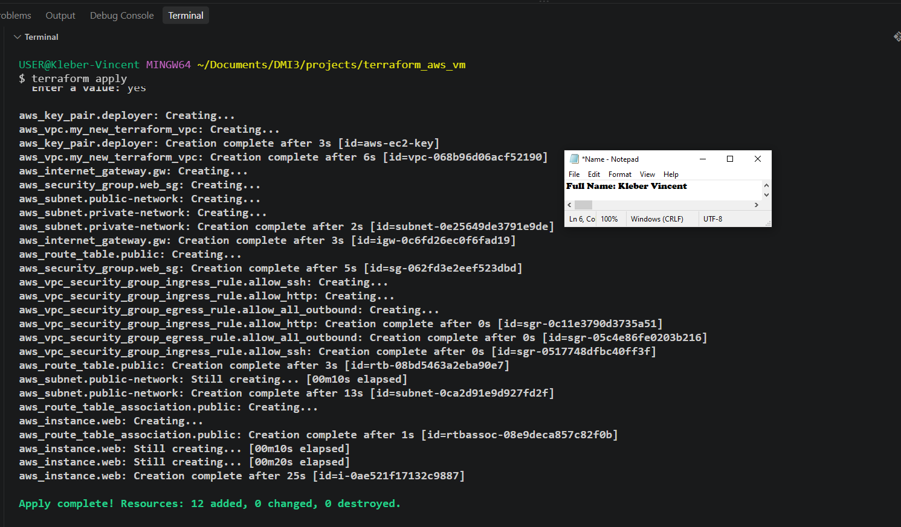
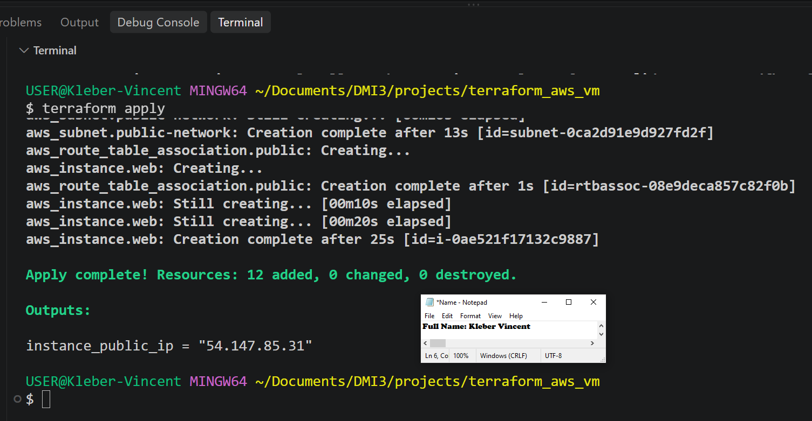
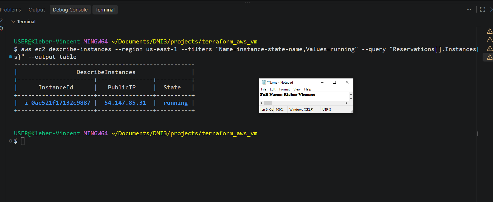
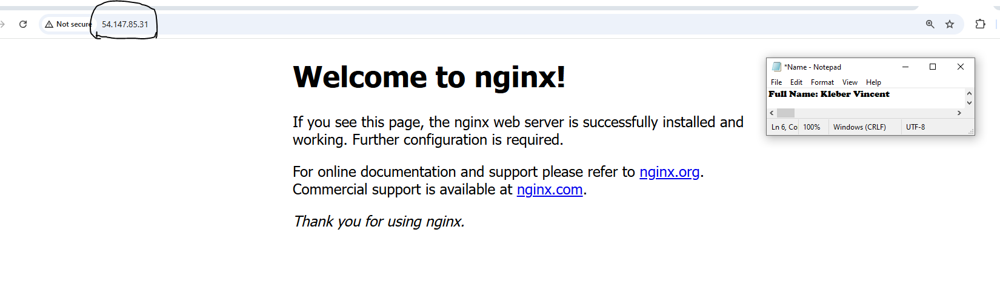
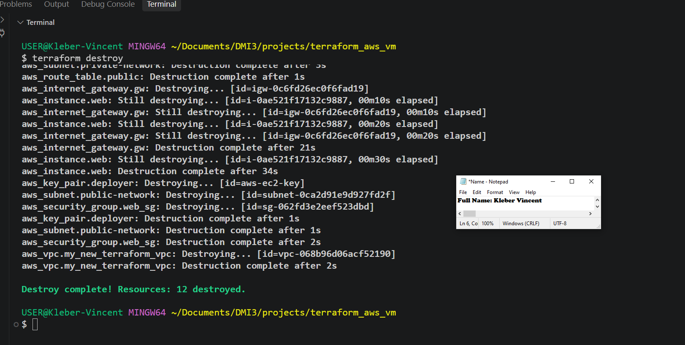

# Assignment 2 — Create an AWS EC2 Virtual Machine Using Terraform

Part of the DevOps Micro Internship (DMI) Cohort 3 with Agentic AI

---

## Purpose

In this hands-on learning practice, I used Terraform to provision a complete AWS environment from scratch: a custom VPC, a public and a private subnet, an Internet Gateway, a public route table, a security group, and an EC2 instance deployed inside the public subnet. I configured SSH and HTTP access, had Nginx install itself automatically on first boot, captured the instance's public IP address, verified the deployment through both AWS CLI and a web browser, and destroyed every resource afterward.

This hands-on learning practice was tackled ahead of Assignment 1 (the Azure VM equivalent), since my Azure account setup is still pending.

Local project directory: `~/Documents/DMI3/projects/terraform_aws_vm`. Region: `us-east-1`.

---

# Task 0 — Set Up and Verify the Terraform and AWS CLI Environment

## Goal

Prepare the local environment for Terraform deployment by installing Terraform and AWS CLI, configuring AWS CLI with my AWS account, and confirming that both tools were working correctly.

I already had Terraform installed from earlier work, but running `terraform version` showed it was out of date (v1.15.7, with v1.16.0 available). Since it had been installed via `winget` (Windows Package Manager) rather than a manual download, I didn't need to manually replace any files. I confirmed the install path with `where terraform`, and found it had already picked up the upgrade to v1.16.0 by the time I re-checked.

I then installed AWS CLI using the official install script:

```powershell
irm https://awscli.amazonaws.com/v2/install.ps1 | iex
```

* `irm` (Invoke-RestMethod) downloads the contents of a URL in PowerShell.
* Piping it into `iex` (Invoke-Expression) runs the downloaded script immediately.

Right after installation, running `aws --version` failed with `'aws' is not recognized`. This wasn't a real failure. The installer had already updated my system's PATH environment variable, but my currently open terminal window had loaded its environment before that happened, so it didn't know about the change yet. Closing and reopening the terminal resolved it immediately, and `aws --version` then returned correctly.

I configured AWS CLI with my account credentials and confirmed access using:

```bash
aws sts get-caller-identity
```

* `aws sts get-caller-identity` asks AWS "who am I, according to the credentials I currently have configured?" and returns the account's UserId, Account ID, and ARN (Amazon Resource Name, a unique identifier for an AWS resource or identity). This is a fast way to confirm AWS CLI is properly authenticated before running any real infrastructure commands.

### Evidence

#### Screenshot 1 — Terminal showing successful `aws --version` output



---

# Task 1 — Create a New Terraform Project and Define the Infrastructure

## Goal

Create a new Terraform project and define the complete AWS EC2 environment in `main.tf`, using the official Terraform Registry documentation as the reference for every resource.

I initially considered reusing a Terraform script a cohort colleague had shared, but decided against it. Copying a pre-written file wouldn't have demonstrated the same understanding of how each resource fits together, and reusing someone else's SSH key would have meant an EC2 instance I couldn't independently prove was under my own control. Instead, I built `main.tf` resource by resource, searching each one on the official Terraform Registry (`registry.terraform.io/providers/hashicorp/aws/latest`) and adapting the documented example usage to my own values.

**Provider configuration:**

```hcl
terraform {
  required_providers {
    aws = {
      source  = "hashicorp/aws"
      version = "6.64.0"
    }
  }
}

provider "aws" {
  region = "us-east-1"
}
```

A **provider** is the plugin that lets Terraform talk to a specific platform, in this case AWS. The `required_providers` block pins which provider and version to use, and `provider "aws"` configures it with the AWS region to deploy into.

**VPC:**

```hcl
resource "aws_vpc" "my_new_terraform_vpc" {
  cidr_block = "10.0.0.0/16"
  tags = {
    Name = "Aws-New-Terraform-Network"
  }
}
```

A **VPC** (Virtual Private Cloud) is an isolated, private network inside AWS that everything else gets built inside. A **CIDR block** (Classless Inter-Domain Routing) defines a range of IP addresses; `10.0.0.0/16` gives this VPC 65,536 addresses to work with.

**Public and private subnets:**

```hcl
resource "aws_subnet" "public-network" {
  vpc_id                  = aws_vpc.my_new_terraform_vpc.id
  cidr_block              = "10.0.1.0/24"
  map_public_ip_on_launch = true
  tags = {
    Name = "Public-Subnet"
  }
}

resource "aws_subnet" "private-network" {
  vpc_id     = aws_vpc.my_new_terraform_vpc.id
  cidr_block = "10.0.2.0/24"
  tags = {
    Name = "Private-Subnet"
  }
}
```

A **subnet** is a smaller slice of a VPC's address range. Splitting a VPC into a public and a private subnet is a standard architecture pattern: anything meant to be reachable from the internet (like a web server) goes in the public subnet, while anything meant to stay isolated (like a database) goes in the private subnet. `map_public_ip_on_launch = true` is what allows instances launched in the public subnet to automatically receive a public IP address.

**Internet Gateway, route table, and association:**

```hcl
resource "aws_internet_gateway" "gw" {
  vpc_id = aws_vpc.my_new_terraform_vpc.id
  tags = {
    Name = "Terraform-IGW"
  }
}

resource "aws_route_table" "public" {
  vpc_id = aws_vpc.my_new_terraform_vpc.id
  route {
    cidr_block = "0.0.0.0/0"
    gateway_id = aws_internet_gateway.gw.id
  }
  tags = {
    Name = "Public-Route-Table"
  }
}

resource "aws_route_table_association" "public" {
  subnet_id      = aws_subnet.public-network.id
  route_table_id = aws_route_table.public.id
}
```

An **Internet Gateway** is what gives a VPC a door to the actual internet. A **route table** contains rules for where traffic should go; the route `0.0.0.0/0 → Internet Gateway` means "any destination, anywhere, goes out to the internet." The **association** is what actually attaches this route table to a specific subnet. I deliberately associated it only with the public subnet. The private subnet was left with no route out, since giving it the same route would erase the distinction between "public" and "private" entirely.

**Security group:**

```hcl
resource "aws_security_group" "web_sg" {
  name        = "web-sg"
  description = "Allow SSH and HTTP inbound traffic and all outbound traffic"
  vpc_id      = aws_vpc.my_new_terraform_vpc.id
  tags = {
    Name = "Web-Security-Group"
  }
}

resource "aws_vpc_security_group_ingress_rule" "allow_ssh" {
  security_group_id = aws_security_group.web_sg.id
  cidr_ipv4          = "105.127.9.218/32"
  from_port          = 22
  ip_protocol        = "tcp"
  to_port            = 22
}

resource "aws_vpc_security_group_ingress_rule" "allow_http" {
  security_group_id = aws_security_group.web_sg.id
  cidr_ipv4          = "0.0.0.0/0"
  from_port          = 80
  ip_protocol        = "tcp"
  to_port            = 80
}

resource "aws_vpc_security_group_egress_rule" "allow_all_outbound" {
  security_group_id = aws_security_group.web_sg.id
  cidr_ipv4          = "0.0.0.0/0"
  ip_protocol        = "-1"
}
```

A **security group** acts as a virtual firewall for an instance. **Ingress** rules control inbound traffic; **egress** rules control outbound traffic. HTTP (port 80) is left open to everyone (`0.0.0.0/0`), since the whole point of Task 4 is letting anyone reach the Nginx page. SSH (port 22), by contrast, is restricted to only my own public IP address (`105.127.9.218/32`), following the checklist's guidance to restrict SSH access whenever possible. The `/32` means "this exact single IP address, nothing else."

**SSH key pair:**

I generated my own SSH key pair rather than reusing anyone else's:

```bash
ssh-keygen -t rsa -b 4096 -f ~/.ssh/aws-ec2-key -N ""
```

* `ssh-keygen` generates a new public/private key pair.
* `-t rsa -b 4096` sets the key type to RSA at 4096 bits, a strong, standard choice.
* `-f ~/.ssh/aws-ec2-key` sets the output filename.
* `-N ""` sets an empty passphrase, since Terraform needs to read the key non-interactively.

```hcl
resource "aws_key_pair" "deployer" {
  key_name   = "aws-ec2-key"
  public_key = file("C:/Users/USER/.ssh/aws-ec2-key.pub")
}
```

The `file()` function reads the contents of a file at plan time. One real snag here: since I run Terraform through Git Bash, I first wrote the path in Git Bash's Unix-style format (`/c/Users/USER/...`), which caused a "no file exists" error. Terraform's binary is a native Windows program and doesn't understand Git Bash's path translation, so it needed the actual Windows-style path (`C:/Users/USER/...`) instead. Switching the format resolved it.

**AMI lookup and EC2 instance:**

```hcl
data "aws_ami" "ubuntu" {
  most_recent = true
  owners      = ["099720109477"] # Canonical's official AWS account ID
  filter {
    name   = "name"
    values = ["ubuntu/images/hvm-ssd/ubuntu-jammy-22.04-amd64-server-*"]
  }
}

resource "aws_instance" "web" {
  ami           = data.aws_ami.ubuntu.id
  instance_type = "t2.micro"

  subnet_id              = aws_subnet.public-network.id
  vpc_security_group_ids = [aws_security_group.web_sg.id]
  key_name               = aws_key_pair.deployer.key_name

  user_data = <<-EOF
              #!/bin/bash
              apt-get update -y
              apt-get install -y nginx
              systemctl start nginx
              systemctl enable nginx
              EOF

  tags = {
    Name = "Terraform-EC2-Instance"
  }
}

output "instance_public_ip" {
  value = aws_instance.web.public_ip
}
```

A **data source** (`data "aws_ami"`) queries AWS for information at plan time instead of creating anything; here it always finds the current latest Ubuntu 22.04 AMI (Amazon Machine Image, the OS template an instance boots from) for `us-east-1`, so the configuration never goes stale from a hardcoded, eventually-deprecated AMI ID. `user_data` is a heredoc (a multi-line string) containing a shell script that runs automatically the very first time the instance boots, installing and starting Nginx without any manual SSH session required. The `output` block, a core Terraform language feature independent of any specific cloud provider, tells Terraform to print the instance's public IP once everything finishes applying.

### Evidence

#### Screenshot 2 — VS Code showing the AWS provider configuration and VPC configuration in `main.tf`



---

#### Screenshot 3 — VS Code showing the EC2 instance configuration and public IP `output` block in `main.tf`



---

# Task 2 — Initialize Terraform

## Goal

Initialize the Terraform working directory and download the required provider components.

```bash
terraform init
```

* `terraform init` reads the `required_providers` block and downloads the matching provider plugin (here, the AWS provider v6.64.0), creating a `.terraform` folder and a `.terraform.lock.hcl` lock file that records exactly which provider version was selected, so future runs stay consistent.

This completed cleanly on the first attempt, with Terraform confirming it had been successfully initialized and was ready for `terraform plan`.

### Evidence

#### Screenshot 4 — Terminal showing the successful `terraform init` output



---

# Task 3 — Plan and Apply the Configuration

## Goal

Review the Terraform execution plan, provision the AWS resources, and record the EC2 instance's public IP address from the Terraform output.

```bash
terraform plan
```

* `terraform plan` compares the configuration in `main.tf` against the real state of AWS (currently nothing) and prints exactly what it intends to create, without touching anything yet.

The first attempt at this failed with `Invalid value for "path" parameter: no file exists at "/c/Users/USER/.ssh/aws-ec2-key.pub"`, the Git Bash path issue described in Task 1. After correcting the path to Windows format, `terraform plan` ran cleanly, listing all 12 resources to be created and ending with `Plan: 12 to add, 0 to change, 0 to destroy.` The note at the end about not using the `-out` flag is a routine informational message, not an error. It simply means the plan wasn't saved to a file for a guaranteed identical `apply` later, which doesn't matter for a single-person, single-run deployment like this one.

```bash
terraform apply
```

* `terraform apply` shows the same plan again and, after typing `yes` to confirm, actually creates every resource in AWS in the correct dependency order (VPC first, then subnets and the Internet Gateway, then the route table and security group, and finally the EC2 instance itself, since it depends on all the others existing first).

The apply completed successfully: `Apply complete! Resources: 12 added, 0 changed, 0 destroyed.`

```bash
terraform output
```

This printed `instance_public_ip = "54.147.85.31"`, the value defined in the `output` block from Task 1.

### Evidence

#### Screenshot 5 — Terraform plan summary showing the proposed resources



---

#### Screenshot 6 — Terraform apply output showing successful completion



---

#### Screenshot 7 — Terraform output showing the public IP address of the EC2 instance



---

### EC2 Public IP Address

**EC2 Public IP Address:** `54.147.85.31`

---

# Task 4 — Verify the Deployment

## Goal

Confirm through AWS CLI that the EC2 instance was created successfully and is running, and verify HTTP access through the instance's public IP.

```bash
aws ec2 describe-instances --region us-east-1 --filters "Name=instance-state-name,Values=running" --query "Reservations[].Instances[].{InstanceId:InstanceId,State:State.Name,PublicIP:PublicIpAddress}" --output table
```

* `aws ec2 describe-instances` asks AWS for details about EC2 instances.
* `--filters "Name=instance-state-name,Values=running"` narrows the results to only currently running instances.
* `--query "..."` reshapes the raw JSON response into just the three fields that matter (instance ID, state, public IP).
* `--output table` formats the result as a readable table instead of raw JSON.

The first attempt failed with `An error occurred (NoRegion): You must specify a region`, since the AWS CLI's own region setting is separate from Terraform's `provider "aws" { region = ... }` block and hadn't been configured. Adding `--region us-east-1` directly to the command resolved it. The output confirmed instance `i-0ae521f17132c9887` in state `running` with public IP `54.147.85.31`, matching the IP recorded from `terraform output` exactly.

I then opened `http://54.147.85.31` in a browser and confirmed the default Nginx welcome page loaded successfully, "Welcome to nginx!", confirming the `user_data` bootstrap script from Task 1 had installed and started Nginx automatically with no manual SSH session needed.

### Evidence

#### Screenshot 8 — AWS CLI output showing the EC2 instance ID, `running` state, and public IP address



---

#### Screenshot 9 — Browser showing the Nginx page successfully loaded using the EC2 instance public IP



---

# Task 5 — Destroy the Resources

## Goal

Remove all AWS resources created by Terraform after completing the deployment and verification.

```bash
terraform destroy
```

* `terraform destroy` reads the current state and tears down every resource Terraform created, in the reverse order they were built (the EC2 instance first, since other resources depend on it existing, down to the VPC last).

This completed successfully: `Destroy complete! Resources: 12 destroyed.`

### Evidence

#### Screenshot 10 — Terminal showing successful `terraform destroy` completion



---

# Submission Instructions

* Complete all tasks in sequence.
* Include all required screenshots specified in Tasks 0–5.
* Ensure that your full name is visible in the required screenshots.
* Record the EC2 public IP address in Task 3.
* Follow the screenshot requirements exactly as specified.
* Ensure that the submitted evidence clearly matches the required task outputs.
* Do not expose AWS access keys, secret keys, private keys, passwords, account IDs, or other sensitive information.
* Do not upload your private key file (`.pem`) to your GitHub repository.
* Review your submission carefully before submitting it through GitHub.

---

# Completion Checklist

* [x] Installed Terraform and verified it using `terraform version`
* [x] Installed AWS CLI and verified it using `aws --version`
* [x] Configured AWS CLI and verified account access
* [x] Confirmed the correct AWS Region
* [ ] Installed and enabled the HashiCorp Terraform extension in VS Code
* [x] Created the Terraform project directory (`terraform_aws_vm`) and `main.tf`
* [x] Added the Terraform and AWS provider configuration
* [x] Defined the custom VPC, public subnet, and private subnet
* [x] Configured the Internet Gateway and public route table
* [x] Associated the public route table with the public subnet
* [x] Defined the security group for SSH and HTTP access
* [x] Restricted SSH access to my public IP whenever possible
* [x] Defined the EC2 instance inside the public subnet
* [x] Configured SSH authentication without exposing the private key
* [x] Added the Terraform output for the EC2 public IP address
* [x] Completed `terraform init` successfully
* [x] Reviewed the Terraform execution plan using `terraform plan`
* [x] Completed `terraform apply` successfully
* [x] Captured and recorded the EC2 public IP using `terraform output`
* [x] Verified that the EC2 instance is running using AWS CLI
* [x] Verified that the AWS public IP matches the Terraform output
* [x] Verified Nginx access through the EC2 public IP
* [x] Completed `terraform destroy` successfully
* [x] Captured all 10 required screenshots
* [ ] Confirmed that my full name is visible in the required screenshots
* [x] Checked that no AWS credentials, private keys, passwords, account IDs, or other sensitive information are visible
* [x] Confirmed that no `.pem` private key file has been uploaded to the GitHub repository

---

## 📌 About DMI & CloudAdvisory

DevOps Micro Internship (DMI) is a project-based DevOps program run by Pravin Mishra (The CloudAdvisory), focused on real-world execution, systems thinking, and career readiness.

It helps learners build strong DevOps foundations through hands-on experience.

---

## 📌 Resources

* 🌐 DMI Official Website: https://dmi.pravinmishra.com?utm_source=github&utm_medium=readme
* 🎓 University: https://university.pravinmishra.com?utm_source=github&utm_medium=readme
* 💬 Discord Community: https://discord.pravinmishra.com?utm_source=github&utm_medium=readme
* 📝 Blog: https://dmi.pravinmishra.com/blog?utm_source=github&utm_medium=readme
* ▶️ YouTube Playlist: https://www.youtube.com/playlist?list=PLFeSNDtI4Cho
* 🔗 Pravin Mishra (LinkedIn): https://www.linkedin.com/in/pravin-mishra-aws-trainer/
* 🏢 CloudAdvisory (LinkedIn): https://www.linkedin.com/company/thecloudadvisory/

---

*This submission is part of the DevOps Micro Internship (DMI) Cohort 3 — Agentic AI Track.*