# Assignment 4 — Deploy EpicBook Web App on AWS Using Terraform Modules and Amazon RDS for MySQL

Part of the DevOps Micro Internship (DMI) Cohort 3 with Agentic AI

---

## Purpose

In this hands-on learning practice, I used reusable Terraform modules to provision the AWS infrastructure required by EpicBook, a full-stack Node.js bookstore application. I built a custom VPC, one public subnet, two private database subnets spread across different Availability Zones, an Internet Gateway, a public route table, two Security Groups, an EC2 Linux instance, and a private Amazon RDS for MySQL database, splitting all of it into three separate, reusable Terraform modules (`network`, `ec2`, `rds`) rather than one large configuration file.

I used EC2 `user_data` to automatically install the required server software, then manually connected to the instance over SSH to initialize the EpicBook database, connect the application to Amazon RDS, configure Nginx as a reverse proxy, validate the complete browser-to-database workflow, destroy the resources after testing, and publish the required LinkedIn post.

This hands-on learning practice was tackled as Assignment 4, ahead of Assignment 1 (the Azure VM equivalent), since my Azure account setup was pending at the time. Local project directory: `~/Documents/DMI3/projects/terraform-aws-epicbook`. Region: `us-east-1`.

---

# Task 0 — Set Up and Verify the Terraform and AWS CLI Environment

## Goal

Prepare the local environment by confirming Terraform and AWS CLI were installed and working correctly, and confirming the HashiCorp Terraform extension was installed and enabled in VS Code.

Since Terraform and AWS CLI were already installed and verified from earlier work on the AWS EC2 hands-on learning practice, I re-ran both checks fresh for this project's documentation rather than reusing the earlier screenshots, since this assignment's evidence requirements ask for two separate screenshots (`terraform version` and `aws --version`) rather than a single combined one.

```bash
terraform --version
```

* `terraform --version` prints the currently installed Terraform version, confirming the binary is on PATH and working.

```bash
aws --version
```

* `aws --version` prints the currently installed AWS CLI version, confirming it is installed and working.

I also confirmed the HashiCorp Terraform extension was already installed and enabled in VS Code's Extensions panel (searchable as "HashiCorp Terraform"), showing "Disable"/"Uninstall" options rather than an "Install" button, confirming it was active.

### Evidence

#### Screenshot 1 — Terminal showing successful `terraform version` output

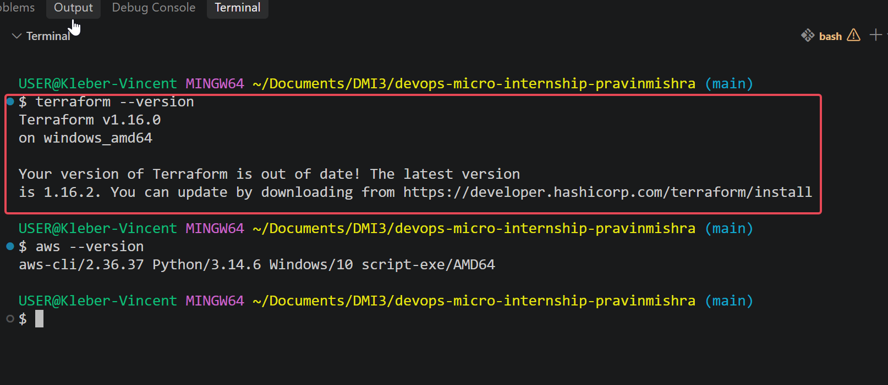

---

#### Screenshot 2 — Terminal showing successful `aws --version` output

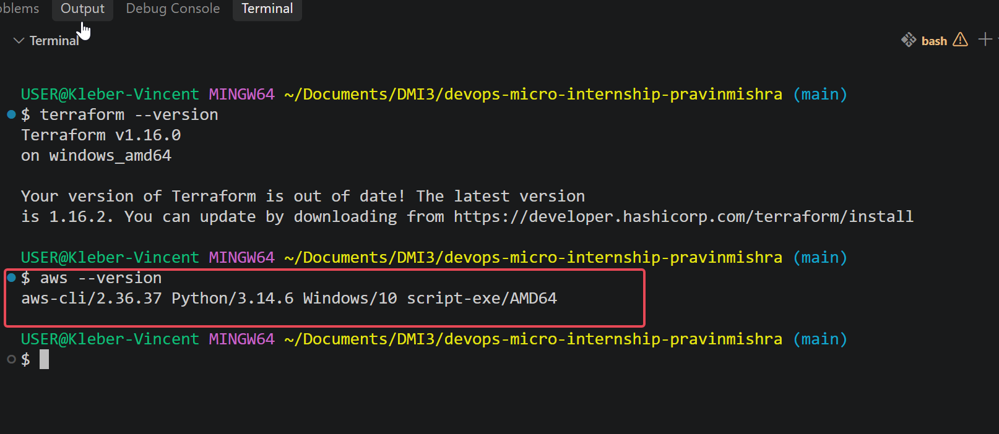

---

#### Screenshot 3 — VS Code showing the HashiCorp Terraform extension installed and enabled

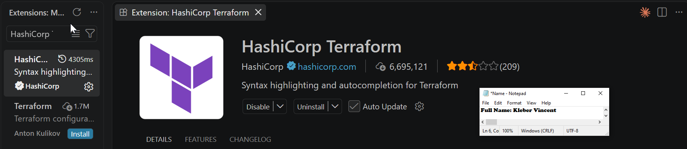

---

# Task 1 — Create the Modular Terraform Project

## Goal

Create the Terraform project and organize the AWS infrastructure into separate `network`, `ec2`, and `rds` modules, matching the exact structure required by the assignment brief.

```bash
mkdir terraform-aws-epicbook
cd terraform-aws-epicbook
code .
```

* `mkdir terraform-aws-epicbook` creates a dedicated project folder, kept fully separate from the earlier single-file AWS EC2 project.
* `cd terraform-aws-epicbook` moves into it.
* `code .` opens the folder in VS Code.

I generated a dedicated SSH key pair for this project rather than reusing the one from the earlier AWS EC2 hands-on learning practice, keeping each project's access isolated from the others:

```bash
ssh-keygen -t rsa -b 4096 -f ~/.ssh/epicbook-aws-key -N ""
ls -la ~/.ssh/epicbook-aws-key*
```

* `ssh-keygen -t rsa -b 4096 -f ~/.ssh/epicbook-aws-key -N ""` generates a new 4096-bit RSA key pair, with an empty passphrase since Terraform needs to read the public key non-interactively. This produces two files: `epicbook-aws-key` (the private key, never shared) and `epicbook-aws-key.pub` (the public key, safe to reference in Terraform).
* `ls -la ~/.ssh/epicbook-aws-key*` confirms both files exist.

I then created the root Terraform files and the three module directories, each with its own `main.tf`, `variables.tf`, and `outputs.tf`:

```bash
touch main.tf variables.tf outputs.tf terraform.tfvars
mkdir -p modules/network modules/ec2 modules/rds
touch modules/network/main.tf modules/network/variables.tf modules/network/outputs.tf
touch modules/ec2/main.tf modules/ec2/variables.tf modules/ec2/outputs.tf modules/ec2/user_data.sh
touch modules/rds/main.tf modules/rds/variables.tf modules/rds/outputs.tf
find . -type f -not -path "./.terraform/*"
```

* `touch main.tf variables.tf outputs.tf terraform.tfvars` creates the four root-level files. `main.tf` calls the three child modules, `variables.tf` declares root-level inputs, `outputs.tf` exposes the final EC2 public IP and RDS endpoint, and `terraform.tfvars` holds the database credentials separately so they never get hardcoded into `main.tf`.
* `mkdir -p modules/network modules/ec2 modules/rds` creates the three module folders in one command.
* Each `touch` command creates that module's three (or four, for `ec2`) files.
* `find . -type f -not -path "./.terraform/*"` lists every file created, confirming the structure matches the required layout.

A **module** in Terraform is a self-contained package of resources that can be reused, similar to a function in programming: `main.tf` is the function body (the actual resources it creates), `variables.tf` declares its inputs (like a function's parameters), and `outputs.tf` declares what it returns (like a function's return value). Splitting `network`, `ec2`, and `rds` into separate modules means each layer of the architecture can be reasoned about independently, and later modules can consume earlier ones' outputs as their own inputs.

### Evidence

#### Screenshot 4 — VS Code Explorer showing the complete root project and network, ec2, and rds module directory structure

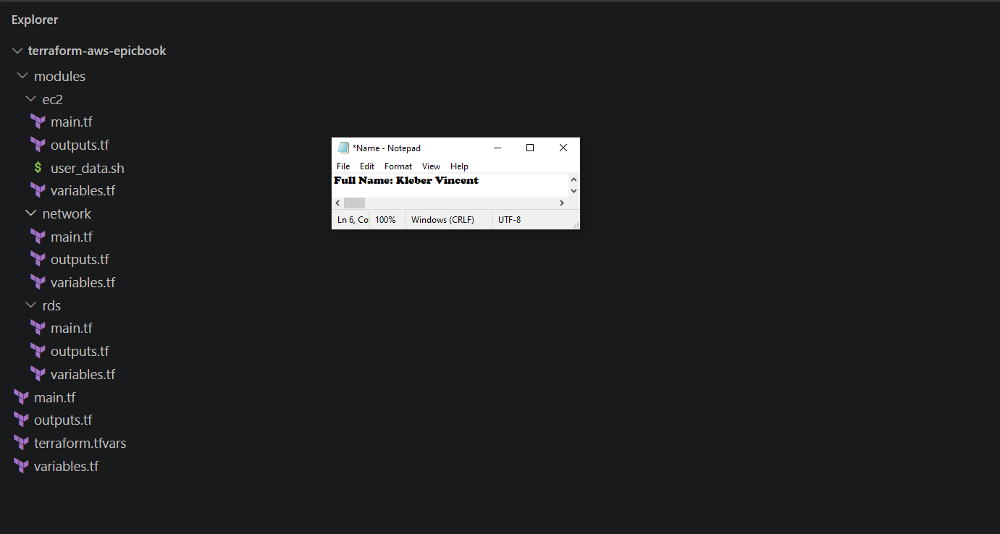

---

# Task 2 — Build the Network Module

## Goal

Create a reusable Terraform network module containing the VPC, subnets, Internet Gateway, routing, and Security Groups required by EpicBook, then expose the values the other two modules would need as outputs.

I built every resource in `modules/network/main.tf` by searching the AWS provider's Terraform Registry documentation resource by resource, adapting the example usage to my own values, rather than copying a pre-written solution.

**VPC**, with DNS settings explicitly enabled since Amazon RDS requires DNS resolution to work correctly inside the VPC (its connection endpoint is a hostname, not a static IP, so instances need DNS support to reach it):

```hcl
resource "aws_vpc" "main_epicbook" {
  cidr_block           = var.vpc_cidr
  enable_dns_support   = true
  enable_dns_hostnames = true

  tags = {
    Name = "Aws-New-Terraform-Network"
  }
}
```

`enable_dns_support` defaults to `true` already, but I set it explicitly for clarity. `enable_dns_hostnames` defaults to `false`, and had to be turned on, without it, the RDS endpoint hostname would not resolve correctly from inside the VPC.

**Three subnets**, the public subnet for EC2, and two private database subnets deliberately placed in different Availability Zones, since Amazon RDS requires a DB subnet group spanning at least two AZs for redundancy:

```hcl
resource "aws_subnet" "public" {
  vpc_id                  = aws_vpc.main_epicbook.id
  cidr_block              = var.public_subnet_cidr
  availability_zone       = var.availability_zone_a
  map_public_ip_on_launch = true

  tags = {
    Name = "EpicBook-Public-Subnet"
  }
}

resource "aws_subnet" "private_db_a" {
  vpc_id            = aws_vpc.main_epicbook.id
  cidr_block        = var.private_subnet_a_cidr
  availability_zone = var.availability_zone_a

  tags = {
    Name = "EpicBook-Private-DB-Subnet-A"
  }
}

resource "aws_subnet" "private_db_b" {
  vpc_id            = aws_vpc.main_epicbook.id
  cidr_block        = var.private_subnet_b_cidr
  availability_zone = var.availability_zone_b

  tags = {
    Name = "EpicBook-Private-DB-Subnet-B"
  }
}
```

**Internet Gateway, public route table, and the association**, connecting only the public subnet to the internet:

```hcl
resource "aws_internet_gateway" "gw" {
  vpc_id = aws_vpc.main_epicbook.id

  tags = {
    Name = "Terraform-IGW"
  }
}

resource "aws_route_table" "public" {
  vpc_id = aws_vpc.main_epicbook.id

  route {
    cidr_block = "0.0.0.0/0"
    gateway_id = aws_internet_gateway.gw.id
  }

  tags = {
    Name = "Public-Route-Table"
  }
}

resource "aws_route_table_association" "public" {
  subnet_id      = aws_subnet.public.id
  route_table_id = aws_route_table.public.id
}
```

I deliberately did not associate this route table with either private subnet. Without any route to the Internet Gateway, the two private database subnets fall back to the VPC's default internal-only route table, meaning nothing on the internet can ever reach RDS directly, even if someone knew its IP address.

**Two Security Groups**, one for EC2 (SSH and HTTP) and a separate one for RDS, restricted to only accept MySQL traffic from the EC2 Security Group itself, not from any IP range:

```hcl
resource "aws_security_group" "web_sg" {
  name        = "web-sg"
  description = "Allow SSH and HTTP inbound traffic and all outbound traffic"
  vpc_id      = aws_vpc.main_epicbook.id

  tags = {
    Name = "Web-Security-Group"
  }
}

resource "aws_vpc_security_group_ingress_rule" "allow_ssh" {
  security_group_id = aws_security_group.web_sg.id
  cidr_ipv4          = var.my_ip
  from_port          = 22
  ip_protocol        = "tcp"
  to_port            = 22
}

resource "aws_vpc_security_group_ingress_rule" "allow_http" {
  security_group_id = aws_security_group.web_sg.id
  cidr_ipv4          = "0.0.0.0/0"
  from_port          = 80
  ip_protocol        = "tcp"
  to_port            = 80
}

resource "aws_vpc_security_group_egress_rule" "allow_all_outbound" {
  security_group_id = aws_security_group.web_sg.id
  cidr_ipv4          = "0.0.0.0/0"
  ip_protocol        = "-1"
}

resource "aws_security_group" "rds_sg" {
  name        = "rds-sg"
  description = "Allow MySQL access only from the EC2 security group"
  vpc_id      = aws_vpc.main_epicbook.id

  tags = {
    Name = "RDS-Security-Group"
  }
}

resource "aws_vpc_security_group_ingress_rule" "allow_mysql_from_ec2" {
  security_group_id            = aws_security_group.rds_sg.id
  referenced_security_group_id = aws_security_group.web_sg.id
  from_port                    = 3306
  ip_protocol                  = "tcp"
  to_port                      = 3306
}
```

The `referenced_security_group_id` argument, rather than `cidr_ipv4`, is what enforces "MySQL only from the EC2 security group": it allows inbound traffic only from resources that are members of `web_sg`, regardless of what IP address they happen to have, rather than trusting a fixed IP range.

After writing all resources in hardcoded form and confirming them correct, I converted the project-specific values into real Terraform variables, to better understand how reusable modules are meant to work. In `modules/network/variables.tf`:

```hcl
variable "vpc_cidr" {
  description = "CIDR block for the VPC"
  type        = string
  default     = "10.0.0.0/16"
}

variable "public_subnet_cidr" {
  description = "CIDR block for the public subnet"
  type        = string
  default     = "10.0.1.0/24"
}

variable "private_subnet_a_cidr" {
  description = "CIDR block for private DB subnet A"
  type        = string
  default     = "10.0.2.0/24"
}

variable "private_subnet_b_cidr" {
  description = "CIDR block for private DB subnet B"
  type        = string
  default     = "10.0.3.0/24"
}

variable "availability_zone_a" {
  description = "Availability Zone for public subnet and private DB subnet A"
  type        = string
  default     = "us-east-1a"
}

variable "availability_zone_b" {
  description = "Availability Zone for private DB subnet B"
  type        = string
  default     = "us-east-1b"
}

variable "my_ip" {
  description = "Your public IP address, allowed to SSH into the EC2 instance"
  type        = string
  default     = "105.127.6.221/32"
}
```

I then updated `main.tf` to reference `var.vpc_cidr`, `var.public_subnet_cidr`, and so on, instead of the literal strings, and re-verified the file matched the original working version exactly, only the CIDR blocks, Availability Zones, and my IP address became variable references rather than hardcoded literals.

Last, `modules/network/outputs.tf` exposes six values consumed later by the `ec2` and `rds` modules:

```hcl
output "my_vpc" {
  value = aws_vpc.main_epicbook.id
}
output "public_subnet" {
  value = aws_subnet.public.id
}
output "private_db_subnet_a" {
  value = aws_subnet.private_db_a.id
}
output "private_db_subnet_b" {
  value = aws_subnet.private_db_b.id
}
output "ec2_security_group" {
  value = aws_security_group.web_sg.id
}
output "rds_security_group" {
  value = aws_security_group.rds_sg.id
}
```

### Evidence

#### Screenshot 5 — VS Code showing the VPC, public subnet, and two private database subnet configurations

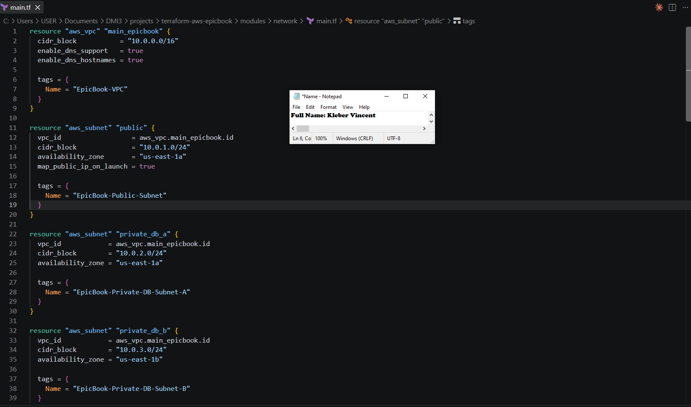

---

#### Screenshot 6 — VS Code showing the Internet Gateway, public route table, and route table association

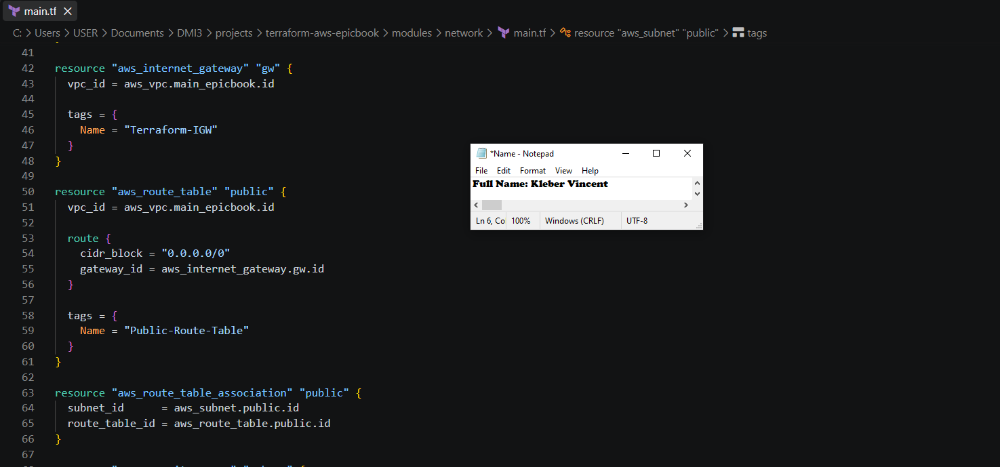

---

#### Screenshot 7 — VS Code showing the EC2 and RDS Security Groups, including MySQL access from the EC2 Security Group only

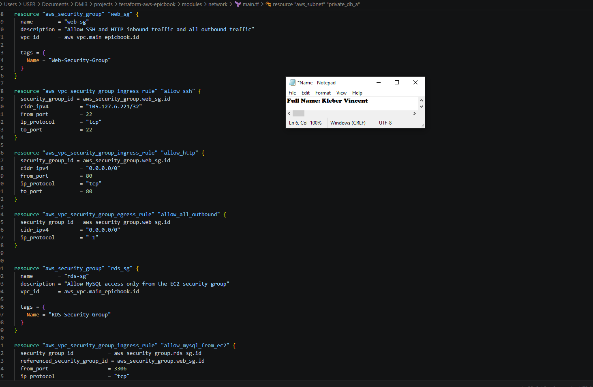

---

#### Screenshot 8 — VS Code showing the network module outputs

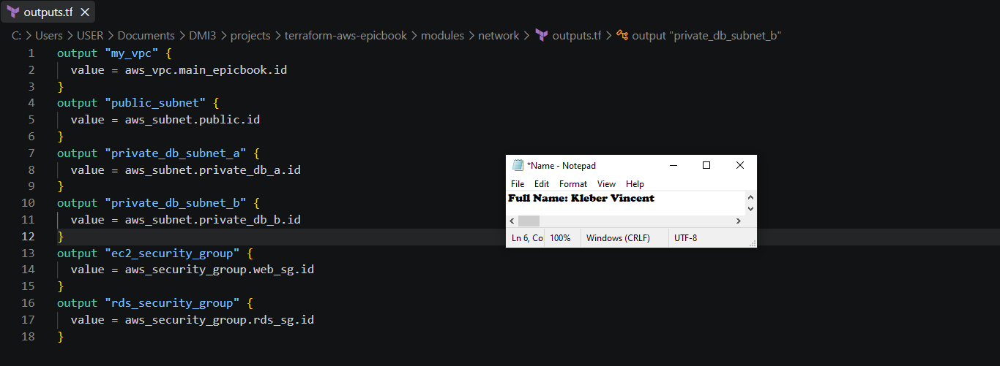

---

# Task 3 — Build the EC2 Module and User Data Installation Script

## Goal

Create an EC2 module that launches the EpicBook application server inside the public subnet, using values passed in from the network module rather than resources defined directly inside this module, and automatically install the required server software using EC2 `user_data`.

Since `ec2` is a separate module from `network`, it cannot see `network`'s resources directly. It needs its own input variables, filled in later by the root module using `network`'s outputs:

```hcl
variable "public_subnet_id" {
  description = "The public subnet ID from the network module"
  type        = string
}

variable "ec2_security_group_id" {
  description = "The EC2 security group ID from the network module"
  type        = string
}
```

**SSH key pair and AMI lookup**, in `modules/ec2/main.tf`:

```hcl
resource "aws_key_pair" "deployer" {
  key_name   = "epicbook-aws-key"
  public_key = file("C:/Users/USER/.ssh/epicbook-aws-key.pub")
}

data "aws_ami" "ubuntu" {
  most_recent = true
  owners      = ["099720109477"] # Canonical's official AWS account ID

  filter {
    name   = "name"
    values = ["ubuntu/images/hvm-ssd/ubuntu-jammy-22.04-amd64-server-*"]
  }
}
```

The `file()` function needed a Windows-style path (`C:/Users/USER/...`) rather than the Git Bash Unix-style path (`/c/Users/USER/...`), since the Terraform binary is a native Windows program and does not translate Git Bash's path format. A **data source** (`data "aws_ami"`), unlike a `resource`, does not create anything, it queries AWS at plan time for information; here, it always finds the current latest matching Ubuntu 22.04 AMI (Amazon Machine Image, the OS template an instance boots from), so the configuration never goes stale from a hardcoded, eventually-deprecated AMI ID.

**EC2 instance**, referencing the network module's values through variables rather than local resource names:

```hcl
resource "aws_instance" "web" {
  ami           = data.aws_ami.ubuntu.id
  instance_type = "t3.micro"

  subnet_id              = var.public_subnet_id
  vpc_security_group_ids = [var.ec2_security_group_id]
  key_name               = aws_key_pair.deployer.key_name

  associate_public_ip_address = true

  user_data = file("${path.module}/user_data.sh")

  tags = {
    Name = "EpicBook-EC2-Instance"
  }
}
```

`path.module` is a built-in Terraform value meaning "the folder this specific file lives in," so `"${path.module}/user_data.sh"` always resolves correctly to `modules/ec2/user_data.sh`, regardless of where `terraform apply` is actually run from.

I initially set `instance_type = "t2.micro"`, matching the earlier AWS EC2 hands-on learning practice, but `terraform apply` later rejected it as not Free Tier eligible on this AWS account. Confirming eligible types with:

```bash
aws ec2 describe-instance-types --filters "Name=free-tier-eligible,Values=true" --query "InstanceTypes[].InstanceType" --output table
```

showed `t3.micro` as eligible, so I switched to it.

`modules/ec2/user_data.sh` prepares the server only, installing the software EpicBook needs without configuring the application itself or handling any database credentials:

```bash
#!/bin/bash
set -e

# Update package lists
apt-get update -y

# Install base utilities
apt-get install -y curl git nginx mysql-client

# Install Node.js LTS (v20.x) via NodeSource
curl -fsSL https://deb.nodesource.com/setup_20.x | bash -
apt-get install -y nodejs

# Start and enable Nginx so it's running on boot
systemctl start nginx
systemctl enable nginx
```

* `set -e` stops the script immediately if any command fails, rather than continuing silently.
* `apt-get update -y` refreshes Ubuntu's package list.
* `apt-get install -y curl git nginx mysql-client` installs curl, Git, Nginx, and the MySQL client (not a full MySQL server, since the database itself lives in RDS, not on this instance).
* The NodeSource script adds a repository providing a current Node.js LTS release, since Ubuntu 22.04's built-in `apt` Node.js package is outdated.
* `systemctl start nginx` and `systemctl enable nginx` start Nginx immediately and ensure it restarts automatically on any future reboot.

`modules/ec2/outputs.tf` exposes the two values the root module needs:

```hcl
output "instance_id" {
  value = aws_instance.web.id
}

output "instance_public_ip" {
  value = aws_instance.web.public_ip
}
```

### Evidence

#### Screenshot 9 — VS Code showing the EC2 resource and user_data configuration

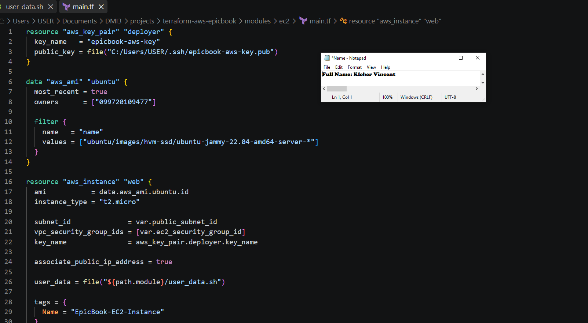

---

#### Screenshot 10 — VS Code showing user_data.sh

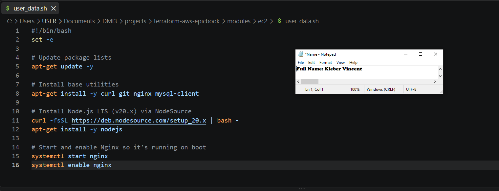

---

#### Screenshot 11 — VS Code showing the EC2 module variables and outputs

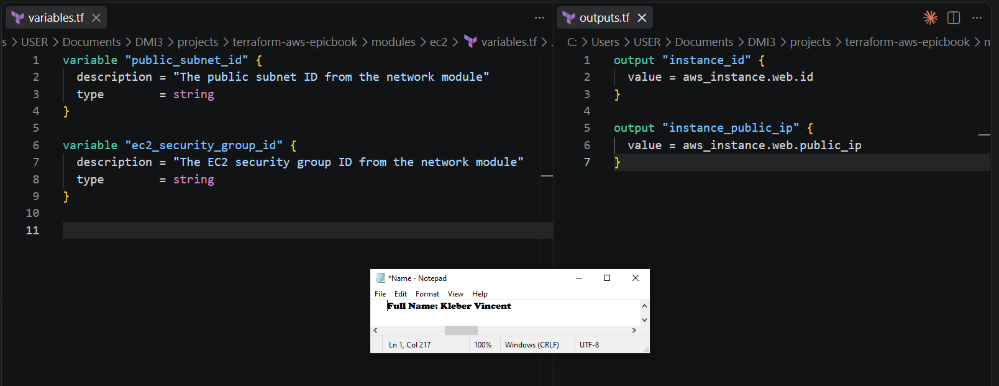

---

# Task 4 — Build the Amazon RDS Module

## Goal

Create an RDS module that provisions Amazon RDS for MySQL inside the two private database subnets, kept fully private and accessible only from the EC2 Security Group.

`modules/rds/variables.tf` declares the five inputs this module needs, including the database credentials, with the password explicitly marked `sensitive`:

```hcl
variable "private_subnet_a_id" {
  description = "RDS private subnet_a"
  type        = string
}

variable "private_subnet_b_id" {
  description = "RDS private subet_b"
  type        = string
}

variable "rds_security_group_id" {
  description = "The RDS security group ID from the network module, allows MySQL only from the EC2 security group"
  type        = string
}

variable "db_username" {
  description = "The database administrator username for RDS"
  type        = string
}

variable "db_password" {
  description = "The database administrator password for RDS"
  type        = string
  sensitive   = true
}
```

`sensitive = true` makes Terraform redact this value from console output during `plan` and `apply`, displaying `(sensitive value)` instead of the actual password. It does not encrypt the value inside the Terraform state file itself, which is precisely why `terraform.tfstate` files must never be committed to a public repository.

`modules/rds/main.tf` defines the DB subnet group (spanning both private subnets, satisfying RDS's multi-AZ requirement) and the RDS instance itself:

```hcl
resource "aws_db_subnet_group" "epicbookdb" {
  name       = "epicbook-subnet-group"
  subnet_ids = [var.private_subnet_a_id, var.private_subnet_b_id]

  tags = {
    Name = "Epicbook_subnet_group"
  }
}

resource "aws_db_instance" "epicbook" {
  identifier     = "epicbook-db"
  engine         = "mysql"
  engine_version = "8.0"
  instance_class = "db.t3.micro"

  allocated_storage = 20

  db_subnet_group_name   = aws_db_subnet_group.epicbookdb.name
  vpc_security_group_ids = [var.rds_security_group_id]

  username = var.db_username
  password = var.db_password

  publicly_accessible = false
  skip_final_snapshot  = true

  tags = {
    Name = "EpicBook-RDS-MySQL"
  }
}
```

`publicly_accessible = false` is what actually makes the database unreachable from the internet, a separate, additional layer of protection on top of the security group rules. `skip_final_snapshot = true` tells AWS to skip taking a mandatory final backup on deletion, appropriate here since this is a temporary lab database being intentionally torn down, not a production system.

`modules/rds/outputs.tf` exposes only the connection endpoint, deliberately never the password:

```hcl
output "rds_endpoint" {
  value = aws_db_instance.epicbook.endpoint
}
```

### Evidence

#### Screenshot 12 — VS Code showing the DB subnet group and RDS MySQL configuration

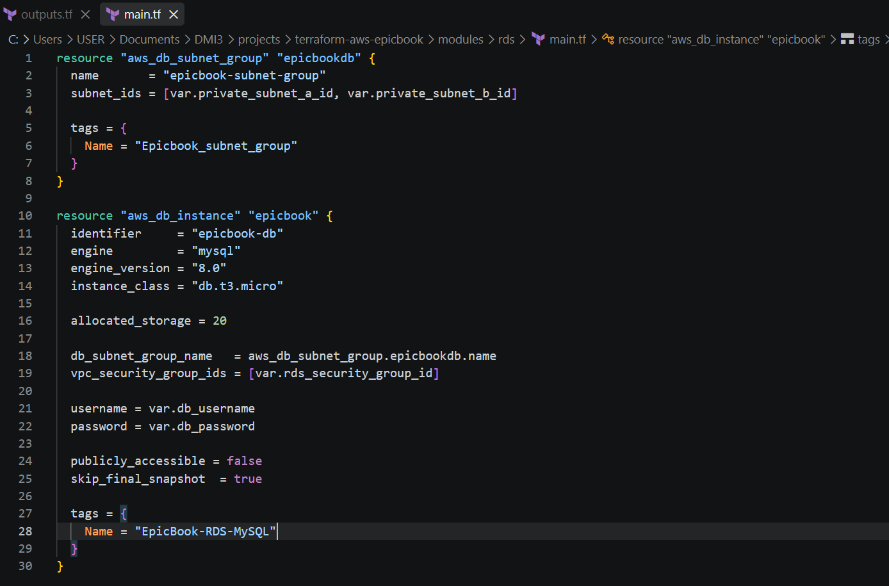

---

#### Screenshot 13 — VS Code showing publicly_accessible = false, the RDS Security Group reference, and the sensitive database variable configuration

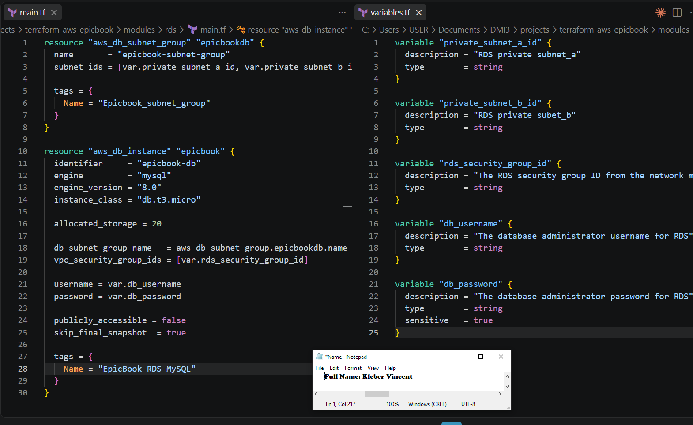

---

#### Screenshot 14 — VS Code showing the RDS endpoint output

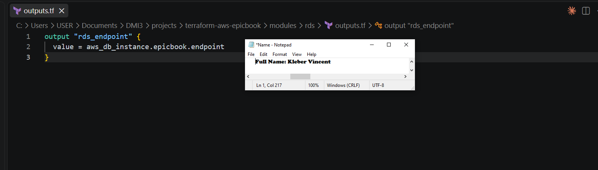

---

# Task 5 — Connect the Terraform Modules from the Root Module

## Goal

Use the root Terraform configuration to call the Network, EC2, and RDS modules and pass values between them, the connective layer that turns three independent modules into one working system.

Root `main.tf`:

```hcl
terraform {
  required_providers {
    aws = {
      source  = "hashicorp/aws"
      version = "6.64.0"
    }
  }
}

provider "aws" {
  region = "us-east-1"
}

module "network" {
  source = "./modules/network"
}

module "ec2" {
  source = "./modules/ec2"

  public_subnet_id      = module.network.public_subnet
  ec2_security_group_id = module.network.ec2_security_group
}

module "rds" {
  source = "./modules/rds"

  private_subnet_a_id   = module.network.private_db_subnet_a
  private_subnet_b_id   = module.network.private_db_subnet_b
  rds_security_group_id = module.network.rds_security_group

  db_username = var.db_username
  db_password = var.db_password
}
```

The `terraform` and `provider "aws"` blocks only ever go in the root module, never inside a child module, since provider configuration (region, credentials) is a global concern the root controls, keeping child modules reusable across different regions or accounts. `module "network" { source = "./modules/network" }` calls a module, pointing at its folder. `module.network.public_subnet` reaches into that module's outputs, following the pattern `module.<module_name>.<output_name>`. This root `main.tf` contains zero direct `resource` blocks, only `module` calls, exactly the "Root Module → Network, EC2, RDS Modules" architecture the assignment describes.

Root `variables.tf`:

```hcl
variable "db_username" {
  description = "The database administrator username for RDS"
  type        = string
}

variable "db_password" {
  description = "The database administrator password for RDS"
  type        = string
  sensitive   = true
}
```

Root `outputs.tf`:

```hcl
output "ec2_public_ip" {
  value = module.ec2.instance_public_ip
}

output "rds_endpoint" {
  value = module.rds.rds_endpoint
}
```

Root `terraform.tfvars` (excluded from version control):

```hcl
db_username = "admin"
db_password = "<a genuinely private password, chosen after this file was first drafted>"
```

Since `terraform.tfvars` holds the real database password in plaintext, I created a `.gitignore` file at the project root before touching any Git commands for this project:

terraform.tfvars
*.tfstate
.tfstate.
.terraform/
.terraform.lock.hcl
*.pem


### Evidence

#### Screenshot 15 — VS Code showing the root main.tf with the Network, EC2, and RDS module blocks

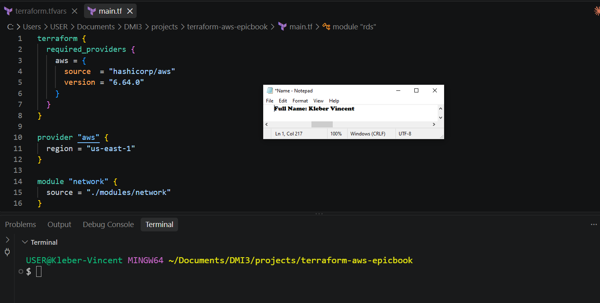

---

#### Screenshot 16 — VS Code showing values passed from the network module to the EC2 and RDS modules

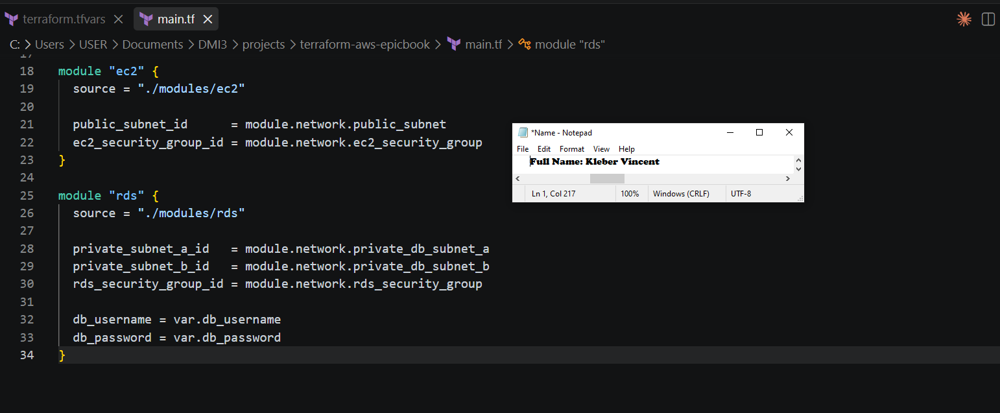

---

#### Screenshot 17 — VS Code showing the root EC2 public IP and RDS endpoint outputs

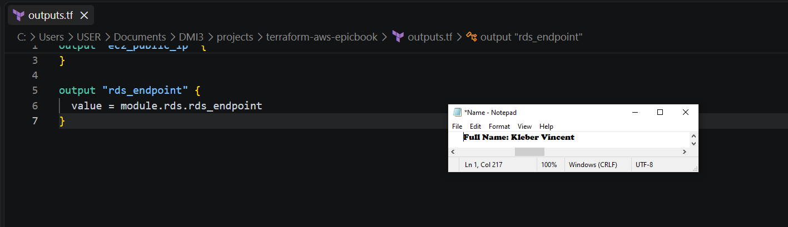

---

# Task 6 — Initialize, Validate, Plan, and Apply the Terraform Configuration

## Goal

Initialize the modular Terraform project, validate the configuration, review the execution plan, and provision the complete AWS infrastructure.

```bash
terraform init
```

* `terraform init` reads the `required_providers` block, downloads the matching AWS provider plugin, and detects the local child modules referenced from the root.

This completed cleanly the first time, confirming Terraform was ready for further commands.

```bash
terraform validate
```

* `terraform validate` checks the configuration's syntax and internal consistency (like duplicate resource declarations or type mismatches) without touching AWS at all. This returned `Success! The configuration is valid.`

```bash
terraform plan
```

* `terraform plan` compares the full configuration, across all three modules, against the current state of AWS (nothing yet) and shows exactly what it intends to create. This first attempt failed with `InvalidClientTokenId: The security token included in the request is invalid`, since the AWS CLI credentials configured on this machine had become invalid at some point after the earlier AWS EC2 hands-on learning practice. I confirmed this was a credentials problem independent of Terraform by running `aws sts get-caller-identity`, which failed identically. I generated a fresh Access Key ID and Secret Access Key through the IAM Console for the same IAM user (`ubani`, created specifically for programmatic CLI/Terraform access, separate from the root account login), ran `aws configure` again with the new key, and confirmed authentication worked before retrying `terraform plan`. This time it succeeded, listing all 17 resources across the three modules and ending with `Plan: 17 to add, 0 to change, 0 to destroy.`

```bash
terraform apply
```

* `terraform apply` shows the plan again and, after confirming with `yes`, actually creates every resource in AWS in the correct dependency order.

The first `apply` attempt failed on two separate resources simultaneously:

* The EC2 instance failed with `InvalidParameterCombination: The specified instance type is not eligible for Free Tier`, resolved by switching `instance_type` from `t2.micro` to the confirmed-eligible `t3.micro`.
* The RDS instance failed with `InvalidParameterValue: The parameter MasterUserPassword is not a valid password. Only printable ASCII characters besides '/', '@', '"', ' ' may be used`, resolved by changing the password in `terraform.tfvars` to avoid those four forbidden characters.

All 15 networking resources (VPC, subnets, IGW, route table, association, both security groups and their rules) had already been created successfully on the first attempt, so re-running `terraform apply` after fixing both issues only needed to create the two remaining resources, the EC2 instance and the RDS database. This completed successfully: `Apply complete! Resources: 2 added, 0 changed, 0 destroyed.` RDS specifically took 5 minutes 24 seconds to finish provisioning, notably longer than EC2 alone.

```bash
terraform output
```

This printed both root outputs:

ec2_public_ip = "100.62.94.243"
rds_endpoint = "epicbook-db.covuaggiwyn9.us-east-1.rds.amazonaws.com:3306"


### Evidence

#### Screenshot 18 — Terminal showing successful terraform init

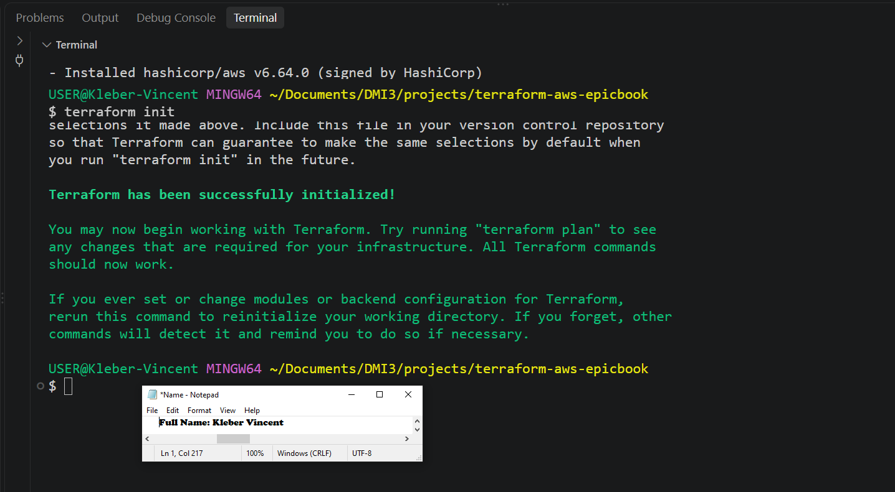

---

#### Screenshot 19 — Terminal showing successful terraform validate

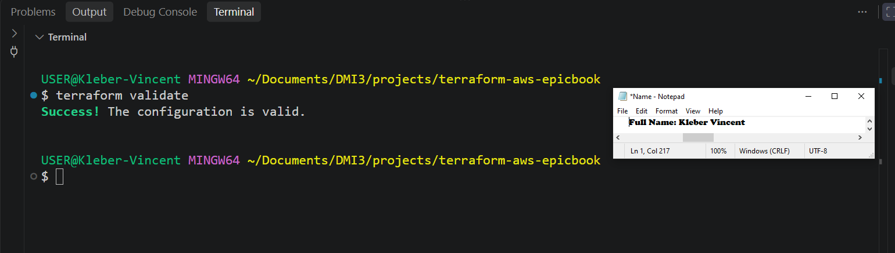

---

#### Screenshot 20 — Terraform plan summary showing the proposed resources

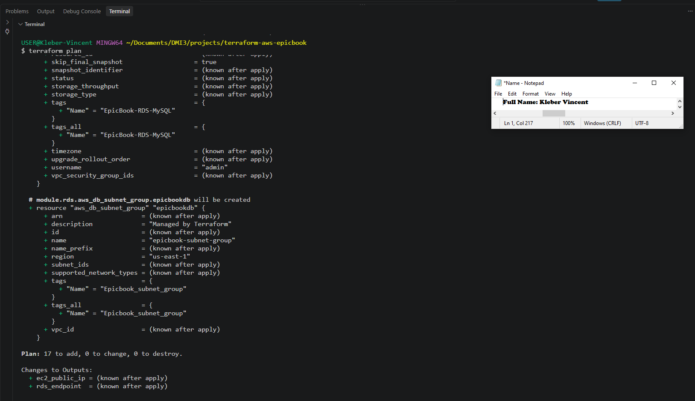

---

#### Screenshot 21 — Terraform apply output showing successful completion

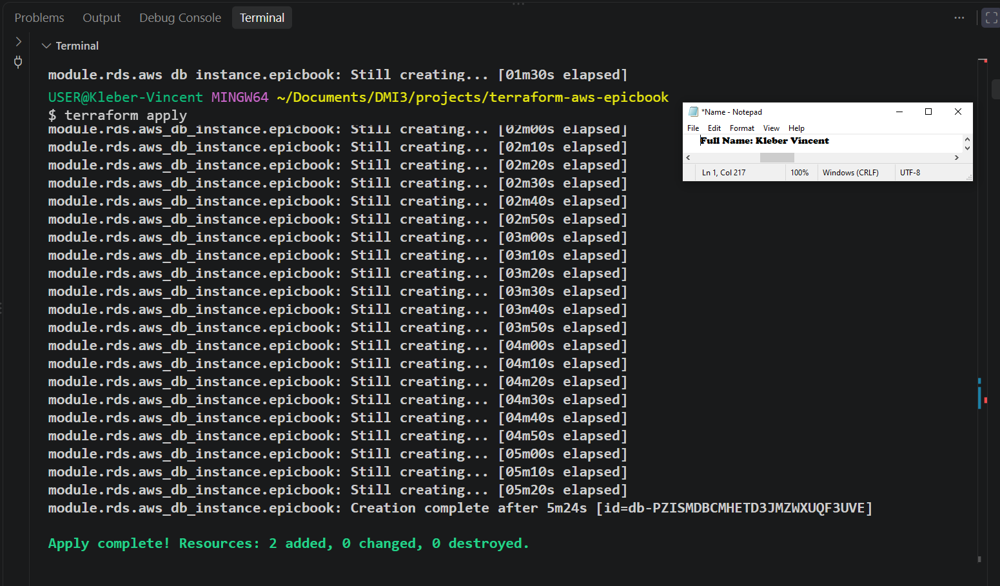

---

#### Screenshot 22 — Terraform output showing the EC2 public IP and RDS endpoint

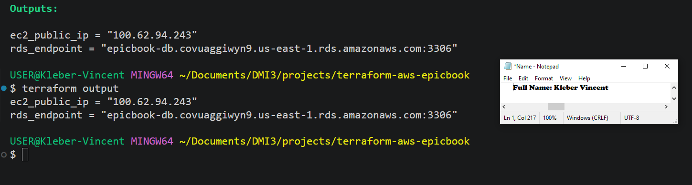

---

# Task 7 — Verify EC2, User Data, and Amazon RDS

## Goal

Confirm through AWS CLI that the EC2 and RDS resources were successfully provisioned, and confirm the EC2 user data script installed the required software.

```bash
aws ec2 describe-instances --region us-east-1 --filters "Name=instance-state-name,Values=running" --query "Reservations[].Instances[].{InstanceId:InstanceId,State:State.Name,PublicIP:PublicIpAddress}" --output table
```

* This filters for running instances and reshapes the response into a readable table of instance ID, state, and public IP. Confirmed instance `i-0b252fa15c20f87b8` in state `running` with public IP `100.62.94.243`, matching the Terraform output exactly.

```bash
aws rds describe-db-instances --region us-east-1 --query "DBInstances[].{Identifier:DBInstanceIdentifier,Status:DBInstanceStatus,PubliclyAccessible:PubliclyAccessible,Endpoint:Endpoint.Address}" --output table
```

* This confirms the RDS instance's status, public accessibility, and endpoint. Confirmed `Status: available`, `PubliclyAccessible: False`, and an endpoint matching Terraform's output.

I then connected to the EC2 instance over SSH to verify the software installed by `user_data.sh`:

```bash
ssh -i ~/.ssh/epicbook-aws-key ubuntu@100.62.94.243
```

The first two attempts timed out with `Connection timed out` on port 22. This was because my own public IP address had changed since I originally wrote the `my_ip` variable's default value, and the `web_sg` security group only trusted the old IP, silently dropping connection attempts from anywhere else rather than returning an explicit error. I confirmed my current IP with `curl https://checkip.amazonaws.com`, updated the `my_ip` variable's default in `modules/network/variables.tf` to the new address, and re-ran `terraform apply`. Since only the SSH ingress rule's `cidr_ipv4` value changed, Terraform updated only that one rule, leaving everything else untouched. SSH then connected successfully.

Once connected:

```bash
cloud-init status
node --version
npm --version
git --version
nginx -v
mysql --version
sudo systemctl status nginx --no-pager
```

* `cloud-init status` confirmed `status: done`, meaning the `user_data.sh` bootstrap script had fully finished running.
* Each version check confirmed the corresponding software: Node.js v20.20.2, npm 10.8.2, Git 2.34.1, Nginx 1.18.0, MySQL client 8.0.46.
* `sudo systemctl status nginx --no-pager` confirmed Nginx was `active (running)`, started automatically at boot by the `systemctl enable nginx` line in `user_data.sh`.

### Evidence

#### Screenshot 23 — AWS CLI showing the EC2 instance running

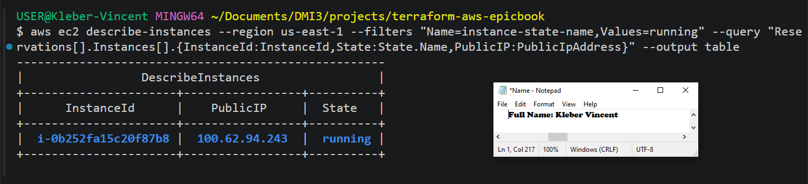

---

#### Screenshot 24 — AWS CLI showing RDS available and not publicly accessible

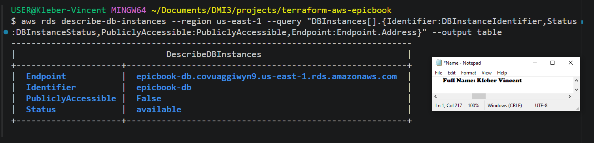

---

#### Screenshot 25 — EC2 terminal showing the required software version checks and active Nginx service

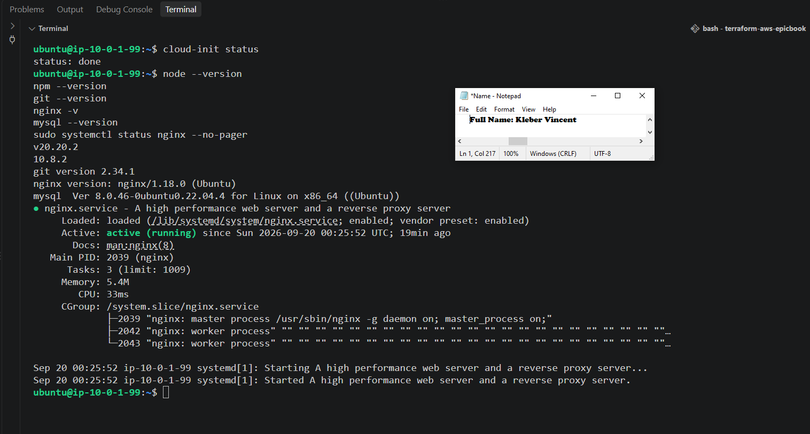

---

# Task 8 — Prepare the EpicBook Database

## Goal

Connect from EC2 to Amazon RDS, create the EpicBook database, import the schema and seed data, and verify the database contents, all performed manually over the same SSH session, since the `user_data.sh` script deliberately did not automate any of this.

```bash
cd ~
git clone https://github.com/pravinmishraaws/theepicbook.git
cd ~/theepicbook
```

* Cloned the EpicBook application repository into the instance's home directory.

```bash
mysql -h epicbook-db.covuaggiwyn9.us-east-1.rds.amazonaws.com -u admin -p
```

* Connected directly to the RDS endpoint using the MySQL client installed earlier. This confirmed the full security chain (`web_sg` → `rds_sg` on port 3306) genuinely worked end to end, not just on paper. The password prompt never displays the typed characters, so no credential was exposed on screen.

Inside the MySQL prompt:

```sql
SHOW DATABASES;
CREATE DATABASE bookstore;
USE bookstore;
SHOW TABLES;
EXIT;
```

Created the `bookstore` database, confirmed with an initially empty `SHOW TABLES;` result.

```bash
mysql -h epicbook-db.covuaggiwyn9.us-east-1.rds.amazonaws.com -u admin -p bookstore < ~/theepicbook/db/BuyTheBook_Schema.sql
```

* Imported the schema, creating the `Author`, `Book`, and `Cart` tables, confirmed via `DESCRIBE Author;` and `DESCRIBE Book;`, which also showed `Book.AuthorId` correctly indexed as a foreign key reference to `Author`.

```bash
mysql -h epicbook-db.covuaggiwyn9.us-east-1.rds.amazonaws.com -u admin -p bookstore < ~/theepicbook/db/author_seed.sql
mysql -h epicbook-db.covuaggiwyn9.us-east-1.rds.amazonaws.com -u admin -p bookstore < ~/theepicbook/db/books_seed.sql
```

* Imported author and book seed data. Verified with `SELECT * FROM Author;`, returning 53 authors (including J.K. Rowling, George Orwell, Chinua Achebe), and `SELECT id, title, bookDescription FROM Book LIMIT 5;`, returning genuine book titles and descriptions.

### Evidence

#### Screenshot 26 — Terminal showing successful EC2-to-RDS connection

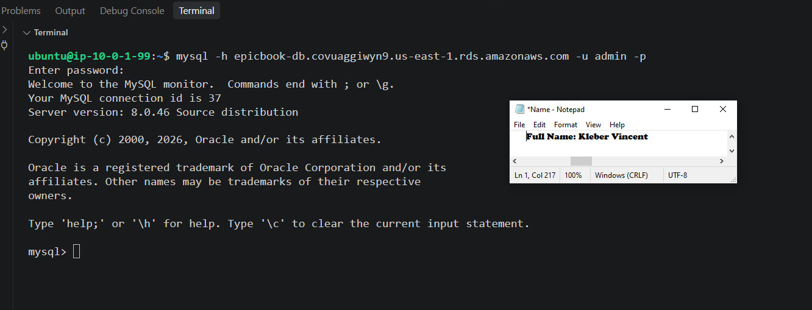

---

#### Screenshot 27 — Terminal showing the EpicBook tables and imported data

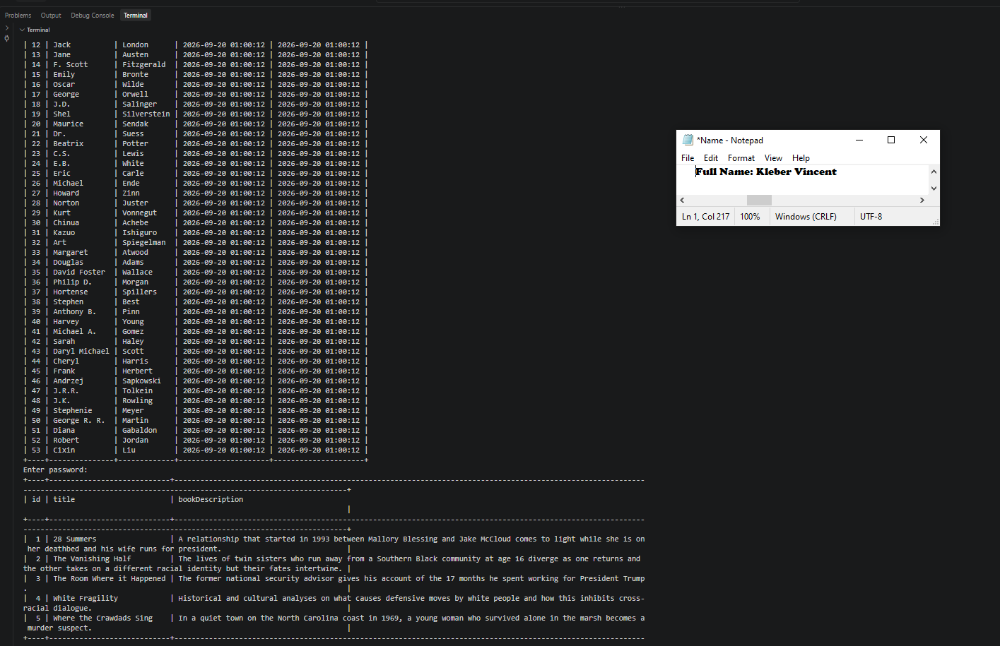

---

# Task 9 — Deploy and Configure the EpicBook Application

## Goal

Install EpicBook's dependencies, configure the application to use Amazon RDS, configure Nginx as a reverse proxy, and start the application.

```bash
cd ~/theepicbook
npm install
```

* Installed 357 packages. Confirmed with `ls` that `node_modules` now existed alongside the project's other files.

```bash
nano config/config.json
```

I edited the `"development"` block to point at the real RDS connection details:

```json
"development": {
  "username": "admin",
  "password": "<the real RDS password, never re-screenshotted>",
  "database": "bookstore",
  "host": "epicbook-db.covuaggiwyn9.us-east-1.rds.amazonaws.com",
  "port": 3306,
  "dialect": "mysql"
},
```

My first edit changed `username`, `password`, and `port`, but left `"host": "127.0.0.1"` (localhost) unchanged, which would have made EpicBook try to connect to a MySQL server on the instance itself, one was never installed there, only the client was, so this would have silently failed. I caught this before starting the app and corrected `host` to the actual RDS endpoint.

**Nginx reverse proxy configuration:**

```bash
sudo rm -f /etc/nginx/sites-enabled/default
sudo nano /etc/nginx/sites-available/epicbook
```

Config file content:

```nginx
server {
    listen 80;
    server_name _;

    location / {
        proxy_pass http://127.0.0.1:8080;
        proxy_http_version 1.1;
        proxy_set_header Upgrade $http_upgrade;
        proxy_set_header Connection 'upgrade';
        proxy_set_header Host $host;
        proxy_cache_bypass $http_upgrade;
    }
}
```

A **reverse proxy** sits in front of an application and forwards incoming requests to it, letting visitors reach the app through a standard port (80) while the app itself runs on a different internal port (8080) they never interact with directly.

```bash
sudo ln -s /etc/nginx/sites-available/epicbook /etc/nginx/sites-enabled/epicbook
sudo nginx -t
sudo systemctl restart nginx
sudo systemctl status nginx --no-pager
```

* Enabled the new site, tested the config for syntax errors (`configuration file ... test is successful`), restarted Nginx, and confirmed it was `active (running)`.

```bash
cd ~/theepicbook
npm run start
```

The first attempt failed immediately:

SyntaxError: /home/ubuntu/theepicbook/config/config.json: Expected ',' or '}' after property value in JSON at position 196


JSON requires exact, strict syntax, a missing comma anywhere breaks the entire file. Reopening `config/config.json` and comparing it line by line against the correct structure found the issue (a missing comma introduced during editing) and fixed it. Re-running `npm run start` this time succeeded, with Sequelize (the ORM EpicBook uses) automatically creating two additional tables the schema import had not covered (`Checkout` and `Cartbook`), confirming a genuine, authenticated connection all the way through to the private RDS database, ending in:

App listening on PORT 8080


From a second, separate SSH session (since the first was now occupied running the server in the foreground):

```bash
ssh -i ~/.ssh/epicbook-aws-key ubuntu@100.62.94.243
ss -tulpn | grep 8080
```

Confirmed `tcp LISTEN` on `*:8080`, owned by a `node` process, verifying from the operating system's own perspective that the app was genuinely listening.

### Evidence

#### Screenshot 28 — Terminal showing successful dependency installation and node_modules

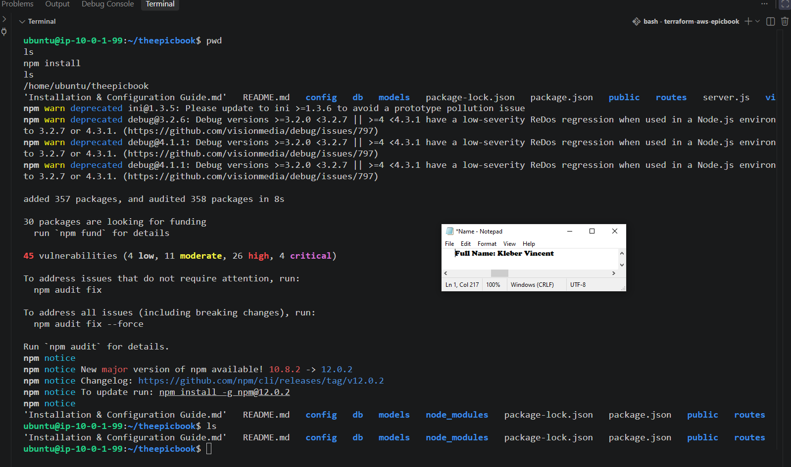

---

#### Screenshot 29 — Terminal showing successful Nginx configuration test and active status

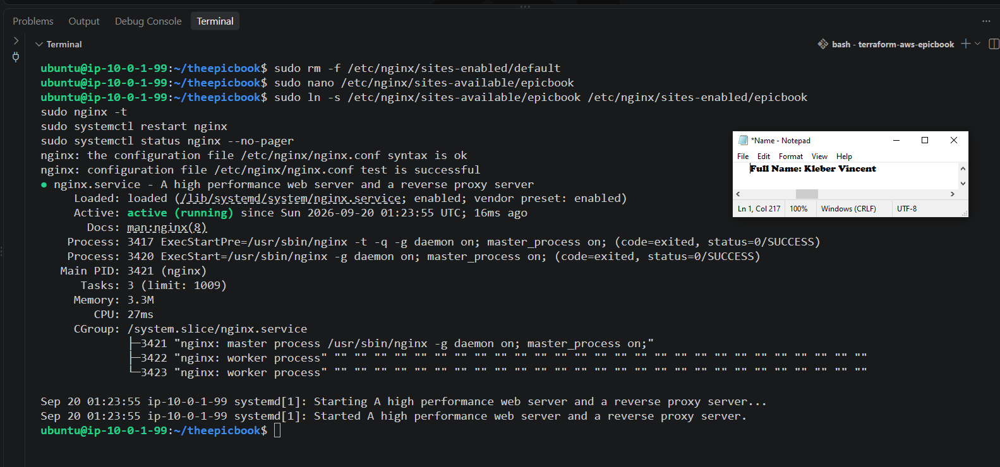

---

#### Screenshot 30 — Terminal showing EpicBook running/listening on port 8080

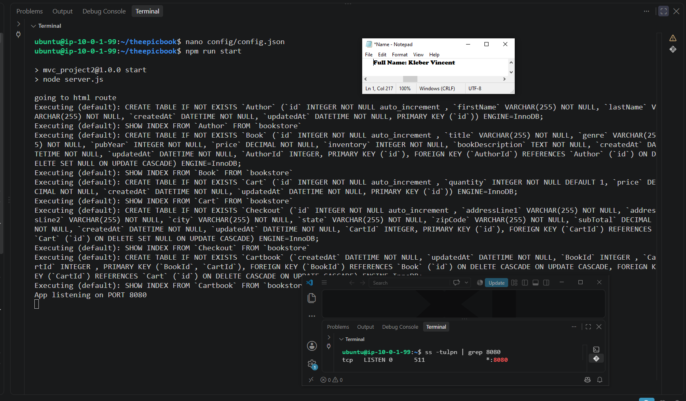

---

# Task 10 — Test End-to-End Functionality

## Goal

Verify that EpicBook, EC2, Nginx, and Amazon RDS work together successfully, from a real browser all the way down to a real database record.

```bash
curl -I http://localhost:8080
```

* Returned `HTTP/1.1 200 OK`, `X-Powered-By: Express`, confirming the Node.js app itself responded correctly, bypassing Nginx entirely.

I then opened a browser on my local machine and visited `http://100.62.94.243`, with no port number, confirming Nginx's reverse proxy was correctly forwarding port 80 traffic to the app's port 8080. EpicBook's homepage loaded correctly, showing the book gallery populated with real cover images and titles pulled from the seed data imported in Task 8 ("28 Summers," "The Little Astronaut," "The Room Where it Happened," with authors like F. Scott Fitzgerald and George Orwell).

**EC2 Public IP URL:** `http://100.62.94.243`

**Cart test.** First, confirmed the cart was empty:

```bash
mysql -h epicbook-db.covuaggiwyn9.us-east-1.rds.amazonaws.com -u admin -p -e "USE bookstore; SELECT * FROM Cart;"
```

Then added "28 Summers" to the cart in the browser, and re-ran the same query, this time returning a new row (`id: 1, quantity: 1, price: 28.00`), timestamped to match the browser action, confirming the browser action genuinely wrote to the private RDS database.

**Checkout test.** Clicking the CHECKOUT button in the browser returned "Your order is placed!" Re-running:

```bash
mysql -h epicbook-db.covuaggiwyn9.us-east-1.rds.amazonaws.com -u admin -p -e "USE bookstore; SELECT * FROM Checkout;"
```

returned an empty result, unexpected given the success message. Rather than assuming this meant something was broken, I investigated by scrolling back through the running `npm run start` server's logs, which showed Sequelize executing `SELECT sum(price) AS sum FROM Cart` followed immediately by `DELETE FROM Cart`, with no `INSERT INTO Checkout` anywhere in the sequence. I confirmed this further by searching the application's own route code:

```bash
cat ~/theepicbook/routes/*.js | grep -i checkout
```

This returned nothing at all, confirming there is genuinely no code anywhere in this application that writes to the `Checkout` table. EpicBook's sample checkout flow calculates the total, clears the cart, and displays a success message, it does not persist an order record. I verified the cart itself was now empty, matching the observed `DELETE FROM Cart`:

```bash
mysql -h epicbook-db.covuaggiwyn9.us-east-1.rds.amazonaws.com -u admin -p -e "USE bookstore; SELECT * FROM Cart;"
```

This is a genuine, documented behavior of this specific sample application, not a fault in the Terraform infrastructure, the RDS connection, or the Nginx configuration, all of which are independently proven working by the successful Cart insert and the app's overall responsiveness throughout this task.

### Evidence

#### Screenshot 31 — Browser showing EpicBook using the EC2 public IP

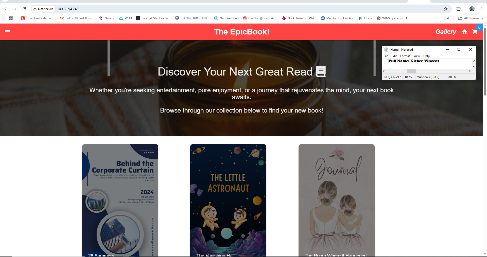

---

#### Screenshot 32 — Browser showing a successful cart action

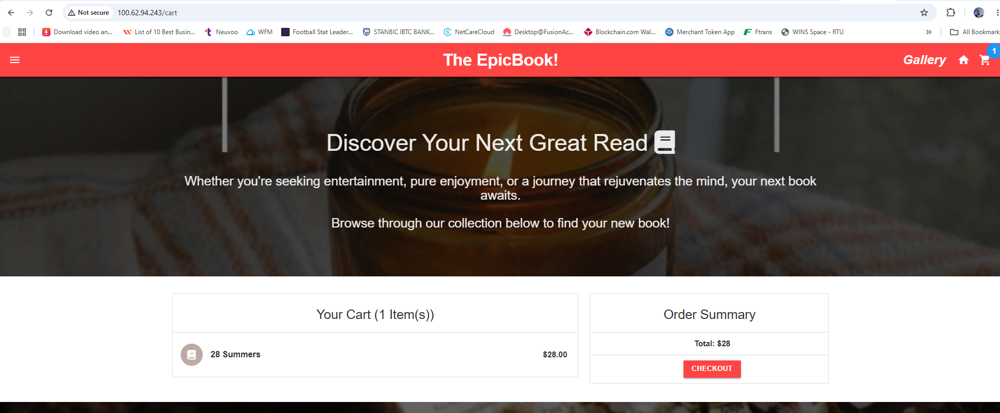

---

#### Screenshot 33 — Terminal showing the corresponding RDS database record created by the application action

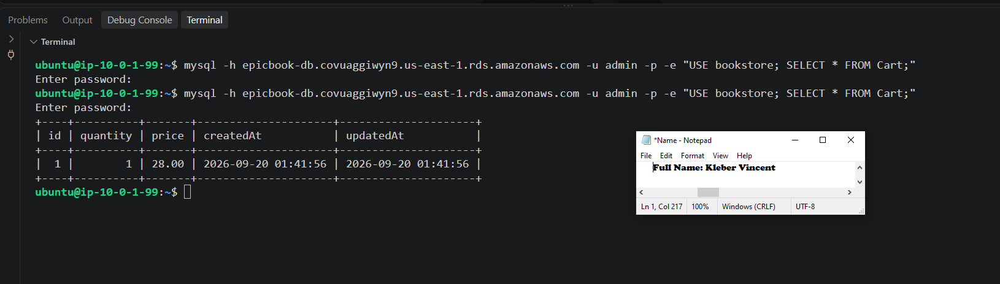

**Additional evidence (supplementary, documenting the checkout investigation):** the Cart table shown empty immediately after checkout, and the route code search confirming no `Checkout` table write exists in the application.


---

# Task 11 — Destroy the Terraform Infrastructure

## Goal

Remove all AWS resources created by the modular Terraform configuration.

```bash
terraform destroy
```

* `terraform destroy` reads the current state and tears down every resource Terraform created, in reverse dependency order.

Run from the local machine, not the EC2 instance's SSH session. Typed `yes` at the confirmation prompt. Destruction proceeded in roughly reverse creation order: the EC2 instance and RDS database first (since other resources depended on them existing), then security group rules and security groups, subnets, the route table and its association, the Internet Gateway, and finally the VPC last. RDS again took the longest of any single resource, 1 minute 54 seconds, consistent with how long it had taken to provision. Completed with:

Destroy complete! Resources: 17 destroyed.


### Evidence

#### Screenshot 34 — Terminal showing successful terraform destroy completion

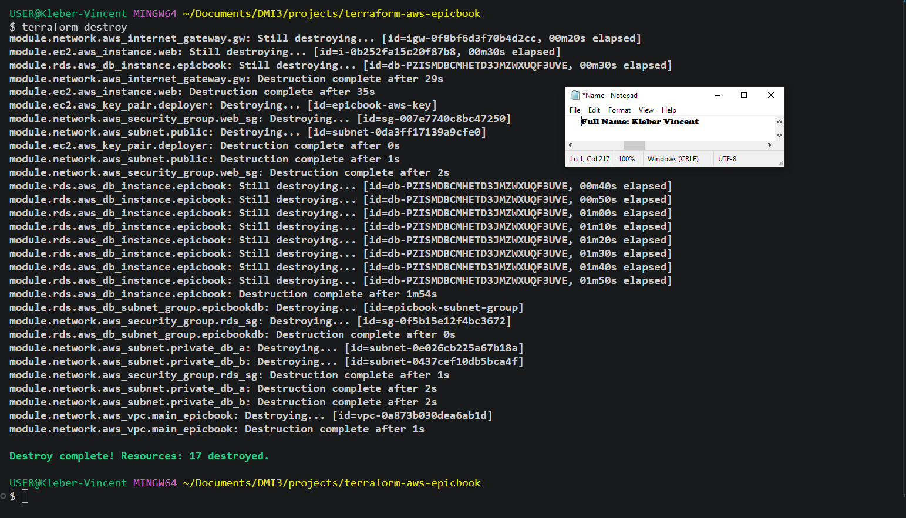

---

# Task 12 — LinkedIn Post (Mandatory)

## Goal

Share what I built and learned from this modular AWS Terraform deployment on LinkedIn, with at least one deployment screenshot as proof.

I initially reused an older cohort post and updated only its P.S. footer, but on review, its body described capabilities (an Elastic IP, a `user_data.sh` script that automatically cloned EpicBook and configured the database) that did not match what I actually built in this hands-on learning practice, the real deployment used a standard dynamic public IP and a `user_data.sh` script limited to software installation only, with the application itself deployed manually over SSH. I edited the post's body to accurately reflect the actual modules built, the real troubleshooting encountered (the AWS credential rotation, the Free Tier instance type rejection, the invalid RDS password character, the IP change that locked out SSH, and the checkout-flow investigation), and republished it.

### Evidence

#### Screenshot 35 — Published LinkedIn post showing the post and at least one deployment image/proof

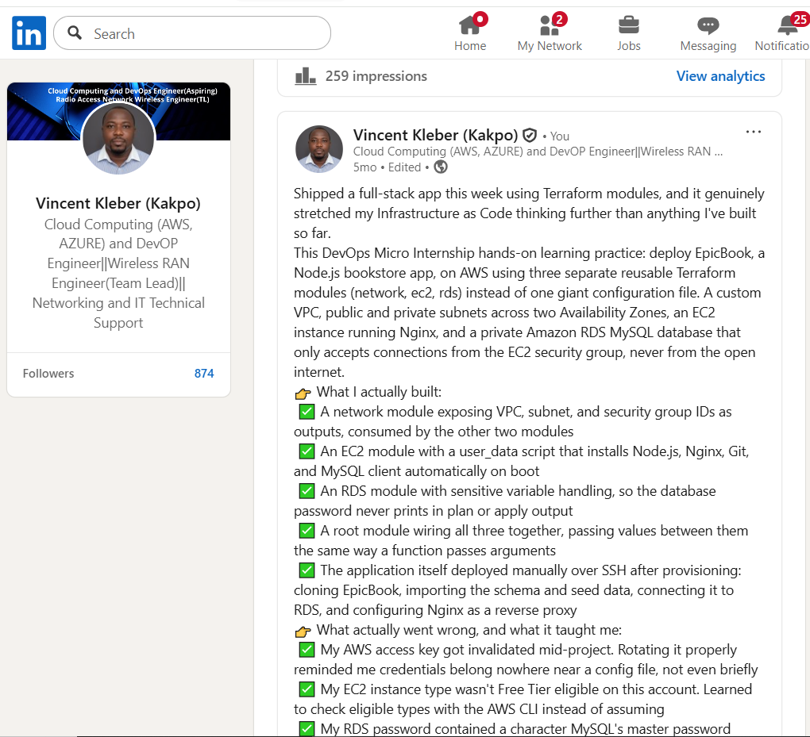

## LinkedIn Post URL

**LinkedIn Post URL:** `https://www.linkedin.com/posts/vincent-kleber-kakpo-8b920b88_shipped-a-full-stack-app-this-week-using-activity-7447494954115014656-WBjH`

---

# Submission Instructions

* Complete Tasks 0–12 in sequence.
* Include all Screenshots 1–35 exactly as specified.
* Ensure that your full name is visible in the required screenshots.
* Include the working EpicBook EC2 public IP URL.
* Include the published LinkedIn post URL.
* Include proof of frontend, backend, and database integration.
* Ensure that the required Terraform root files, module files, and user_data.sh are included in the GitHub submission.
* Do not upload Terraform state files, .pem files, or a terraform.tfvars file containing passwords or other sensitive values.
* Do not expose AWS credentials, account IDs, private SSH keys, RDS passwords, access tokens, Terraform sensitive values, or other confidential information.
* Review all screenshots and files carefully before submitting through GitHub.

---

# Completion Checklist

* [x] Installed and verified Terraform
* [x] Installed and verified AWS CLI
* [x] Configured AWS CLI
* [x] Confirmed the AWS Region
* [x] Installed the HashiCorp Terraform extension
* [x] Created the modular Terraform project
* [x] Created the root main.tf, variables.tf, and outputs.tf
* [x] Created the Network module
* [x] Created the EC2 module
* [x] Created the RDS module
* [x] Created the EC2 user_data.sh
* [x] Created VPC 10.0.0.0/16
* [x] Created public subnet 10.0.1.0/24
* [x] Created private DB subnet A 10.0.2.0/24
* [x] Created private DB subnet B 10.0.3.0/24
* [x] Used different Availability Zones for the database subnets
* [x] Created and attached the Internet Gateway
* [x] Created the public route table
* [x] Associated the public subnet with the public route table
* [x] Created the EC2 Security Group
* [x] Allowed HTTP port 80
* [x] Restricted SSH port 22
* [x] Created the RDS Security Group
* [x] Allowed MySQL port 3306 from the EC2 Security Group only
* [x] Exposed the required network module outputs
* [x] Defined the EC2 instance
* [x] Connected user_data.sh using the EC2 user_data argument
* [x] Configured EC2 with a public IP
* [x] Installed the required software using user data
* [x] Created the RDS DB subnet group
* [x] Created Amazon RDS for MySQL
* [x] Confirmed RDS is not publicly accessible
* [x] Configured sensitive database variables
* [x] Exposed the RDS endpoint
* [x] Connected all modules through the root module
* [x] Passed network outputs to EC2 and RDS
* [x] Added root EC2 public IP and RDS endpoint outputs
* [x] Completed terraform init
* [x] Completed terraform validate
* [x] Reviewed terraform plan
* [x] Completed terraform apply
* [x] Verified EC2 is running
* [x] Verified RDS is available
* [x] Verified user data installation
* [x] Connected to EC2 using SSH
* [x] Cloned EpicBook
* [x] Created the bookstore database
* [x] Imported the database schema
* [x] Imported author seed data
* [x] Imported book seed data
* [x] Verified database records
* [x] Installed EpicBook dependencies
* [x] Configured EpicBook to use RDS
* [x] Configured Nginx
* [x] Started EpicBook
* [x] Verified port 8080
* [x] Loaded EpicBook through the EC2 public IP
* [x] Verified product viewing
* [x] Verified Add to Cart
* [x] Verified the checkout/order workflow (confirmed as a cart-clearing action with no persisted order record, through server log and route code investigation)
* [x] Confirmed application actions in Amazon RDS
* [x] Completed terraform destroy
* [x] Published the required LinkedIn post
* [x] Added the LinkedIn post URL
* [x] Captured all 35 required screenshots
* [x] Confirmed that my full name is visible in the required screenshots
* [x] Checked that no sensitive information is exposed

---

## 📌 About DMI & CloudAdvisory

DevOps Micro Internship (DMI) is a project-based DevOps program run by Pravin Mishra (The CloudAdvisory), focused on real-world execution, systems thinking, and career readiness.

It helps learners build strong DevOps foundations through hands-on experience.

---

## 📌 Resources

* EpicBook Repository: https://github.com/pravinmishraaws/theepicbook
* EpicBook Installation, Configuration & Troubleshooting Guide: https://github.com/pravinmishraaws/theepicbook/blob/main/Installation%20%26%20Configuration%20Guide.md
* 🌐 DMI Official Website: https://dmi.pravinmishra.com?utm_source=github&utm_medium=readme
* 🎓 University: https://university.pravinmishra.com?utm_source=github&utm_medium=readme
* 💬 Discord Community: https://discord.pravinmishra.com?utm_source=github&utm_medium=readme
* 📝 Blog: https://dmi.pravinmishra.com/blog?utm_source=github&utm_medium=readme
* ▶️ YouTube Playlist: https://www.youtube.com/playlist?list=PLFeSNDtI4Cho
* 🔗 Pravin Mishra (LinkedIn): https://www.linkedin.com/in/pravin-mishra-aws-trainer/
* 🏢 CloudAdvisory (LinkedIn): https://www.linkedin.com/company/thecloudadvisory/

---

*This submission is part of the DevOps Micro Internship (DMI) Cohort 3 — Agentic AI Track.*